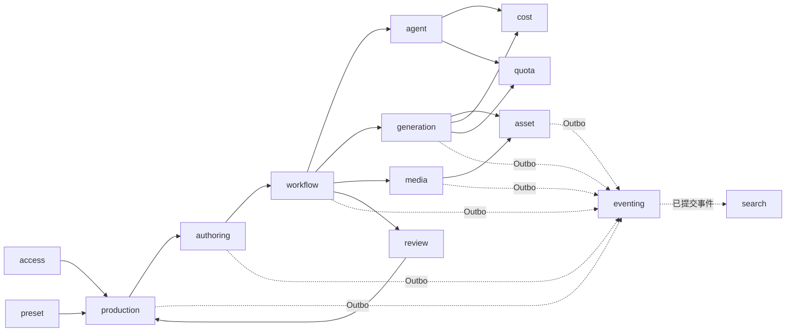
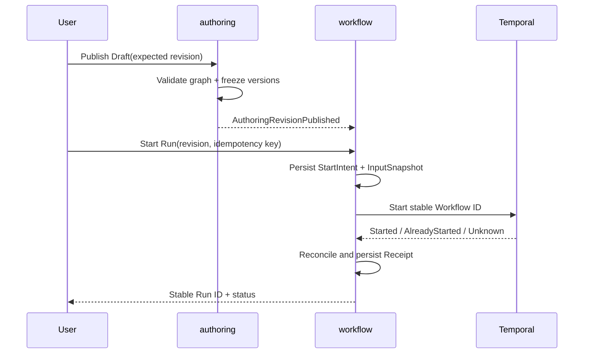
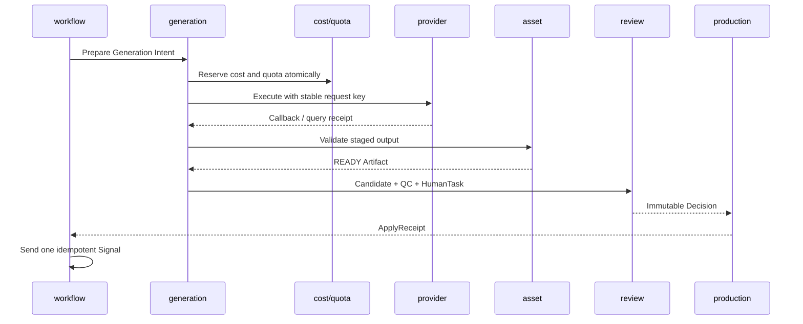

# 后端领域模块功能设计

- 状态：已接受设计
- 日期：2026-08-25
- 产品依据：[产品范围与验收基线](../prd/0001-产品范围与验收基线.md)
- 架构依据：[系统总体架构](0003-系统总体架构.md) · [架构分层与依赖规则](0004-架构分层与依赖规则.md) · [后端服务架构](2001-后端服务架构.md) · [领域语言与模块命名规范](0006-领域语言与模块命名规范.md)
- 派生文档：[后端领域服务与生产闭环需求规格](../requirement/2002-后端领域服务与生产闭环需求规格.md) · [后端领域服务与生产闭环实施计划](../plan/2002-后端领域服务与生产闭环实施计划.md)

## 结论

Lanverse Backend 由 14 个有明确事实所有权的业务模块组成：`access`、`production`、`preset`、`authoring`、`workflow`、`review`、`generation`、`agent`、`asset`、`media`、`cost`、`quota`、`eventing` 与 `search`。每个模块同时拥有自己的领域状态机、Application Command/Query、Repository Port、Outbox Event 和故障恢复规则；其他模块只能保存 ID + Version、不可变 Snapshot 或可重建 Projection。

本设计从空系统定义目标模型，所有能力都以待实现、待验证状态开始。目录存在、类型声明或单次调用成功都不代表模块完成；只有纵向业务切片、失败路径和 Acceptance 同时成立，才能形成实现证据。

## 1. 范围与非目标

本文定义：

- 14 个 Backend 模块的职责、聚合、状态、不变量与公开 Application Contract；
- 模块内事务、同进程跨模块原子协调和跨进程 Saga；
- 从注册、剧本、Production Bible、分镜、生成、审核到成片导出的生产闭环；
- 幂等、结果未知、并发、取消、重试、恢复、审计与投影重建语义；
- 前端、Workflow、Agent、Provider、Media、事件与搜索之间的业务边界。

本文不定义具体 UI 组件、Provider SDK 调用细节、数据库厂商调优参数、部署副本数或实施进度。运行程序、协议源和基础设施边界见[后端服务架构](2001-后端服务架构.md)。

## 2. 模块关系与依赖规则



箭头表示通过公开 Application Interface、ID/Version、Snapshot 或正式异步契约协作，不表示可以读取对方 Repository 或表。依赖必须遵守以下规则：

1. Domain 不导入其他模块、框架或基础设施实现。
2. Application 可以依赖本模块 Domain/Port，并通过对方公开 Application Interface 协调。
3. 同一 PostgreSQL 边界内需要原子完成的业务旅程由专用 Coordinator + 共享 Unit of Work 组合，不把协调逻辑塞入任一聚合。
4. 跨 Binary 或外部 Provider 的动作必须先持久化 Intent，再通过 Receipt、Outbox、Saga 或 Reconcile 收敛。
5. Query 可以读取本模块事实或明确发布的 Projection；禁止用跨模块 Join 绕开业务授权与版本边界。

## 3. 全局 Application Contract

### 3.1 Command Context

所有修改命令必须属于以下一种主体类型，并带齐对应 Context：

| 主体类型 | 必要 Context | 典型入口 |
|---|---|---|
| 已认证业务主体 | Actor、Session、Workspace、Capability、Idempotency Key、Expected Revision | Web/API 业务操作 |
| 已认证账户主体 | Actor、Session、Idempotency Key | 账户安全与 Workspace 创建 |
| 匿名认证流程 | Challenge、Proof、Client Fingerprint、Idempotency Key | 注册、登录、找回 |
| Provider Callback | Provider、Signature、Timestamp、Provider Event ID | 生成任务回调 |
| 内部服务主体 | Service Principal、Scope、Trace、Stable Operation ID | gRPC、Worker、Agent Tool |
| 运维主体 | Operator、Reason、Ticket、Scope、Dry Run | Replay、Reindex、对账与修复 |

每个 Context 都必须完成认证、权限、作用域、时钟窗口和重放校验。跨 Workspace 的“无权限”和“不存在”返回相同公共语义，避免泄漏资源存在性。

### 3.2 Command 执行顺序

```text
Validate Envelope
  → Authenticate Principal
  → Authorize Capability / Workspace
  → Load Idempotency Receipt
  → Lock Aggregate / Check Expected Revision
  → Apply Domain Policy
  → Persist Aggregate + Receipt + Outbox in one transaction
  → Return stable ID / Revision / Result
```

- 同一 Idempotency Key + 同一 Input Hash 返回原结果。
- 同一 Key + 不同 Input Hash 返回冲突，不能覆盖 Receipt。
- Query 不得产生业务副作用、写审计业务事实或隐式触发远程任务。
- 所有时间、随机数和 ID 都由 Application 注入 Domain，保证测试与回放确定性。

### 3.3 错误与结果未知

| 类别 | 含义 | 调用方动作 |
|---|---|---|
| `invalid_argument` | 输入不满足 Schema 或领域前置条件 | 修正输入，不重试原请求 |
| `unauthenticated` / `forbidden` | 主体无效或能力不足 | 重新认证或申请权限 |
| `conflict` | Revision、状态或幂等输入冲突 | 重新读取事实后由用户决定 |
| `resource_exhausted` | Budget、Quota、Rate Limit 或容量不足 | 等待、降级或显式调整 |
| `known_failure` | 操作确认未生效 | 可按 Retry Policy 使用同一稳定 ID 重试 |
| `outcome_unknown` | 远程端可能已生效但未取得 Receipt | 先对账，禁止生成新业务身份盲目重提 |
| `temporarily_unavailable` | 依赖暂不可用且确认未提交 | 有界退避重试或进入可见等待状态 |

### 3.4 版本冻结

每个生产 Run 必须冻结下列引用，运行中发布新版本不得改变旧 Run：

- Script/Bible/Production Snapshot；
- Authoring Revision 与 Workflow Definition；
- Preset、Style、Policy、Skill、Prompt、Rubric 和 Tool Policy；
- Capability、Model Policy、Provider Binding 与 Price Quote；
- 输入 Asset/Artifact/Consent 版本；
- Node Catalog 与 Media/Render Policy 版本。

## 4. 模块所有权总览

| 模块 | 权威事实 | 公开能力 | 明确不拥有 |
|---|---|---|---|
| `access` | Identity、Session、Membership、Capability | 注册、登录、会话轮换、成员授权 | Workspace 生命周期、业务对象 |
| `production` | Workspace、Project、Episode、Scene、Shot、Script/Bible 版本、生产绑定 | 项目结构、版本发布、生产快照 | 协作草稿、执行历史、媒体字节 |
| `preset` | Preset/Style/Policy/Override 版本 | 发布与解析 Effective Policy | Provider Job、Workflow Run |
| `authoring` | Draft、Revision、Node Catalog、GraphPatch Receipt | 编辑、校验、发布、Patch Apply | Temporal History、Production Bible |
| `workflow` | Definition、Run/Node 业务投影、Start/Control/Signal Receipt | 编译、启动、暂停、恢复、取消、局部重跑 | Provider/Media 具体执行 |
| `review` | HumanTask、Claim Lease、ReviewDecision | 领取、续租、决议 | 被审核聚合、Workflow History |
| `generation` | Capability、Model Policy、Request/Job/Candidate/Selection | 路由、提交、回调、候选选择 | 金额账本、Artifact 字节 |
| `agent` | Definition Manifest、Invocation、Grant、AgentRun/Result | 授权并调用受限 Agent | 业务事实写入、模型 Provider 密钥 |
| `asset` | Asset/Version、Artifact、Readiness、Lineage、Location、Rights | 上传、登记、签名访问、血缘 | 媒体处理任务、候选选择 |
| `media` | Probe、Derivative、MediaJob、RenderManifest/Receipt | 转码、字幕、混音、渲染、导出 | Asset 权威元数据、Production 绑定 |
| `cost` | Price、Estimate、Reservation、Ledger、Budget | 估算、预留、结算、释放、对账 | 使用次数限额、Provider 路由 |
| `quota` | Policy、Window、Counter、Reservation、Decision | 检查、预留、消费、释放 | 金额与币种 |
| `eventing` | Outbox/Inbox 协议、DLQ、Replay、Checkpoint、Audit Projection | 发布、消费治理、重放 | Workflow Timer、同步业务命令 |
| `search` | Index Version、Alias、Search Projection、Reindex Job | 搜索、降级查询、重建 | 业务 Command 正确性 |

## 5. `access`：身份、会话与成员能力

### 权威模型

- `UserAccount`：主体身份、状态、验证状态和 Token Version。
- `RegistrationChallenge` / `RegistrationReceipt`：匿名注册证明与幂等结果。
- `AuthSession`：Session Family、轮换序号、撤销原因、过期时间与设备摘要。
- `Membership`：User 与 Workspace 的角色、能力集合和有效期。

### 状态与不变量

`UserAccount` 使用 `pending_verification → active → suspended/deactivated`；`AuthSession` 使用 `active → rotated/revoked/expired`。Refresh Token 每次只允许成功轮换一次；检测到旧 Token 重放时撤销整个 Session Family。权限不能只依赖 Token 内缓存，敏感 Command 必须校验最新 Membership/Token Version。

注册闭环在一个 Unit of Work 中创建 `UserAccount + Workspace + Owner Membership + RegistrationReceipt + Outbox`。Session 创建失败时依据 Receipt 补发，不能重建已提交账户或 Workspace。

### 主要事件

`UserRegistered`、`SessionRotated`、`SessionFamilyRevoked`、`MembershipGranted`、`MembershipRevoked`。事件不携带密码、验证码、Token 或完整设备指纹。

## 6. `production`：生产结构与项目事实

### 权威模型

- `Workspace`、`Project`、`Episode`、`Scene`、`Shot`；
- `ScriptDocument` / `ScriptVersion`、`NarrativeStructure` / `NarrativeUnit`；
- `ProductionBibleVersion`、`CharacterSpecificationVersion`、`LocationSpecificationVersion`；
- `ProductionSnapshot`、`ProductionBinding` 与 `MaterializationReceipt`。

### 不变量

1. 已发布 Script/Bible/Specification 版本不可原地修改。
2. Episode/Scene/Shot 的排序、拆分和合并必须保持稳定身份、引用与审计守恒。
3. Project 归档后只读；恢复必须是显式、有审计的 Command。
4. Production Binding 必须指向精确 AssetVersion/Artifact Version，不指向“最新”。
5. 同一 Bible Identity 在作用域内只能物化一次权威 Asset，别名和 occurrence 不创建第二身份。

### Production Bible 发布

`PublishProductionBible` 先校验全文证据、未决冲突、未知实体闭环和引用版本，再由 Coordinator 在同一事务中：

1. 发布不可变 `ProductionBibleVersion`；
2. 创建或复用项目级 Asset Identity；
3. 写入 AssetState/AssetVersion 与 Production Binding；
4. 写入 `MaterializationReceipt` 与双方 Outbox。

任一步失败整体回滚；同一发布 Key 重试返回同一 Receipt。

## 7. `preset`：风格与策略解析

`preset` 拥有版本化 `Preset`、`Style`、`GenerationPolicy`、`QCPolicy`、`MotionPolicy`、`RenderPolicy` 和 Project/Shot Override。解析顺序固定为平台默认 → Workspace → Project → Episode/Shot Override，输出不可变 `EffectivePolicySnapshot` 与内容 Hash。

发布 Preset 前必须校验引用的 Capability、Model Policy、Agent Definition 和 Media Policy 版本存在且可用。运行时只读取冻结 Snapshot；不得重新解析“当前配置”。相同输入必须产生相同 Snapshot Hash。

## 8. `authoring`：Guided/Canvas 共用创作事实

### 模型

- `AuthoringDraft`：可编辑业务草稿与当前 Revision 指针；
- `AuthoringRevision`：规范化、不可变的 Graph + Metadata；
- `NodeDefinitionVersion` / `NodeCatalogVersion`：节点端口、配置 Schema、能力和风险；
- `GraphPatchIntent` / `GraphPatchReceipt`：AI/Copilot 修改的预览、确认与提交事实。

Guided Studio 与 Canvas Studio 只能产生同一 Graph Schema。布局、选中、Presence 和纯 UI 注释不进入执行 Hash；业务节点、端口、边、配置和冻结引用进入 Hash。

发布前必须完成：未知节点版本、端口类型、必填输入、一般环、无界 Loop、权限、预算、Policy、Asset Readiness 和 Consent 校验。协作 Yjs 文档只是可恢复工作副本，发布事实只能是 PostgreSQL 中的 `AuthoringRevision`。

GraphPatch 固定执行 `Validate → Preview → User Confirm → ApplicationIntent → ApplyGrant → CollaborationReceipt → CommitSnapshot`。远程应用结果未知时按 Application ID 对账，不生成第二个 Patch。

## 9. `workflow`：编译与长生命周期执行

### 模型与状态

- `WorkflowDefinitionVersion`：由 AuthoringRevision + Node Catalog 编译的不可变定义；
- `WorkflowRun` / `NodeRunProjection`：面向业务查询的运行投影；
- `WorkflowStartIntent/Receipt`、`ControlIntent/Receipt`、`SignalIntent/Receipt`；
- `RunInputSnapshot`、`NodeCacheEntry`、`QualityGateResult`。

业务状态统一为：

```text
QUEUED → RUNNING → WAITING_HUMAN / RETRYING / PAUSED
      → SUCCEEDED / FAILED / CANCELLED / NEEDS_ATTENTION
```

Temporal History 是 Timer、Retry、Activity、Signal 和 Compensation 的运行权威；PostgreSQL 只保存稳定业务绑定和查询投影。Workflow ID 由 Workspace/Project/Run 身份确定；Start 返回未知时必须通过 Describe/History 对账。

Node Cache Key 至少包含 Node Definition、规范化输入 Hash、冻结 Policy/Model/Prompt/Skill、输入 Artifact Hash 和 Runtime Contract Version。局部重跑只能使依赖闭包变脏，不修改旧成功 Run 的历史事实。

节点级局部重跑固定派生一个新的 `WorkflowRun`，并显式保存 `SourceWorkflowRunID` 与 `RerunRootNodeID`；旧 Run、旧 NodeRun 与 Temporal History 均保持不可变。MVP 只允许从 `FAILED` 或 `SUCCEEDED` 的源 Run 派生，并继续绑定源 Run 的同一 `WorkflowDefinitionVersion` 与 `RunInputSnapshot`。目标节点及其全部下游节点形成 Dirty 闭包；Dirty 闭包执行所需、但不在闭包内的传递上游节点以新 NodeRun 投影复制源 Run 的 canonical Input/Output Snapshot 与 Hash，状态使用既有终态 `SKIPPED`，并由 `ReusedFromNodeRunID` 自引用明确记录来源。这个来源引用不是 `NodeCacheEntry` 命中，不查询或写入缓存，也不重新调用 Executor。与 Dirty 闭包无依赖关系的节点不进入派生 Run 投影或 Temporal Execution Plan。使用可由 GORM 正向增加的来源字段而不修改已有状态 CHECK，保证同一 Model Catalog 能同时落到空库与现有库，不引入 Migration 或兼容写入分支。

Backend 必须在启动 Temporal 前验证源 Run 终态、Definition/Snapshot 身份、源 NodeRun 集合、所有必需上游输出及端口契约；任一缺失、非终态、Hash 漂移或跨 Workspace 身份都 fail closed。局部重跑复用正常 Start Intent/Receipt 和新的稳定 Temporal Workflow ID，重复命令只重放同一个派生 Run。Temporal 仍执行正式 Episode Workflow，但只获得 Dirty 节点的拓扑子序列；Runtime 解析输入时可以读取同一派生 Run 中带来源引用的上游输出，完成时要求所有 Dirty 节点终态且所有复用投影仍保持 canonical。这个切片不增加第二调度器、原地重置 NodeRun、全图无条件重跑或公共 HTTP 入口。

单 Shot 重跑建立在上述派生 Run 语义之上，但只有真实 Generation/Shot 节点和按 Shot 冻结的 Owner Reference 接入后才成立；当前剧本到分镜 MVP 明确不包含图片/视频生成，因此不得用 Storyboard Export、空 Activity 或兼容分支伪装 ShotWorkflow 已完成。

MVP 的 `NodeCacheEntry` 只保存已经完成并可复用的不可变输出快照，不建立第二套运行中状态、Lease 或调度器。Key Material 使用 `node-cache-key-v1` 明确记录 Node Definition Content Hash、Config Hash、规范化输入 Hash、可选的冻结 Policy/Model/Prompt/Skill Hash、排序去重后的输入 Artifact Hash 和 Runtime Contract Version；任一执行输入变化都必须产生不同 Cache Key。缓存以 Workspace + Cache Key 隔离，命中不得跨租户；相同 Key 只能对应一个 canonical Output Snapshot/Hash，不同输出必须报冲突。Source WorkflowRun/NodeRun 只作为来源审计，缓存输出本身必须足以还原绑定。

缓存事实不等于缓存命中：只有 Node Executor 返回规范化输出绑定、Temporal Workflow 将上游 Output Hash 纳入当前节点输入 Hash，且 Runtime 原子写入 NodeRun 输出投影后，才允许把节点标记为 `CACHED`。在这些条件完成前，不得仅凭节点状态或整个 RunInputSnapshot Hash 跳过执行。

Node Executor 输出先固定为 `node-output-v1`：一个输出快照由按 Port 排序且不可重复的 Binding 集合组成，每个 Binding 明确 `port`、`value_type`、Owner 事实的 `reference_id` / `reference_version` 和 `content_hash`。Executor 终态只能返回 `SUCCEEDED` 或 `SKIPPED` 与该结构化输出；持久外部任务尚未终结时可返回不带任何输出的 `RETRYING`。Runtime 负责校验、规范化和计算 Output Hash，Executor 不得自行声明 `CACHED`，也不得在 `RETRYING` 时提前携带输出。非人工节点完成时，Node 状态、canonical Output Snapshot/Hash、Claim Token 清除必须在同一 GORM 事务中提交；执行失败或输出无效时只能进入 Retry，不得留下半成品输出。已完成 Activity 重放必须从 NodeRun 投影返回原始 Output Snapshot/Hash，不再次调用 Executor。

Temporal 耗尽节点 Activity 的有限重试，或发现终态输出契约违反时，必须先调用 Backend `FailRun` Activity：Backend 在单个 GORM 事务内锁定 Run 与当前 NodeRun，确认身份、可失败状态、无输出半成品与 Control Fencing 后，同时投影 NodeRun/Run 为 `FAILED`、记录稳定错误代码与 `rerun_failed_node` 恢复动作；投影成功后 Temporal 才返回原始执行错误。这条路径使失败节点局部重跑来自真实运行事实，不允许手工改库或仅在测试中伪造源 Run。

本契约只建立可传播的输出事实，不在没有输入解析器时提前启用缓存。下一层由 Runtime 根据 Graph Edge/Binding 解析上游端口，校验 `value_type`，形成规范化 Node Input 与上游 Output Hash；Human Gate 只有在目标 Owner 写入正式 Apply Receipt 与输出引用后才能向下游传播，不能把 Review 状态伪装为业务产物。

`node-input-v1` 由 Backend Runtime 从已提交的 WorkflowDefinitionVersion 与 RunInputSnapshot 生成，不接受 Executor 自报输入。快照包含 canonical Node Config、按目标 Port 排序的输入 Binding 和排序后的全部 Frozen Reference：Edge Binding 必须引用上游已完成 Node 的精确 Output Port/Value Type/Owner Reference，Variable Binding 必须引用编译定义中的变量值；任一缺失、类型漂移、重复 Port 或上游无输出都拒绝 Claim。为保证 MVP 的正确失效，全部 Frozen Reference 进入每个节点输入 Hash，后续只有在证明依赖裁剪正确后才能优化缓存粒度。

Node Claim 首次从 `QUEUED/RETRYING` 进入 `RUNNING` 时，canonical Input Snapshot/Hash、Claim Token、Attempt 与 Revision 在同一 GORM 事务中写入；丢失 Activity 的再次 Claim 必须重新解析并验证 Input Hash 不变。WorkflowRun 在 Start 时把 Workspace ID、Project ID、Initiator User ID 和 Initiator Token Version 作为正向 GORM Model Catalog 事实一次冻结，Claim 必须从该已提交事实携带完整运行身份。Node Executor 只能使用这组身份调用目标 Owner 的公开 Application Interface，不接受 Temporal Payload、客户端或 Executor 自报授权上下文，也不得越过 Application 直接访问业务 Repository。Owner Application 仍用当前账户事实校验该冻结 Token Version；账户凭据被撤销后，尚未执行节点必须 fail closed，不能伪造最新版本继续。Node Executor 只接收该身份、输入快照以及编译定义中的期望 Output Ports；Runtime 在提交输出前校验 Port 完整性与 `value_type`，不能让 Executor 返回未知端口、遗漏必填端口或改变类型。

`workflow.input.script_revision` 的 Production Executor 首先落地上述边界：它用 WorkflowRun 发起人通过正式 Script Application Service 重新授权并读取不可变 Revision，逐项核对 Workspace、Project、Reference ID、Version 与 Normalized Hash，再返回 `script_revision` 的 `node-output-v1`。MVP 不建立通用 Service Locator、反射注册表或 Repository 路由；后续 Production/Agent Executor 只有在各自输入、等待和失败语义明确后才按同一接口逐项接入。

`activity.production_bible` 不在 Temporal Activity 内同步占用整个 Agent 执行时间。Executor 使用 Workflow NodeRun 的稳定幂等身份调用正式 Production Bible Application Service，第一次调用原子创建 Bible、Task、Agent Invocation 和 Command Receipt；后续调用只重放同一 Receipt 并读取同一 Bible。`queued/running` 是已提交但未完成的正常外部等待：Runtime 在 Claim fencing 事务中清除 Claim、将 NodeRun/WorkflowRun 投影为 `RETRYING`，Temporal Workflow 使用持久 Timer 后再以同一业务幂等身份查询；正常等待不消耗 Activity 错误重试，也没有业务墙钟超时。每次 Timer 后必须先消费 Workflow Control Signal；暂停期间不得继续查询 Owner，Resume 后才恢复。只有 Bible 进入 `needs_review` 且 Workspace、Project、Document Revision、Input Hash、Result Hash 全部与冻结输入一致时，Executor 才返回 `production_bible_candidate` 的 `node-output-v1`；`failed/unknown/cancelled`、越权或身份/哈希漂移都是显式失败，不伪造候选输出。等待期间不写 Node Cache，只有候选输出原子完成时才允许按冻结输入写入缓存事实。

`activity.episode_plan` 只负责生成可审阅的确定性分集计划，不得在 Activity 内代替用户确认、创建 Episode 或发布剧集剧本。Executor 必须同时消费已冻结 Script Revision 与 Production Bible Gate 输出，通过正式 Project、Production Bible 和 Planning Application Service 重新鉴权：项目提供当前目标时长，节点配置只冻结期望集数，Planning Owner 使用 `explicit_markers` 和稳定 NodeRun 幂等键创建或重放同一个 `review_ready` Plan。只有 Workspace、Project、Document Revision、已确认 Bible、期望集数、目标时长和 Plan Input Hash 全部一致时，节点才输出 `episode_plan_candidate`。随后独立的 `human.episode_plan_review` Gate 以 ReviewDecision ID 派生稳定幂等键调用 Planning Owner `ConfirmPlan`；Owner 必须在确认事务中返回 `episode_plan.confirm` Command Receipt，锁定提案并把 Plan 从 revision 1 推进到 confirmed revision 2，Gate 才可输出保持同一 Plan ID/Input Hash 的正式 `episode_plan` 引用。重复 Signal 只重放该 Receipt，不得重复确认；Episode 物化与发布属于其后的 Production 节点，不得把 `review_ready` 状态或前端内存状态伪装成已确认计划。

`activity.episode_structure` 只消费 `human.episode_plan_review` 输出的正式 `episode_plan`，并重新核对 Workflow 冻结的 Script Revision、运行身份、Workspace、Project、Plan 创建者、revision 与 Input Hash。首次执行通过 Planning Application 依次提交 `episode_plan.materialize` 与 `episode_plan.publish` 两个独立幂等命令：前者原子创建 Episode、草稿版本和唯一 Plan→ImportCommit，后者发布版本并创建 `needs_review` 的 Episode Structure；Workflow 不直接访问 Planning Repository 或表。若进程在物化提交后、发布提交前退出，重试必须通过 Plan 的唯一 ImportCommit 查询恢复并继续发布，不能用已经变化的 Project revision 重新物化。节点按 ImportCommit Segment 顺序加载已发布结构，以结构、Episode、正式 Script Version 与 Result Hash 的规范引用计算批次 Content Hash，输出一个指向 published ImportCommit revision 2 的 `episode_structure_candidate`，随后由独立 `human.episode_structure_review` 打开批次审核；本节点不得代替用户确认任何 Structure。

`human.episode_structure_review` 审核的是上述 ImportCommit 所代表的完整结构批次，不建立另一张批次表。创作者先通过 Planning Owner 既有 `AcceptTask` 命令逐项接受各场次必要制作任务；正向 ReviewDecision 生效时，Human Gate Applier 以 ReviewDecision ID 派生稳定幂等键调用 `ConfirmPublishedStructureBatch`。Planning 必须在一个 GORM 事务内锁定 published ImportCommit 与按 Segment 顺序加载的全部 Structure，重新计算候选 Content Hash，验证每场一至四个制作任务、至少一个 `shot_breakdown` 且所有必要任务已接受，再一次性把全部 Structure 置为 confirmed 并写入唯一 `episode_structure.confirm_batch` Command Receipt。任一结构校验失败时全部回滚；Receipt 已提交而 Signal 未完成时只重放同一 Receipt。Gate 的正式 `episode_structures` 输出保持同一 ImportCommit ID、revision 2 与批次 Content Hash，便于下游 Storyboard 节点按同一不可变批次引用读取已确认结构。

`activity.storyboard_draft` 必须消费上述完整 `episode_structures` 批次，而不是只处理首集。Storyboard Owner 用一个 `StoryboardDraftSet` 把 confirmed ImportCommit、结构批次 Content Hash 与按 Segment 顺序创建的逐集 `StoryboardDraftBatch` 固定在同一 GORM 事务和同一 Command Receipt 中；Set 是 Workflow 图上单一 `storyboard_candidate` 端口所代表的真实业务聚合，不复制 Structure、Episode 或 Agent 状态。每个 Episode 仍由既有持久 Agent Invocation 独立生成 candidate-only 草案；节点在任一 Batch 为 `queued/running` 时返回正常持久等待，全部 Batch 到达 `needs_review` 后由 Owner 对有序 Batch ID、Episode/Structure/Script Version、Input Hash 与 Result Hash 计算 Set Content Hash，并输出 Set ID。重试只重放同一 Set/Receipt，不按“最新 Batch”猜测，也不新增迁移脚本、第二数据库、第二调度器或 Agent 写入路径。

`human.storyboard_review` 审核上述完整 Draft Set。创作者仍通过 Storyboard Owner 的逐镜 `Decide` 与逐集 `Approve` 明确接受每个候选；Set 在创建时冻结各 Episode 当前正式 Shot 的 Order Hash，作为 Apply baseline。正向 ReviewDecision 生效时，Human Gate Applier 以 ReviewDecision ID 派生稳定幂等键调用 `ApplySet`：Storyboard Owner 必须在一个 GORM 事务内锁定 Set、按固定顺序锁定全部 Episode 与 Draft Batch，重新核对 Set Candidate Hash、baseline、全部逐镜 accepted 决议和全部 Batch approved 状态，再一次性归档旧 Shot、创建完整批次的新 Shot、把 Set/Batch 置为 applied 并写入唯一 `storyboard.apply_set` Command Receipt。任一 Episode 漂移或校验失败时全批回滚；Receipt 已提交而 Signal 未完成时只重放同一 Receipt。Gate 输出指向同一 Set 的 applied revision 与正式 Shot 集合 Content Hash，不能继续沿用 candidate hash 冒充正式 `storyboards`。

`production.storyboard_export` 消费上述 applied Draft Set，不接受“最新 Shot”或单个 Episode ID 替代 Workflow 冻结输入。Storyboard Owner 在单个 GORM 事务内锁定 Set 与全部 Episode，根据 Set 的有序 Batch 重算当前正式 Shot 集合 Hash；只有该 Hash 与 Gate 冻结的 applied Hash 一致时，才复用现有确定性 ZIP 构建器为每集创建 JSON、CSV、HTML 与 manifest 导出。一个 `StoryboardExportSet` 仅聚合按 Draft Set 顺序排列的 Episode/Export/Order Hash/Content Hash 引用，作为 Workflow 单一 `storyboard_export` 输出的真实持久业务对象；Export Set、全部逐集 Export 与唯一 `storyboard.create_export_set` Command Receipt 要么整体提交，要么整体回滚。任一 Episode 缺少正式 Shot、正式 Hash 漂移或包构建失败都不得留下部分导出；重试只重放同一 Receipt。该聚合直接进入现有 GORM Model Catalog，不新建 Migration、导出微服务、第二数据库或手写 SQL Schema。

`workflow-worker` 是独立 Go 进程，但与 API 使用同一 Backend 代码和容器镜像；它只装配 Workflow GORM Store、Temporal Worker、Review Opener 和已实现的 Production Executor，不复制 API 业务层，也不创建第二数据库。进程启动时使用同一 GORM Model Catalog 从当前模型正向同步空库，然后连接配置的 Temporal Namespace/Task Queue；Compose 必须等 API 完成同一 Catalog 同步并健康后再启动 Worker，避免空库上的并发 DDL。配置、PostgreSQL、Schema Sync、Temporal 或 Worker 注册任一失败都终止启动，SIGINT/SIGTERM 必须停止取新 Activity 并优雅关闭连接。MVP 不为 Worker 增加第二 HTTP 服务、健康表或自建调度器。

Workflow 公共 HTTP 边界只在 `lanverse-api` 组合现有 Application Use Case：`POST /api/v1/workflow-runs` 从已发布 Authoring Revision 启动 Run，`GET /api/v1/workflow-runs/{run_id}` 返回经当前账户/Workspace 重新授权的 Run + Node 投影，`POST /api/v1/workflow-runs/{run_id}/reruns` 派生节点局部重跑，`POST /api/v1/workflow-runs/{run_id}/controls` 只接受 `pause` / `resume` / `cancel` 与 expected revision。Handler 仅使用标准 `net/http`、既有 validator 和统一 Problem Envelope 做严格协议转换；启动/重跑/控制继续分别由 StartService 和 ControlService 持久 Intent/Receipt 并调用同一官方 Temporal Go SDK Client，Query 只读 GORM 投影且不产生业务副作用。

高影响 Control 不信任 Browser 自报 Workspace：Application 先通过 Run ID 获得当前授权投影，GORM Adapter 又在创建 Control Intent 的同一事务内重新校验 User Status、Token Version、Workspace Status 和非 Viewer Membership，同时锁定 Run revision；撤权、跨租户或自报 Workspace 漂移均 fail closed。`lanverse-api` 暴露 Workflow 命令后必须在启动时建立 Temporal Client，并在 Readiness 中执行 SDK Health Check；不允许 API 在无法调度真实 Worker 时仍对外报告就绪。本切片不预建 SSE/Event Store、前端运行页面、Generation/Asset 路由或 Handler 中的 GORM 旁路。

Runtime 只对编译策略为 `by_inputs` 的节点启用缓存，并在 Claim 事务中把完整 Cache Key 写入 NodeRun 投影；`never` 节点不得生成或查询缓存键。命中时，Runtime 必须在 Claim Token/Revision 围栏内，将缓存的 canonical Output Snapshot/Hash 与 Node 状态 `CACHED` 原子提交，Executor 不得运行。未命中时，Executor 成功输出、不可变 `NodeCacheEntry` 与 NodeRun 的终态输出必须在同一 GORM 事务中提交；并发相同 Key 只能收敛到相同输出，不同输出整体回滚并报冲突。MVP 不增加 Pending Cache、Lease、Redis、后台缓存协调器或跨 Workspace 复用。

## 10. `review`：人工任务与不可变决议

`HumanTask` 绑定精确对象类型、对象 ID、Revision、候选集合和 Rubric Version。领取使用带到期时间的 `ClaimLease`，支持续租、释放和过期接管；过期 Lease 不能提交决议。

`ReviewDecision` 是不可变终态：`approved`、`rejected`、`changes_requested` 或 `selected`。提交前重新校验对象 Revision，过期对象返回 Stale，不覆盖新版本。Review 不直接写 Production、Generation 或 Asset；需要生效的决议先由目标 Owner 写 `ApplyReceipt`，Workflow 只在 Receipt 后发送一次幂等 Signal。

Human Gate 打开时必须使用与普通节点相同的 Graph/Port 解析器冻结 `node-input-v1`，并把上游候选的 Owner Reference ID 绑定到 HumanTask；重放打开操作必须验证 Input Hash 与候选集合不变。发送信号前，Backend 必须从 PostgreSQL 重新核对 HumanTask、不可变 ReviewDecision、Subject Revision、Decision 值及 `selected` 候选，不能信任客户端重复提交的 Decision。

正向决议必须先由 Backend 内的目标 Owner Application Service 以 ReviewDecision ID 派生稳定幂等键，返回真实持久化 Command Receipt 与正式资源版本；Workflow Apply Receipt 保存该 Owner Receipt ID、Operation 和 canonical `node-output-v1`/Hash。Temporal Signal 只携带这组已提交证据，Runtime 必须把 Signal、Apply Receipt 与 Node/Decision 身份逐项对齐后，才能在同一 GORM 事务中将 Gate 标记为 `SUCCEEDED` 并写入完全相同的 Output Snapshot/Hash。信号结果未知时只重放已保存的 Owner 证据，不得再次产生生产效果；拒绝或要求修改的决议不得伪造 Owner 输出。下游仍通过普通 Graph/Port 解析器消费 Gate 输出，不建立 Human Gate 专用旁路。

## 11. `generation`：模型路由、任务与候选

### 模型

- `GenerationCapabilityVersion`、`ModelPolicyVersion`、`ProviderBindingVersion`；
- `GenerationIntent`、`GenerationRequest`、`ProviderJob`、`ProviderCallbackReceipt`；
- `GenerationCandidate`、`CandidateSelection` 与 `ProviderUsageReceipt`。

提交时冻结能力、模型策略、Provider、输入 Artifact、Prompt/Skill、Price Quote 和输出约束。Provider Request Key 必须稳定；Callback 在公网层验签、限制时间窗口并按 Provider Event ID 去重，再转换为内部规范化 Command。

Provider 输出先进入隔离 Staging，经 Asset 完整性与 Readiness 校验后才能创建 Candidate。候选不等于选择；只有经确定性 QC、语义 QC、必要人工审核和唯一 `CandidateSelection` 后才能进入 Production Binding。

Fallback 是显式 Policy，必须受预算、Quota、尝试次数与 deadline 限制。超时但结果未知时进入 `RECONCILING`，不能释放预留后立即向另一 Provider 重提。

### 首个 Candidate/QC 前置切片：READY 图片候选登记

在 Provider Submission 与单 Shot Workflow 接入前，`generation` Owner 先交付可独立验收的 `generation.candidate.register_ready`：Application 只能通过 Asset 的 `RequireReady` 公开端口读取图片 Artifact，不得查询 Asset 表、读取 MinIO 或根据对象存在性推断就绪。Candidate 冻结 Artifact ID、Revision、SHA-256、媒体类型、宽高、Provider Job Source ID/Output Key 和当前确定性 QC Policy Snapshot；只有来源类型为 `generation_provider_job` 且 Artifact/Location 已通过 Asset 门禁时才允许登记。

同一事务必须原子写入唯一 `GenerationCandidate`、不可变 `QCReport` 与 Owner Command Receipt。确定性 QC 首版只检查已验证图片的媒体类型、最小宽高与最大像素数，Policy Version、约束和 Policy Hash 全部冻结在报告中；通过进入 `QC_PASSED`，失败进入 `QC_FAILED` 并记录稳定失败码。重复或并发命令必须收敛，同一 Idempotency Key、Artifact 或 Source Output 的绑定漂移必须拒绝；下游通过 `RequireQCPassed` fail closed，不能自行解释 QC JSON。

该切片复用现有 GORM、共享 PostgreSQL Unit of Work、Asset Application Port 与 Command Receipt，不新增 Migration 文件、手写 SQL、第二数据库、对象存储读取、通用 Provider 抽象层或兼容分支。它不创建虚假的 Provider Job，不执行远程模型，不结算费用，不创建 CandidateSelection/Review/Production Binding，也不把候选登记宣称为图片生成节点或 Shot Workflow 已完成。

### CandidateSelection 前置切片：不可变 ReviewDecision 应用

在 Generation Human Gate 接入 Workflow 前，`generation` Owner 先交付 `generation.candidate.select`：命令只接受 ReviewDecision ID 与幂等键，必须经 Review Application Port 重新读取已完成 HumanTask 和不可变 `selected` 决议，不能接受调用方自报 Candidate ID、候选集合、Subject Revision 或 Reviewer。Review Port 同时复核当前调用者 Token Version 与 Workspace Membership；Generation 再对 HumanTask 冻结的全部 Candidate 调用自身 `RequireQCPassed`，逐个复核 Workspace、Project、QC Report Hash 与当前 Asset READY，任一失败则不产生 Selection。

`CandidateSelection` 对 HumanTask 和 ReviewDecision 双重唯一，冻结 Workflow Run/Node、HumanTask Subject/Revision、全部排序 Candidate ID、被选 Candidate Revision/Artifact/Hash、ReviewDecision 与 Reviewer；Generation 在一个 GORM 事务内写 Selection 和 Owner Command Receipt。并发或重复应用必须收敛到同一 Selection/Receipt，同一 Idempotency Key、HumanTask、ReviewDecision 或候选绑定漂移必须拒绝。下游只能通过 `RequireSelected` 获得仍满足 QC/Asset 门禁的 Selection，不能把 ReviewDecision 或 `QC_PASSED` 直接解释为正式选择。

该切片复用 Review/Generation Application Port、GORM 与通用 Command Receipt，不由 Generation 查询 Review 表，不新增 Migration、第二事实源、兼容字段或通用抽象层。它不建立 GenerationIntent/CandidateSet，不把 HumanTask 候选展开接入 Authoring/Workflow，不写 Production Binding，也不执行 Temporal Signal；这些边界必须在后续真实 Generation Node 与单 Shot Workflow 切片完成。

## 12. `agent`：受限智能体控制面

Go `agent` 模块拥有 `AgentDefinitionManifest`、`AgentInvocation`、`ExecutionGrant`、`ExecutionBudget`、`AgentRun` 与 `AgentResult`。Python Runtime 只执行被授权定义，不拥有任何业务事实。

Grant 必须绑定 Run/Node、输入 Hash、允许的 Agent/Skill/Prompt/Rubric/Tool 版本、模型能力、最大步数、调用次数、Token、费用和 deadline，并具备短时有效期与防重放标识。

- Tool 只能经 Backend Allowlist API 读取最小上下文或提交 Proposal；
- 模型调用只能经 Model Gateway；
- Runtime 无数据库、对象存储、Yjs、Shell 和任意网络权限；
- 输出必须通过 Schema、引用、权限、版本与确定性 Gate，之后才可由业务 Owner 接受；
- Repair 次数有上限，耗尽后进入人工审核或明确失败。

## 13. `asset`：资产、产物、血缘与权利

### 三层模型

| 层 | 含义 | 关键属性 |
|---|---|---|
| Asset / AssetVersion | 可版本化业务身份与语义 | 类型、项目身份、版本、状态、权利 |
| Artifact | 不可变生成或上传产物记录 | Content Hash、Media Type、Readiness、Lineage |
| Storage Location | Artifact 字节的物理位置 | Profile、Bucket、Key、Region、Checksum、状态 |

Artifact Readiness 状态为：

```text
PENDING_VALIDATION → READY
                   ↘ QUARANTINED / UNAVAILABLE
READY → TOMBSTONED（仅满足保留与引用规则后）
```

上传执行 `CreateUploadSession → Presigned Upload → Complete → Hash/Format Validate → READY`。Bucket 默认私有，Download Grant 短期且绑定主体、Workspace、Artifact、动作和有效期。未 READY、权利过期、Consent 撤销或作用域不匹配时默认拒绝生成、发布和导出。

位置迁移不改变 Artifact ID/Hash：复制 → 校验 → Dual Read → 切换 Primary → 观察 → 退役旧位置；任一步失败可回滚到上一个有效 Primary。

### 首个 Generation/Shot 前置切片：图片 Artifact Readiness

首个媒体 Shot 节点接入前，Backend 先建立 `asset` Owner 的最小图片产物闭环。Provider 或 Media Worker 只能把私有 MinIO 中的唯一 Staging Object Key、声明的 SHA-256、字节数、媒体类型和稳定 Source Output Key 提交给 Asset；Asset 以 `asset.artifact.register_staged` Command Receipt 原子登记 `PENDING_VALIDATION` Artifact 与唯一 Staging Location。对象字节不进入 PostgreSQL，PostgreSQL/GORM 仍是 Artifact、Location、Readiness 与 Receipt 的唯一业务事实源。

`asset.artifact.validate_ready` 必须先从私有对象存储完整读取对象，再核对字节数、SHA-256、声明媒体类型以及图片可解码性；只有全部通过，才在一个 GORM 事务内把 Artifact 置为 `READY`、把 Location 切为 `PRIMARY` 并写同一 Owner Receipt。内容损坏、类型伪报或图片不可解码必须持久化为 `QUARANTINED`，依赖不可达则保持 `PENDING_VALIDATION` 并允许同一命令重试。并发或重复登记/验证必须收敛到同一 Artifact 与 Receipt；同一 Idempotency Key 或 Source Output Key 的输入漂移必须拒绝。

Workflow、Generation、Media 和 Production 只能通过 Asset Application Service 的 `RequireReady` 查询消费 Artifact，不得直接读取 Asset 表或根据对象存在性推断就绪。本切片复用现有 GORM、MinIO Go SDK、共享 Unit of Work 与 Command Receipt，不增加 Migration 文件、手写 SQL Schema、第二数据库、Redis、对象复制队列或兼容层。它只交付图片 Artifact/Location/Readiness 前置，不提前宣称 Asset/AssetVersion、Rights/Consent、Generation Provider、Candidate/QC/Selection 或 Shot Workflow 已完成。

## 14. `media`：媒体处理、渲染与导出

`media` 拥有 `MediaProbeResult`、`DerivativeReceipt`、`MotionPlan`、`RenderManifestVersion`、`MediaJob` 与 `Render/ExportReceipt`。输入永远不可覆盖；输出先写临时位置，完整性和 Hash 通过后由 Asset 登记新 Artifact/Lineage。

`RenderManifestVersion` 冻结时间线、镜头 Artifact、音频、字幕、字体、转场、滤镜、规格、编码器策略与所有输入 Hash。相同 Manifest + Idempotency Key 只能形成一个业务输出 Receipt。

MediaJob 使用 `queued → claimed → running → verifying → succeeded/failed/reconciling/cancelled`。Worker 丢失、FFmpeg 超时、磁盘不足或回执未知时依据 Lease、Heartbeat、临时对象和 Receipt 对账；不能因为重试产生重复 Artifact。

## 15. `cost` 与 `quota`：费用和用量双门禁

`cost` 使用 Decimal + Currency 表达金额，拥有 Price、Estimate、Reservation、Ledger Entry 和 Budget；`quota` 拥有 Policy、Window、Counter、Reservation 和 Decision，不保存金额。两者以 PostgreSQL 事实为准，Redis 只能做可丢弃的快速拒绝或 Rate Limit。

所有付费 Provider、Agent 模型调用和高成本 Media Job 固定执行：

```text
Intent + Cost Reservation + Quota Reservation + Outbox
  → AcquireExecutionClaim
  → short-lived ExecutionAuthorization
  → Execute
  → Usage/Result Receipt
  → Settle Cost + Consume Quota
     or Release / Reconcile
```

准备事务必须同时成功或失败。Claim 与取消互斥；Authorization 过期后不得执行。结果未知时两类 Reservation 保持占用直到对账，避免超预算或超限额重提。Ledger 只追加，不原地修改历史金额。

### Cost 前置切片：Project Budget 唯一事实归属

在 Cost Reservation 接入前，必须先消除 Production Project 与 Cost 同时持有预算的冲突。`production.project` 只拥有项目身份、制作属性、状态和 Revision，不再保存或写入 `BudgetLimit/Currency`，旧的 `/projects/{project_id}/budget-limit` 写入口直接移除，不建立兼容转发或双写。`cost` 以独立 `BudgetPolicy` 成为 Project 预算的唯一 Owner；Policy 由 Workspace Owner 通过 `cost.budget.set` 创建或按 Expected Revision 更新，成员可经当前身份授权读取。

`BudgetPolicy` 使用 `shopspring/decimal` 与三位大写 Currency，金额在进入 Hash、Receipt 和 PostgreSQL 前规范化到最多六位小数；Project 同一时刻只有一个当前 Policy，每次更新保留递增 Revision 和内容 Hash。创建/更新与 `CommandReceipt` 在一个 GORM/PostgreSQL 事务中提交，相同命令重放返回同一结果，幂等输入、Revision、Workspace/Project 绑定或持久化内容漂移必须失败关闭。未设置 Budget 不回退到 Project 默认值，后续高成本准备必须明确拒绝。

该切片建立 `cost/domain → cost/application → cost/adapter/{gormdb,httpapi}` 的显式边界；复用已经锁定的 GORM、Decimal、UUID、HTTP Validator 与通用 CommandReceipt，不新增依赖、Migration 文件、手写 SQL、共享 `utils`、第二金额字段或兼容路由。它只完成 Budget 所有权与管理闭环，不实现 Price、Estimate、Cost Reservation、Ledger、GenerationIntent、Cost/Quota 共享事务或 Provider 调用，因此不代表 `BE-MOD-011`/`BE-JRN-004` 已完成。

### Cost 第二前置切片：`generation.image` PriceQuote 与 Estimate

Cost Reservation 只能引用由 Cost 计算并冻结的 Estimate，不能接受发起模块或客户端自报金额。MVP 只支持已经进入真实 Generation/Quota 旅程的 `generation.image` Metric：Workspace Owner 在已设置 Project Budget 的前提下追加 PriceQuote Revision，Quote 的 Currency 必须与当前 BudgetPolicy 一致；Quote 行一经创建不可修改，调整单价只能追加下一 Revision。已有任一 PriceQuote 后 Budget Currency 不得原地切换，避免当前 Budget 与历史/当前 Quote 形成混币种事实。设置 PriceQuote 与 CommandReceipt 在同一个 GORM/PostgreSQL 事务中完成，并通过锁定 Project BudgetPolicy 串行化首次创建和并发 Revision 更新。

发起模块通过 Cost Application Command 使用稳定 `generation_intent` Source ID 与正整数 Units 创建 Estimate。Cost 必须从服务端读取当前 BudgetPolicy 和最新 PriceQuote，计算 `unit_amount × units`，并在不可变 Estimate 中冻结 Budget ID/Revision/Limit、PriceQuote ID/Revision、Metric、Source、Units、Unit Amount、Total Amount、Currency 与 Content Hash；调用方不能提交单价、币种、总额或 Quote Revision。同一 Project + Source 最多一个 Estimate，重试、并发和新的 Idempotency Key 都返回第一次冻结的结果，Source/Units/Metric 或持久化内容漂移必须失败关闭。

这一切片复用现有 Cost 边界、Decimal、GORM、Project 授权和 CommandReceipt，不新增依赖、Migration 文件、手写 SQL、第二数据库、通用价格注册表、汇率、过期任务或 Provider/Model 占位事实。公共 HTTP 只提供 Owner 管理当前 PriceQuote 和成员读取，Estimate 创建暂时只暴露 Cost Application Interface，等待 GenerationIntent Coordinator 以真实 Source 调用；本切片不预留预算、不写 Ledger、不执行 Provider，也不宣称完成 `BE-MOD-011` 或 `BE-JRN-004`。

### Cost 第三前置切片：Reservation 与追加式 Ledger

Cost Reservation 必须引用现有不可变 Estimate，调用方只提交 Estimate ID，不能再次提交金额、Currency、Units 或 PriceQuote。Cost 在一个 GORM/PostgreSQL 事务中锁定当前 Project BudgetPolicy，重新授权发起人并读取全部当前 Reservation 事实，以 `reserved + settled + estimate.total <= current budget limit` 原子裁决；同一 Estimate 只有一个 Reservation。MVP 不建立第二份余额 Counter，当前占用只从 PostgreSQL Reservation 派生，Budget 下调也必须在同一锁域拒绝低于现有 Reserved + Settled 的值。

Reservation 当前只实现 `RESERVED → SETTLED` 与 `RESERVED → RELEASED`。Settle 调用方提交稳定 Usage Receipt ID 与实际 Units，Cost 使用 Estimate 冻结的 Unit Amount 计算实际金额；实际 Units 必须在 `1..estimated units` 内，不能自报结算金额。Settle 从 Reserved 移除完整 Estimate Amount，并把实际金额计入 Settled，未使用差额自动归还；Release 移除完整 Reserved Amount 且不增加 Settled。已结算不能释放，已释放不能结算；相同命令或相同终态事实重放不得产生第二次金额变化。

每次 Reserve/Settle/Release 都追加一条不可变 CostLedgerEntry：Reserve 写正 Reserved Delta，Settle 写负 Reserved Delta + 正 Settled Delta，Release 写负 Reserved Delta。Reservation 与 Ledger Entry、CommandReceipt 必须同事务提交；读取、重放和后续转换必须验证唯一 Sequence、类型、Delta、Currency、Usage Receipt 与 Content Hash 能重建 Reservation 生命周期。结果未知时 Reservation 保持 `RESERVED`，不得自动释放、过期或盲目重提，等待后续 Generation Receipt/Reconcile 协调。

这一切片继续只暴露 Cost Application Interface，避免在 GenerationIntent/Provider Receipt 尚未实现时公开可伪造结算输入的 REST。它复用现有 Decimal、GORM、Project 授权和 CommandReceipt，不新增依赖、Migration 文件、DDL/Raw SQL、余额缓存、定时释放器、Event/Outbox 或兼容状态；也不实现 `EXECUTION_CLAIMED/RECONCILING`、Cost/Quota 共享准备事务、Execution Authorization 或 Provider 调用，因此仍不代表 `BE-MOD-011`/`BE-JRN-004` 完成。

### Quota 前置切片：PostgreSQL 日配额预留生命周期

在 Generation 高成本准备协调器接入前，`quota` Owner 先交付单一 `generation.image` 指标的日配额闭环。Workspace Owner 通过 `quota.policy.set_daily` 创建或按 Expected Revision 更新 Project 日配额 Policy；Policy 明确 `UTC` 自然日窗口与正整数单位上限。Editor/Owner 可以为稳定 Source Type + Source ID 调用 `quota.reservation.reserve`，Quota 必须在一个 GORM 事务中锁定当前 Policy 和当天 Counter，原子增加 Reserved Units、建立唯一 Reservation 与 Command Receipt。Reservation 冻结 Policy Revision、Limit、Window Start/End 与 Units，调用方不能自报窗口或当前用量。

同一 Source 在同一 Policy/Window 最多一个 Reservation；并发或重复预留必须收敛，同一幂等键、Source、Policy Revision 或 Units 漂移必须拒绝。显式 `consume` 只能把 `RESERVED` 原子转换为 `CONSUMED`，从 Reserved Counter 转入 Consumed Counter；显式 `release` 只能把 `RESERVED` 转为 `RELEASED` 并归还 Reserved Counter。两者各自写 Owner Receipt，重复命令无第二次计数，Counter 永不为负且 `reserved + consumed <= limit`。未知执行结果不得自动释放，必须保留预留等待后续 Receipt/Reconcile。

该切片使用成熟 GORM、PostgreSQL 行锁、唯一索引和现有 Command Receipt；PostgreSQL 是唯一 Quota 事实源，Redis 不参与正确性。它不新增 Migration 文件、手写 SQL、第二 Counter、兼容字段、通用指标注册表或定时清理器，也不实现 Cost、Generation Intent、共享准备事务、Execution Claim/Authorization、Provider 调用、Outbox 或 Reconcile Worker；因此不代表 `BE-JRN-004` 已完成。

### Generation 高成本准备与执行授权切片

首个真实图片 Provider 接入前，`generation` Owner 交付内部 `PrepareImageGeneration`：输入只接受 Workflow Runtime 已冻结的 Workspace/Project、WorkflowRun ID、NodeRun ID、`node-input-v1` Hash、正整数 Units 与当前发起人身份。Generation 必须从现有 `wrk_runs`/`wrk_node_run_projections` 读取来源，校验 Run 发起人、租户/项目、Run/Node 归属、执行态、`external_ai` 风险等级、Runtime Claim 以及重新 canonicalize 后的 Input Hash，不接受调用方自报的孤立 UUID。每个 NodeRun 最多一个 `GenerationIntent`；Intent 冻结上述来源、`generation.image` Metric、Cost Estimate/Reservation、Quota Reservation、发起人 Token Version 与 Content Hash。新的幂等键只能复用同一来源与输入，Input Hash、Units、租户、Owner Receipt 或任一关联事实漂移必须失败关闭。

准备操作由 Generation GORM Coordinator 开启一个 PostgreSQL 外层事务，并把同一事务连接绑定给现有 Cost 与 Quota Application Service。Cost 依次创建不可变 Estimate 和 Reservation，Quota 创建当天 Reservation；两类 Owner 继续执行各自授权、不变量、行锁、Counter/Ledger 与 Command Receipt，GORM 1.31.2 的已锁定嵌套事务能力只在外层事务内建立 Savepoint。最终 Intent、Cost Estimate/Reservation/Ledger、Quota Reservation/Counter 和全部 Receipt 同时提交；Quota/Cost/Generation 任一步失败都整体回滚，不做跨事务补偿、直接写 Owner 表或复制 Owner 业务算法。

Intent 的 MVP 生命周期为 `PREPARING → PREPARED → CLAIMED` 或 `PREPARING → PREPARED → CANCELLED`；`PREPARING` 只存在于未提交事务，用于按 NodeRun 串行化并发首次准备。`AcquireExecutionClaim` 与 `CancelPreparedIntent` 必须锁定同一 Intent 行：Claim 生成不可预测 Claim Token、递增 Fencing Version、冻结 Claimant 与短时到期时间；Cancel 只允许从 `PREPARED` 进入，在同一外层事务中调用 Cost/Quota Owner 释放预留。并发 Claim/Cancel 只能有一个成功；已 CLAIMED Intent 不得假装无外部结果而释放，留待 Provider Receipt/Reconcile 切片处理。

`ExecutionAuthorization` 是由已持久化 Claim 派生的 Backend 内部值，绑定 Intent、Claim Token/Fencing、Input Hash、Cost/Quota Reservation 与 Expires At。当前 Model Gateway 尚在同一 Backend 信任边界内，授权通过数据库 Owner Port 实时校验，不引入第二套 JWT Secret、自制离线令牌或公开 REST；到期、Token/Revision 漂移、发起人撤权、任一 Reservation 不再为 Reserved 均失败关闭。MVP 不自动续租或重新 Claim，避免 Provider 结果未知时重复提交。

本切片复用现有 GORM、Decimal、Command Receipt、Cost/Quota Application Service 和单 PostgreSQL 连接，不新增依赖、Migration 文件、DDL/Raw SQL、余额镜像、Redis 正确性、兼容状态或 Agent 业务事实。它不创建 Provider Binding/Job、Request Key、Callback/Usage Receipt、Outbox、Settle/Consume、Reconcile 或 Workflow 图片节点，因此仍不代表完整 `BE-MOD-007`/`BE-JRN-004` 完成。

### Generation Provider 提交与结果对账切片

高成本 Intent 已 Claim 后，Generation 从 Project 当前追加式 `ProviderBindingVersion` 冻结单一 `generation.image` Capability、Provider Adapter Key、Model Key 和非敏感 Credential Reference；旧 Request 永远引用创建时的 Binding ID/Revision，不因后续发布新 Binding 改路由。MVP 只实现 Project Owner 发布内部 Binding 的 Application Command，不建立通用 Capability Registry、Fallback 图、动态 Provider 插件市场或公开管理 REST；Secret 值不进入 PostgreSQL、Receipt、日志或 Hash。

`SubmitImageRequest` 必须先在 PostgreSQL 事务内重新验证 `ExecutionAuthorization`、发起人权限、Intent Claim/Fencing 和仍为 Reserved 的 Cost/Quota Owner 事实，然后按 Intent 唯一创建不可变 `GenerationRequest` 与 `ProviderJob`。Request 冻结 Intent/Input Hash/Units、Binding/Provider/Model 与稳定 `RequestKey`；Job 初始进入 `DISPATCHING`。远程 Provider 调用只能发生在该事务提交后，绝不能持有数据库锁等待网络，也不能在调用成功前伪造 Provider Receipt。

同一 Intent、Request 与 RequestKey 只能各有一份事实。首次提交进程在网络调用前崩溃、调用结果丢失或并发重投时，后续调用必须按已持久化 RequestKey 查询 Provider，而不是再次 Submit 或生成新身份。规范化 Provider Outcome 只有 `accepted`、`succeeded`、`failed`、`unknown`：accepted 进入 `RUNNING`，unknown 进入 `UNKNOWN/OUTCOME_UNKNOWN` 并保持双 Reservation；known failed 才能释放，succeeded 才能结算/消费。迟到的 terminal Outcome 可以收敛 UNKNOWN，但 terminal 事实不得被旧 accepted/unknown 覆盖。

Provider terminal Outcome 必须携带稳定 Provider Event ID；成功还必须携带 Provider 实际 Units 和已经由 Adapter 放入私有 Staging 的不可变 Output Reference（Output Key、Object Key、SHA-256、字节数、媒体类型和图片尺寸），失败携带稳定失败码且不得伪造输出。Generation 在一个外层 GORM 事务内写唯一 `ProviderResultReceipt`、更新 Job/Intent，并调用 Cost `Settle` + Quota `Consume` 或 Cost/Quota `Release`；任一步失败整体回滚，重放只能返回同一 terminal Receipt 与 Owner Receipt。

本切片用一个 Provider Gateway Port 表达 Submit/Query，测试通过受控 Adapter 验证远程边界和故障矩阵；具体云 Provider HTTP SDK、Callback 公网验签、对象下载/上传、Outbox Worker、Candidate 自动登记与 Workflow 图片 Node Executor 属于后续切片。实现继续只使用 GORM Model Catalog 和单 PostgreSQL 事实源，不新增 Migration、DDL/Raw SQL、第二数据库、跨事务补偿或兼容写分支。

### Provider 成功输出物化切片

在 Workflow 图片节点消费候选前，Generation 必须从成功的 `ProviderResultReceipt` 驱动唯一的输出物化流程。调用方只提交 Provider Job ID 和当前 Run 发起人身份，不能重新提交 Output、Artifact 或 Candidate 元数据。Backend 必须重读并校验 Job、Request、Intent、Binding、成功 Receipt、Cost 已结算、Quota 已消费以及发起人当前权限；失败、运行中、结果未知、终态事实漂移或已撤权的 Job 均不得创建 Artifact。Provider Gateway 的冻结 Submission 必须包含 Workspace、Project 和 Provider Job ID，使具体 Adapter 只能把字节写入 `staging/{workspace_id}/{provider_job_id}/...` 私有路径。

每个 Receipt Output 按冻结顺序依次调用 Asset Owner 的 `register_staged` 与 `validate_ready`，再调用 Generation Candidate Owner 的 `register_ready`。三个 Owner Command 的幂等键都由不可变 Provider Receipt ID 和 Output Key 派生，不接受外部键；重复调用、并发调用或进程在任一 Owner Receipt 后退出，都从已提交事实继续，不创建第二个 Artifact、Location、Candidate 或 QC Report。Asset 校验得到的 SHA-256、字节数、媒体类型和真实解码宽高必须与 Provider Receipt 完全一致，任何漂移、隔离产物或 QC 输入漂移都失败关闭。

MVP 不新增物化状态表、跨 Owner 大事务、补偿删除或兼容状态。不可变 Provider Result Receipt 与既有 Asset/Candidate Owner Receipt 已足以构成恢复依据：对象存储暂时不可用时保留 `PENDING_VALIDATION` 并重试；已经 `QUARANTINED` 的不可变对象不自动替换；部分输出已完成时保留其 Owner 事实并只重放稳定命令。本切片只提供 Backend Application Interface 和真实 PostgreSQL/MinIO 验收，不选择云 Provider、不实现公网 Callback、Temporal Workflow 图片节点、CandidateSet/Human Gate 或 Production Binding。

## 16. `eventing` 与 `search`：事件治理和可重建投影

业务 Command 在 Owner 事务中写 Outbox。Publisher 通过 CDC 或受控扫描至少一次发布；Consumer 使用 Inbox Event ID 去重，并以 Aggregate Revision 防止旧事件覆盖新投影。

Event Envelope 必须包含 Event ID/Type/Schema Version、Aggregate ID/Revision、Workspace ID、Partition Key、Occurred At、Trace、Correlation、Causation 和严格 Payload。Topic 按聚合稳定分区；破坏性 Schema 变更使用新版本并先完成 Consumer 兼容门禁。

Poison Message 进入 DLQ；Replay Job 记录范围、原因、Schema、Checkpoint、水位和操作者。实时流与 Replay 通过 Revision/Checkpoint 收敛，不能各自成为 Writer。

`search` 按 Workspace 强制过滤，使用版本化 Index + Alias。Index 文档记录 Source Revision；乱序旧事件被拒绝。搜索不可用时返回明确 degraded 响应，可回退到有限 PostgreSQL 查询，但不能放宽租户和权限过滤。全量 Reindex 从 Snapshot + Event 重建并原子切换 Alias。

## 17. 跨模块生产闭环

### 17.1 Authoring 到 Workflow



### 17.2 高成本生成到人工应用



### 17.3 成片输出

Workflow 以已选择 Candidate 和冻结 Production Snapshot 生成 RenderManifest；Media 执行 Probe/Derivative/Voice/Subtitle/Mix/Render/Export；Asset 登记每个输出 Artifact 和 Lineage；Cost/Quota 结算；Eventing 将已提交事实投影到 Audit/Search/Analytics。最终导出必须能反查全部输入版本、策略、模型、费用、人工决议与运行 Trace。

## 18. 事务与一致性边界

| 旅程 | 一致性方式 | 禁止做法 |
|---|---|---|
| 注册 + Workspace + Owner Membership | Coordinator + 单 PostgreSQL Unit of Work | 先建 User 后异步补 Workspace |
| Bible 发布 + Asset 物化 | Coordinator + 单 Unit of Work | 两个模块各自提交后人工补偿 |
| Owner 事实 + Outbox | 单模块事务 | 提交数据库后直接发 Kafka |
| Workflow Start/Signal | Intent/Receipt + stable ID + Reconcile | 超时后换 ID 重发 |
| Provider/Agent/Media 执行 | Reservation + Claim + Receipt + Saga | 分布式事务或未知结果盲重试 |
| Review 应用 | Decision + Owner ApplyReceipt + SignalReceipt | Review 直接更新业务表 |
| Search/Audit 投影 | Inbox + Revision Fencing + Replay | 投影回写业务事实 |

## 19. 并发、取消与恢复

1. 聚合修改使用 `expected_revision`；冲突返回当前 Revision 和可重新读取的资源标识。
2. Lease/Claim 都包含 Owner、Token、期限和 Fencing Version；过期执行者的迟到结果不能覆盖新执行者。
3. 取消先持久化 Intent，与 Claim 获取在同一锁域互斥；已经产生外部结果时进入 Reconcile，再决定结算或丢弃。
4. Worker 重启依据 Intent、Receipt、Heartbeat、Temporal History、Provider Job 与临时对象恢复，不依赖内存队列。
5. 重复 HTTP、Activity、Callback、Kafka Delivery 和 Signal 最终只能产生一次领域效果、一次费用与一个权威 Receipt。

## 20. 安全与内容治理

- 所有 Workspace Command 重新授权，服务身份使用最小 Scope；
- Provider Callback 验签、限制重放窗口，内部 gRPC 使用服务身份；
- Secret、Token、验证码、用户原稿和 Provider Payload 不进入非必要日志、Metric Label、Event 或 Trace；
- Asset 下载、生成、发布和导出必须校验 Rights/Consent/Usage Scope；
- Agent Tool、模型能力、步数、费用和网络访问全部由 Grant 限定；
- Replay、Reindex、对账、强制解锁和数据修复必须记录 Operator、Reason、Ticket、范围与结果。

## 21. 可观测性与审计

每个 Command、Workflow、Agent Invocation、Generation Job、Media Job 和 Event 共享 Trace/Correlation/Causation。核心 Metric 使用有界标签，业务 ID 进入结构化日志字段而不是标签。

最低审计范围包括：认证与权限变更、Bible/Script/Revision 发布、GraphPatch 应用、Workflow Control、费用/限额变更、Provider Callback、候选选择、ReviewDecision、Production Apply、Artifact 下载/导出、Replay/Reindex 和运维修复。

告警至少覆盖积压、失败率、Outcome Unknown 年龄、Reservation 悬挂、Temporal Task 延迟、Provider Callback 延迟、Media Lease 过期、Outbox/Inbox/DLQ、Search Projection Lag 与跨模块 Receipt 不一致。

## 22. 需求追踪

| 设计范围 | Requirement |
|---|---|
| 全局 Command、事务、跨模块与版本冻结 | `BE-APP-001`–`BE-APP-007` |
| 14 个模块所有权与最小契约 | `BE-MOD-001`–`BE-MOD-014` |
| 注册、Bible、Workflow、付费执行、审核、渲染与投影旅程 | `BE-JRN-001`–`BE-JRN-008` |
| 真实剧本完整闭环与故障注入 | `BE-E2E-001`–`BE-E2E-002` |

实现顺序和唯一执行 Checklist 见[后端领域服务与生产闭环实施计划](../plan/2002-后端领域服务与生产闭环实施计划.md)。本文只定义目标设计，不声明任何 Requirement 已实现或已验收。
