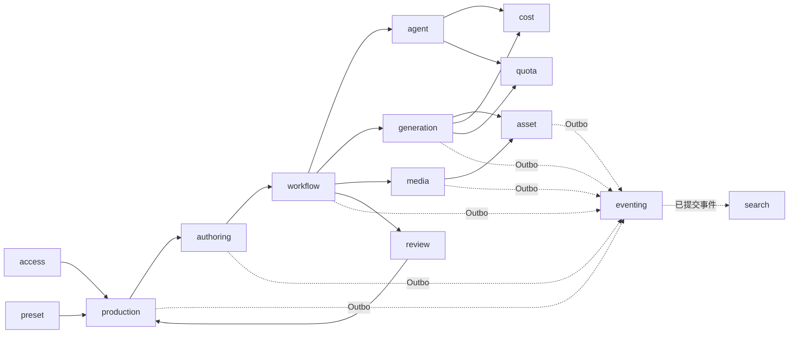
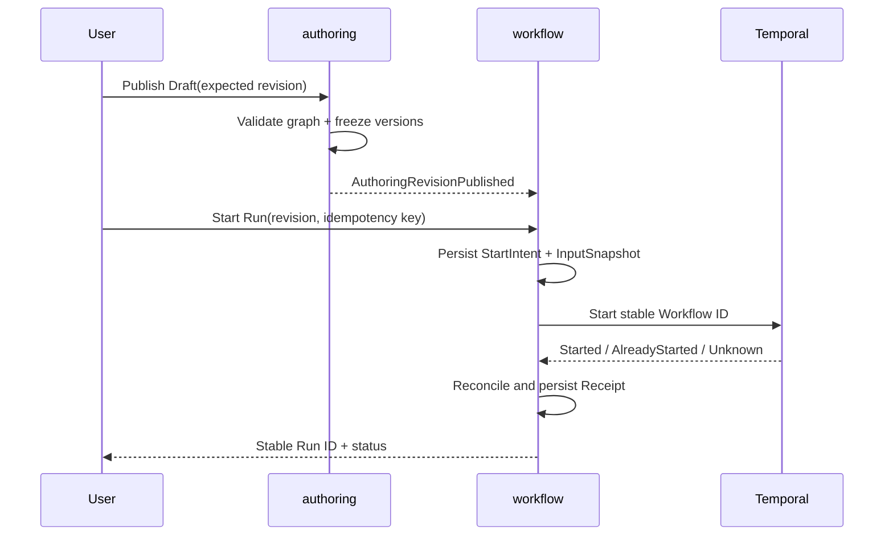
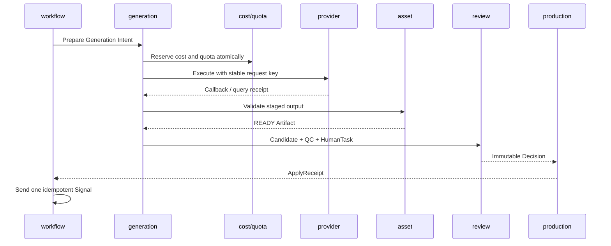

# 后端领域模块功能设计

- 状态：已接受设计
- 日期：2026-08-25
- 产品依据：[产品范围与验收基线](../prd/0001-产品范围与验收基线.md)
- 架构依据：[系统总体架构](0003-系统总体架构.md) · [架构分层与依赖规则](0004-架构分层与依赖规则.md) · [后端服务架构](2001-后端服务架构.md) · [领域语言与模块命名规范](0006-领域语言与模块命名规范.md)
- 派生文档：[后端领域服务与生产闭环需求规格](../requirement/2002-后端领域服务与生产闭环需求规格.md) · [后端领域服务与生产闭环实施计划](../plan/2002-后端领域服务与生产闭环实施计划.md)

## 结论

Lanverse Backend 由 14 个有明确事实所有权的业务模块组成：`access`、`production`、`preset`、`authoring`、`workflow`、`review`、`generation`、`agent`、`asset`、`media`、`cost`、`quota`、`eventing` 与 `search`。每个模块同时拥有自己的领域状态机、Application Command/Query、Repository Port、Outbox Event 和故障恢复规则；其他模块只能保存 ID + Version、不可变 Snapshot 或可重建 Projection。

本设计从空系统定义目标模型，所有能力都以待实现、待验证状态开始。目录存在、类型声明或单次调用成功都不代表模块完成；只有纵向业务切片、失败路径和 Acceptance 同时成立，才能形成实现证据。

## 1. 范围与非目标

本文定义：

- 14 个 Backend 模块的职责、聚合、状态、不变量与公开 Application Contract；
- 模块内事务、同进程跨模块原子协调和跨进程 Saga；
- 从注册、剧本、Production Bible、分镜、生成、审核到成片导出的生产闭环；
- 幂等、结果未知、并发、取消、重试、恢复、审计与投影重建语义；
- 前端、Workflow、Agent、Provider、Media、事件与搜索之间的业务边界。

本文不定义具体 UI 组件、Provider SDK 调用细节、数据库厂商调优参数、部署副本数或实施进度。运行程序、协议源和基础设施边界见[后端服务架构](2001-后端服务架构.md)。

## 2. 模块关系与依赖规则



箭头表示通过公开 Application Interface、ID/Version、Snapshot 或正式异步契约协作，不表示可以读取对方 Repository 或表。依赖必须遵守以下规则：

1. Domain 不导入其他模块、框架或基础设施实现。
2. Application 可以依赖本模块 Domain/Port，并通过对方公开 Application Interface 协调。
3. 同一 PostgreSQL 边界内需要原子完成的业务旅程由专用 Coordinator + 共享 Unit of Work 组合，不把协调逻辑塞入任一聚合。
4. 跨 Binary 或外部 Provider 的动作必须先持久化 Intent，再通过 Receipt、Outbox、Saga 或 Reconcile 收敛。
5. Query 可以读取本模块事实或明确发布的 Projection；禁止用跨模块 Join 绕开业务授权与版本边界。

## 3. 全局 Application Contract

### 3.1 Command Context

所有修改命令必须属于以下一种主体类型，并带齐对应 Context：

| 主体类型 | 必要 Context | 典型入口 |
|---|---|---|
| 已认证业务主体 | Actor、Session、Workspace、Capability、Idempotency Key、Expected Revision | Web/API 业务操作 |
| 已认证账户主体 | Actor、Session、Idempotency Key | 账户安全与 Workspace 创建 |
| 匿名认证流程 | Challenge、Proof、Client Fingerprint、Idempotency Key | 注册、登录、找回 |
| Provider Callback | Provider、Signature、Timestamp、Provider Event ID | 生成任务回调 |
| 内部服务主体 | Service Principal、Scope、Trace、Stable Operation ID | gRPC、Worker、Agent Tool |
| 运维主体 | Operator、Reason、Ticket、Scope、Dry Run | Replay、Reindex、对账与修复 |

每个 Context 都必须完成认证、权限、作用域、时钟窗口和重放校验。跨 Workspace 的“无权限”和“不存在”返回相同公共语义，避免泄漏资源存在性。

### 3.2 Command 执行顺序

```text
Validate Envelope
  → Authenticate Principal
  → Authorize Capability / Workspace
  → Load Idempotency Receipt
  → Lock Aggregate / Check Expected Revision
  → Apply Domain Policy
  → Persist Aggregate + Receipt + Outbox in one transaction
  → Return stable ID / Revision / Result
```

- 同一 Idempotency Key + 同一 Input Hash 返回原结果。
- 同一 Key + 不同 Input Hash 返回冲突，不能覆盖 Receipt。
- Query 不得产生业务副作用、写审计业务事实或隐式触发远程任务。
- 所有时间、随机数和 ID 都由 Application 注入 Domain，保证测试与回放确定性。

### 3.3 错误与结果未知

| 类别 | 含义 | 调用方动作 |
|---|---|---|
| `invalid_argument` | 输入不满足 Schema 或领域前置条件 | 修正输入，不重试原请求 |
| `unauthenticated` / `forbidden` | 主体无效或能力不足 | 重新认证或申请权限 |
| `conflict` | Revision、状态或幂等输入冲突 | 重新读取事实后由用户决定 |
| `resource_exhausted` | Budget、Quota、Rate Limit 或容量不足 | 等待、降级或显式调整 |
| `known_failure` | 操作确认未生效 | 可按 Retry Policy 使用同一稳定 ID 重试 |
| `outcome_unknown` | 远程端可能已生效但未取得 Receipt | 先对账，禁止生成新业务身份盲目重提 |
| `temporarily_unavailable` | 依赖暂不可用且确认未提交 | 有界退避重试或进入可见等待状态 |

### 3.4 版本冻结

每个生产 Run 必须冻结下列引用，运行中发布新版本不得改变旧 Run：

- Script/Bible/Production Snapshot；
- Authoring Revision 与 Workflow Definition；
- Preset、Style、Policy、Skill、Prompt、Rubric 和 Tool Policy；
- Capability、Model Policy、Provider Binding 与 Price Quote；
- 输入 Asset/Artifact/Consent 版本；
- Node Catalog 与 Media/Render Policy 版本。

## 4. 模块所有权总览

| 模块 | 权威事实 | 公开能力 | 明确不拥有 |
|---|---|---|---|
| `access` | Identity、Session、Membership、Capability | 注册、登录、会话轮换、成员授权 | Workspace 生命周期、业务对象 |
| `production` | Workspace、Project、Episode、Scene、Shot、Script/Bible 版本、生产绑定 | 项目结构、版本发布、生产快照 | 协作草稿、执行历史、媒体字节 |
| `preset` | Preset/Style/Policy/Override 版本 | 发布与解析 Effective Policy | Provider Job、Workflow Run |
| `authoring` | Draft、Revision、Node Catalog、GraphPatch Receipt | 编辑、校验、发布、Patch Apply | Temporal History、Production Bible |
| `workflow` | Definition、Run/Node 业务投影、Start/Control/Signal Receipt | 编译、启动、暂停、恢复、取消、局部重跑 | Provider/Media 具体执行 |
| `review` | HumanTask、Claim Lease、ReviewDecision | 领取、续租、决议 | 被审核聚合、Workflow History |
| `generation` | Capability、Model Policy、Request/Job/Candidate/Selection | 路由、提交、回调、候选选择 | 金额账本、Artifact 字节 |
| `agent` | Definition Manifest、Invocation、Grant、AgentRun/Result | 授权并调用受限 Agent | 业务事实写入、模型 Provider 密钥 |
| `asset` | Asset/Version、Artifact、Readiness、Lineage、Location、Rights | 上传、登记、签名访问、血缘 | 媒体处理任务、候选选择 |
| `media` | Probe、Derivative、MediaJob、RenderManifest/Receipt | 转码、字幕、混音、渲染、导出 | Asset 权威元数据、Production 绑定 |
| `cost` | Price、Estimate、Reservation、Ledger、Budget | 估算、预留、结算、释放、对账 | 使用次数限额、Provider 路由 |
| `quota` | Policy、Window、Counter、Reservation、Decision | 检查、预留、消费、释放 | 金额与币种 |
| `eventing` | Outbox/Inbox 协议、DLQ、Replay、Checkpoint、Audit Projection | 发布、消费治理、重放 | Workflow Timer、同步业务命令 |
| `search` | Index Version、Alias、Search Projection、Reindex Job | 搜索、降级查询、重建 | 业务 Command 正确性 |

## 5. `access`：身份、会话与成员能力

### 权威模型

- `UserAccount`：主体身份、状态、验证状态和 Token Version。
- `RegistrationChallenge` / `RegistrationReceipt`：匿名注册证明与幂等结果。
- `AuthSession`：Session Family、轮换序号、撤销原因、过期时间与设备摘要。
- `Membership`：User 与 Workspace 的角色、能力集合和有效期。

### 状态与不变量

`UserAccount` 使用 `pending_verification → active → suspended/deactivated`；`AuthSession` 使用 `active → rotated/revoked/expired`。Refresh Token 每次只允许成功轮换一次；检测到旧 Token 重放时撤销整个 Session Family。权限不能只依赖 Token 内缓存，敏感 Command 必须校验最新 Membership/Token Version。

注册闭环在一个 Unit of Work 中创建 `UserAccount + Workspace + Owner Membership + RegistrationReceipt + Outbox`。Session 创建失败时依据 Receipt 补发，不能重建已提交账户或 Workspace。

### 主要事件

`UserRegistered`、`SessionRotated`、`SessionFamilyRevoked`、`MembershipGranted`、`MembershipRevoked`。事件不携带密码、验证码、Token 或完整设备指纹。

## 6. `production`：生产结构与项目事实

### 权威模型

- `Workspace`、`Project`、`Episode`、`Scene`、`Shot`；
- `ScriptDocument` / `ScriptVersion`、`NarrativeStructure` / `NarrativeUnit`；
- `ProductionBibleVersion`、`CharacterSpecificationVersion`、`LocationSpecificationVersion`；
- `ProductionSnapshot`、`ProductionBinding` 与 `MaterializationReceipt`。

### 不变量

1. 已发布 Script/Bible/Specification 版本不可原地修改。
2. Episode/Scene/Shot 的排序、拆分和合并必须保持稳定身份、引用与审计守恒。
3. Project 归档后只读；恢复必须是显式、有审计的 Command。
4. Production Binding 必须指向精确 AssetVersion/Artifact Version，不指向“最新”。
5. 同一 Bible Identity 在作用域内只能物化一次权威 Asset，别名和 occurrence 不创建第二身份。

### Production Bible 发布

`PublishProductionBible` 先校验全文证据、未决冲突、未知实体闭环和引用版本，再由 Coordinator 在同一事务中：

1. 发布不可变 `ProductionBibleVersion`；
2. 创建或复用项目级 Asset Identity；
3. 写入 AssetState/AssetVersion 与 Production Binding；
4. 写入 `MaterializationReceipt` 与双方 Outbox。

任一步失败整体回滚；同一发布 Key 重试返回同一 Receipt。

## 7. `preset`：风格与策略解析

`preset` 拥有版本化 `Preset`、`Style`、`GenerationPolicy`、`QCPolicy`、`MotionPolicy`、`RenderPolicy` 和 Project/Shot Override。解析顺序固定为平台默认 → Workspace → Project → Episode/Shot Override，输出不可变 `EffectivePolicySnapshot` 与内容 Hash。

发布 Preset 前必须校验引用的 Capability、Model Policy、Agent Definition 和 Media Policy 版本存在且可用。运行时只读取冻结 Snapshot；不得重新解析“当前配置”。相同输入必须产生相同 Snapshot Hash。

## 8. `authoring`：Guided/Canvas 共用创作事实

### 模型

- `AuthoringDraft`：可编辑业务草稿与当前 Revision 指针；
- `AuthoringRevision`：规范化、不可变的 Graph + Metadata；
- `NodeDefinitionVersion` / `NodeCatalogVersion`：节点端口、配置 Schema、能力和风险；
- `GraphPatchIntent` / `GraphPatchReceipt`：AI/Copilot 修改的预览、确认与提交事实。

Guided Studio 与 Canvas Studio 只能产生同一 Graph Schema。布局、选中、Presence 和纯 UI 注释不进入执行 Hash；业务节点、端口、边、配置和冻结引用进入 Hash。

发布前必须完成：未知节点版本、端口类型、必填输入、一般环、无界 Loop、权限、预算、Policy、Asset Readiness 和 Consent 校验。协作 Yjs 文档只是可恢复工作副本，发布事实只能是 PostgreSQL 中的 `AuthoringRevision`。

GraphPatch 固定执行 `Validate → Preview → User Confirm → ApplicationIntent → ApplyGrant → CollaborationReceipt → CommitSnapshot`。远程应用结果未知时按 Application ID 对账，不生成第二个 Patch。

## 9. `workflow`：编译与长生命周期执行

### 模型与状态

- `WorkflowDefinitionVersion`：由 AuthoringRevision + Node Catalog 编译的不可变定义；
- `WorkflowRun` / `NodeRunProjection`：面向业务查询的运行投影；
- `WorkflowStartIntent/Receipt`、`ControlIntent/Receipt`、`SignalIntent/Receipt`；
- `RunInputSnapshot`、`NodeCacheEntry`、`QualityGateResult`。

业务状态统一为：

```text
QUEUED → RUNNING → WAITING_HUMAN / RETRYING / PAUSED
      → SUCCEEDED / FAILED / CANCELLED / NEEDS_ATTENTION
```

Temporal History 是 Timer、Retry、Activity、Signal 和 Compensation 的运行权威；PostgreSQL 只保存稳定业务绑定和查询投影。Workflow ID 由 Workspace/Project/Run 身份确定；Start 返回未知时必须通过 Describe/History 对账。

Node Cache Key 至少包含 Node Definition、规范化输入 Hash、冻结 Policy/Model/Prompt/Skill、输入 Artifact Hash 和 Runtime Contract Version。局部重跑只能使依赖闭包变脏，不修改旧成功 Run 的历史事实。

MVP 的 `NodeCacheEntry` 只保存已经完成并可复用的不可变输出快照，不建立第二套运行中状态、Lease 或调度器。Key Material 使用 `node-cache-key-v1` 明确记录 Node Definition Content Hash、Config Hash、规范化输入 Hash、可选的冻结 Policy/Model/Prompt/Skill Hash、排序去重后的输入 Artifact Hash 和 Runtime Contract Version；任一执行输入变化都必须产生不同 Cache Key。缓存以 Workspace + Cache Key 隔离，命中不得跨租户；相同 Key 只能对应一个 canonical Output Snapshot/Hash，不同输出必须报冲突。Source WorkflowRun/NodeRun 只作为来源审计，缓存输出本身必须足以还原绑定。

缓存事实不等于缓存命中：只有 Node Executor 返回规范化输出绑定、Temporal Workflow 将上游 Output Hash 纳入当前节点输入 Hash，且 Runtime 原子写入 NodeRun 输出投影后，才允许把节点标记为 `CACHED`。在这些条件完成前，不得仅凭节点状态或整个 RunInputSnapshot Hash 跳过执行。

Node Executor 输出先固定为 `node-output-v1`：一个输出快照由按 Port 排序且不可重复的 Binding 集合组成，每个 Binding 明确 `port`、`value_type`、Owner 事实的 `reference_id` / `reference_version` 和 `content_hash`。Executor 只能返回 `SUCCEEDED` 或 `SKIPPED` 与该结构化输出；Runtime 负责校验、规范化和计算 Output Hash，Executor 不得自行声明 `CACHED`。非人工节点完成时，Node 状态、canonical Output Snapshot/Hash、Claim Token 清除必须在同一 GORM 事务中提交；执行失败或输出无效时只能进入 Retry，不得留下半成品输出。已完成 Activity 重放必须从 NodeRun 投影返回原始 Output Snapshot/Hash，不再次调用 Executor。

本契约只建立可传播的输出事实，不在没有输入解析器时提前启用缓存。下一层由 Runtime 根据 Graph Edge/Binding 解析上游端口，校验 `value_type`，形成规范化 Node Input 与上游 Output Hash；Human Gate 只有在目标 Owner 写入正式 Apply Receipt 与输出引用后才能向下游传播，不能把 Review 状态伪装为业务产物。

`node-input-v1` 由 Backend Runtime 从已提交的 WorkflowDefinitionVersion 与 RunInputSnapshot 生成，不接受 Executor 自报输入。快照包含 canonical Node Config、按目标 Port 排序的输入 Binding 和排序后的全部 Frozen Reference：Edge Binding 必须引用上游已完成 Node 的精确 Output Port/Value Type/Owner Reference，Variable Binding 必须引用编译定义中的变量值；任一缺失、类型漂移、重复 Port 或上游无输出都拒绝 Claim。为保证 MVP 的正确失效，全部 Frozen Reference 进入每个节点输入 Hash，后续只有在证明依赖裁剪正确后才能优化缓存粒度。

Node Claim 首次从 `QUEUED/RETRYING` 进入 `RUNNING` 时，canonical Input Snapshot/Hash、Claim Token、Attempt 与 Revision 在同一 GORM 事务中写入；丢失 Activity 的再次 Claim 必须重新解析并验证 Input Hash 不变。Node Executor 只接收该快照以及编译定义中的期望 Output Ports；Runtime 在提交输出前校验 Port 完整性与 `value_type`，不能让 Executor 返回未知端口、遗漏必填端口或改变类型。该切片完成后，Node Cache 才能用 Node Definition、Config Hash、Input Hash、Frozen Hash、上游 Content Hash 与 Runtime Contract 组成完整 Key。

Runtime 只对编译策略为 `by_inputs` 的节点启用缓存，并在 Claim 事务中把完整 Cache Key 写入 NodeRun 投影；`never` 节点不得生成或查询缓存键。命中时，Runtime 必须在 Claim Token/Revision 围栏内，将缓存的 canonical Output Snapshot/Hash 与 Node 状态 `CACHED` 原子提交，Executor 不得运行。未命中时，Executor 成功输出、不可变 `NodeCacheEntry` 与 NodeRun 的终态输出必须在同一 GORM 事务中提交；并发相同 Key 只能收敛到相同输出，不同输出整体回滚并报冲突。MVP 不增加 Pending Cache、Lease、Redis、后台缓存协调器或跨 Workspace 复用。

## 10. `review`：人工任务与不可变决议

`HumanTask` 绑定精确对象类型、对象 ID、Revision、候选集合和 Rubric Version。领取使用带到期时间的 `ClaimLease`，支持续租、释放和过期接管；过期 Lease 不能提交决议。

`ReviewDecision` 是不可变终态：`approved`、`rejected`、`changes_requested` 或 `selected`。提交前重新校验对象 Revision，过期对象返回 Stale，不覆盖新版本。Review 不直接写 Production、Generation 或 Asset；需要生效的决议先由目标 Owner 写 `ApplyReceipt`，Workflow 只在 Receipt 后发送一次幂等 Signal。

Human Gate 打开时必须使用与普通节点相同的 Graph/Port 解析器冻结 `node-input-v1`，并把上游候选的 Owner Reference ID 绑定到 HumanTask；重放打开操作必须验证 Input Hash 与候选集合不变。发送信号前，Backend 必须从 PostgreSQL 重新核对 HumanTask、不可变 ReviewDecision、Subject Revision、Decision 值及 `selected` 候选，不能信任客户端重复提交的 Decision。该绑定只证明“审了哪个候选、作了什么决议”，不等于目标 Owner 已应用；成功 Gate 仍须在目标 Owner ApplyReceipt 返回正式 `node-output-v1` 后才能写入 `SUCCEEDED` 并传播下游。

## 11. `generation`：模型路由、任务与候选

### 模型

- `GenerationCapabilityVersion`、`ModelPolicyVersion`、`ProviderBindingVersion`；
- `GenerationIntent`、`GenerationRequest`、`ProviderJob`、`ProviderCallbackReceipt`；
- `GenerationCandidate`、`CandidateSelection` 与 `ProviderUsageReceipt`。

提交时冻结能力、模型策略、Provider、输入 Artifact、Prompt/Skill、Price Quote 和输出约束。Provider Request Key 必须稳定；Callback 在公网层验签、限制时间窗口并按 Provider Event ID 去重，再转换为内部规范化 Command。

Provider 输出先进入隔离 Staging，经 Asset 完整性与 Readiness 校验后才能创建 Candidate。候选不等于选择；只有经确定性 QC、语义 QC、必要人工审核和唯一 `CandidateSelection` 后才能进入 Production Binding。

Fallback 是显式 Policy，必须受预算、Quota、尝试次数与 deadline 限制。超时但结果未知时进入 `RECONCILING`，不能释放预留后立即向另一 Provider 重提。

## 12. `agent`：受限智能体控制面

Go `agent` 模块拥有 `AgentDefinitionManifest`、`AgentInvocation`、`ExecutionGrant`、`ExecutionBudget`、`AgentRun` 与 `AgentResult`。Python Runtime 只执行被授权定义，不拥有任何业务事实。

Grant 必须绑定 Run/Node、输入 Hash、允许的 Agent/Skill/Prompt/Rubric/Tool 版本、模型能力、最大步数、调用次数、Token、费用和 deadline，并具备短时有效期与防重放标识。

- Tool 只能经 Backend Allowlist API 读取最小上下文或提交 Proposal；
- 模型调用只能经 Model Gateway；
- Runtime 无数据库、对象存储、Yjs、Shell 和任意网络权限；
- 输出必须通过 Schema、引用、权限、版本与确定性 Gate，之后才可由业务 Owner 接受；
- Repair 次数有上限，耗尽后进入人工审核或明确失败。

## 13. `asset`：资产、产物、血缘与权利

### 三层模型

| 层 | 含义 | 关键属性 |
|---|---|---|
| Asset / AssetVersion | 可版本化业务身份与语义 | 类型、项目身份、版本、状态、权利 |
| Artifact | 不可变生成或上传产物记录 | Content Hash、Media Type、Readiness、Lineage |
| Storage Location | Artifact 字节的物理位置 | Profile、Bucket、Key、Region、Checksum、状态 |

Artifact Readiness 状态为：

```text
PENDING_VALIDATION → READY
                   ↘ QUARANTINED / UNAVAILABLE
READY → TOMBSTONED（仅满足保留与引用规则后）
```

上传执行 `CreateUploadSession → Presigned Upload → Complete → Hash/Format Validate → READY`。Bucket 默认私有，Download Grant 短期且绑定主体、Workspace、Artifact、动作和有效期。未 READY、权利过期、Consent 撤销或作用域不匹配时默认拒绝生成、发布和导出。

位置迁移不改变 Artifact ID/Hash：复制 → 校验 → Dual Read → 切换 Primary → 观察 → 退役旧位置；任一步失败可回滚到上一个有效 Primary。

## 14. `media`：媒体处理、渲染与导出

`media` 拥有 `MediaProbeResult`、`DerivativeReceipt`、`MotionPlan`、`RenderManifestVersion`、`MediaJob` 与 `Render/ExportReceipt`。输入永远不可覆盖；输出先写临时位置，完整性和 Hash 通过后由 Asset 登记新 Artifact/Lineage。

`RenderManifestVersion` 冻结时间线、镜头 Artifact、音频、字幕、字体、转场、滤镜、规格、编码器策略与所有输入 Hash。相同 Manifest + Idempotency Key 只能形成一个业务输出 Receipt。

MediaJob 使用 `queued → claimed → running → verifying → succeeded/failed/reconciling/cancelled`。Worker 丢失、FFmpeg 超时、磁盘不足或回执未知时依据 Lease、Heartbeat、临时对象和 Receipt 对账；不能因为重试产生重复 Artifact。

## 15. `cost` 与 `quota`：费用和用量双门禁

`cost` 使用 Decimal + Currency 表达金额，拥有 Price、Estimate、Reservation、Ledger Entry 和 Budget；`quota` 拥有 Policy、Window、Counter、Reservation 和 Decision，不保存金额。两者以 PostgreSQL 事实为准，Redis 只能做可丢弃的快速拒绝或 Rate Limit。

所有付费 Provider、Agent 模型调用和高成本 Media Job 固定执行：

```text
Intent + Cost Reservation + Quota Reservation + Outbox
  → AcquireExecutionClaim
  → short-lived ExecutionAuthorization
  → Execute
  → Usage/Result Receipt
  → Settle Cost + Consume Quota
     or Release / Reconcile
```

准备事务必须同时成功或失败。Claim 与取消互斥；Authorization 过期后不得执行。结果未知时两类 Reservation 保持占用直到对账，避免超预算或超限额重提。Ledger 只追加，不原地修改历史金额。

## 16. `eventing` 与 `search`：事件治理和可重建投影

业务 Command 在 Owner 事务中写 Outbox。Publisher 通过 CDC 或受控扫描至少一次发布；Consumer 使用 Inbox Event ID 去重，并以 Aggregate Revision 防止旧事件覆盖新投影。

Event Envelope 必须包含 Event ID/Type/Schema Version、Aggregate ID/Revision、Workspace ID、Partition Key、Occurred At、Trace、Correlation、Causation 和严格 Payload。Topic 按聚合稳定分区；破坏性 Schema 变更使用新版本并先完成 Consumer 兼容门禁。

Poison Message 进入 DLQ；Replay Job 记录范围、原因、Schema、Checkpoint、水位和操作者。实时流与 Replay 通过 Revision/Checkpoint 收敛，不能各自成为 Writer。

`search` 按 Workspace 强制过滤，使用版本化 Index + Alias。Index 文档记录 Source Revision；乱序旧事件被拒绝。搜索不可用时返回明确 degraded 响应，可回退到有限 PostgreSQL 查询，但不能放宽租户和权限过滤。全量 Reindex 从 Snapshot + Event 重建并原子切换 Alias。

## 17. 跨模块生产闭环

### 17.1 Authoring 到 Workflow



### 17.2 高成本生成到人工应用



### 17.3 成片输出

Workflow 以已选择 Candidate 和冻结 Production Snapshot 生成 RenderManifest；Media 执行 Probe/Derivative/Voice/Subtitle/Mix/Render/Export；Asset 登记每个输出 Artifact 和 Lineage；Cost/Quota 结算；Eventing 将已提交事实投影到 Audit/Search/Analytics。最终导出必须能反查全部输入版本、策略、模型、费用、人工决议与运行 Trace。

## 18. 事务与一致性边界

| 旅程 | 一致性方式 | 禁止做法 |
|---|---|---|
| 注册 + Workspace + Owner Membership | Coordinator + 单 PostgreSQL Unit of Work | 先建 User 后异步补 Workspace |
| Bible 发布 + Asset 物化 | Coordinator + 单 Unit of Work | 两个模块各自提交后人工补偿 |
| Owner 事实 + Outbox | 单模块事务 | 提交数据库后直接发 Kafka |
| Workflow Start/Signal | Intent/Receipt + stable ID + Reconcile | 超时后换 ID 重发 |
| Provider/Agent/Media 执行 | Reservation + Claim + Receipt + Saga | 分布式事务或未知结果盲重试 |
| Review 应用 | Decision + Owner ApplyReceipt + SignalReceipt | Review 直接更新业务表 |
| Search/Audit 投影 | Inbox + Revision Fencing + Replay | 投影回写业务事实 |

## 19. 并发、取消与恢复

1. 聚合修改使用 `expected_revision`；冲突返回当前 Revision 和可重新读取的资源标识。
2. Lease/Claim 都包含 Owner、Token、期限和 Fencing Version；过期执行者的迟到结果不能覆盖新执行者。
3. 取消先持久化 Intent，与 Claim 获取在同一锁域互斥；已经产生外部结果时进入 Reconcile，再决定结算或丢弃。
4. Worker 重启依据 Intent、Receipt、Heartbeat、Temporal History、Provider Job 与临时对象恢复，不依赖内存队列。
5. 重复 HTTP、Activity、Callback、Kafka Delivery 和 Signal 最终只能产生一次领域效果、一次费用与一个权威 Receipt。

## 20. 安全与内容治理

- 所有 Workspace Command 重新授权，服务身份使用最小 Scope；
- Provider Callback 验签、限制重放窗口，内部 gRPC 使用服务身份；
- Secret、Token、验证码、用户原稿和 Provider Payload 不进入非必要日志、Metric Label、Event 或 Trace；
- Asset 下载、生成、发布和导出必须校验 Rights/Consent/Usage Scope；
- Agent Tool、模型能力、步数、费用和网络访问全部由 Grant 限定；
- Replay、Reindex、对账、强制解锁和数据修复必须记录 Operator、Reason、Ticket、范围与结果。

## 21. 可观测性与审计

每个 Command、Workflow、Agent Invocation、Generation Job、Media Job 和 Event 共享 Trace/Correlation/Causation。核心 Metric 使用有界标签，业务 ID 进入结构化日志字段而不是标签。

最低审计范围包括：认证与权限变更、Bible/Script/Revision 发布、GraphPatch 应用、Workflow Control、费用/限额变更、Provider Callback、候选选择、ReviewDecision、Production Apply、Artifact 下载/导出、Replay/Reindex 和运维修复。

告警至少覆盖积压、失败率、Outcome Unknown 年龄、Reservation 悬挂、Temporal Task 延迟、Provider Callback 延迟、Media Lease 过期、Outbox/Inbox/DLQ、Search Projection Lag 与跨模块 Receipt 不一致。

## 22. 需求追踪

| 设计范围 | Requirement |
|---|---|
| 全局 Command、事务、跨模块与版本冻结 | `BE-APP-001`–`BE-APP-007` |
| 14 个模块所有权与最小契约 | `BE-MOD-001`–`BE-MOD-014` |
| 注册、Bible、Workflow、付费执行、审核、渲染与投影旅程 | `BE-JRN-001`–`BE-JRN-008` |
| 真实剧本完整闭环与故障注入 | `BE-E2E-001`–`BE-E2E-002` |

实现顺序和唯一执行 Checklist 见[后端领域服务与生产闭环实施计划](../plan/2002-后端领域服务与生产闭环实施计划.md)。本文只定义目标设计，不声明任何 Requirement 已实现或已验收。
