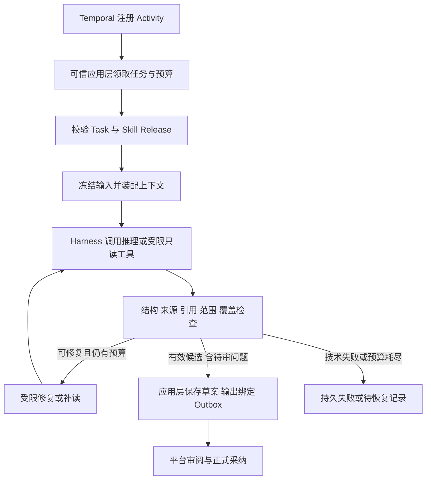

# Agent Harness 专业能力与创作流程设计

- 状态：待评审目标，尚未取代已接受设计或解锁实施
- 日期：2026-09-07
- 上位边界：[0013 创作编排与多媒体画布架构调整](0013-创作编排与多媒体画布架构调整设计.md)
- 联动设计：[1003 多媒体创作画布与运行可视化](1003-多媒体创作画布与运行可视化设计.md)
- 既有设计：[3003 StoryGraph Harness](3003-StoryGraph剧本解析Harness与内置Skill设计.md) · [3001 制作圣经](3001-项目制作圣经生成执行框架设计.md) · [3002 分镜 Harness](3002-本地-Codex-分镜智能体执行框架设计.md)

## 1. 结论、问题与范围

Harness 是有界专业任务的执行内核：固定输入、选择已发布 Skill、装配上下文、调用推理/受限工具、验证结果，并把可保存的候选交回可信应用层。Python Temporal 编排长期创作流程；Go 保持正式采纳、供应商操作、权限与账本的唯一边界。三者不共享可变执行状态。

当前 `StoryGraphHarness`、`SceneAnalysisHarness` 已有包摘要校验、严格 Schema、来源校验和单次调用限制，`build-storygraph` 已有多 Stage 指引；新设计需要补齐可组合的专业能力、按场上下文、持久执行预算、草案发布及对画布的检查点协议。不能把拆出多个 Skill 文件当作这些能力已经存在。

本文负责 Task、Skill、上下文、结果检查、候选修订、专业流程和执行描述。平台事务/迁移/事件传输归 0013；节点坐标、分组和 UI 操作归 1003。非目标为自由多 Agent 群聊、模型生成可执行 Workflow、推理进程直接读写数据库、42 个常驻服务，以及一次性实现所有流程。

## 2. 执行边界与调用循环

职责分为四层：

| 层 | 负责 | 不负责 |
| --- | --- | --- |
| Workflow | 阶段顺序、动态集合、依赖、Timer、等待与取消传播 | 直接 I/O、模型调用、数据库 DAG 轮询 |
| Activity/应用层 | 授权核验、任务领取、预算预留、草案事务、平台端口、执行结果对账 | 把模型建议直接认定为正式决定 |
| Harness | 上下文、Skill 选择、推理循环、受限工具、校验与修复分类 | 跨小时审批等待、长期调度、直接采纳或扣费 |
| 推理适配器 | 执行一个受限请求，返回结构化结果与可获得的使用信息 | 获得平台数据库、供应商长期密钥或任意系统工具 |

Harness 返回结构化候选/Issue；应用层完成持久化后才返回可消费的结果引用。`output_writer` 若存在，属于可信应用层端口，数据库凭据不得进入模型可访问的子进程。

## 3. Task、快照与结果合同

| 合同 | 必要内容 | 约束 |
| --- | --- | --- |
| TaskEnvelope | task/invocation ID、run/step ID、scope、Skill Release 引用、snapshot_ref、授权引用、budget_ref | 服务端身份验证后派生租户；输入不允许替换工具或动态类路径 |
| InputSnapshot | 正式源版本、输入资源 revision、上游采纳映射、用户锁定、允许输出、模型/Skill/策略摘要 | 不可变；短期令牌不写入快照；副作用前重新鉴权 |
| ContextManifest | 实际装载的片段/资源、hash、裁剪/摘要记录、遗漏项、工具补读证据 | 可以解释“本次看到了什么”；关键原文不得静默截断 |
| AttemptResult | attempt/fence、输入与 release hash、执行状态、候选或错误、usage 观察 | 尚未成为唯一接受结果；迟到成功只能留审计 |
| PersistedOutput | 被接受结果、候选 revision、checks_ref、OutputBinding、usage_ref | 可读取且已提交后才能发布 ready |
| Proposal | 目标类型、base revision、内容或受限 Patch、来源、未决事项、修改范围 | 模型不能分配平台正式 ID，也不能自签通过 |

ResourceRef、RunCommand、AcceptanceReceipt、跨语言 canonical 规则沿用 0013，不重新定义同名身份。

执行状态、审阅、质量、新旧状态与正式采纳分别保存。`succeeded` 表示本次任务产生了符合合同的结果；该结果可以包含 unresolved 或语义 blocker。Schema/来源无效属于技术失败，不能包装成可采纳候选。自动检查通过也不等于平台已采纳。

## 4. 上下文组织与原稿保真

输入按“任务规则 → 当前原文 → 已采纳对象 → 相邻状态与披露约束 → 相关背景 → 示例”装配。原稿、参考内容、用户意图与系统规则使用明确数据边界，附件中的指令不能注册 Skill 或改变工具策略。

长稿先保留完整源和可追溯分块，再按块提取、按类型归并。分块记录原文区间与重叠规则，汇总按来源区间去重；不能先压缩为摘要后宣称已完成全部实体和对白提取。

全局解析覆盖所有已上传原稿；逐场导演只读取当前场、必要上下文、已确认状态及该场允许披露的信息。全局确认“蒙面人是周野”，不意味着早期镜头可显示其脸部。人物身份/造型/出场、地点/地点变体/叙事场次、道具类型/实例/状态分别建模。

SourceRef 固定源版本、块与 Unicode code point 区间、文本 hash；规范化文本保留与原稿的映射。引用错误只能重读或重提案，不能让模型猜 hash。有效来源证明可追溯性，不自动证明模型语义判断正确。

超出上下文预算时，先缩小 scope 或请求已授权片段；可摘要背景，但台词与必需证据不可静默丢弃。仍无法完整处理时返回上下文不足与缺失范围，由 Workflow 重新拆分或进入人工处理。

## 5. Skill 的内容、执行声明和发布

SkillRelease 固定包名/版本、内容摘要、输入输出 Schema、参考文件、执行类型、允许工具、修改范围、修复/用量限制、产物角色与评测版本。`SKILL.md` 表达专业方法；执行权限取发布声明、部署策略、调用授权和本次批准范围的交集，不能由正文覆盖。

沿用 [Agent Skills 公开格式](https://github.com/agentskills/agentskills/blob/main/docs/specification.mdx) 的 SKILL.md 与附属资源组织；schemas、execution.yaml、评测格式和 StepDescriptor 是 Lanverse 扩展，不是公开格式自带的执行保障。先复用现有 `build-storygraph` 的真实指引与校验，逐步拆出可独立测试/发布的能力，不批量创建空包。

42 项能力保留原统一设计稿名称，分工如下；这是目标覆盖目录，不代表均已安装或实现。

| 专业域 | 能力目录 | 核心产物 |
| --- | --- | --- |
| 剧作解析（8） | inspect-manuscript、divide-episodes、summarize-episode、segment-scenes、mark-story-beats、extract-dialogue-cues、verify-text-coverage、propose-script-revision | 来源、分集/场次、节拍/对白、覆盖账与改编差异 |
| 全局设定（8） | collect-cast、collect-places、collect-props、resolve-entity-aliases、map-story-relations、trace-continuity、audit-story-facts、compile-asset-needs | 提及、身份提案、关系/状态与制作需求 |
| 视觉开发（5） | design-character-sheet、design-location-sheet、design-prop-sheet、define-visual-style、bind-reference-material | 外观与风格提案、明确用途的参考 |
| 导演分镜（8） | analyze-scene-intent、arrange-blocking、design-shot-coverage、write-shot-briefs、time-dialogue-and-action、review-screen-direction、plan-frame-board、audit-scene-coverage | 场次拆解、调度、覆盖、ShotBrief 和 FrameBoard |
| 镜头制作（5） | prepare-image-instructions、prepare-video-instructions、assess-shot-feasibility、review-generated-take、plan-selective-retake | 配方、可行性、审片问题与重拍提案 |
| 声音交付（4） | plan-voice-performance、align-caption-script、propose-edit-assembly、review-delivery | 配音、字幕、EditPlan 和交付检查 |
| 参考修订（4） | analyze-reference-film、derive-style-playbook、explain-change-impact、replan-affected-work | 拉片研究、风格配置与受限修订方案 |

现有 Stage 与目标 Skill 通过显式迁移表映射，不能用新包名继续返回旧语义 payload。新包发布需要正例、反例、缺证据例、越权例和独立评测；执行固定版本，升级只影响新调用。撤回阻止新执行，旧产物仍可审计；不能用相近包代替找不到的版本。

## 6. 专业结果如何形成

| 步骤 | 模型负责 | 代码/领域负责 | 下游消费 |
| --- | --- | --- | --- |
| 分集分场 | preserve/propose/revise 范围内提出边界和理由 | 首尾覆盖、重复/缺号、空范围、原文映射和采纳 | StoryMap 与稳定 Episode/Scene 映射 |
| 提及与身份 | 基于来源提出 link/merge/split/uncertain | 类型/范围/共现约束、稳定 ID、人工合并与撤销记录 | WorldBook 与各场 Presence |
| 剧情状态 | 从节拍提出状态变化、认知和披露证据 | 分支/时间与 known/unknown/conflicting 处理 | 镜头入口/出口状态 |
| 导演方案 | 叙事目的、站位/视线、镜头覆盖与表演意图 | 必拍节拍/对白映射、引用、时长和硬依赖检查 | SceneBreakdown、ShotBrief、FrameBoard |
| 生成配方 | 在能力范围内提出提示和参考方案 | 硬约束、授权、报价、预留和供应商操作 | RenderRecipe、Take |
| 审片 | 时间/区域定位问题及不确定性 | 解码/时长等技术检查、人工决定与正式选择 | QC Issue 与 TakeSelection |
| 改稿 | 解释影响并在许可集合内重规划 | DependencyIndex 计算字段影响、批准范围和复用验证 | 新修订运行；历史交付保持冻结 |

SourceCheck、ReferenceCheck、ScopeCheck、CoverageCheck 为确定性检查；语义评测保留证据、检查器版本与人工复核。身份、表演或运镜缺少可评价证据时允许 not_evaluable，不能用 Schema 成功推导艺术质量通过。

视觉参考可以按选定集/场需求生成，不必先为全剧所有角色和造型出图；事实解析与实体整理仍覆盖已上传全稿。SceneBreakdown → ShotBrief → RenderRecipe 必须保留中间产物，不能只用一个提示词字段代替导演设计。

## 7. 持久创作流程与人工门

| Flow | 拥有的创作顺序 | 完成依据 |
| --- | --- | --- |
| CreateSeriesFlow | 全稿分析、全局设定、选定剧集制作 | 子流产物与平台正式回执 |
| ReadManuscriptFlow | 原稿检查、分集、逐集/场提取、覆盖与审阅 | StoryMap/场次草案及采纳映射 |
| BuildStoryWorldFlow | 分场提取、全局归并、状态/关系与资产需求 | 固定 WorldBook 及正式采纳 |
| DevelopVisualsFlow | 按需求设计、申请生成、参考审阅 | 选定范围的 VisualLibrary |
| DirectEpisodeFlow | 分场导演、有界汇总与时长/依赖检查 | 整集可审阅导演方案 |
| DirectSceneFlow | 意图、调度、覆盖、ShotBrief、校时、方向与画板 | 来源 → Beat → Shot → Panel 关联 |
| ProduceShotFlow | 已批准配方、关键帧、视频、审片和选择等待 | 候选、QC 与平台选片/绑定回执 |
| ProviderCallFlow | 确保平台 operation 被接收并等待结果 | Go Generation 原操作结果；不直接访问供应商 |
| FinishEpisodeFlow | 声音、字幕、剪辑提案、渲染与交付等待 | Go 冻结的 ReleaseBundle |
| ReviseProductionFlow | 受影响范围重规划、复用与重新审阅 | 新运行关联旧基线与 ChangeSet |
| StudyReferenceFlow | 已授权视频的探测、边界/帧、语义分析、归组与风格提炼 | ReferenceStudy/ReferenceAnalysis、AnalyzedShot、分组与待审 StylePlaybookDraft |

这是职责目录，不要求 11 个 Flow 同时形成代码骨架。纯计算步骤无需创建子 Workflow；需要长期等待、独立取消或有界 fan-out 才建立持久边界。子流并发受租户、推理配额、供应商容量与预算限制；Continue-as-New 需保留逻辑步骤身份和在途处理策略。

参考片的 ReferenceStudy 是专业分析产物，ReferenceAnalysis 是其版本化跨边界索引；AnalyzedShot 表达原片镜头，通过显式 adaptation_link 才能转为待制作 ShotBrief。单帧不足以验证完整运镜，不确定摄影参数保留 unknown。边界修正保留已分析区间，只重抽受影响邻域；StylePlaybookDraft 经过审阅才可入库。

Go 先保存 ReviewDecision，再完成已有显式 Owner Effect，最后可靠通知目标 Python 流程。任一 checkpoint 未完成都不可宣称整项采纳成功。收到拒绝或修改请求时，Workflow 按冻结流程配置进入指定修订分支，不能抹去原结果从全稿重新开始。

## 8. 重试、修复、预算与取消

Invocation 的预算和控制头是持久事实；每次 Attempt 领取时核验剩余额度并取得 fencing token。当前 Harness 内存计数仅约束单进程调用，不能直接充当跨重启预算。新的调用前先登记额度占用，结果返回后按可获得的 usage 对账；未知用量不能当零。

| 情况 | 行为 |
| --- | --- |
| 发送前本地失败 | 同 Invocation 在剩余预算内创建下一 Attempt |
| 执行结果未知 | 先查原执行/已存产物；无可恢复执行时经明确策略重新尝试，可能产生推理费用 |
| Schema 可修复错误 | 在冻结上限内结构修复；不能顺便修改故事或扩大输入范围 |
| 来源错误 | 返回失效片段，补读原文；禁止猜证据 |
| 身份歧义/覆盖缺口 | 保存可审阅问题或限定提案，不随机重试到“通过” |
| 语义修订 | 固定父候选、Issue 与允许字段，应用 typed Patch 后重验，产生新 revision |
| 用户改稿 | 新 snapshot/修订运行，旧结果标 stale；已采用候选在新选择前保持可追溯 |
| Deadline/取消 | 终止并等待本次推理子进程退出，处理残留进程和额度；不占用无限后台任务 |
| 旧 Worker 迟到 | CAS 核验 claim、release/control 与当前 Attempt；失败结果只留审计 |

技术 Attempt deadline、Invocation 累积预算、业务人工等待期限分别定义。暂停不重置预算；重试不得变更原供应商 operation ID。额外创意候选需要新的明确请求与预算。

## 9. 给画布的执行合同

StepDescriptor 与已发布 StepSpec 绑定，至少包含稳定 step_key、业务标题、阶段、scope_kind、progress_unit、output_roles、允许的 renderer 类型和门禁描述。运行前编译固定描述；前端不能根据日志猜阶段，也不各写一份业务步骤清单。

renderer 为受控枚举，不能携带动态组件路径。Descriptor 声明可用操作种类；实际能否执行还由平台当前权限、版本和业务状态决定，不能仅凭前端按钮启用获得授权。

StepInstance 表达一个 scope 的逻辑工作；StepAttempt 表达技术尝试；OutputBinding 使用 step_instance_id + output_role + item_key 绑定持久资源 revision。首次结果填充稳定槽位，重试更新尝试状态，不能重复创建镜头卡。部分结果保存 completeness=partial，不解除正式生产门禁。

运行事件只发送已提交检查点：接受、展开、开始、部分产物、结果就绪、待审、失败和完成。资源/输出事件带可读取引用；工具细节只提供脱敏操作摘要，不暴露隐藏推理、全量原稿或凭据。传输、去重与项目游标沿用 0013；1003 负责投影表现。

进度单位为可验证计数或不确定阶段。动态发现更多集/场时显示范围更新；没有可靠供应商百分比时显示提交时间、最近查询和等待原因。

## 10. 实际落点、兼容与设计验证

保留 `agent/app/modules/storygraph` 的候选与专业校验，复用 `candidate_runtime` 现有传输边界；新可信应用/执行层按需要添加，不能为整张目标架构提前建空目录。代码层区分 task receiver、context builder、skill resolver、reasoning adapter、result checker、repair policy 和持久输出端口，不要求一个职责一个文件或类。

旧 Go-owned Candidate 与旧 Bundle/Wire 保持原身份；新 Agent-owned Proposal 使用新版本合同。接受后同步 3003/3001/3002 的所有权、阶段与恢复条款，保留 style-blind 事实、来源、typed repair、显式 Gate 和调用预算规则，避免两套同名 Candidate Head 同时可写。

设计验证场景：长稿跨块与中文/表情来源；目录/正文集号冲突；别名误合并与撤销；蒙面身份披露；多人手机；闪回道具状态；必拍节拍遗漏；单场失败与局部修订；输出保存后响应丢失；预算跨重启；过期批准；旧 Attempt 迟到；Skill 撤回；视频生成 UNKNOWN。

这些场景是后续合同与验收的输入，尚无本设计的运行通过声明。首个增量聚焦一份合成原稿、一个新解析流程、可采纳草案及恢复证据，再扩展专业能力。
