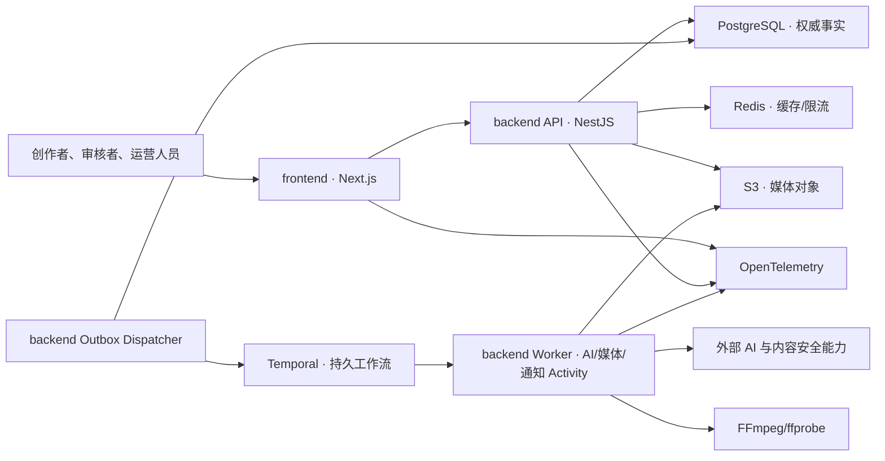

# ARCH-001 AI 短剧制作平台总体架构设计

## 1. 设计结论

Lanverse 首发采用统一 monorepo、模块化单体控制面和独立 Worker：Next.js Web 负责交互与 BFF，NestJS API 负责授权和业务事实，PostgreSQL 保存权威数据，Temporal 负责编排长任务，AI/媒体 Worker 独立扩缩容，对象存储保存媒体，Redis 只承担易失缓存与限流。

本设计吸收 Jellyfish 的分镜准备/生成边界，以及 Toonflow 的来源事件、Agent 分工和生产图思路；不复制两者的技术栈或具体代码。流程和 Agent/任务见 [ARCH-002](ARCH-002-短剧生产流程与工作台设计.md)、[ARCH-003](ARCH-003-AI策划与生成任务架构设计.md)，契约、媒体安全与运行质量见 [ARCH-004](ARCH-004-API事件文件与数据契约设计.md)、[ARCH-005](ARCH-005-媒体安全隐私与数据生命周期设计.md)、[ARCH-006](ARCH-006-部署观测灾备容量成本与测试设计.md)。

## 2. 当前状态与约束

- Git 根目录已统一为 `Lanverse/`，原 `lanverse-backend/` 子目录已移除。
- 当前只有治理和正式文档，无应用源码、依赖清单、数据库或部署制品。
- 技术基线由 [TCR-001](../requirement/TCR-001-平台技术栈与总体架构约束需求规格说明书.md) 固定；本设计不得降低 NFR、权限、版本、成本、合规和交付要求。
- 正式实现必须等待本组 Design 被接受，并继续完成 `PRD → Plan → Acceptance`。

## 3. 目标与非目标

目标：

- 打通内容导入、剧本、分镜准备、资产一致性、生成、声音、后期、审核、成本、合规和交付。
- 让每项业务事实、AI 输入、任务尝试、候选结果和正式采用可追溯、可恢复、可替换。
- 先交付可验证的单集闭环，再扩展跨集协作、高级剪辑和供应能力。

非目标：

- 不自研基础模型，不默认建设微服务、Kafka 或插件市场。
- 不把浏览器做成专业 NLE，不把“任务成功”当作“创作通过”。
- 不为兼容已删除的历史前后端试验代码建立双轨实现。

## 4. 开源项目参考决策

参考基线为 Jellyfish `main@a9678194ddf2d9be3ccbe78d4287d87d5089e123` 与 Toonflow `master@bc61ec7a1b5df31293b286981a5f4ad4635464ee`。仅吸收可验证的领域模式；两者固定提交均包含 Apache-2.0 `LICENSE`，Toonflow 另在项目说明披露补充商用条款，完成法律审查前不复制代码或素材。

| 来源与模式 | Lanverse 决策 | 原因 |
| --- | --- | --- |
| Jellyfish：分镜准备页与生成工作室分离 | 吸收 | 降低页面职责和状态混淆 |
| Jellyfish：准备、生成、任务状态分离 | 扩展为准备、运行、审核、采用、交付正交状态 | 防止单一状态字段过载 |
| Jellyfish：Draft→Context→Preview→Submission | 增加版本、哈希和不可变快照后吸收 | 保证预览与实际提交一致 |
| Jellyfish：业务任务与执行器分离、OpenAPI 客户端 | 以 ProductionTask/Attempt、Temporal 与生成客户端实现 | 支持恢复并减少契约漂移 |
| Toonflow：章节事件→改编策划→剧本→生产 | 形成版本化 SourceEvent/AdaptationPlan 主链 | 长篇改编先建立来源证据与取舍 |
| Toonflow：决策/执行/监督 Agent | 作为提案、执行和复核职责吸收 | Agent 输出必须经权限、版本与人工门禁 |
| Toonflow：无限画布与持久记忆 | 画布仅作 P1 视图；记忆按租户/项目/Agent 隔离并引用来源 | 布局和召回结果不能成为正式事实 |
| Toonflow：用户上传 TypeScript 供应商代码 | 不照搬；仅允许受控、签名、版本化 Adapter | 避免任意代码执行、密钥和供应链风险 |
| Jellyfish：FastAPI/MySQL/Celery/Vite 与前端轮询 | 不照搬具体技术组合；保留页面边界与生成客户端思想 | 已接受技术栈、Temporal 和 SSE 约束不同 |
| Toonflow：Electron/Express/SQLite、进程内 Promise 与 JSON 工作区 | 不照搬运行形态 | 不满足多租户 SaaS、持久任务和类型化事实要求 |

参考证据：Jellyfish [页面边界](https://github.com/Forget-C/Jellyfish/blob/a9678194ddf2d9be3ccbe78d4287d87d5089e123/site/content/docs/architecture/shot-page-boundary.md)、[任务执行](https://github.com/Forget-C/Jellyfish/blob/a9678194ddf2d9be3ccbe78d4287d87d5089e123/site/content/docs/architecture/task-execution.md)、[生成客户端](https://github.com/Forget-C/Jellyfish/tree/a9678194ddf2d9be3ccbe78d4287d87d5089e123/front/src/services/generated) 和 [LICENSE](https://github.com/Forget-C/Jellyfish/blob/a9678194ddf2d9be3ccbe78d4287d87d5089e123/LICENSE)；Toonflow [项目说明](https://github.com/HBAI-Ltd/Toonflow-app/blob/bc61ec7a1b5df31293b286981a5f4ad4635464ee/docs/README.en.md)、[Script Agent](https://github.com/HBAI-Ltd/Toonflow-app/tree/bc61ec7a1b5df31293b286981a5f4ad4635464ee/src/agents/scriptAgent)、[事件提取](https://github.com/HBAI-Ltd/Toonflow-app/blob/bc61ec7a1b5df31293b286981a5f4ad4635464ee/src/utils/cleanNovel.ts)、[Agent 记忆](https://github.com/HBAI-Ltd/Toonflow-app/blob/bc61ec7a1b5df31293b286981a5f4ad4635464ee/src/utils/agent/memory.ts) 和 [LICENSE](https://github.com/HBAI-Ltd/Toonflow-app/blob/bc61ec7a1b5df31293b286981a5f4ad4635464ee/LICENSE)。

## 5. 系统上下文与运行边界



- Web 只保存编辑会话，不保存唯一正式事实或供应商密钥。
- `backend` 应用层是业务写入的唯一授权边界：公开命令经 API，Worker 结果经相同应用用例；二者都不得绕过模块规则直接写表。
- Temporal 保存执行历史但不是用户业务事实源；Worker 不直接拥有业务数据。
- 大媒体经短期授权在浏览器与对象存储之间传输，API 只管理授权和元数据。

## 6. 目标仓库结构

```text
Lanverse/
├── backend/
│   ├── src/
│   │   ├── modules/         # NestJS 领域模块与应用用例
│   │   ├── workflows/       # Temporal Workflow 定义
│   │   ├── workers/         # AI、媒体、通知 Activity 与进程入口
│   │   └── integrations/    # 供应能力、对象存储及外部系统适配
│   ├── prisma/              # 数据模型与向后兼容迁移
│   └── test/                # 单元、集成与契约测试
├── frontend/
│   ├── src/
│   │   ├── app/             # Next.js 路由、布局与 BFF 边界
│   │   ├── features/        # 按业务能力组织的工作台功能
│   │   ├── components/      # 可复用且可访问的展示组件
│   │   ├── services/generated/ # OpenAPI 生成客户端
│   │   └── stores/          # 有边界的编辑会话状态
│   └── e2e/                 # Playwright 关键流程
├── deploy/                  # 本地环境、IaC、部署与观测模板
├── docs/                    # AGENTS 规定的正式交付流程
├── package.json
├── pnpm-workspace.yaml
└── pnpm-lock.yaml
```

`backend` 同一代码库可构建 API 与多个 Worker 制品，但进程、队列和资源池独立；不得再创建顶层 `apps/`、`packages/` 或独立 Worker 仓库。可选 Python 推理服务只有在 TypeScript Worker 无法承担且 ADR 通过后才创建，也不得预留空目录。

## 7. 后端领域模块

| 模块 | 事实所有权 | 公开应用用例/事件 | 失败语义与运维责任 | 首发部署 |
| --- | --- | --- | --- | --- |
| identity | 账户、工作空间、成员、角色、授权 | authorize、manageMembership / IdentityChanged | 默认拒绝、撤销传播；Identity/Security Ops | API 内模块 |
| project-content | 项目、系列、分集、来源、剧本版本和基线 | createProject、confirmContentBaseline / ContentBaselineChanged | 版本冲突、基线过期；Content Ops | API 内模块 |
| continuity | 故事圣经、剧情事实和状态变化 | recordStoryFact、checkContinuity / ContinuityChanged | 冲突/不确定不自动裁决；Content Ops | API 内模块 |
| asset-media | 资产身份/版本、媒体版本、使用与谱系 | registerMediaVersion、bindProjectAsset / MediaVersionChanged | 隔离、对象缺失与对账；Media Ops | API 内模块 |
| storyboard | 场次、ShotSpec、提取候选、准备状态 | resolveCandidate、confirmShotBaseline / ShotPreparationChanged | 过期/版本冲突；Storyboard Ops | API 内模块 |
| agent-runtime | AgentRun、Step、Review、Skill/Prompt 版本和受控记忆 | start/cancelAgentRun、publishSkill / AgentRunChanged | unknown、取消与人工恢复；AI Ops | API + Worker |
| capability-production | 能力目录、路由快照、任务、尝试和候选 | checkReadiness、createTask、completeAttempt / ProductionTaskChanged | 供应失联、对账与补做；Production Ops | API + Worker |
| postproduction | 配音、字幕、声音和时间线快照 | saveTimeline、renderSnapshot / RenderChanged | 编解码/渲染失败；Media Ops | API + Worker |
| review-governance | 审核轮次、意见、决定和当前采用关系 | openReview、decide、adopt / AdoptionChanged | 越权/版本冲突；Governance Ops | API 内模块 |
| cost-ledger | 预算、预占、结算、释放、退款和冲正 | reserve、settle、release / LedgerEntryPosted | 余额不足、重复计量与对账；FinOps | API 内模块 |
| compliance-delivery | 权利、安全、标识、保留/删除、个人数据请求、质检和交付 | assessCompliance、manageRetention、createDelivery / DeliveryChanged | Legal Hold、阻断、删除失败；Compliance Ops | API + Worker |
| notification-ops | 通知、运营处置和分析投影 | dispatchNotification、openOpsIncident / NotificationChanged | 去重、死信与补投；Platform Ops | API + Worker |

每个命令只在所属模块的 PostgreSQL 事务内写事实和 Outbox；跨模块只能通过上述应用用例、事件或工作流协作，失败后按责任列恢复，不建立分布式事务或跨模块写表。

## 8. 前端应用边界

- Server Components 负责会话校验、导航壳和适合服务端取得的初始数据；编辑器使用明确 Client Island。
- 服务端状态使用 TanStack Query，编辑会话使用 Zustand，URL 保存可分享导航状态。
- 公开站、登录工作台、外部审片入口采用不同布局、缓存和安全策略。
- `frontend/src/services/generated/` 每次由接受的 OpenAPI 生成；页面不得再建第二套 DTO 或手写请求类型。

## 9. 部署、观测和安全

- 独立制品：`frontend`、`backend-api`、`backend-worker-*`；共享同一提交版本和契约版本。
- 环境：local、test、staging、production；生产数据不得进入低环境。
- 发布顺序：向后兼容迁移→API/Worker→Web→清理旧契约；回滚反向执行且不回滚已提交业务事实。
- 所有请求、任务、Activity、供应调用、计量和媒体结果共享 trace/request/task/attempt 标识。
- OIDC 登录后使用安全 HttpOnly 会话；所有业务动作在 API 重新执行租户与对象级授权。

## 10. 需求追踪矩阵

| 需求输入 | 设计落点 | 设计输出/下游验证 |
| --- | --- | --- |
| SRS-001、FR-001～FR-008、FR-021 | 本文 5～8；ARCH-002；ARCH-003 | 身份、内容、资产、工作台、Agent 与人工门禁 |
| FR-009～FR-011、FR-017 | ARCH-003；ARCH-004 | 能力、生成、任务、候选、成本、契约和恢复 |
| FR-012～FR-016、FR-018～FR-020 | ARCH-002；ARCH-004～ARCH-005 | 后期、审核、采用、合规、交付与通知 |
| NFR-001、TCR-001～TCR-003 | 本文 5～9、12；ARCH-004～ARCH-006 | 契约、数据、媒体、安全、运行、容量和测试 |
| ADG-001 | 本文第 13 节；ARCH-001～ARCH-006；TRACE-001；ADR-001 | 设计准入、逐需求追踪和技术决策入口 |

逐条需求的覆盖状态、设计位置和预期验证见 [TRACE-001](TRACE-001-AI短剧平台需求设计验证追踪矩阵.md)；后续 PRD、Plan、Test 和 Acceptance 必须回填具体文档编号与证据。

## 11. 实现切片

| 切片 | 可演示闭环 | 依赖 |
| --- | --- | --- |
| S0 工程骨架 | monorepo、CI、OpenAPI、身份、观测、健康检查 | Design/PRD/Plan 接受 |
| S1 来源到分镜 | 来源事件、策划产物、剧本版本、AI 拆镜提案与人工确认 | S0 |
| S2 资产与准备 | 资产版本、候选处理、ShotPreparationState | S1 |
| S3 生成闭环 | 预览快照、Temporal 任务、图片/视频候选、任务中心 | S2 |
| S4 后期与审核 | 配音、字幕、时间线、审核与当前采用 | S3 |
| S5 成本合规交付 | 账本、权利/安全/标识、质检和交付包 | S4 |

每个切片都必须单独完成 PRD、可执行 Plan、测试优先实现和 Acceptance，不允许一次性搭空壳模块。

## 12. 迁移与回滚

- 当前无业务数据和源码，不执行历史数据迁移；初始化迁移从 `0001` 建立。
- 原仓库目录上移只改变本地路径，不改变 Git 对象、提交或远端地址。
- 任一切片失败时回滚其部署与向后兼容迁移，保留已产生的任务、费用和媒体证据。
- 技术族、模块所有权或部署单元变化必须另建 ADR，不直接改本设计结论。

## 13. 评审门禁与未决项

进入 PRD 前必须确认：首发部署地区、身份提供商、S3/Temporal/PostgreSQL 托管方案、容量基线和媒体规格，并完成 ARCH-001～ARCH-006、TRACE-001 与 [ADR-001](ADR-001-首发平台架构与仓库边界.md) 的设计准入评审。进入实现前还须完成可执行 Plan，并通过 [ADG-001](../requirement/ADG-001-前后端集成契约与设计完整性评审门禁.md) 的实施准入。
