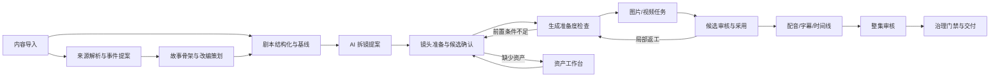

# ARCH-002 短剧生产流程与工作台设计

## 1. 核心设计

Lanverse 以“镜头”为高成本生产单元，以“分集”为连续推进范围。准备、生成、审核、采用和交付分别形成事实，不使用一个 `status` 表达整个生命周期；页面的读写职责和事实所有者遵循 [ARCH-007](ARCH-007-业务模块边界与服务协作设计.md)。

固定提交中的 Jellyfish 源码与架构文档展示了“分镜准备、生成工作室、通用任务中心”的页面边界；Toonflow 产品说明、截图和编译前端展示了“章节事件、结构化策划、Agent 对话与生产画布”的创作方向，不据此推断生产成熟度。Lanverse 组合这些证据：结构化工作台是事实入口，Agent 是受控协作者，画布只是可重建投影。[Jellyfish 页面边界](https://github.com/Forget-C/Jellyfish/blob/a9678194ddf2d9be3ccbe78d4287d87d5089e123/site/content/docs/architecture/shot-page-boundary.md) · [Toonflow 项目说明](https://github.com/HBAI-Ltd/Toonflow-app/blob/bc61ec7a1b5df31293b286981a5f4ad4635464ee/docs/README.en.md)

## 2. 端到端生产流



### 2.1 阶段输出

| 阶段 | 输入 | 固定输出 | 不代表 |
| --- | --- | --- | --- |
| 来源理解 | 原始内容与证据片段 | SourceEventRevision；P1 SourceEventRelation 候选 | AI 提案已确认 |
| 改编策划 | 已确认事件与创作目标 | 骨架、改编策略的 PlanningArtifactVersion | 剧本已定稿 |
| 剧本基线 | 原始内容或已确认策划 | ScriptVersion baseline | 资产或镜头已准备 |
| 拆镜提案 | 剧本基线 | ShotSpec 草稿与提取候选 | 已允许高成本生成 |
| 镜头准备 | ShotSpec、候选、资产 | ShotPreparationSnapshot | 已具备模型输入 |
| 生成准备 | 业务草稿与版本化上下文 | GenerationReadiness/Preview | 已创建任务 |
| 任务执行 | 不可变 SubmissionSnapshot | ProductionAttempt、MediaVersion 与 GenerationCandidate | 已审核或采用 |
| 审核采用 | 固定候选 | ReviewDecision/Adoption | 整集或合规通过 |
| 正式交付 | 成片快照与门禁证据 | DeliveryVersion | 渠道已上线 |

## 3. 工作台信息架构

| 页面/区域 | 权威查询/主要命令 | 页面特有空态、失败与恢复 | 明确不负责 |
| --- | --- | --- | --- |
| 项目大厅 | ProjectList / createProject | 空态引导创建；离线仅展示已缓存清单 | 镜头生产细节 |
| 项目总览 | ProjectFlowSummary / 无跨域写命令 | 空分集引导创建；卡片失败可独立重查 | 直接改写各模块事实 |
| 来源与事件工作台 | SourceRevision、EventProposal / importSource、proposePlan | 无来源引导导入；版本冲突比较后重载/另存 | 自动决定改编取舍 |
| 剧本工作台 | PlanningArtifact、ScriptVersion / saveScriptDraft、confirmScriptBaseline | 无草稿引导创建；ETag 冲突比较，确认失败不改基线 | 分镜图和媒体生成 |
| 分镜列表 | ShotList、PreparationSummary / 无写命令（导航至准备页） | 空态引导拆镜；分页局部失败保留已载入项并重查 | 单镜头候选的深度确认 |
| 镜头准备页 | ShotPreparationSnapshot / resolveExtractionCandidate、bindShotAsset | 无提取结果引导提取；过期/冲突刷新快照后比较 | 图片/视频任务主操作 |
| 分集生成工作室 | GenerationReadiness、Preview、GenerationRequest/Task / requestGeneration | 阻断项深链负责页；SSE 断线以游标续接和权威查询收敛 | 绕过预算/合规/准备度直接 createTask |
| 资产工作台 | AssetCatalog、MediaUsageProjection / bindProjectAsset | 空态引导建资产；受限/失效版本禁止绑定并重查使用位置 | 叙事事实裁决 |
| 任务中心 | ProductionTaskProjection / requestCancellation、requestRetry | 空态说明无任务；游标失效查询快照，unknown 提供对账入口 | 提示词调试、审核或业务编辑 |
| 候选审片室 | GenerationCandidate、ReviewRound / recordDecision、adoptVersion | 无提交显示来源入口；固定版本失效阻止决定并重开轮次 | 修改生成输入 |
| 后期时间线 | TimelineVersion、ProxyManifest / saveTimeline、requestRender | 空态建时间线；代理失败保留位置，冲突比较/另存版本 | 改写上游候选和镜头基线 |
| 交付中心 | DeliveryGateSummary / createDeliverySnapshot | 空态列前置项；门禁失败定位证据，部分导出返回原快照 | 创作编辑 |
| 平台设置 | WorkspacePolicy、CapabilityManifest / publishRoutingPolicy | 空配置使用受控默认；ETag 冲突重载，越权不暴露敏感值 | 项目内容生产 |
| Agent 协作面板 | AgentRun、AgentReview / startAgentRun、cancelAgentRun、recordDecision | 空态选择结构化目标；切页/断线后按原作用域回查运行 | 绕过领域命令直接改正式事实 |

上述写命令逐字使用 ARCH-007 的 canonical command；页面可显示本地化动作文案，但不得另造 API operation 别名。每页都必须实现 loading 骨架、可行动 empty、不可枚举 unauthorized、带 request_id 的 error/retry、offline 只读或保留未保存稿、conflict 比较/重载/另存及恢复后权威重查。`ProjectFlowSummary` 由后端生成，主动作只导航到事实负责页。

## 4. 页面导航模型

建议首发路由语义：

```text
/w/:workspaceId/projects
/w/:workspaceId/projects/:projectId
/w/:workspaceId/projects/:projectId/source
/w/:workspaceId/projects/:projectId/episodes/:episodeId/{script|shots|studio}
/w/:workspaceId/projects/:projectId/episodes/:episodeId/shots/:shotId/prepare
/w/:workspaceId/projects/:projectId/{review|timeline|delivery}
/w/:workspaceId/{assets|tasks|settings}
```

- 工作空间、项目、分集和镜头上下文必须能从 URL 恢复；任务、评论和通知的深链必须返回明确业务对象及版本。
- 无权对象统一返回不可枚举结果，不能从路由错误判断对象存在。

## 5. 来源事件、Agent 策划与生产图

- 长篇小说、漫画或多章节内容先形成 `SourceEventRevision`；现成剧本可跳过事件提取，但仍需保留来源版本。
- 事件节点保存人物、地点、时间、摘要、重要度、置信度和证据片段；P1 再提供时间、因果、伏笔、回收、并行及人物弧关系候选，经人工确认后进入改编上下文。Toonflow 当前源码主要实现逐章事件文本而非完整图，因此这里只吸收中间层思想，不复制数据结构。
- 故事骨架、改编策略、分集剧本和导演规划均为独立 `PlanningArtifactVersion`。Planning Agent 提计划，Execution Agent 产出候选版本，Review Agent 只给复核报告，具备权限的责任人决定接受、修改或拒绝；接受候选不等于确认基线。
- 每次 `AgentRun` 展示输入版本、模型、Skill/Prompt 版本、工具步骤、费用和结果；对话或记忆不得成为唯一产物，也不得承担权限和阶段状态机。
- P0 以列表/表格和结构化编辑器完成生产；P1 可增加无限画布。`CanvasView` 只保存实体引用、节点位置、连线与视图设置，所有编辑仍调用领域命令，画布丢失后可从权威事实重建。

## 6. 镜头准备模型

### 6.1 提取候选

| 候选类型 | 允许决定 | 决定结果 |
| --- | --- | --- |
| 角色/场景/服装/道具/声音 | 关联已有、创建并关联、忽略、修正后处理 | 绑定明确 AssetVersion 或记录忽略证据 |
| 对白/旁白 | 接受、修改后接受、忽略 | 形成版本化 DialogueLine 或记录忽略证据 |
| 镜头语言/动作拍点 | 接受、修改后接受、拒绝 | 写入新的 ShotSpec 草稿版本 |

所有候选必须保存来源片段、提取运行、模型能力版本、原始载荷、处理人和处理时间。重新提取创建新候选集合，不覆盖已处理历史。

### 6.2 准备快照

`ShotPreparationSnapshot` 由服务端聚合并包含：

- `shot_spec_version`、`script_version`、`snapshot_version`。
- 基础字段完整性、提取决定、候选总数/待处理数。
- 当前资产绑定、对白行、动作拍点和阻断原因。
- `preparation_state`：`not_extracted / awaiting_resolution / resolved / skipped / stale / blocked`。
- `ready_for_generation_design`：仅表示可进入生成准备设计，不表示模型输入已完整。

候选处理命令成功后必须直接返回最新快照。前端不得自行重算正式准备状态或串联多个刷新请求拼装结果。这一模式参考 Jellyfish 的聚合准备状态，但增加版本和过期语义。[参考状态流](https://github.com/Forget-C/Jellyfish/blob/a9678194ddf2d9be3ccbe78d4287d87d5089e123/site/content/docs/architecture/shot-status-flow.md)

## 7. 正交状态模型

| 维度 | 权威来源 | 状态示例 | 禁止混入 |
| --- | --- | --- | --- |
| 内容基线 | Script/Storyboard Baseline | draft、in_review、confirmed、superseded | 生成运行状态 |
| 镜头准备 | ShotPreparationSnapshot | not_extracted、awaiting_resolution、resolved、skipped、stale、blocked | 任务成功/失败 |
| 生成准备度 | GenerationReadiness | ready、not_ready、blocked、stale | 是否正在生成 |
| 任务运行 | ProductionTask/Attempt | queued、blocked、waiting_*、running、postprocessing、partially_succeeded、succeeded、failed、cancelling、cancelled、skipped、manual_action_required、unknown | 创作审核结果 |
| 候选审核 | ReviewRound/ReviewDecision | 轮次过程为 open、in_review、changes_requested、approved、rejected、terminated、superseded；决定为不可变事实 | 当前采用 |
| 使用关系 | Adoption | active、superseded、revoked；无 active 关系即未采用 | 正式交付 |
| 成片交付 | DeliveryVersion | draft、qualifying、qualified、delivered、withdrawn | 外部渠道上线 |

页面可并列展示多个维度，但不得合并成“完成度状态”。

## 8. 生成工作室交互

- 左侧镜头导航显示准备、生成准备度、运行和采用四个轻量标识。
- 中央区域只处理当前镜头的参考帧、提示词预览、参数、候选和差异。
- 右侧诊断按可执行顺序列出阻断项；候选未处理时只提供“去准备页”。
- 批量生成先取得每个镜头的 `GenerationReadiness`，只提交明确选中的 ready 项；其余项保留逐项原因。
- 预览展示业务输入版本、参考媒体、模型能力、预计成本、许可/数据策略和告警。
- 提交后原预览冻结，后续输入变化只将任务/候选标记为 `stale`，不得静默重做。
- 工作流由 `ModelCapability` 选择多参考、首帧、首尾帧等路径，并按模型时长上限组合 Track；每个 Track 保留多个候选和明确采用关系。

## 9. 任务中心交互

- 默认显示当前对象相关的活跃任务和最近结束任务，可按范围、类型和状态筛选。
- 每项展示任务名称、来源对象、状态、进度、耗时、费用状态、可取消/重试资格和回跳入口。
- 任务中心不展示完整提示词、参考图映射、审核详情或供应商密钥诊断；这些信息留在业务页面。
- SSE 断线后显示“正在恢复/状态未知”，使用事件游标续接并用查询快照收敛，不把空列表解释为无任务。
- 用户发起取消后显示 `cancelling`，直到平台确认 `cancelled` 或返回无法取消的终态。

## 10. 权限与协作

| 动作 | 后端强制的动作权限/策略 |
| --- | --- |
| 编辑剧本/镜头草稿、处理拆镜候选、裁决生成一致性 | `content:draft:write` / `storyboard:extraction:resolve` / `generation:consistency:resolve` |
| 确认剧本/分镜基线 | `baseline:confirm`，且满足责任分配策略 |
| 启动生成、取消或重试任务 | `production:generation:request` / `production:task:cancel` / `production:task:retry`，且通过预算/模型/合规策略 |
| 审核候选与整集 | `review:decide`，按职责分离策略校验 |
| 当前采用、正式交付 | `adoption:write` / `delivery:create` |
| 修改模型路由、Agent 模板、预算或合规策略 | 分别使用 `workspace:policy:manage` / `agent:manage` / `budget:manage` / `compliance:policy:manage` |

编剧、导演、制作人员等仅是 persona 示例，不直接产生权限；后端按主体、租户、对象、动作和策略授权。MVP 使用乐观并发，冲突时提供比较、重载或另存版本。

## 11. 异常与回流

| 场景 | 页面行为 | 事实处理 |
| --- | --- | --- |
| 重新提取后出现新候选 | 标记准备待确认 | 旧决定保留，新集合独立处理 |
| 资产版本失效或受限 | 显示阻断并导航资产页 | Readiness 变为 stale/blocked |
| 预览后输入变化 | 提示重新派生 | 原预览与已提交快照不变 |
| 供应任务失联 | 显示 unknown 与对账动作 | 不自动判失败或扣费 |
| 部分批量失败 | 逐项展示继续/重试 | 成功项不回滚，失败项新尝试 |
| 审核退回 | 定位镜头、版本和问题 | 不改变历史决定，创建返工请求 |

## 12. 验收与未决项

- AC-ARCH-002-001：用户可从项目总览完成“来源/策划→剧本→准备→生成→审核→时间线→交付”的可逆导航。
- AC-ARCH-002-002：同一镜头的准备、准备度、运行、审核和采用状态可同时展示且互不覆盖。
- AC-ARCH-002-003：处理任一候选后，服务端返回的新快照可直接驱动页面，无客户端正式状态推导。
- AC-ARCH-002-004：任务中心能够回跳来源，但不承载业务调试详情。
- AC-ARCH-002-005：断线、并发冲突、重新提取和部分批量失败均保留可判断状态。
- AC-ARCH-002-006：任一 Agent 产物可反查来源、模型、Skill/Prompt、工具步骤、复核和人工决定；删除画布不丢失业务事实。

进入 PRD 前需确认：`skipped` 是否允许用于所有镜头、跳过理由和批准角色、分集工作室默认布局、外部审片是否首发 P0。
