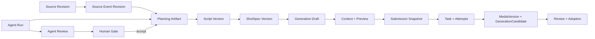
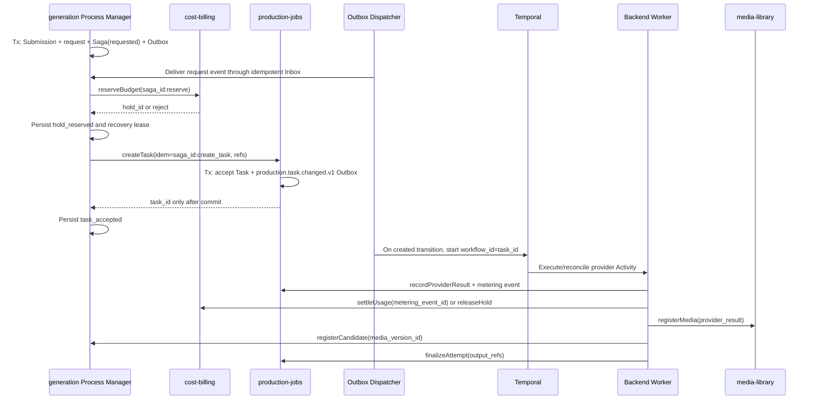

# ARCH-003 AI 策划、生成准备与异步任务架构设计

## 1. 设计结论

来源理解、Agent 策划和媒体生成都先产生可审查版本，不直接改写正式基线。每次生成由“业务草稿→解析上下文→派生预览→不可变提交快照”驱动；`production-jobs` 的 `ProductionTask/Attempt` 是任务事实源，Temporal 负责可靠执行，`generation` 候选经审核和采用后才能进入时间线或交付。模块所有权以 [ARCH-007](ARCH-007-业务模块边界与服务协作设计.md) 为准。

Jellyfish 的四层生成和任务真相层予以吸收；Toonflow 的事件中间层、Agent、Skill 和能力驱动 Provider 只吸收职责思想，并补齐版本、租户、人工门禁和安全边界。[Jellyfish 生成准备](https://github.com/Forget-C/Jellyfish/blob/a9678194ddf2d9be3ccbe78d4287d87d5089e123/site/content/docs/architecture/generation-workspace.md)

Toonflow 固定提交证据分列为[事件提取](https://github.com/HBAI-Ltd/Toonflow-app/blob/bc61ec7a1b5df31293b286981a5f4ad4635464ee/src/utils/cleanNovel.ts)、[Script Agent](https://github.com/HBAI-Ltd/Toonflow-app/tree/bc61ec7a1b5df31293b286981a5f4ad4635464ee/src/agents/scriptAgent)、[Production Agent](https://github.com/HBAI-Ltd/Toonflow-app/tree/bc61ec7a1b5df31293b286981a5f4ad4635464ee/src/agents/productionAgent)、[Skills](https://github.com/HBAI-Ltd/Toonflow-app/tree/bc61ec7a1b5df31293b286981a5f4ad4635464ee/data/skills) 与 [Provider 配置](https://github.com/HBAI-Ltd/Toonflow-app/blob/bc61ec7a1b5df31293b286981a5f4ad4635464ee/src/utils/vendor.ts)；这些事实不构成成熟度背书。

## 2. 核心领域对象

| 对象 | 事实与关键约束 | 所属模块 |
| --- | --- | --- |
| SourceDocumentRevision | 原著/剧本来源版本、权利证据/合规结论版本引用、校验和与解析状态 | story-development |
| SourceEventRevision/Relation | 带证据片段的来源事件节点；Relation 为 P1 的时间、因果、伏笔、回收、并行和人物弧候选 | story-development |
| PlanningArtifactVersion | 故事骨架、改编策略、分集规划和导演规划的不可变版本 | story-development |
| ScriptVersion / Scene / DialogueLine | 唯一当前剧本基线、场次/对白及其上游来源 | story-development |
| ShotSpecVersion | 镜头意图、动作、对白和唯一当前分镜基线 | storyboard |
| AgentRun/AgentStep/AgentReview | 策划、执行、机器复核运行及工具调用、用量和候选引用 | agent-runtime |
| HumanDecision | 对 Agent 候选的不可变接受、修改请求或拒绝事实 | review-approval |
| ExtractionRun/Candidate/Resolution | 拆镜或元素提取提案，以及追加式关联、接受、修正或忽略决定 | storyboard |
| AssetIdentity/AssetVersion | 稳定资产与服装、变身、时段等不可变衍生版本 | creative-assets |
| ProjectAssetBinding | 项目对明确资产版本的授权关系 | creative-assets |
| ShotAssetBinding | 镜头对明确资产版本的有序引用 | storyboard |
| GenerationDraft/ContextSnapshot | 可编辑意图与服务端解析的版本化上下文 | generation |
| DerivedPreview/SubmissionSnapshot/GenerationRequestProcess | 编译预览、不可变提交输入，以及持久化 Saga 进度、租约、稳定幂等键和补偿结果 | generation |
| ProductionTask/ProductionAttempt | 用户目标、预算引用与每次不可覆盖的供应执行事实 | production-jobs |
| BudgetHold/LedgerEntry | 预算预占、结算、释放、退款和冲正的追加式账本事实 | cost-billing |
| GenerationCandidate | 一次生产尝试产生的创意候选，引用明确 MediaVersion 和质量信号 | generation |
| ReviewRound/ReviewDecision/Adoption | 固定候选的审核轮次、不可变决定和唯一当前采用关系 | review-approval |
| MediaObject/MediaVersion/MediaUsageProjection | 逻辑媒体、物理版本、技术状态/校验和/派生谱系；使用投影由源模块引用重建 | media-library |

工作空间是全局资产的租户边界；项目、镜头和 Track 保存版本化绑定而非内容副本。画布、Agent 记忆、Redis、Temporal 可见性和供应商状态均不得成为这些对象的唯一来源。

## 3. 主关系与批准链

## 4. Agent 运行、Skill 与记忆

- Planning Agent 只输出结构化计划；Execution Agent 仅调用阶段白名单工具并产生候选版本；Review Agent 使用独立上下文输出报告且无权批准；Human Gate 决定接受、要求修改或拒绝。
- `AgentRun` 只表达执行生命周期：`draft/queued/running/succeeded/failed/cancelling/cancelled/unknown`；`AgentReview` 只表达机器复核报告生命周期：`pending/running/completed/failed/superseded`。
- `HumanDecision` 是 `accepted/changes_requested/rejected` 的不可变事实；接受只选定候选草稿，确认剧本或分镜基线必须另行调用授权命令。
- Run 固定业务输入版本、Agent/模型/Provider、Prompt/Skill、工具权限、结构化输出、Token、费用、耗时及关联复核/人工决定；每个工具调用形成 `AgentStep`，写操作必须走领域命令。
- Skill 与 Prompt 采用 `draft/published/retired` 版本生命周期，发布需回归样本、审批和回滚目标；素材中的 Prompt Injection 不得扩大工具权限。
- 记忆分为本次 Run 的 Working Memory、可删除的交互摘要和带来源的语义检索快照；按 workspace/project/agent/user 隔离并执行保留策略。故事圣经、剧本、资产、状态、权限和成本只能来自权威对象。
- Toonflow 当前主要保存逐章事件文本和本地向量记忆，并非可直接移植的事件图或企业检索层；Lanverse 的事件节点/边与检索结果都必须保存来源、置信度和版本。

## 5. 生成准备四层模型

| 层 | 固定内容 | 约束 |
| --- | --- | --- |
| Business Draft | 生成类型、镜头、参考模式、人工意图、参数覆盖和模板选择 | 可自动保存，不产生费用、不等于提交 |
| Resolved Context | Script/Shot/故事圣经/资产版本、相邻镜头、参考媒体、模板/能力/路由、权利/安全/预算 | 服务端生成 `context_hash`；输入变化创建新快照 |
| Derived Preview | 最终提示词、参考编号、生效参数、能力限制、预计成本/时长、告警和阻断项 | 带 `preview_hash`、过期时间和输入版本 |
| Submission Snapshot | 实际提示词、媒体、参数、模型/策略、价格、许可和全部哈希 | 再校验权限/预算/准备度后冻结，Task 仅引用此对象 |

预览与提交使用同一个编译器；任一输入、模板、能力或价格变化均返回 `PREVIEW_STALE`。模型能力必须由 Manifest 驱动，不能按模型名称拼接分支。

## 6. GenerationReadiness

| 检查组 | 示例 |
| --- | --- |
| content/continuity | 基线有效、必填项和候选已处理、资产及相邻镜头上下文可解析 |
| reference/capability | 参考媒体可用，模型支持目标输入模式、数量、时长、画幅和音频 |
| governance/budget | 权利、安全、地区、真人授权、预计费用和额度满足 |
| concurrency | 无同幂等范围活跃任务，租户与供应并发可接受 |

服务端逐项返回 `ready`、`checks[]`、`effective_versions` 和 `evaluated_at`；批量检查不得因一个镜头失败隐藏其他结果。

## 7. API 边界

事件/Agent、准备快照、草稿/预览、任务、审核和采用均使用显式命令；精确路径、错误、幂等、SSE 与 Schema 由 [ARCH-004](ARCH-004-API事件文件与数据契约设计.md) 统一定义，禁止通用 `PATCH status`。

## 8. 任务创建与执行

`GenerationRequestProcess` 是持久化 Saga/Process Manager，`saga_id = generation_request_id`，状态按 `requested→hold_reserved→task_accepted` 或 `failed/manual_action_required` 推进；预算、建任务和释放分别固定 `saga_id:reserve`、`saga_id:create_task`、`saga_id:release`，每步单模块事务记录结果与 Outbox/Inbox。请求事务提交后 API 可立即驱动同一 Process Manager，Outbox 重投和带 fencing token 的租约扫描负责并发去重与崩溃恢复；API 只在预占成功且 `createTask` 已提交并返回同一 `task_id` 后响应 `202`。Task 接受前禁止启动 Workflow，接受后仅由 `production.task.changed.v1` 的 created 转换以 `workflow_id=task_id` 幂等启动。任意提交点崩溃后先按 `saga_id` 查询/重放预占、`createTask` 幂等回执和 Task：回执 accepted 即恢复 Task，明确 rejected 或在无在途租约时确认未受理才以 `saga_id:release` 释放 Hold；`in_progress/unknown` 转人工处置并保留或续租 Hold，绝不因超时或暂时查无 Task 直接释放；已有 Task 时则重投启动事件并对账。有效计量独立结算，媒体/候选失败按规则追加退款或补偿；Attempt 仅在所需输出登记后终结，Workflow 只编排调用公开用例的 Activity。

## 9. 状态、取消与恢复

| 对象（事实所有者） | 状态/事实值 |
| --- | --- |
| AgentRun（agent-runtime） | draft、queued、running、succeeded、failed、cancelling、cancelled、unknown |
| AgentReview（agent-runtime） | pending、running、completed、failed、superseded |
| HumanDecision（review-approval） | accepted、changes_requested、rejected；每次决定不可变 |
| ProductionTask（production-jobs） | queued、blocked、waiting_user、waiting_upstream、waiting_platform、running、postprocessing、partially_succeeded、succeeded、failed、cancelling、cancelled、skipped、manual_action_required、unknown |
| ProductionAttempt（production-jobs） | created、submitted、provider_queued、provider_running、receiving、postprocessing、succeeded、failed、cancelled、unknown |
| GenerationCandidate（generation） | awaiting_media、ready_for_review、blocked、archived；阻断引用外部决定，媒体技术状态另属 media-library |
| ReviewRound（review-approval） | open、in_review、changes_requested、approved、rejected、terminated、superseded |
| ReviewDecision（review-approval） | approved、changes_requested、rejected、terminated；追加且不可变 |
| Adoption（review-approval） | active、superseded、revoked；无 active 关系即未采用 |

### 9.1 允许的转换与处置

| 对象 | 正常推进 | 等待、异常、取消与恢复 | 终态/重做不变式 |
| --- | --- | --- | --- |
| AgentRun / AgentReview | Run：draft→queued→running→succeeded；Review：pending→running→completed | Run 活跃→cancelling→cancelled/failed/unknown；unknown 经对账回 running 或终态；Review 可 failed，输入失效→superseded | Run 终态不回退，重试新建 Run；Review 报告只追加 |
| ProductionTask | queued↔blocked/waiting_user/waiting_upstream/waiting_platform→running→postprocessing→succeeded/partially_succeeded | 活跃→cancelling→cancelled；错误→failed；策略→skipped/manual_action_required；unknown 经对账回活跃或终态 | manual_action_required 可恢复 queued；取消剩余→cancelled、不可恢复→failed、授权免做→skipped；`requestRetry`/换路由经新预算决定后只新建 Attempt |
| ProductionAttempt | created→submitted→provider_queued→provider_running→receiving→postprocessing→succeeded | 活跃→failed/cancelled/unknown；unknown 经供应对账回原阶段或终态 | 终态不可覆盖；迟到结果隔离，补做新建 Attempt |
| ReviewRound | open→in_review→approved/rejected/changes_requested/terminated | 固定对象失效→superseded；changes_requested 的修订对象新开轮次 | ReviewDecision/HumanDecision 只追加，不改运行状态 |
| GenerationCandidate / Adoption | awaiting_media→ready_for_review/blocked；复核解除后 blocked→ready_for_review，任一可→archived | 仅技术可用、合规允许且 approved 候选可建 active Adoption；替换/撤销→superseded/revoked | 每个采用作用域最多一个 active，历史关系不可删除 |

- 状态只能由所属模块的显式命令转换；评审决定不回写任务状态，采用关系不回写审核轮次，聚合页面不得创造合并状态。
- 取消/失败补偿以幂等 Activity 释放未结算预占、撤销临时授权并按保留策略清理未采用中间物；已计费或迟到结果只对账/隔离，不伪造回滚。
- 超时区分受理、排队、供应执行、回调等待和总期限；失联进入 `unknown`，由对账而非盲目重试收敛。
- Temporal 重放、Worker 重启、重复 Outbox/回调不得重复任务、媒体、扣费或采用；部分批量成功保留成功项。

## 10. Provider、媒体与安全

- `CapabilityAdapter` 负责配置验证、模型清单、提交、查询/回调、取消和用量归一；Manifest 记录输入模式/限制、时长、分辨率、画幅、原生音频、异步方式、价格、地区、保留和许可版本。
- 生产环境禁止在 API 进程执行用户提交的 TypeScript 或从任意 URL 拉取代码。扩展只接受管理员批准、签名和版本化 Adapter；如需第三方插件，必须经 ADR 采用独立沙箱、资源时限、默认断网、域名白名单和 Secret Reference。
- 外部媒体先进入隔离区；类型、大小、校验和、恶意文件和可解码性技术检查形成带技术状态的 MediaVersion，内容安全由独立 ComplianceDecision 门禁。通过所需门禁后再生成代理/探针；供应商 URL 不是平台媒体地址。
- BYOK/平台密钥仅存秘密管理系统，日志、数据库业务字段、任务载荷、浏览器和 Agent 记忆不得包含密钥或长期签名 URL。
- 预算预占、Submission、Task、媒体、候选和账本是跨模块 Saga，不宣称原子；每一步以引用和幂等键关联，失败时保留可继续、释放、补偿或人工处置的事实。

## 11. 实施、迁移与回滚

1. 先实现 Task/Attempt、Outbox、Temporal 空执行器、SSE 和故障验证。
2. 再实现来源事件/策划版本、AgentRun、人审门禁和镜头候选准备。
3. 实现四层编译器与图片 Adapter，再增加视频、媒体后处理和批量。
4. 最后增加检索记忆、P1 生产画布、成本对账与运营恢复。

当前无历史业务数据；迁移从 `0001` 开始并保持向后兼容。回滚停用新入口和 Worker，不删除快照、任务、账本、媒体或审计证据；改变 Temporal/PostgreSQL/S3、状态语义或插件执行边界必须另建 ADR。

## 12. 验收门禁

- AC-ARCH-003-001：事件、策划和 Agent 产物可反查来源证据、输入版本、模型、Prompt/Skill、工具、费用、复核与人工决定。
- AC-ARCH-003-002：Preview 与 Submission 逐字段一致；输入变化得到 `PREVIEW_STALE`。
- AC-ARCH-003-003：在请求、预占、建 Task、Task 接受和 Workflow 启动前后逐点注入崩溃，重投仍只产生一个 Task、一个有效 Hold 和一个 Workflow，不重复扣费或 Adoption。
- AC-ARCH-003-004：Task 明确未受理的孤立 Hold 可幂等释放，受理不明时不得误释放；Task 已接受但 Workflow 未启动可重投恢复，取消、超时、未知、迟到结果和部分失败均收敛到可判断状态。
- AC-ARCH-003-005：任一候选媒体可追溯至来源、Script/Shot、资产、AgentRun、Task/Attempt、模型、费用和审核。
- AC-ARCH-003-006：删除缓存、Agent 记忆、画布和 Temporal 可见性后，仍可由 PostgreSQL 与对象存储重建业务视图。

进入 PRD 前需确认：来源类型与事件关系 P0 范围、Agent 人工门禁、记忆保留、Preview 期限、首发模型能力、失败计费和供应商数据保留边界。
