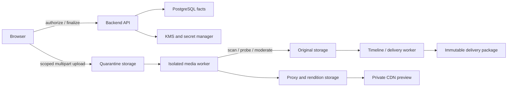

# ARCH-005 媒体安全、隐私与数据生命周期设计

## 1. 设计结论与边界

Lanverse 以 PostgreSQL 分模块保存媒体、权利、审核和生命周期事实，S3 兼容对象存储只保存二进制对象；事实所有权遵循 [ARCH-007](ARCH-007-业务模块边界与服务协作设计.md)。原始文件、代理、候选、时间线、审核、采用和交付相互独立；外部媒体必须分别通过技术检查和内容安全裁决后才能用于生产。

首发不提供公开对象、永久链接、浏览器正式渲染或任意 URL 导入；不将文件名、对象 Key、CDN 路径或签名 URL 当作授权证据。保留期、数据驻留区域和交付规格在进入 PRD 前由业务、法务、安全和运维确认。

## 2. 信任边界与主数据流

- Backend 应用层是媒体业务事实的唯一写入权限边界；Worker Activity 也必须调用受控应用用例。
- 对象存储、CDN、Temporal、Redis、搜索投影和外部供应商均不是权限、删除、审核或当前采用的事实源。
- 每次处理以 `workspace_id/media_version_id/task_id/attempt_id/trace_id` 关联，队列和 Workflow 历史只传稳定标识。

## 3. 核心对象与正交状态

| 对象（所属模块） | 权威事实 | 状态或不变式 |
| --- | --- | --- |
| MediaObject / MediaVersion（media-library） | 稳定媒体身份、不可变版本、来源和谱系 | 新文件、派生或重新生成必须新建版本 |
| MediaIngestRecord / ObjectBlob / MediaRendition（media-library） | 跨存储登记意图、存储引用、内容/存储校验和、工具与配方版本 | 摄取为 `copy_pending/verified/registered`；Blob 生命周期另为 `active/pending_delete/deleted/delete_failed` |
| UploadSession / MediaTechnicalInspection（media-library） | 分片完成、恶意文件/格式/可解码性技术证据 | 技术失败保持隔离，不能解释为内容违规 |
| ContentSafetyAssessment（compliance-governance） | 内容安全结论、证据和规则版本 | `pending/passed/review_required/blocked/error`；检查错误不等于通过 |
| TimelineVersion / Track / ClipRef（postproduction） | 非破坏性编辑及对明确媒体版本的引用 | 已审核或已交付版本不得原位修改 |
| SubtitleVersion / Cue（postproduction） | 语言、台词来源、整数 Tick 和样式 | 每种语言独立版本、审核和交付 |
| AudioMixVersion（postproduction） | 对白、音乐、环境声、音效及参数快照 | 混音结果不覆盖源音频 |
| DeliverySnapshot / PackageBuildRecord / Manifest（delivery） | 固定输入、目标规格、门禁证据、文件清单和校验和 | 重试不改输入；重新交付必须新建版本 |
| RetentionPolicy / DeletionCase / LegalHold / DeletionEvidence（compliance-governance） | 适用策略、保留例外、参与模块步骤与删除证明 | 删除不能改写历史交付和审计事实 |

媒体技术可用性、内容安全、权利、审核、采用和保留必须分字段/对象表达，禁止合并为一个 `status`。

## 4. 存储分区与对象规则

| 区域 | 用途 | 强制边界 |
| --- | --- | --- |
| quarantine | 未信任上传及供应返回 | 无 CDN、不可生产引用；只允许上传与隔离 Worker 读取 |
| originals | 通过门禁的原始文件与母版 | 版本化、非公开、不可原位覆盖；权利或保留策略驱动访问 |
| renditions | 代理、缩略图、波形、预览、中间渲染 | 可由原始版本、配方和工具版本重建；使用私有 CDN |
| delivery | 质检后的交付包 | 不可变、包清单逐文件校验；仅经交付授权下载 |
| evidence | 权利、扫描、审核、删除与安全证据 | 依法定/合同策略防篡改，严格限制运营访问 |

对象 Key 使用环境、不可猜测标识和物理版本，原始文件名仅作经清洗的展示元数据。同内容可去重但不共享跨租户授权或泄露哈希命中；数据库引用与物理 Blob 引用计数分离。

## 5. 上传、隔离和派生处理

1. API 验证 `subject + workspace + project + object + action`，以幂等键创建带预期大小、类型、校验和和过期时间的 `UploadSession`。
2. 浏览器使用限时、限对象、限操作的分片授权直传 quarantine；前端展示进度、暂停、恢复、取消和失败。
3. 完成命令校验分片清单、长度、客户端校验和与存储证据；重放返回同一业务结果。
4. 隔离 Worker 在无特权沙箱内执行文件头/真实 MIME、恶意载荷、解压炸弹、媒体可解码性和 `ffprobe` 摘要检查，设置 CPU、内存、磁盘和时限。
5. 内容安全根据对象、用途、地区和规则版本输出通过、人工复核或阻断；检查服务故障不得记为通过。
6. 全部门禁通过后，应用用例先以确定性目标 Key、预期校验和和操作键持久化 `MediaIngestRecord(copy_pending)`；Worker 在数据库事务外幂等复制对象，校验目标大小/校验和后标记 `verified`，再由独立应用事务创建 `MediaVersion/ObjectBlob`、写 Outbox 并标记 `registered`。对象复制与数据库登记从不宣称原子，隔离副本只在 `registered` 后延迟清理。
7. 对账器按租约扫描 `copy_pending/verified`：目标存在且匹配时继续验证/登记，不存在时重做复制，不匹配时隔离并告警；重复 `copy/head/register` 均以操作键收敛。受管摄取前缀中超过安全等待窗且没有 IngestRecord、ObjectBlob 或活跃任务引用的目标对象按幂等清理作业删除并记录审计，避免崩溃留下孤儿 Blob。
8. 代理、缩略图、波形和媒体摘要以原始校验和、规格、FFmpeg/字体版本和配方哈希幂等生成，任一输入变化形成新 Rendition。

供应商结果必须由 Worker 通过允许的 HTTPS 域名拉取，限制 DNS/IP、重定向、长度、时间和输出类型，然后进入同一隔离流程；不将供应商 URL 保存为平台媒体地址。

## 6. 时间线、字幕、音频与交付

| 能力 | 设计约束 |
| --- | --- |
| 时间线 | 固定 `timebase_num/timebase_den`，位置使用整数 Tick；Clip 只引用明确 MediaVersion，移动、裁切、替换、速度和转场不改源媒体 |
| 预览 | 浏览器使用代理、缩略图和波形，支持授权后 Range 读取；代理失效不改编辑位置或已保存版本 |
| 字幕 | Cue 保存语言、说话人、文本、整数 Tick、来源台词和样式；SRT/ASS 为固定 SubtitleVersion 的派生物 |
| 音频 | 保留采样率、声道、时长、响度和峰值摘要；台词、音乐、环境声和音效参数进入不可变混音快照 |
| 正式渲染 | 仅服务端 Worker 可以渲染；输入固定时间线、采用媒体、混音、字幕、标识、规格、工具/字体版本和配方 |
| 交付 | 质检与权利、安全、AI 标识及批准证据都指向同一 DeliverySnapshot；Package Manifest 记录每文件格式、大小和校验和 |

渲染重试创建新 Attempt 但复用同一快照；输入或配方变化必须新建 Snapshot。代理与预览不参与正式交付判断，交付成功也不等于已发行。

## 7. 授权、加密与隐私

- 每次签发访问授权前由 API 通过 MediaVersion 反查租户、对象、动作、权利、安全和保留状态；授权限方法、对象、TTL、Range/大小和内容类型，可撤销外部审片链接与普通签名 URL 分开。
- 对象和数据库采用 KMS 信封加密，环境密钥独立；租户专属密钥仅在合规/合同需要时启用。密钥、授权和服务角色支持轮换、撤销、最小权限和访问审计。
- 租户作用域必须贯穿数据库查询、缓存 Key、对象元数据、CDN 缓存键、搜索、日志、导出与分析；对象前缀仅是防御纵深而非授权。
- 剧本、未发布媒体、肖像、声纹/声音参考、审片身份和访问记录按个人/敏感数据分类；只收集必要元数据，记录目的、授权/单独同意、地区、渠道和保留策略。
- 外部 AI/安全服务只接收必要版本，必须固定地区、保留、训练使用、删除、子处理者和退出条款；未经明确允许不得用项目内容训练第三方模型。

## 8. 威胁模型与控制

| 威胁 | 预防与检测 | 失败行为 |
| --- | --- | --- |
| 跨租户 IDOR、对象枚举、CDN 混缓存 | 服务端对象授权、不可猜测 ID、租户缓存键、跨租户矩阵测试 | 默认拒绝且不暴露对象存在性 |
| 伪造 MIME、恶意文件、解码器漏洞 | 文件头、多引擎扫描策略、沙箱、资源限额、工具镜像锁定 | 保持隔离、标记阻断或错误 |
| SSRF、重定向跳板、过大供应输出 | 禁用任意 URL、域名白名单、DNS/IP 重验证、字节/时间上限 | 终止拉取并保留诊断证据 |
| 签名 URL/密钥泄露或重放 | 短 TTL、最小作用域、Secret Reference、日志脱敏、轮换 | 撤销授权/密钥，告警并定位访问 |
| 转码炸弹与资源耗尽 | 按租户限流、任务配额、CPU/内存/磁盘/时限、独立 Worker 资源池 | 终止单次 Attempt，不影响控制面 |
| 未授权肖像/声音处理或数据外泄 | 权利/单独同意门禁、最小披露、供应契约、出境与导出审计 | 阻断新处理/交付，启动事件处置 |
| 内部滥用、删除不完整或备份复活 | 职责分离、临时权限、Legal Hold、删除编排/对账、恢复后墓碑重放 | 禁止访问并保留可核验差异 |

## 9. 保留、删除与证据

| 数据类别 | 默认原则 | 删除前检查 |
| --- | --- | --- |
| 未完成上传、隔离失败件 | 最短运行保留，到期自动清理 | 安全事件或复核保留 |
| 原始版本、候选与已采用媒体 | 项目/契约策略及权利期限 | 活跃引用、当前采用、审核、争议、交付与 Legal Hold |
| 代理、缩略图、波形和中间物 | 可重建、短保留与容量水位清理 | 重建源可用且无活跃任务 |
| 交付包、权利与审计证据 | 按合同、发行、争议和法定要求 | 授权主体、保留例外与审批记录 |

`compliance-governance` 删除用例先完成身份校验、范围发现、引用/Legal Hold 判定和二次确认，再创建 `DeletionCase`。Temporal 只承载编排，各模块通过自己的生命周期命令撤销访问、写墓碑并幂等清理所属事实/对象/投影；案件最后对账策略、例外、执行者、时间和结果摘要，禁止跨表删除。

备份内数据按既定窗口自然过期，不为单项删除改写不可变备份；恢复后必须重放墓碑且不恢复用户访问。审计只保留合规必要摘要，不保留可再现完整媒体的内容。

## 10. 降级、恢复与审计

| 故障 | 对用户的可判断行为 |
| --- | --- |
| 扫描/内容安全不可用 | 媒体保持隔离或待复核，禁止生产和交付，恢复后继续原任务 |
| 代理/CDN 失败 | 保留时间线位置与正式事实，显示预览降级，不盲目切换为公开原片 |
| 对象存储/KMS 不可用 | 拒绝新授权与需读写任务，不伪造上传、渲染或删除成功 |
| 转码/交付部分失败 | 保留固定输入与成功文件，只新建 Attempt 重试失败步骤，不重复批准 |
| 删除部分失败 | 继续禁止访问，保持 `delete_failed`，告警并逐子系统补做/对账 |

审计记录上传授权、完成校验、安全结论/人工复核、访问授权与下载、保留变更、Legal Hold、密钥管理、导出、交付和删除。记录主体、作用域、动作、对象版本、结果、政策/证据版本、时间和关联标识，不记录密钥、完整内容或签名 URL。

## 11. 需求追踪与验证

| 需求 ID | 设计落点 | 设计证据/实施后验证 |
| --- | --- | --- |
| FR-007-001～012 | 第 3～5、9 节 | 版本/谱系模型、去重与损坏/隔离用例 |
| FR-012-001～014、FR-013-001～011 | 第 3、6～9 节 | 声音授权门禁、音频摘要、局部返工与混音回放 |
| FR-014-001～014、FR-015-001～012 | 第 3、6 节 | Tick/版本契约、字幕导出、非破坏编辑与历史还原 |
| FR-016-001～013、FR-018-001～016 | 第 3、6～10 节 | 固定审核对象、权利/安全矩阵、申诉与标识证据 |
| FR-019-001～017 | 第 3、6、9～10 节 | 交付快照、质检门禁、Manifest 校验与幂等重试 |
| NFR-001-014～026、032～037 | 第 2～10 节 | 租户隔离、隐私请求、删除演练、谱系抽样与媒体样片 |
| TCR-001-008、010～011、020～021、025 | 第 2、4、6～8 节 | 存储/资源池图、服务端渲染、密钥与许可清单 |
| TCR-002-013、015、021、023、030～031、033、035 | 第 2～10 节 | 对象/删除契约、FFmpeg 记录、隔离测试与日志检查 |
| TCR-003-021～032、037 | 第 2、5～8、10 节 | 上传/访问契约、浏览器降级、签名过期与前端遥测测试 |
| ADG-001-007、011～012、017、020～021 | 全文 | 文件契约、数据生命周期、媒体架构与威胁模型评审 |

设计阶段通过条件：评审数据流/信任边界、状态与唯一事实归属、文件契约示例、媒体格式/测试语料清单、保留策略矩阵和威胁模型；本阶段不要求已存在可运行代码。

进入已接受 Plan 后的实施验收必须覆盖：分片重放/断点/校验和、复制或登记各崩溃点的 `copy_pending→verified→registered` 对账与孤儿 Blob 清理、伪造 MIME/恶意或畸形样本/资源耗尽、跨租户和 CDN 隔离、签名过期/撤销、扫描/KMS/存储降级、同快照重复渲染、交付校验、权利/个人数据请求、Legal Hold、跨系统删除对账和备份恢复后墓碑重放。

## 12. 开源参考与评审未决项

Jellyfish 固定提交中展示了[文件上传与对象存储服务](https://github.com/Forget-C/Jellyfish/blob/a9678194ddf2d9be3ccbe78d4287d87d5089e123/backend/app/services/studio/files.py)，Toonflow 固定提交中展示了[项目素材上传](https://github.com/HBAI-Ltd/Toonflow-app/blob/bc61ec7a1b5df31293b286981a5f4ad4635464ee/src/routes/assets/uploadClip.ts)与[音频素材管理](https://github.com/HBAI-Ltd/Toonflow-app/blob/bc61ec7a1b5df31293b286981a5f4ad4635464ee/src/routes/assets/addAudioAssets.ts)。这些事实只支持“素材需要稳定管理入口”的产品参考，不构成企业安全或生命周期成熟度证明；Lanverse 不照搬其控制面中转二进制、本地路径、宽松引用或单一文件状态。

进入 PRD 前必须确认：首发地区与数据驻留、个人/敏感数据分类、权利和合同保留期、最大文件/项目容量、输入与交付编码规格、扫描/安全供应方、CDN/KMS 方案、删除 SLA、备份保留窗口与安全事件响应责任人。
