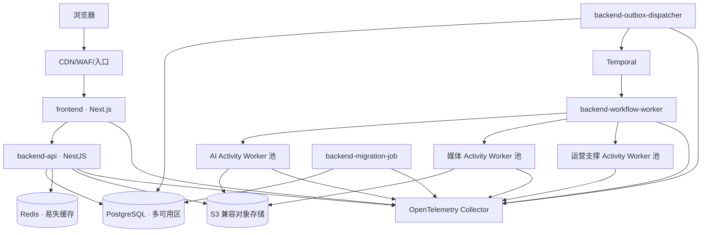

# ARCH-006 部署观测灾备容量成本与测试设计

## 1. 设计结论与边界

首发采用统一源码版本和 [ARCH-007](ARCH-007-业务模块边界与服务协作设计.md) 规定的独立运行制品：`frontend`、API、Outbox Dispatcher、Workflow Worker、AI/媒体/运营 Activity Worker 与 Migration Job。它们共享 `backend/` 领域规则但使用独立入口、队列、权限、资源池和扩缩策略；任何制品失败不得要求同步扩容或重启其他制品。

本设计固定供应商中立的运行约束和待评审的 Temporal 技术族，不提前选择云厂商、首发地区、容器编排或 IaC 产品。地区、托管服务、网络产品与基线规模须在容量输入确认后通过 ADR 接受。当前文档只形成 Design 评审输入，不代表已部署、已压测或已达到 SLO。

## 2. 环境与生产拓扑

| 环境 | 用途与隔离 | 数据和发布规则 |
| --- | --- | --- |
| local | 单机开发及契约验证；允许等价依赖容器 | 仅合成数据，不连接生产账户或密钥 |
| test | 每个变更的短生命周期集成环境 | 自动创建/销毁，禁止复制生产内容 |
| staging | 生产同构、缩小容量的发布和恢复演练环境 | 使用脱敏/合成样片，经相同迁移和部署流水线 |
| production | 单地区多可用区首发，控制面和数据面私网隔离 | 仅不可变制品和受审批配置；跨区灾备受数据驻留约束 |

- `frontend` 与 API 无共享进程状态；静态资源使用内容哈希，服务端会话通过受控后端校验。
- API 至少跨两个故障域运行；Worker 按 AI 外部等待、CPU 媒体处理、通知和可选 GPU 分池。
- PostgreSQL 是业务事实源；Redis 丢失后可重建；Temporal 保存执行历史但不替代业务任务事实；对象存储保存媒体并启用校验、版本与生命周期策略。
- 灾备位置不承载日常流量；使用版本化 IaC、独立备份和必要的温备数据能力。若演练证明冷启动无法达到 RTO，则必须提升为温备，不得降低恢复目标。
- API、Worker、数据库和依赖分别暴露存活、就绪、版本信号；依赖不可用时停止接收无法安全处理的新工作，不删除已受理事实。

## 3. 构建、交付与数据库迁移

| 阶段 | 强制门禁 | 产物/证据 |
| --- | --- | --- |
| 变更检查 | 冻结安装、格式/静态/类型、单元/集成/契约测试、OpenAPI 兼容检查、迁移检查、安全/许可/密钥扫描 | 可复现日志和失败定位 |
| 构建 | 分别构建前端、API、Dispatcher、Workflow/Activity Worker 和 Migration OCI 制品；生成 SBOM、签名、来源证明 | 提交、锁文件、契约和制品摘要绑定的发布清单 |
| 预发布 | IaC 计划审批、迁移演练、部署、冒烟、代表性 E2E 与性能抽样 | 环境差异、测试和审批记录 |
| 生产 | 数据兼容确认后金丝雀或滚动发布，按 API/Worker 兼容矩阵推进前端 | 发布人、时间、配置版本、指标和回滚点 |

- 数据库采用 `expand → migrate/backfill → switch → contract`；扩展迁移须兼容当前及上一发布，收缩只在旧制品、旧工作流和回填均退出后执行。
- 迁移程序须可重入、分批、限速并记录游标；大表变更先以生产规模副本验证锁、时间、磁盘和复制延迟预算。
- Temporal Workflow 使用确定性版本标记或新任务队列演进；旧 Worker 保留至运行中 Workflow 可安全完成或迁移。
- 发布失败优先回退前端/API/Worker 制品；不反向执行破坏性数据库变更。事实不一致时暂停新任务，按运行手册前滚修复或由已验证备份恢复。

## 4. 配置、密钥与供应链

- 非敏感配置以版本化模式管理，启动时校验类型、范围和环境；变更记录操作者、审批、摘要与生效版本。
- 密钥来自集中秘密存储和工作负载身份，不写入 Git、镜像、前端 Bundle、日志或 Workflow 历史；按环境/服务最小授权并支持轮换、撤销和访问审计。
- 数据库、对象存储、Temporal、供应商及签名密钥分别授权；高风险轮换先双密钥过渡，再验证旧密钥失效。
- 直接依赖、容器基础镜像、FFmpeg/字体/模型和 IaC 模块锁定版本并生成 SBOM；严重漏洞或许可风险未被接受时阻止发布。

## 5. 日志、指标与链路追踪

| 信号 | 设计要求 | 保留与安全 |
| --- | --- | --- |
| 日志 | 结构化输出 `timestamp/service/release/env/tenant_scope/request_id/task_id/attempt_id/trace_id/error_code` | 集中脱敏；禁止令牌、签名 URL、完整提示词和未发布正文 |
| 指标 | RED（请求）、USE（资源）、队列时延、任务/供应商/导出、成本与业务门禁指标 | 限制标签基数；对象标识用于日志/追踪而非指标标签 |
| 追踪 | 浏览器→API→Outbox→Workflow→Activity→供应商/媒体→账本/候选 | 采样策略保留错误与高价值链路，敏感属性在采集端删除 |

所有信号携带不可变 `release_version`，并可从任务、尝试、账本分录或交付版本反查；告警链接到仪表盘、日志查询、追踪和运行手册。审计日志与诊断日志分离，前者按不可修改策略保存。

## 6. SLO、错误预算与告警

| 服务指标 | 目标/窗口 | 告警信号 |
| --- | --- | --- |
| 核心控制面可用性 | 月度 ≥99.9% | 1h/6h 多窗口错误预算燃烧率 |
| 普通交互延迟 | 基线负载 P95 ≤2s | 延迟与错误率同时越线，按路由定位 |
| 异步任务受理 | P95 ≤3s | 受理失败、Outbox 积压或派发延迟 |
| 已知供应状态可见性 | 30s 内达成率 ≥99% | 回调/SSE 延迟和状态未知比例 |
| 平台任务可靠完成 | ≥98%，供应商故障单列 | 停滞、重试耗尽、人工处置比例 |
| 正式交付导出成功率 | ≥99% | 导出失败、校验失败和重试激增 |

P1 告警表示用户关键流程大面积不可用、数据/费用/安全风险或错误预算快速燃烧，须立即响应；P2 表示容量下降或局部功能退化，须在值班目标内响应。告警以用户症状为主、资源原因为辅，必须有影响范围、责任服务、关联版本和抑制/去重规则；无明确动作的指标只进入看板。

## 7. 备份、恢复与灾难恢复

- 正式业务数据 RPO≤5 分钟、RTO≤60 分钟：PostgreSQL 使用连续日志归档和加密快照，备份存于独立故障域/账户并定期验证可读性。
- 对象存储启用版本、校验和、防误删和按驻留规则的复制；媒体元数据与对象清单对账。未完成分片上传可重试，不承诺恢复未受理数据。
- Temporal 持久层按产品支持方式备份/复制；恢复后以 PostgreSQL 任务事实对账并重放 Outbox。Redis、搜索、分析和代理投影从权威来源重建，不提高其事实等级。
- 恢复顺序为网络/身份/密钥→PostgreSQL 与对象存储→Temporal→API/Dispatcher→Worker→frontend；恢复期间禁止重复扣费、重复交付或静默采用迟到结果。
- 每季度执行一次可重复恢复演练，至少覆盖数据库时间点恢复、对象误删、区域不可用和运行中任务对账；记录实际 RPO/RTO、数据差异、责任人及改进项。

## 8. 容量、扩缩与背压

| 资源 | 容量模型与主要变量 | 扩缩/保护信号 |
| --- | --- | --- |
| frontend/API | `峰值RPS=并发用户×每分钟动作÷60×突发系数` | RPS、P95、CPU/内存、连接；跨故障域保留最小副本 |
| AI Worker | `所需并发≈到达率×平均等待时长÷目标利用率` | Temporal schedule-to-start、最老任务、供应商限流；按能力队列限流 |
| 媒体 Worker | 按输入分钟、编码规格、CPU/GPU 时间和临时磁盘基准 | 队列龄、处理实时倍速、CPU/内存/磁盘；每任务资源上限 |
| PostgreSQL/Redis/Temporal | 事务率、连接、IOPS、WAL/历史增长和热键 | 池化、慢查询、复制延迟、缓存命中和历史积压 |
| 对象存储/网络 | `月新增=项目数×每项目媒体量×候选/代理/版本系数` | 容量、生命周期、请求率、跨区复制与出口流量 |

扩容不得只看 CPU：Worker 以队列等待目标为主，API 以用户延迟/错误率为主。全链路设置租户配额、供应商速率限制、批次上限、并发舱壁和优先级；过载时拒绝新低优先级任务并给出可恢复状态，不丢弃已受理任务。首发负载和媒体假设未确认前，所有实例数只作为 Plan 的压测变量，不写死为生产承诺。

## 9. 成本与预算治理

- 分开核算平台基础设施成本与 [FR-017](../requirement/FR-017-预算额度与成本账本需求规格说明书.md) 的用户业务账本；两者按任务/尝试/能力/结果每日对账，不以云账单替代业务计量事实。
- 单位经济模型至少包含“每活跃工作空间、每集、每镜头尝试、每成片分钟”的 AI、计算、存储、流量和观测成本，并区分成功、失败、重试、候选未采用和保留成本。
- 环境和制品使用统一成本标签；对月预算、单项目预算和供应商额度设置 50%/80%/100% 观察、预警和阻断策略。阈值须可配置且不自动终止已承诺的计费副作用。
- 异常花费、用量无结果、重复计量或单价漂移触发运营事件；仅获授权人员可暂停新可计费任务、切换路由或提高预算，并保留审计。

## 10. 测试与演练策略

| 层次 | 设计范围 | 实施后证据 |
| --- | --- | --- |
| 静态与单元 | 类型、领域规则、状态机、幂等、计价、迁移、安全及 ARCH-007 模块依赖规则 | CI 报告、依赖图、变异/覆盖率的风险解释 |
| 组件与集成 | 前端组件；真实 PostgreSQL、Redis、Temporal、对象存储等价环境 | 可重复测试、数据库隔离和清理证据 |
| 契约 | OpenAPI、SSE、事件、回调、Adapter、媒体清单及前后版本兼容 | 生产者/消费者契约和旧制品兼容报告 |
| E2E/样片 | 登录→导入→分镜→生成→断线恢复→审核→费用→导出 | 代表性 180 秒样片、浏览器/网络矩阵和追踪证据 |
| 非功能 | 3 倍峰值 30 分钟、媒体基准、故障注入、安全/租户/隐私/无障碍 | 性能曲线、漏洞处置、跨租户否定测试和人工检查 |
| 恢复 | 进程/可用区/供应商故障、重复回调、数据库/对象恢复和回滚 | 季度演练记录、RPO/RTO、对账与改进关闭证据 |

快速、确定性的单元与契约测试构成测试金字塔主体，E2E 只覆盖高价值跨边界流程。安全测试包括 SAST/SCA、密钥/容器/IaC 扫描、DAST、授权矩阵、租户隔离、回调重放和恶意上传。故障注入不得直接作用于未演练保护的生产数据；先在 test/staging 验证，再以审批、爆炸半径和停止条件控制生产演练。测试数据禁止使用未获授权的真实剧本或个人数据。

### 10.1 代表性单集夹具与 E2E 断言

基础夹具固定为合成的 1 工作空间、3 个职责分离用户、1 个 180 秒分集、12 场/60 镜头、8 个版本化资产、每镜头 2 个候选、预算/权利/安全策略和可追踪 Provider Stub；所有断言同时检查租户、版本、Task/Attempt、账本、媒体谱系和 trace。

| 场景 | 故障注入点 | 可判定断言/关联验收 |
| --- | --- | --- |
| 完整单集 | 无；导入→分镜→生成→审核→时间线→导出 | 60 镜头有明确状态，交付 Manifest/费用/采用可追溯；AC-TCR-002-005 |
| 生成部分失败 | 10 镜头批次中 Provider 拒绝 2 项 | 成功项不回滚，失败项新 Attempt，预算只按证据结算；AC-ARCH-003-003/004 |
| SSE 断线恢复 | 第 N 个事件后断网并制造乱序 | `Last-Event-ID` 续接并去重，快照最终收敛且不误判完成；AC-ARCH-002-004/005 |
| 重复回调/Outbox | 同 external_event_id 回调 3 次并重放 Outbox | 仅一个候选、一次结算和一次状态转换；AC-ARCH-003-003 |
| 单镜头局部重做 | 已采用镜头只重做一个 Track | 其他 Track/镜头引用、锁定元素和审核状态不变，新候选不得自动采用；AC-011-004、FR-016-009～010 |
| 导出部分失败 | 固定 DeliverySnapshot 的一个 Rendition 失败 | 仅失败步骤新 Attempt，同快照重试，Manifest 无残缺成功；FR-019-009～017 |

## 11. 发布、回滚与运行手册

- 发布前固定源提交、契约、迁移、配置、模型/适配器和制品摘要；变更负责人确认 SLO、容量、成本及回滚信号。
- 金丝雀阶段按错误率、延迟、任务积压、重复费用、媒体失败和前端错误预算自动或人工停止；稳定观察窗通过后逐步放量。
- 回滚保持 API/Worker/前端契约兼容，运行中 Workflow 继续由兼容 Worker 处理；若无法安全回退，则暂停入口并执行前滚修复。
- `docs/operations/` 的实施期运行手册至少覆盖：发布回滚、数据库故障/恢复、任务/队列停滞、供应商故障、对象误删、预算异常、密钥轮换、安全事件和区域灾难。
- 每份手册包含触发条件、权限与负责人、安全检查、操作步骤、验证/停止条件、沟通模板、回退路径和证据留存；未验证的步骤不得标为可执行。

### 11.1 运行手册责任与演练目录

| 手册 | Owner | 触发条件 | 设计演练频率/最迟点 |
| --- | --- | --- | --- |
| 发布与回滚 | Release Manager + 服务 Owner | 金丝雀错误/延迟/重复费用越阈或迁移异常 | 每次发布前 staging；每季度完整回滚 |
| 灾难恢复 | Operations + Database/Storage Owner | 数据库/对象/区域不可用或预计超出 RPO/RTO | 每季度；首发前完成一次全链路恢复 |
| 供应商故障 | Production Ops + AI Owner | 限流、错误、状态 unknown 或用量对账异常越阈 | 每季度及新 Provider 上线前 |
| 安全事件 | Security Incident Commander | 凭据泄漏、跨租户、恶意媒体或异常导出告警 | 每半年及重大边界变更前桌面/技术演练 |

## 12. 需求追踪与验证门禁

| 需求 | 本设计落点 | Design 评审证据 | 实施/Acceptance 证据 |
| --- | --- | --- | --- |
| FR-010-001～019 | 2、5～8、10～11 | 队列、背压、恢复和告警场景评审 | 故障注入、幂等、重试/取消/迟到结果测试 |
| FR-017-001～012 | 5～6、9、11 | 计量/预算/处置边界与成本模型 | 零重复扣费、对账、阈值和审计测试 |
| FR-019-009～017、FR-020-001～015 | 5～6、9～11 | 交付/通知/运营信号和责任矩阵 | 样片导出、通知去重、运营事件 E2E |
| NFR-001-001～013、027～031、033、039～046 | 2～11 | SLO、RPO/RTO、发布、容量和测试方案 | 负载、恢复、安全、兼容、发布与观测报告 |
| TCR-001-003、009、012、021～022 | 2～8 | 部署单元、拓扑、信号和容量模型 | IaC、独立扩缩、链路和重建演练 |
| TCR-002-005、011、014、025～037 | 2～11 | Outbox、迁移、Workflow、Worker 与运行边界 | 集成/契约/迁移/滚动发布和安全测试 |
| TCR-003-017～018、035～042 | 3、5～6、10～11 | SSE、性能、兼容和前端发布方案 | 浏览器 E2E、Web Vitals、旧制品兼容报告 |
| ADG-001-022～024、034、039～047 | 全文 | 评审清单、测试计划和手册目录 | 门禁通过记录、仪表盘、演练与 Acceptance |

Design 阶段只检查决策完整性、追踪、计算模型、契约示例、测试场景和演练计划；实际制品、流水线、仪表盘、压测、故障注入、恢复演练及运行手册执行结果必须在已接受 Plan 后产生，并写入 Acceptance。进入 PRD 前仍须确认首发地区、身份/托管方案、NFR 容量假设、成本责任人和告警值班目标。
