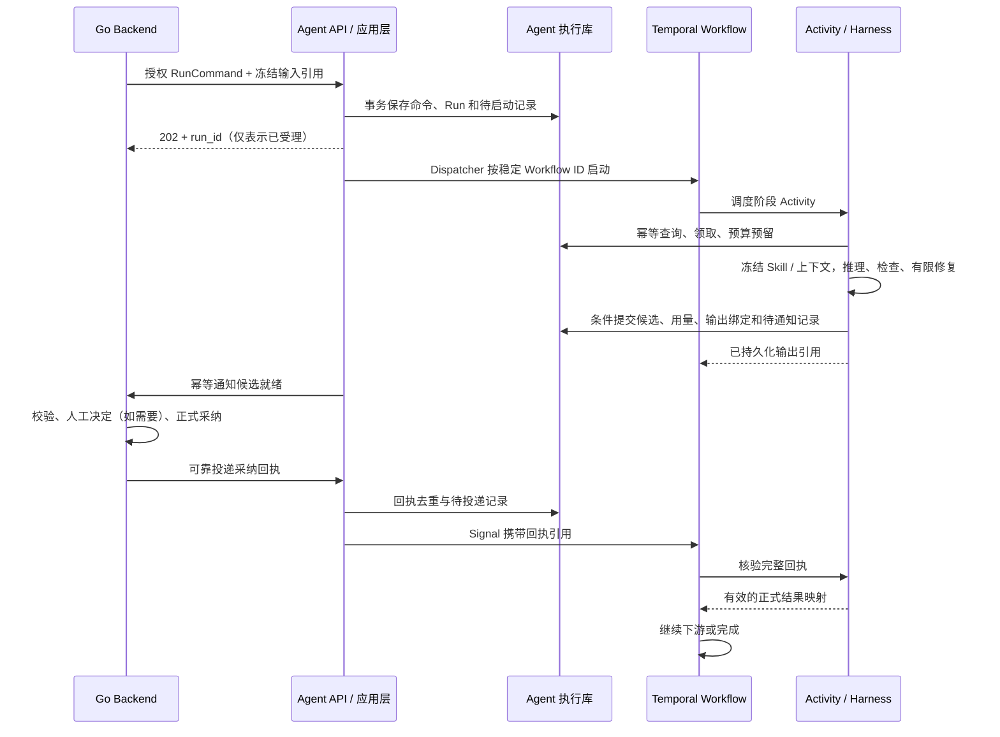

# Agent 服务目录与 Harness 工作流设计

> 状态：用户已于 2026-09-21 授权按设计实施；完成范围以验收记录为准。
> 日期：2026-09-21。上位规范：[PROJECT.md](../../PROJECT.md)。
> 编写依据为职责需要、已接受的单服务与 FastAPI 组织约定，以及官方运行机制；仅核对目录清单，未以业务代码反推设计。

## 1. 目标与范围

Agent 是一个 Python 服务，统一承载内部命令 API、Temporal Worker、创作执行记录和 Harness。保留一个镜像、一个默认应用进程、一个内部 HTTP 入口；模型可在受控子进程运行。Workflow、Harness、Skill 是服务内职责，不是三个待拆分的微服务。

本设计明确目录和文件归属、执行契约、状态、持久化、人工等待、取消、重试和验收。首个验收切片是剧本解析产生候选、经 Go 采纳后继续执行；不预建全部创作能力，不引入自由多 Agent 群聊、动态 Workflow 代码、通用 DAG 引擎或第二个任务调度器。

Go 仍负责身份与权限、正式源版本、业务数据、审批采纳、供应商发送授权和费用账本。Agent 管理执行事实和草案；前端只经 Go 查询或操作。模型调用可以由 Agent 的受控推理适配器执行，但不得自行授权额度或调用 Go 拥有的媒体生产供应商。

## 2. Harness、Workflow 与 Skill

| 概念 | 职责 | 落点 |
| --- | --- | --- |
| Workflow | 决定阶段顺序、依赖、分支、有界并发、等待和取消 | `app/creation/workflow.py` |
| Workflow Harness | 保障流程能够可靠启动、执行、保存、通知和恢复；是 Workflow、Activity、执行存储的组合职责 | `app/creation/`，不再新增同名框架或服务 |
| Activity / 执行用例 | 调用外部系统，领取执行权、预留预算、调用 Harness、保存结果、核对回执 | `app/creation/activities.py`、`execution.py` |
| Agent Harness | 在一个冻结任务内装配上下文、执行推理、检查与有限修复，返回候选及用量 | `app/harness/` |
| 专业能力 | 定义某类任务的输入、候选、专业检查与上下文要求 | `app/modules/<能力>/` |
| Skill | 提供已发布的专业方法和参考资料；不授予执行权限 | `skills/<能力>/`，由 `app/skills/` 加载 |
| Reasoner | 对接一次模型请求或受控推理子进程 | `app/reasoning/` |

Workflow 管“下一步与何时继续”，Harness 管“这一步如何在限制内完成”。Harness 不自行创建长任务、不等待人工审批、不直写数据库；Workflow 不执行模型、HTTP、数据库或文件 I/O。Temporal 的 Workflow/Activity 分工参考[官方 Python 指南](https://docs.temporal.io/develop/python)。

## 3. 目录与文件规范

保留现有标准目录名称；下列文件表达目标职责，只有真实功能需要时才创建。小模块不机械增加 Controller/Service/Repository 三层，也不为同一职责并列新增 `providers/`、`contracts/` 或 `workflow_harness/`。

```text
agent/
  app/
    main.py                         # 唯一 create_app() 工厂
    core/
      config.py                     # Settings、运行配置校验
      container.py                  # 显式装配依赖，持有客户端与后台任务
      lifespan.py                   # 唯一启动、就绪与关闭过程
    api/
      dependencies.py               # Depends 服务提供者与内部鉴权适配
      router.py                     # 统一 include_router
      routes/
        health.py                   # live / ready
        creation.py                 # 启动、查询、取消、恢复、回执接收
        <能力>.py                   # 确需独立调用时才提供的内部能力接口
    creation/
      contract.py                   # RunCommand、状态查询、回执与控制命令
      service.py                    # 命令校验、幂等受理、控制用例
      workflow.py                   # 仅 Temporal Workflow 与确定性状态推进
      activities.py                 # Activity 注册及执行用例调用
      execution.py                  # 领取、预算、Harness 调用、结果提交
      repository.py                 # 执行存储、唯一约束与条件写入
      dispatcher.py                 # 已提交待启动 / 待通知记录的可靠交接
      recovery.py                   # 查询原执行、未知结果对账与受控恢复
      platform.py                   # Go 私有契约客户端；不复制 Go 业务规则
      worker.py                     # 注册 Workflow / Activity 与 Worker 配置
    harness/
      schemas.py                    # 单次执行请求、结果和检查问题
      service.py                    # 公共有界执行循环
    modules/<能力>/
      schemas.py                    # 该能力专属输入及候选
      harness.py                    # 专业上下文与执行策略
      checks.py                     # 来源、范围、覆盖等确定性检查
    reasoning/
      <适配器>.py                   # 推理调用、工具限制、超时和进程回收
    protocol/
      canonical.py                  # 规范序列化、摘要等跨语言协议机制
    text_contract/
      task.py                       # 文本任务身份、输入引用与授权范围
      source.py                     # 来源版本、片段和证据引用
      checks.py                     # 文本结果共享检查合同
      failure.py                    # 文本执行的错误分类
    skills/
      catalog.py                    # 显式能力与发布版本注册
      runtime.py                    # 固定发布资源的校验、解析和只读加载
  skills/<能力>/
    SKILL.md                        # 专业指导
    references/                     # 随发布冻结的参考资料
  tests/
    unit/                           # 纯规则、上下文、预算与校验
    contract/                       # Go / Python wire 和快照样例
    workflow/                       # Activity 替身、等待、重放与恢复
    integration/                    # 真实存储、Temporal、Go 交接
    architecture/                   # 必要依赖约束
  pyproject.toml
  uv.lock
  .python-version
  Dockerfile
  README.md
```

`protocol` 只管传输编码机制，`text_contract` 只管共享文本执行语义；能力专属字段留在 `modules/<能力>`。模块间实际重复且稳定的合同才提升共享，不建立万能 DTO 包。

Workflow 与 Activity 必须分文件。首个流程使用 `workflow.py`，确有多个流程时再按流程拆分，不同时保留两套注册入口。`main.py` 与路由文件不得包含 Workflow、数据库初始化或模型执行代码。

## 4. 依赖与装配

```text
main → core/container + core/lifespan → API、Worker、客户端与存储
API → creation/service → 执行存储 / Temporal Client
Workflow → Activity 契约（调用由 Temporal 调度）
Activity → execution → Harness、执行存储、Go 客户端
Harness → 专业能力、SkillRuntime、Reasoner 接口
专业能力 → 自有 Schema、text_contract / protocol
reasoning / skills → 各自外部依赖或静态资源
```

具体依赖由 `container.py` 注入。Harness 只接收冻结输入、受限能力与执行预算，不接收 Repository、Go 写入客户端或 Temporal Client。数据库句柄和长期凭据不得传入提示词或模型子进程。

同进程模块调用默认使用显式接口，不通过自身 HTTP 地址重复调用。已有内部 HTTP 协议若仍有消费者，在后续迁移中明确处理；本设计不自动删除接口。Python 模块分层不是安全沙箱，模型子进程仍需限定工作目录、环境变量、工具和可访问资源。

技术栈为 Python、FastAPI、Uvicorn、Pydantic、pydantic-settings、HTTPX、Temporal Python SDK、PostgreSQL 执行存储；工具链为 uv、Ruff、mypy、pytest / pytest-asyncio。依赖固定在 `pyproject.toml` / `uv.lock`，不增加额外 Agent 框架来包裹相同执行循环。

## 5. 契约与身份

以下是必须表达的语义，不要求复制为相同数量的类或数据库表。已有合同应映射后复用，字段或 wire 变更须有版本和跨语言验证。

| 合同 | 必要字段或语义 |
| --- | --- |
| RunCommand | 协议版本、命令 ID、租户与业务范围、流程类型 / 版本、输入引用、授权引用、预算、追踪 ID |
| InputSnapshot | 源版本、输入摘要、上游产物版本、允许修改范围、Skill / 模型 / 策略版本；内容不可变 |
| TaskEnvelope | 业务 run_id、step_key、invocation_id、snapshot_ref、能力、release_hash、授权与 budget_ref、deadline |
| ContextManifest | 实际读取的来源和摘要、片段范围、裁剪记录、缺失项；可解释本次模型看到的内容 |
| AttemptResult | attempt_id、fence、候选或错误、检查结果、provider_operation_id（可获得时）、usage 与未知用量标记 |
| PersistedOutput | output_id、revision、输入与发布摘要、检查引用、归属和上游依赖；提交后才可消费 |
| AcceptanceReceipt | Go 回执 ID、run / step、候选 ID 与 revision、源版本、决定、正式对象映射、业务 effect 完成状态 |

- `run_id` 是业务运行身份，不等同于 Temporal 的 Run ID；Workflow ID 由租户和业务运行身份稳定派生，重复提交或启动重试不更换该身份。
- `step_key` 标识逻辑阶段及处理范围；`invocation_id` 标识一次冻结输入上的任务，Activity 重投继续使用它。真正的新推理尝试使用新 `attempt_id`，不能用 SDK 重试计数替代业务尝试记录。
- 同一命令 ID 和相同输入返回原运行；同一 ID 携带不同输入返回冲突。用户修改原稿、范围或发布版本须创建新输入快照及修订关联。
- 内部请求必须验证调用身份和授权范围，租户不得仅凭请求体自报。Schema 拒绝未知控制字段；用户内容不能覆盖模型、工具白名单和发布路径。

### 5.1 内部 API 操作

API 按以下操作语义提供类型化合同，具体路径在实施时对照已发布接口确定，不借规范重写无关 URL。操作均由 Go 或受信任的内部调用者发起，客户端不能直接访问。

| 操作 | 输入与返回 | 关键约束 |
| --- | --- | --- |
| 启动运行 | RunCommand → `202`、run_id、查询引用 | 持久化受理后才返回；幂等重放返回原运行 |
| 查询运行 / 产物 | run_id / output_id → 状态、revision、问题和结果引用 | 检查租户及业务范围，分页返回尝试记录，不泄漏原始日志 |
| 暂停 / 取消 | 控制命令 ID、run_id、期望控制版本 → 受理回执 | 请求受理不等于已经停止；重复命令不再次改变版本 |
| 恢复 / 重试 | 控制命令 ID、阻塞原因引用、期望版本及授权 → 受理或拒绝 | 不暴露任意“重跑”开关，unknown 必须先对账 |
| 接收审批采纳回执 | AcceptanceReceipt → 去重后的持久接收回执 | 持久接收不等于 Workflow 已消费；可靠交接跟踪至完成 |

错误统一包含 `code`、可公开的 `message`、`trace_id` 和必要问题明细。认证 / 权限失败、输入无效、身份或版本冲突、预算不足、依赖暂不可用分别表达；不能以 HTTP 200 加字符串假装失败，也不能把预算不足和 unknown 标成可无限自动重试。长任务失败通过运行查询返回，API 不一直挂起等待推理结束。

## 6. 标准执行闭环



Dispatcher 只转交已经提交的启动、通知及回执投递记录，不根据数据库阶段状态重新计算流程，不能成为第二个 Scheduler。HTTP 断开不取消已受理任务；前端刷新通过 Go 查询同一 `run_id`。

剧本解析切片按“校验源与冻结版本 → 分集分场候选 → 角色、场景与状态提取 → 来源和覆盖检查 → Go 审阅采纳 → 输出正式映射”验证。阶段是否需要人工门由冻结的流程定义决定；下游若依赖正式身份，必须等待采纳映射，不能使用模型临时 ID 代替正式 ID。

### 6.1 Workflow Harness

1. 流程使用显式注册的 Python Workflow 与冻结的流程版本；模型可提出分解候选，可信代码校验后决定范围，不执行模型生成的 Workflow 代码。
2. Workflow 只保留流程所需的轻量身份、状态和输出引用。I/O 全部放在 Activity；时间、Timer 和等待使用 Temporal 机制；不在 Workflow 中读取环境变量、Skill 文件或实时数据库。
3. 步骤依赖使用已提交的输出引用。按集 / 场执行时限制并发和总预算；必需分支失败须阻断相关汇总，允许部分结果时明确缺失范围，不以成功子集冒充完整结果。
4. 仅长期独立等待、独立取消或需要限制历史规模时使用 Child Workflow；普通函数和纯计算不逐层包装成 Workflow。
5. 人工等待释放 Activity，不占用模型进程。Signal 接收已持久化控制命令或回执引用；Query 只读运行投影，不能扣费或产生业务写入。消息语义参考[Temporal 官方说明](https://docs.temporal.io/develop/python/workflows/message-passing)。
6. Workflow 是推进顺序的所有者；数据库里的 Run / Step 状态是查询投影，通过 Activity 写入，记录修订与更新时间。投影滞后时可重建，不能用投影反向覆盖 Temporal 历史。

### 6.2 Agent Harness

每次 Harness 执行固定为：校验任务 → 加载指定 Skill Release → 装配上下文 → 一次受限推理 → 结构与专业检查 → 有限修复或返回结果。

- SkillRuntime 校验固定发布包的版本和摘要；调用中不得读取可变的“最新版本”，撤回或缺失版本须明确失败，不静默替换。
- 上下文至少区分系统规则、用户原文、已采纳事实和参考资料。保留源版本、片段与 hash；不能把附件指令当系统指令。超出预算返回缺失范围或由 Workflow 缩小任务，不能静默丢弃原文后声称全稿覆盖。
- 能力模块定义确定性检查：Schema、来源、引用、范围、覆盖；语义质量问题独立保存。`schema_valid` 不等于质量通过，质量通过也不等于 Go 已采纳。
- 修复须携带原候选、问题和允许修改范围；只能在相同输入与预算内产生新候选 revision。需要扩大任务范围或换源时交回 Workflow，不在 Harness 内另开流程。
- 每次推理或工具调用前由可信执行用例预留预算。Harness 内存计数仅作局部限额，重启后仍以持久用量和预留为准；最大步数、修复次数、Token / 费用和 deadline 必须有明确上限，不能使用无限循环默认值。
- Reasoner 负责协议转换、结构化响应、取消和进程回收；禁止 SDK、Harness、Activity 三层各自透明重试同一次外部发送。工具按发布策略与本次授权的交集开放。

## 7. 持久化与状态

Agent 使用自己的执行 Schema 与写权限，不能写 Go 的正式业务表。执行库至少保存命令去重、快照、运行投影、Invocation、Attempt、预算预留与用量、候选版本、输出绑定和可靠交接记录；可按真实查询与事务需要合并表，不要求一概念一表。

关键事务规则：

1. 命令受理与待启动记录同事务；提交后启动失败由 Dispatcher 重投，Temporal 已启动但本地未确认时按原 Workflow ID 查询。
2. 领取 Attempt 和预留预算原子完成；领取权包含 lease 与递增 fence。lease 过期只证明持有者失联，不证明外部调用未发生。
3. 提交时校验 invocation、attempt、fence、控制版本和输入摘要。旧 Worker 结果只能保存为审计信息，不覆盖当前候选。
4. 候选、检查、用量记录、OutputBinding 与就绪通知同事务提交。大文件先写不可变对象并确认存在，再提交引用；失败留下的孤立对象可后续清理，不能发布悬空引用。
5. Go / Agent 交接均采用至少一次投递加业务幂等键，重复通知返回原结果。数据库唯一约束保护接受结果和回执，不能只依赖进程内锁。

| 状态对象 | 状态与含义 |
| --- | --- |
| Run 执行 | `queued → running → succeeded`；可进入 `waiting_review`、`blocked`、`paused`；取消经 `cancelling → cancelled`；确定不可恢复才 `failed` |
| Attempt | `prepared → running → succeeded / failed / cancelled / unknown`；`unknown` 必须对账，不等于失败 |
| 候选检查 | `passed / needs_review / blocked`，附问题与证据，独立于执行状态 |
| 正式采纳 | `not_submitted / pending / accepted / rejected`，只依据 Go 回执；源变更另标 `stale` |

`succeeded` 表示流程合同要求的执行已完成。对于“仅生成草案”的流程，候选持久化即可完成；对于“生成并采纳”的流程，必须取得完整 Go effect 回执。每个流程在注册时声明完成条件，不能混用。

## 8. 人工门、取消与失败恢复

Go 先持久化审批决定，再完成正式业务写入，最后可靠投递回执。只有审批决定但正式写入未完成时，Agent 继续等待，不把“批准”推导成“已采纳”。重复或乱序回执按回执 ID、候选 revision 和源版本处理；旧候选回执不能解锁新候选。

拒绝进入流程定义的结束或受控修订分支；修订保留父候选和问题。用户改稿创建新快照，不覆盖原结果。人工等待超时进入明确阻塞或结束状态，不能自动批准。

| 场景 | 行为 |
| --- | --- |
| 请求重复 / API 返回丢失 | 按原命令 ID 返回原 Run，不重复创建流程 |
| Worker 崩溃 / Activity 重投 | 先查 Invocation 已提交结果；存在即返回；未完成时核对 Attempt 与外部操作 |
| 确定未发送的临时失败 | 按退避和剩余预算创建下一 Attempt；预留与实际用量分别核算 |
| 已发送但超时 / 断连 | 标记 `unknown`，保留预留，查询原 operation 或结果；不能直接重新生成 |
| 无法查询或证明原结果 | 保持 blocked / unknown，需明确恢复决定及额外预算；不承诺外部调用恰好一次 |
| Schema 可修复 / 证据缺失 | 在上限内修复或补读；来源不足须保留问题，不能伪造证据 |
| 权限失效 / 预算耗尽 / 发布不可用 | 停止新调用，返回明确错误或阻塞原因，不自动换身份、模型或 Skill |
| 暂停 | 在可安全检查点停止推进；不回滚已提交结果，不重置预算，不能假定已发送调用被暂停 |
| 取消 | 持久化取消意图并传播至 Activity / 子进程；等待回收，核对已发操作和用量；无法确认的操作仍保留 unknown |
| 结果提交后通知失败 | 重投通知，复用 output_id；不重新执行模型 |
| 旧 Worker 迟到 | fence / 控制版本拒绝当前提交，保留审计及必要用量，不复活被取消流程 |

Activity 具有至少一次执行语义；超时与重试需显式配置，安全的读操作可自动重试，有外部副作用的操作先证明幂等或对账后重试。长 Activity 使用 heartbeat 协助故障检测和取消，不能把 heartbeat 当作输出持久化。依据：[Temporal 错误处理](https://docs.temporal.io/develop/python/best-practices/error-handling)。

## 9. 生命周期、版本与观测

- 使用单一 `create_app()` 与 FastAPI `lifespan`：校验 Settings / Schema 兼容性 / Skill 包 → 创建数据库和 HTTP 客户端 → 创建 Temporal Client → 注册并启动 Worker 与 Dispatcher → 就绪。初始化部分失败时按逆序释放已创建资源。参考[FastAPI lifespan](https://fastapi.tiangolo.com/advanced/events/)。
- 关闭先取消就绪和新任务受理，停止 Dispatcher 领取新记录，再在宽限期内收敛 Worker、在途 Activity 与子进程，最后关闭客户端。关键后台任务异常退出必须触发不就绪与受控关闭，不能让 HTTP 存活掩盖 Worker 已死。
- `/healthz` 表示进程存活；`/readyz` 表示本实例必要组件及依赖可用，不执行真实付费推理，不宣称业务 E2E 通过。默认一个应用 Worker 进程，不能随意增加 Uvicorn workers 导致重复启动后台组件。
- Workflow 版本、Skill Release、Schema、模型策略与输入摘要在运行中冻结。Workflow 修改须验证已有历史可重放，并选择兼容发布方式；Skill 升级只影响新调用。Continue-as-New 仅在历史规模需要时使用，传递业务身份与未完成控制状态，不能重置预算或漏掉消息。
- 日志关联 tenant / run / step / invocation / attempt / trace，记录等待、耗时、预算、unknown、检查失败和交接积压，不打印密钥、完整原稿或模型内部推理。用户侧只展示阶段、产物、问题和可执行操作。
- 先用有界并发与租户额度限制防止单租户占满执行槽；出现排队公平性需求时评估 Temporal Task Queue Fairness，并核验部署与 SDK 支持，不预建独立公平调度服务。

## 10. 最小验收与后续落地

用户已授权实施，首轮范围为本地 Harness 调用、后台生命周期、配置与工具链；见 [首轮改造验收](../acceptance/工程规范首轮改造验收.md)。其余业务切片按以下标准继续验收，不预建未使用的能力、文件或存储表。

| 验证 | 必须证明 |
| --- | --- |
| API / 契约 | 重复命令返回原运行、输入冲突被拒绝、越权被拒绝；Go/Python 字段及摘要一致 |
| Harness 单元测试 | 固定 Skill 与来源、预算上限、修复停止、结构失败和语义问题可区分 |
| Workflow 测试 | 正常顺序、人工等待、拒绝修订、乱序回执、取消和必需分支失败 |
| 存储与并发 | 重复 Activity 不重复接受输出、旧 fence 不能提交、预算不能超领 |
| 故障注入 | 启动前后崩溃、结果落库后通知前崩溃均可恢复；未知外部发送不盲重试 |
| 生命周期 | 无模型请求的就绪检查、后台任务退出被发现、取消后无孤儿子进程 |
| 版本与重放 | 历史 Workflow 可重放，运行中不切换 Skill，源变更不覆盖旧结果 |
| 真实切片 | 提交原稿 → 得到持久候选 → Go 审批采纳 → 回执解锁下一步 → 重启 / 刷新仍可查询 |

工具入口为 `uv sync --locked --all-extras`、`uv run --locked --all-extras ruff check app tests`、`uv run --locked --all-extras ruff format --check app tests`、`uv run --locked --all-extras mypy app`、`uv run --locked --all-extras pytest`。Workflow 测试使用 Temporal 测试环境与 Activity 替身；仅 Timer 测试需要时启用时间跳跃，真实存储和 Temporal 验收独立报告。真实模型调用需要可用授权与预算；替身通过不能替代它。

## 11. 与已有文档的关系

继承 [0021 单服务设计](0021-Agent单服务架构调整设计.md) 的服务数量和业务所有权，以及 [0023 FastAPI 与 Skill 设计](0023-Agent%20FastAPI%20标准化目录与%20Skill%20运行时设计.md) 的入口、目录与生命周期约定；参考 [3004 Harness 设计](3004-AgentHarness专业能力与创作流程设计.md) 的候选、预算与专业执行语义。

本稿接受后，服务内调用默认显式接口、Workflow Harness 的职责解释及本稿目录归属成为新增整改依据；0021 中要求服务内 HTTP 回环的条款在该范围被替代。既有 wire 协议、Workflow 身份和历史执行不因文档变更自动迁移；下次实施须逐项对照。历史完成记录仍是历史证据，不能作为本设计通过验收的证明。
