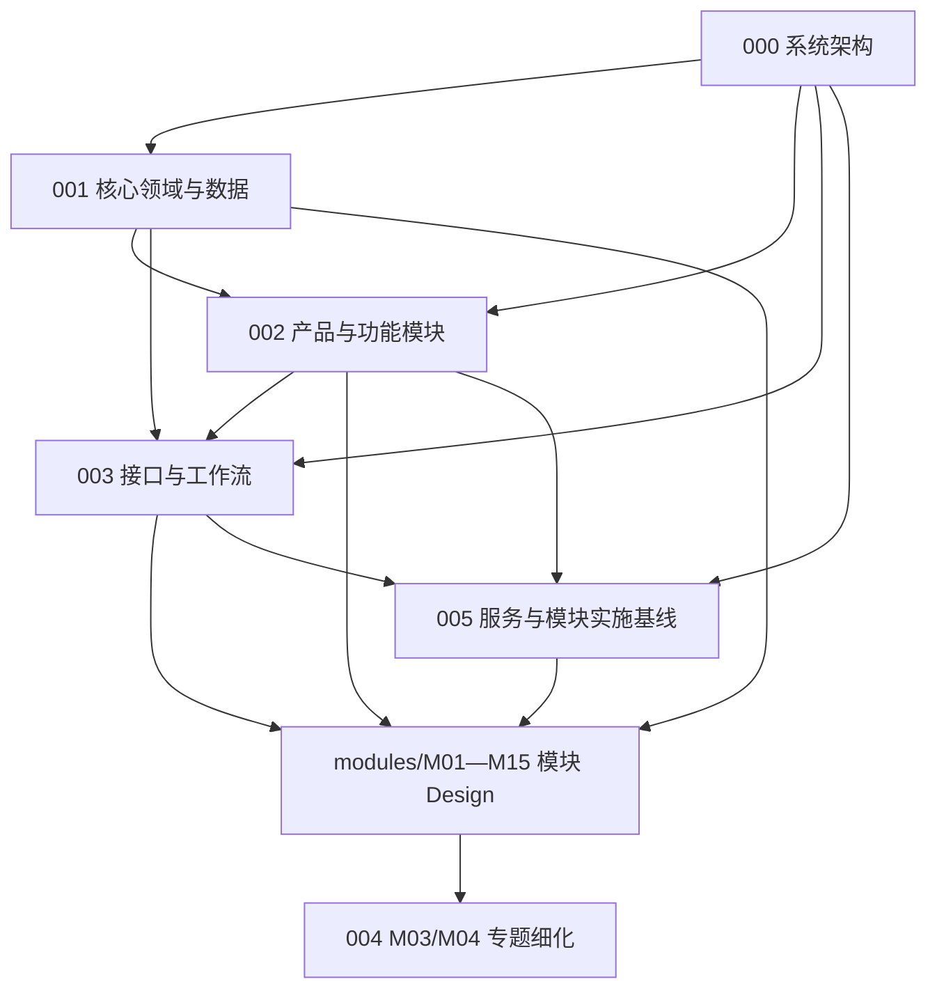

# AI 视频生产平台 Design 索引

- 状态：active
- 基线日期：2026-08-22
- 当前设计生命周期：000/005 顶层架构 accepted/frozen；其余 proposed

## 1. 当前设计顺序

正式 Design 从 000 重新编号，并按“架构 → 领域与数据 → 产品模块 → 接口工作流 → 模块详细设计”评审。

| 序号 | Design | 责任 | 状态 |
| --- | --- | --- | --- |
| 000 | [AI 视频生产平台目标系统架构设计](./000-AI视频生产平台目标系统架构设计.md) | 前后端分离、MVVC、TypeScript 前端、Go 业务后端、Python Agent、MinIO、最终 Schema、无兼容、物理目录、POJO + Controller + Service、六个运行角色 | accepted |
| 001 | [AI 视频生产平台核心领域与数据模型设计](./001-AI视频生产平台核心领域与数据模型设计.md) | 聚合、事实所有权、PostgreSQL 最终 Schema、物理类型、主外键、索引、约束、版本和投影 | proposed |
| 002 | [AI 视频生产平台目标产品与功能模块设计](./002-AI视频生产平台目标产品与功能模块设计.md) | 产品边界、用户流程、M01—M15、状态、失败路径、权限和验收切片 | proposed |
| 003 | [AI 视频生产平台接口、工作流与功能实现设计](./003-AI视频生产平台接口工作流与功能实现设计.md) | 无路径版本 `/api`、HTTP/事件信封、幂等、ETag、游标、错误、耐久流程与 Agent | proposed |
| 004 | [AI 视频生产平台剧本基础分析与人物拆解专题设计](./004-AI视频生产平台剧本基础分析与人物拆解详细设计.md) | M02/M03/M04 的整本拆集、每集场景、人物×集数、生产清单、实施级接口与关键物理表 | proposed |
| 005 | [AI 视频生产平台服务与模块实施基线](./005-AI视频生产平台服务与模块实施基线.md) | Go/Python 工程边界、逻辑模块、六类安全隔离运行入口、基础设施、外部服务 Gate 和首次实施 Gate | accepted |
| modules | [M01—M15 模块详细 Design](./modules/README.md) | 每个功能模块一份实现边界、数据、命令、状态、失败和验证设计 | proposed |

M01—M15 当前已按模块一一拆分到 `modules/`；004 保留为跨 M03/M04 的专题细化。逻辑模块不等于微服务数量，研发仍按 A—F 纵向切片推进。

## 2. 依赖关系

000 决定运行和技术边界；001 决定事实所有权与不可合并对象；002 决定系统包含什么模块和用户结果；003 统一跨模块接口与运行语义；005 统一解释产品能力、逻辑模块、运行服务和外部依赖；`modules/` 是每个模块的详细实现事实源；004 只细化 M03/M04 专题。

## 3. 当前关键决策

- 前端固定在 `frontend/`，采用 TypeScript、Next.js、React、OpenAPI 生成客户端和 RTK Query；只拥有交互与视图状态，不形成第二套业务后端。
- 后端固定在 `backend/`，采用 Go 模块化单体；Go Application Service 拥有唯一业务规则、事务和业务表写入。
- Agent 固定在顶层 `agent/`，采用 Python/LangGraph；只运行 Harness/Skill、模型和只读 Tool，不拥有业务数据库、批准或 current。
- 前后端调用风格固定为 Model–View–ViewModel–Controller（MVVC）；View/ViewModel 在前端，Controller/Application Service/POJO Model 在后端按边界分层。
- 公开 HTTP 路径只使用无版本前缀 `/api`；事件 topic 也不带版本后缀，信封 `schema_version` 只用于当前契约一致性校验。
- 项目只实现本 Design 定义的数据库、API、消息和 MinIO key；`schema_version` 只接受当前契约，其他值拒绝，不建立 alias、转换器、双读或回退路径。
- 数据库只保留 `backend/schema/current.sql`、空库初始化和非空 fingerprint 严格校验；不采用 ORM，不建立结构演进目录或历史链。
- 对象存储固定为私有 MinIO；`ObjectStoragePort` 只隔离 SDK/I/O 与测试，S3-compatible API 只是协议，不建设 AWS S3 adapter 或运行时多存储切换。
- Go 中按 plain struct/value object 落实 POJO 目标：领域对象不依赖 HTTP、pgx、sqlc 或 Provider SDK；Service 以用例而不是数据表组织。
- 000 §6 是唯一物理目录事实源；目标路径在开发前评审，但实际目录只随真实用例、owner 和测试创建，禁止空目录、全局 `shared/utils/managers` 和纯转发层。
- 目标运行边界为 `api`、`operation-worker`、`import-worker`、`provider-worker`、`agent-worker`、`media-worker` 六类安全隔离入口，按切片启用；API 不执行长任务。
- Go `modules/agents` 拥有 M06 Run/Proposal；顶层 Python `agent/` 拥有无业务写权限的 Harness/Skill。LangGraph 只编排单次 Agent 运行，不成为审批、人物资料、人物出场矩阵或生产流程事实源。
- PostgreSQL 事实与事务 Outbox 先提交，再执行队列、外部模型和媒体副作用。
- 五个非 Agent 运行角色固定由 Go 实现，唯一 Agent 运行角色固定由 Python 实现；不得创建第二套业务后端。
- 商业计费、订阅、支付和增长不属于系统范围；用量只服务资源治理。

## 4. 事实源规则

- 000 是技术架构事实源；
- 001 是对象所有权、版本与数据约束事实源；
- 002 是目标产品边界与模块责任事实源；
- 003 是接口、事件、耐久流程和实施切片事实源；
- 005 是运行服务、基础设施、外部服务 Gate、模块运行映射和首次实施 Gate 的事实源；
- `modules/M01—M15` 是对应模块的详细实现事实源；004 等专题 Design 只能补充算法和交互细节；
- [Requirement](../requirement/README.md) 定义用户结果和验收，Design 不得反向扩大范围；
- 多份文档冲突时不得任选一份实现，应先按上述所有权修正事实源和所有下游引用。

## 5. 当前设计范围

本目录只保存当前有效 Design。被替代方案不在 `docs/` 内建立归档目录；需要保留的决策原因进入当前 Design 或 Git 历史，目标实现和验收只以当前 Design 为准。

## 6. 文档治理

- 当前编号只表达推荐阅读顺序，每个编号只有一份正式 Design；
- 模块详细设计必须回链稳定 Requirement ID 和上游 Design；
- 技术提案只有在 ADR/PoC 和相应故障验证完成后才能从 `proposed` 进入 `accepted`；
- 设计变化先更新事实所有者，再更新接口、数据、计划和验收；
- 不为未来可能出现的服务、兼容层、目录或工作流提前创建空设计。
- 新增框架、基础设施、生产进程、顶层目录或跨模块抽象前，先核验官方资料与至少一个相近活跃开源实现，只记录与当前决策相关的采用/拒绝结论。
