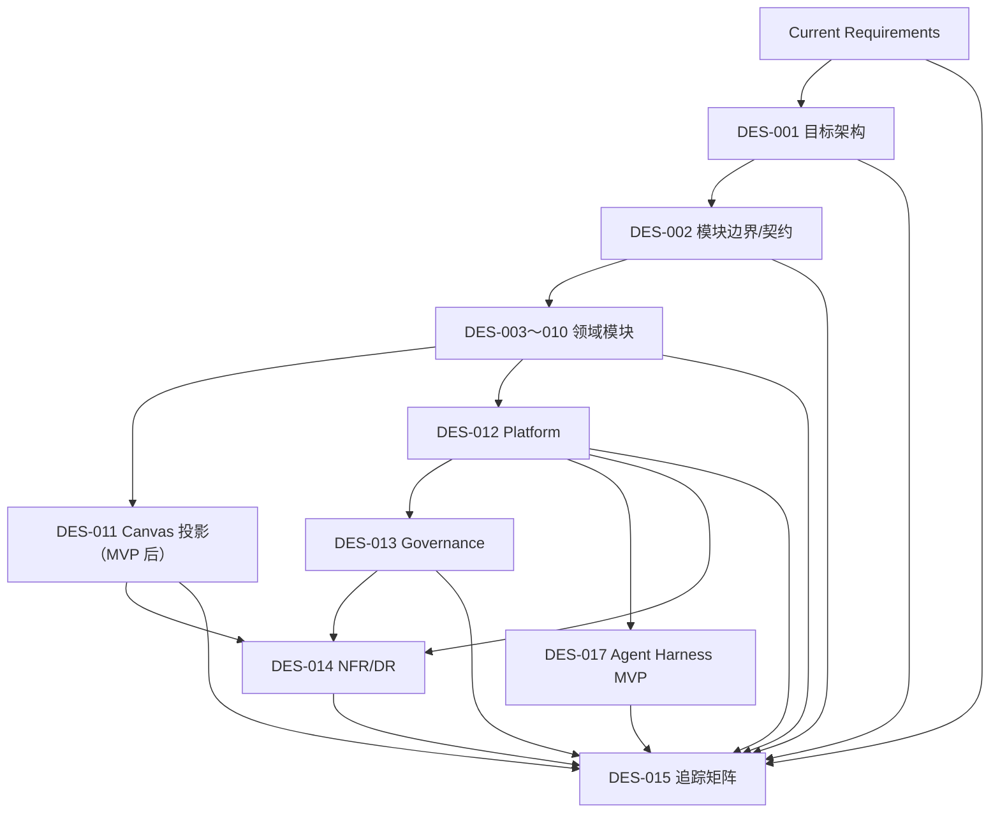

# AI 短剧制作平台 Design 索引

## 1. 当前事实范围

本目录是当前 Requirement 的技术/模块设计事实源，不是现有代码说明或历史技术债汇总。目标产品从剧本、叙事、资产、分镜、关键帧和视频候选到“每镜恰有一个显式主选，并导出有序原始视频素材包”为止。当前 MVP 优先完成不依赖画布的业务闭环和 Agent Harness。

当前明确排除：Timeline、剪辑、拼接、转码、成片、字幕/音频后期、发布投放、支付计费和商业运营。可视化画布是同一领域事实的 Read Model/Projection，不是第二业务引擎。

## 2. 阅读顺序

| 序号 | Design | 责任 |
| --- | --- | --- |
| 000 | [项目顶层结构与工程规范](./000-项目顶层结构与工程规范.md) | 目标仓库结构、依赖、契约、测试和交付门禁 |
| 001 | [目标技术架构与选型](./001-目标技术架构与选型.md) | Greenfield 架构、技术提案、选项权衡和 PoC Gate |
| 002 | [领域模块边界与跨模块契约](./002-领域模块边界与跨模块契约.md) | 事实所有者、Command/Query/Event、Outbox/Inbox、stale 和批量失败 |
| 003 | [身份、Workspace 与权限](./003-身份Workspace与权限设计.md) | UserAccount/Session/Membership、强隔离、action policy 和 ServiceGrant |
| 004 | [项目与剧集工作台](./004-项目与剧集工作台设计.md) | Project/Episode、顺序、概览、blocker 和 next action |
| 005 | [剧本与叙事版本](./005-剧本与叙事版本设计.md) | 原稿、分集、ScriptVersion、NarrativeUnit、AI 候选和生产处置 |
| 006 | [资产候选与选择](./006-资产候选与选择设计.md) | 角色/场景/道具、状态/版本、图片候选、就绪和影响 |
| 007 | [分镜基线与叙事覆盖](./007-分镜基线与叙事覆盖设计.md) | Shot/Spec/Order、拆合守恒、Coverage 和 StoryboardBaseline |
| 008 | [关键帧与视觉参考](./008-关键帧与视觉参考设计.md) | Slot/Brief、图片 Candidate/Selection、VisualReferenceRevision |
| 009 | [视频生成候选与主选](./009-视频生成候选与主选设计.md) | 固定生成请求、原始视频 Candidate、唯一主选与重新确认 |
| 010 | [镜头检查、快照与素材包导出](./010-镜头检查快照与素材包导出设计.md) | 逐镜检查、complete/partial、ExportSnapshot、ZIP64 原始素材包 |
| 011 | [可视化制作画布与工作流投影](./011-可视化制作画布与工作流投影设计.md) | CanvasLayout、DomainNode/Edge、独立图层、SSE 恢复、列表等价和 Agent Proposal |
| 012 | [平台 Capability、Provider、耐久任务与媒体](./012-平台Capability与Provider耐久任务及媒体设计.md) | Capability Catalog、Adapter、WorkTask/Attempt、unknown、私有媒体、血缘和消耗 |
| 013 | [安全、隐私、权利与内容治理](./013-安全隐私权利与内容治理设计.md) | 数据分类、权利/内容/Provider 准入、AIGC、审计、保留/删除和安全事件 |
| 014 | [NFR、SLO、容量、观测、备份与灾备](./014-非功能服务目标容量观测备份与灾备设计.md) | 统一 SLI/SLO、容量口径、部署、OTel、降级、RPO/RTO 和恢复演练 |
| 015 | [Requirement → Design 追踪矩阵](./015-Requirement到Design追踪矩阵.md) | FR/NFR/AC、不变式和开放 Gate 的双向追踪 |
| 017 | [Agent Harness 与 MVP 业务闭环](./017-Agent Harness与MVP业务闭环设计.md) | 不依赖画布的 Skill 执行、剧本解析和候选审核闭环 |

已归档的已实施设计：[DES-016 跨页面 BasicLayout 与壳层布局](../archive/design/016-跨页面BasicLayout与壳层布局设计.md)。

## 3. 关键依赖

箭头不表示代码必须拆服务。DES-003～013 是模块化单体中的逻辑边界；长任务 Worker 与 API 进程隔离，但复用同一 TypeScript 领域契约。

## 4. 技术提案状态

| 提案 | 当前状态 | 接受前证据 |
| --- | --- | --- |
| TypeScript + React/Next.js | proposed | 构建/E2E/无障碍/Canvas 渲染 PoC |
| TypeScript 模块化单体 API | proposed | NestJS/Fastify 在 OpenAPI、SSE、模块边界和性能 ADR 中选择 |
| 独立 TypeScript Worker | proposed | 真 Provider/媒体/导出故障闭环；只有真实算法/SDK 证明必需才增 Python Worker |
| PostgreSQL | proposed 优先 | 事务/唯一约束/Outbox/Inbox/并发/PITR 验证 |
| Temporal 优先 | proposed | 与 PostgreSQL Queue 执行同一故障 PoC 后 ADR |
| 私有托管 S3 兼容存储 | proposed | 地域、权限、版本、生命周期、Range、20 GiB、备份/恢复 PoC |
| REST/OpenAPI + SSE/轮询降级 | proposed | 契约漂移、断线/游标缺口、代理和多实例 PoC |
| Redis | 非默认；可选 | 只能用于限流/缓存/SSE fan-out，不是事实源；证明必需后才引入 |
| OpenTelemetry | proposed | 全链关联、低基数标签和敏感 canary 为 0 |

## 5. 证据使用边界

GitHub/公开项目仅用于证明可行模式、发现风险和构造 PoC，不是技术选型或需求事实源。特别是 [waoowaoo 固定提交](https://github.com/waooAI/waoowaoo/tree/ce8edebf7cd2fe32c37a8d628aa3edc67f544586) 的根 LICENSE 是 CC BY-NC-SA 4.0 人类可读摘要并含 NonCommercial；本项目只参考“可视化制作信息”交互模式，不复制其代码、UI、资产、领域结构或技术 DAG。

## 6. 文档治理

- 编号是当前阅读顺序，每个编号只有一份 Design；不并存另一份“总核心模块设计”制造双事实源。
- 需求变更时先更新 Requirement，再更新对应 Design 和 DES-015；不在 Plan/代码中隐式改范围。
- 技术决策只在 PoC 证据完整后通过 ADR 从 proposed 转 accepted。
- 历史技术债、旧实现说明、剪辑/成片/商业运营设计不进入当前 Design 序列。
