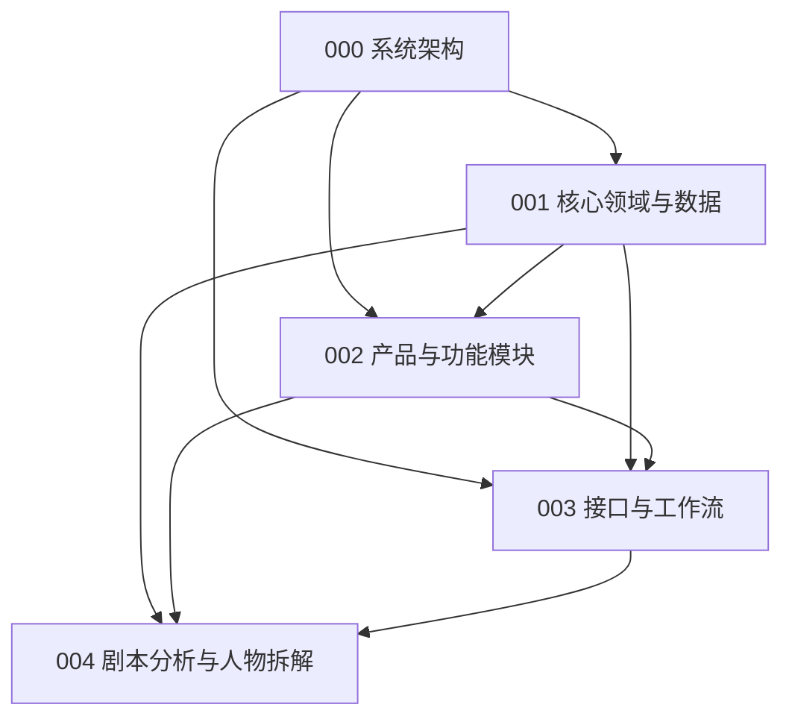

# AI 视频生产平台 Design 索引

- 状态：active
- 基线日期：2026-08-20
- 当前设计生命周期：proposed

## 1. 当前设计顺序

正式 Design 从 000 重新编号，并按“架构 → 领域与数据 → 产品模块 → 接口工作流 → 模块详细设计”评审。

| 序号 | Design | 责任 | 状态 |
| --- | --- | --- | --- |
| 000 | [AI 视频生产平台目标系统架构设计](./000-AI视频生产平台目标系统架构设计.md) | Python 主栈、多进程角色、可靠执行、数据与媒体、Go Gate、部署和恢复 | proposed |
| 001 | [AI 视频生产平台核心领域与数据模型设计](./001-AI视频生产平台核心领域与数据模型设计.md) | 聚合、事实所有权、数据关系、约束、版本、投影和迁移 | proposed |
| 002 | [AI 视频生产平台目标产品与功能模块设计](./002-AI视频生产平台目标产品与功能模块设计.md) | 产品边界、用户流程、M01—M15、状态、失败路径、权限和验收切片 | proposed |
| 003 | [AI 视频生产平台接口、工作流与功能实现设计](./003-AI视频生产平台接口工作流与功能实现设计.md) | HTTP/事件契约、耐久流程、Agent、媒体、失败恢复和纵向切片 | proposed |
| 004 | [AI 视频生产平台剧本基础分析与人物拆解详细设计](./004-AI视频生产平台剧本基础分析与人物拆解详细设计.md) | M03 全部及 M04 人物子域的结构、身份、资料、状态、关系、弧光、证据和迁移；地点/道具详细设计待续 | proposed |

004 起为模块详细设计，按依赖与实施优先级增加，不按模块编号预建空文件。逻辑模块不等于微服务数量。

## 2. 依赖关系

000 决定运行和技术边界；001 决定事实所有权与不可合并对象；002 决定系统包含什么模块和用户结果；003 统一跨模块接口与运行语义；004 细化首个核心智能闭环。

## 3. 当前关键决策

- 后端当前采用 Python 单栈、多进程角色；FastAPI 与 Python 应用层拥有唯一业务实现。
- Agent、Provider 和媒体任务在独立 Python Worker 运行；API 不执行长任务。
- LangGraph 只编排单次 Agent 运行，不成为审批、人物资料或生产流程事实源。
- PostgreSQL 事实与事务 Outbox 先提交，再执行队列、外部模型和媒体副作用。
- 首期不引入 Go；只有 000 中的容量与剖析 Gate 满足后才进行 Go PoC。
- 商业计费、订阅、支付和增长不属于系统范围；用量只服务资源治理。

## 4. 事实源规则

- 000 是技术架构事实源；
- 001 是对象所有权、版本与数据约束事实源；
- 002 是目标产品边界与模块责任事实源；
- 003 是接口、事件、耐久流程和实施切片事实源；
- 004 及后续详细 Design 是对应模块的实现事实源；
- [Requirement](../requirement/README.md) 定义用户结果和验收，Design 不得反向扩大范围；
- 多份文档冲突时不得任选一份实现，应先按上述所有权修正事实源和所有下游引用。

## 5. 历史设计

旧 DES-000—017 已移动到 [v1 Design 归档](../archive/v1/design/README.md)。它们保留历史编号，但不再与当前 000—004 并列，也不参与当前实现和验收。

## 6. 文档治理

- 当前编号只表达推荐阅读顺序，每个编号只有一份正式 Design；
- 模块详细设计必须回链稳定 Requirement ID 和上游 Design；
- 技术提案只有在 ADR/PoC 和相应故障验证完成后才能从 `proposed` 进入 `accepted`；
- 设计变化先更新事实所有者，再更新接口、数据、计划和验收；
- 不为未来可能出现的服务、兼容层、目录或工作流提前创建空设计。
