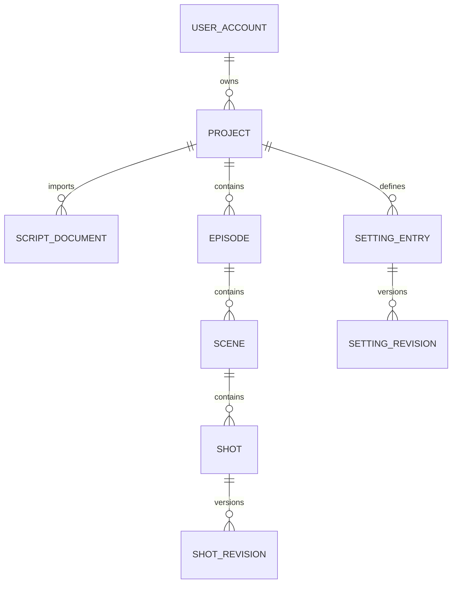
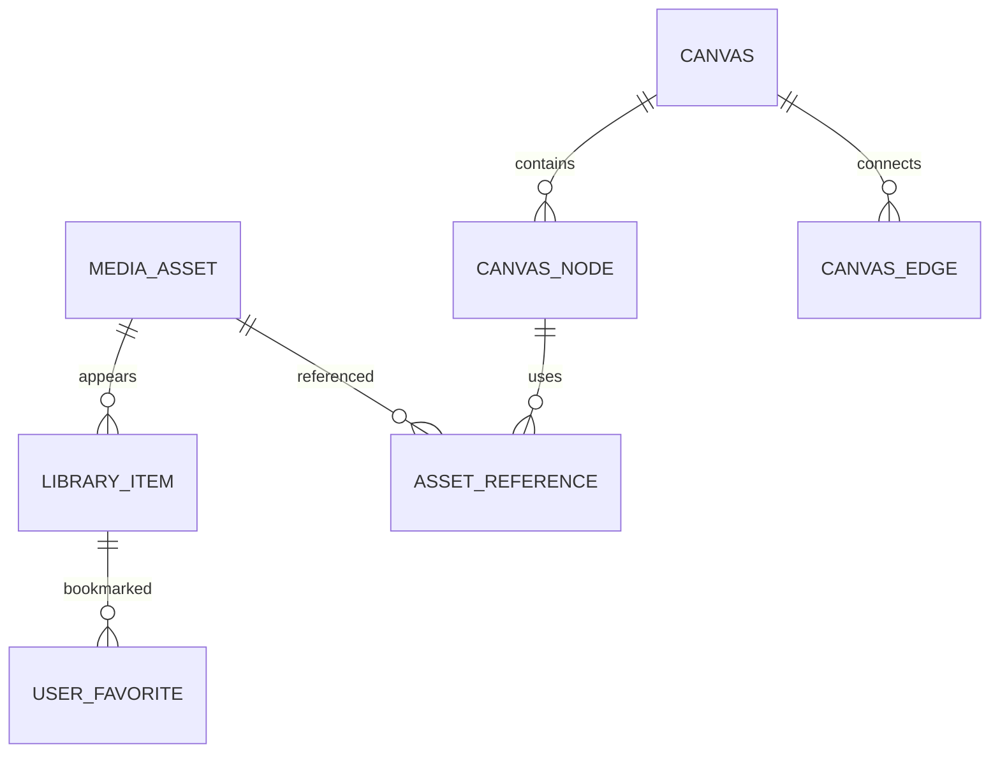
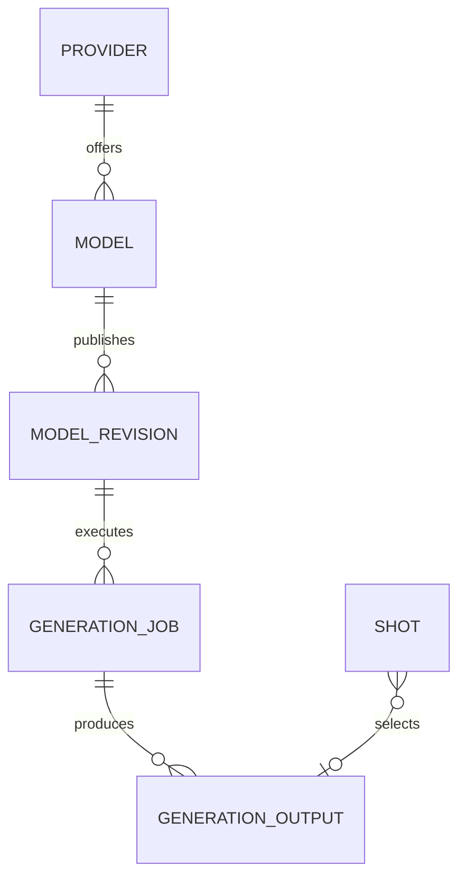

# 浮光页面驱动的数据设计

本设计只由[新页面字段与动作](../requirement/浮光页面/index.md)推导。下面是新系统的完整逻辑模型，**不是对旧Schema的增量补丁**。旧表、旧接口、旧分页和旧工作流不决定新模型；本轮没有创建或删除任何实际数据库对象。

## 1. 设计边界与取舍

- 一个账号可以拥有多个项目；管理员负责账号/模型/凭据/审计/健康。管理员身份不自动授予读取任意私有剧本的权限。当前没有组织管理、成员邀请或共享编辑页面，不预建组织/RBAC平台。
- 名称、正式输入、版本、文件归属、收藏、选定和个人偏好需要持久化；搜索、选中项、播放进度、弹窗和拖动中间帧不需要。
- 卡片计数、引用次数、完成率、成功率、耗时分位数与健康状态是查询结果，先不建汇总表。
- 二进制保存在受控对象存储，关系库保存元数据和引用；画布只存布局、类型明确的局部内容及业务引用。
- PostgreSQL逻辑类型用于表述约束，不由此批准新中间件或微服务。新增物理Schema、SQL与迁移需在设计接受后的实施阶段处理。

## 2. 关系总览

项目内容与版本：

素材归属与画布：

模型、任务与正式选定：

图省略审计和短期项目任务等辅助关联；下表是字段与约束的完整设计入口。所有逻辑表名均是提案，不宣称当前数据库已有。

## 3. 通用字段与约束

- 独立对象 `id uuid PK`、`created_at/updated_at timestamptz`；不可变版本/事件只需要created_at。时间存UTC，展示时区显式返回。
- 可编辑头记录 `revision bigint NOT NULL DEFAULT 1`，更新带expected_revision并原子递增。版本记录只能追加，不静默改写历史。
- 下面未标“可空”的字段必填；派生字段不落库。UUID不能替代授权，所有项目对象以project所属权与引用范围检查。
- 名称/说明/参数的长度限制由页面和明确请求上限定义，不继承旧库宽度。已明确：项目名最多50字、显示名最多32字。其他上限为待评审配置，不能把mock文本长度当限制。
- 不强行给每张表加org_id/project_id。账号、供应商、模型是全局配置；项目内容才带project_id；个人素材以owner_user_id确定权限。

## 4. 账号、会话与个人偏好

| 逻辑表       | 关键列与类型                                                                                                                                                                                                                                                   | 约束 / 索引 / 生命周期                                                                                                                               | 页面消费者                                       |
| ------------ | -------------------------------------------------------------------------------------------------------------------------------------------------------------------------------------------------------------------------------------------------------------- | ---------------------------------------------------------------------------------------------------------------------------------------------------- | ------------------------------------------------ |
| user_account | login_name text；display_name varchar(32)；password_hash text；role text；enabled bool；force_change_password bool；failed_login_count int；locked_until/last_login_at timestamptz可空；avatar_asset_id uuid可空；theme text；default_prompt_suffix text默认空 | login_name规范化后唯一且创建后不可改；role=admin/creator，注册只能creator；账号停用不删除；theme=light/dark/system；头像FK media_asset且当前用户可用 | 登录、注册、改密、账号设置、管理账号、审计显示名 |
| user_session | user_id uuid FK；token_hash text唯一；device_label text；created_at/last_seen_at/expires_at timestamptz；revoked_at timestamptz可空；restricted bool                                                                                                           | 索引(user_id,revoked_at,last_seen_at)；只存高熵令牌hash，Cookie HttpOnly/Secure；空闲12h、绝对7d由当前页面文案定义；单设备退出可立即撤销             | 登录与设备列表                                   |

个人主题和提示词直接放账号，不借用旧的工作区/模型级偏好，也不创建通用配置平台。未勾选保持登录使用浏览器会话Cookie；服务端到期限制仍生效。声明密码规则由当前UI确定：至少10位、字母+数字、确认一致；密码上限与hash算法参数在实现评审时确定，不在文档编造已实现安全结果。

## 5. 项目、剧本与镜头

| 逻辑表          | 关键列与类型                                                                                                                                                                                                 | 约束 / 索引 / 生命周期                                                                                                                                                          | 页面消费者                     |
| --------------- | ------------------------------------------------------------------------------------------------------------------------------------------------------------------------------------------------------------ | ------------------------------------------------------------------------------------------------------------------------------------------------------------------------------- | ------------------------------ |
| project         | owner_user_id FK；name varchar(50)；aspect_ratio text；style text；cover_asset_id uuid可空；revision                                                                                                         | ratio=9:16/16:9/1:1；style=realistic/anime/guofeng/film；索引(owner_user_id,updated_at,id)；新项目可以无剧本                                                                    | 首页、所有项目上下文           |
| script_document | project_id FK；source_asset_id FK；filename text；format text；parsed_text text可空；parse_status text；error_code text可空                                                                                  | 保存原文件与解析结果；txt/md/docx是当前明确格式；pdf是accept与文案不一致的待定项；索引(project_id,created_at,id)                                                                | 首页导入、场/台词来源          |
| episode         | project_id FK；position int；title text；source_document_id FK可空；source_span jsonb可空                                                                                                                    | unique(project_id,position)；原文范围只描述已解析来源；不建立旧剧本多工作台结构                                                                                                 | 分镜页头、分析分集、画布上下文 |
| scene           | episode_id FK；position int；name text；source_span jsonb可空                                                                                                                                                | unique(episode_id,position)；集/场属于同一项目                                                                                                                                  | 分镜与镜头定位                 |
| shot            | project_id FK；scene_id FK；position int；current_revision_id uuid；selected_frame_output_id/selected_video_output_id uuid可空；revision                                                                     | 场内position唯一；当前版本必须属于该shot；选定必须属于同一项目/镜头；(project_id,scene_id,position,id)索引                                                                      | 镜头、故事板、画布、分析       |
| shot_revision   | shot_id FK；version_no int；description text；shot_size/camera_move/mode text；duration_ms int；model_revision_id uuid可空；params jsonb；references jsonb；dialogues jsonb；change_note text；created_by FK | unique(shot_id,version_no)；版本不可变；duration_ms>0；模型可在草稿中为空，执行前必需；JSON闭集见下文                                                                           | 镜头编辑、历史、台词播放       |
| project_job     | project_id FK；kind text；status text；request_key uuid；input_hash text；source_id/target_project_id uuid可空；progress int；error_code text可空                                                            | 仅import_script/extract_settings/copy_project三种当前需求；unique(project_id,request_key)；相同键异输入409；状态queued/running/succeeded/failed；复制发布前不可展示为可编辑完成 | 首页导入与复制的必要后台工作   |

镜头JSON：`params`由选定模型版本约束；`references[]`只含明确类型的setting/shot引用及冻结版本；引用已选产物时还冻结selected_output_id；实际媒体关系存在asset_reference。`dialogues[]`含稳定line_id、source_document_id及原文位置（可空）、speaker/text、voice/speed/emotion快照、audio_output_id（可空），用于当前只读播放。它不是任意metadata，不允许base64、凭据和签名URL。

数据上限提案：单次版本JSON≤64KiB，参考数量受模型限制；真实超限场景出现后再评审拆表，不预建独立台词/配音平台。镜头输入改变不覆盖已选视频，页面根据选定所用版本显示失效。

## 6. 设定集与引用

| 逻辑表           | 关键列与类型                                                                                                          | 约束 / 查询                                                                                                                                          | 页面消费者                          |
| ---------------- | --------------------------------------------------------------------------------------------------------------------- | ---------------------------------------------------------------------------------------------------------------------------------------------------- | ----------------------------------- |
| setting_entry    | project_id FK；kind text；current_revision_id uuid；locked_revision_id uuid可空；revision                             | kind=character/location/prop；名称搜索可投影当前版本；锁定指针属于本条目                                                                             | 设定列表与镜头参考                  |
| setting_revision | entry_id FK；version_no int；name text；aliases text[]；description text；looks jsonb；voice jsonb可空；created_by FK | unique(entry_id,version_no)；looks闭集含look_id/name/version_no/description/slot锁定信息；当前槽位四种用途；voice包括模型、音色、试听asset及真人声明 | 造型、参考定帧、音色、版本          |
| asset_reference  | asset_id FK；shot_revision_id/setting_revision_id/canvas_node_id uuid可空；slot_key text；position int                | 三个owner列恰好一个非空；每owner+slot+position唯一；索引(asset_id)；当前引用数只计当前/锁定版本或有效节点，历史引用另保留                            | 素材引用数/详情、参考预览、删除保护 |

真人声明按页面现有输入保存 `voice.declaration={source_asset_id,text,declared_by,declared_at}`。素材变更后旧声明不自动覆盖新声音；未声明真实来源不得提交生成。该记录表达用户声明，不冒充人工审核或法律结论；当前没有材料审批/续期/授权交易界面，不预建这些模型。

选定替换后的“下游失效”是当前镜头页明确需求。最小实现通过镜头/设定冻结的引用版本及selected_output_id与当前指针比较得到：同项目有界查询依赖引用，返回stale及原因；不自动重新生成。仅当实际量级证明直接比较不够时再引入专用依赖索引。

## 7. 素材与画布

| 逻辑表        | 关键列与类型                                                                                                                                                                                                            | 约束 / 索引 / 生命周期                                                                                                                                                        | 页面消费者                             |
| ------------- | ----------------------------------------------------------------------------------------------------------------------------------------------------------------------------------------------------------------------- | ----------------------------------------------------------------------------------------------------------------------------------------------------------------------------- | -------------------------------------- |
| media_asset   | owner_user_id FK；kind/mime_type text；object_key text可空；text_content text可空；byte_size bigint；width/height/duration_ms/text_length可空；sha256 text；origin text；status/moderation_status text；preview_key可空 | 二进制object_key与纯文本text_content按kind互斥；status=uploading/ready/failed；审核pending/approved/rejected/unknown；索引(owner_user_id,created_at,id)；浏览器不拿object_key | 所有媒体预览、头像、导入文件、生成产物 |
| asset_folder  | owner_user_id FK；project_id FK可空；name text                                                                                                                                                                          | 当前仅一层文件夹；scope内名称唯一；无通用目录/树引擎                                                                                                                          | 素材侧栏                               |
| library_item  | asset_id FK；owner_user_id FK；project_id/folder_id FK可空；title text；tags text[]；deleted_at timestamptz可空；revision                                                                                               | 同一asset在同一scope只有一项；文件夹scope一致；个人与项目归属通过独立条目表达；索引(owner_user_id,project_id,updated_at,id)                                                   | 卡片、加入项目、回收站动作             |
| user_favorite | user_id FK + library_item_id FK复合PK；created_at                                                                                                                                                                       | 收藏属于当前用户；删除收藏不删除素材                                                                                                                                          | 收藏列表与星标                         |
| canvas        | project_id FK；name text；viewport jsonb；revision                                                                                                                                                                      | 项目内画布摘要；viewport只包含x/y/zoom                                                                                                                                        | 无限画布                               |
| canvas_node   | canvas_id FK；kind text；x/y/width/height numeric；z_index int；parent_node_id可空；ref_kind/ref_id可空；config jsonb                                                                                                   | 容器同画布且不能成环；尺寸正数；业务节点只存ref，局部草稿用按kind验证的config                                                                                                 | 镜头表、参考、文本、媒体、生成面板     |
| canvas_edge   | canvas_id FK；source_node_id/target_node_id FK；source_port/target_port text；kind text                                                                                                                                 | 两端必须同画布；相同端口关系唯一；删除节点同事务清关系                                                                                                                        | 画布连线                               |

素材主列表按页面**每页40项**返回，详情与预览单取。回收仅修改library_item，不能删除仍被引用的asset；当前没有永久清理界面，不加入自动清空方案。缩略图、时长、尺寸由真实媒体探测得到，不能按文件名造值。目录/收藏/引用计数查询计算。

## 8. 模型、执行与审计

| 逻辑表            | 关键列与类型                                                                                                                                                                                                                                                                                                   | 约束 / 生命周期                                                                                                                                                                 | 页面消费者                         |
| ----------------- | -------------------------------------------------------------------------------------------------------------------------------------------------------------------------------------------------------------------------------------------------------------------------------------------------------------- | ------------------------------------------------------------------------------------------------------------------------------------------------------------------------------- | ---------------------------------- |
| provider          | key text唯一；name text；capabilities text[]；region text；credential_ciphertext text可空；credential_hint text可空；group_id_ciphertext可空；last_test_at/result/error_code可空；updated_by FK；revision                                                                                                      | 只有管理员读安全摘要；新密钥测试成功才CAS替换；明文不落普通日志、回执或浏览器缓存                                                                                               | 供应商凭据、模型列表、健康         |
| model             | provider_id FK；key text；name text；capability text；enabled bool；draft_revision_id/published_revision_id uuid可空；revision                                                                                                                                                                                 | unique(provider_id,key)；启停只影响新任务；无须创建动态能力目录平台                                                                                                             | 模型注册表、生成模型选择           |
| model_revision    | model_id FK；version_no int；modes text[]；param_schema/defaults/limits jsonb；change_note text；created_by FK                                                                                                                                                                                                 | unique(model_id,version_no)；所有版本不可变，保存草稿追加版本，发布仅更新头指针；JSON为明确参数schema                                                                           | 默认参数、JSON、差异与历史任务     |
| generation_job    | project_id/created_by FK；shot_revision_id/canvas_node_id/setting_revision_id可空；purpose text；model_revision_id FK；input_snapshot jsonb；request_key uuid；input_hash text；status/stage text；provider_request_id可空；started_at/finished_at可空；error_code可空；estimated_cost/actual_cost numeric可空 | target恰好一个，助手建议允许canvas上下文；unique(created_by,request_key)；queued/running/succeeded/failed/unknown/manual；冻结输入不可改；索引(project_id,status,created_at,id) | 生成、待处理、统计、健康           |
| generation_output | job_id FK；ordinal int；asset_id FK可空；text_result text可空；status text                                                                                                                                                                                                                                     | unique(job_id,ordinal)；媒体与文字结果至少一个且按purpose校验；候选存在不代表正式选定                                                                                           | 镜头候选、设定定帧、画布、助手建议 |
| audit_event       | actor_id FK可空；project_id FK可空；action/object_type text；object_id uuid可空；result text；before/after jsonb可空；object_revision bigint可空；request_id uuid；occurred_at timestamptz                                                                                                                     | 只追加；秘密字段在写入前剔除；索引(occurred_at,id)、(project_id,occurred_at,id)、(actor_id,occurred_at,id)                                                                      | 审计表格、详情、CSV                |

“预计/实际费用”是防止真实收费被mock掩盖的执行记录，不引入钱包、套餐、账本平台或价格管理产品。接真实付费供应商前需要可解释费用确认；不清楚费用时不能自动执行。当前新页面未规定结算后台，本阶段不展开旧财务架构。

## 9. 关系完整性与索引补充

- shot/setting_entry的当前与锁定版本采用“头ID+版本ID”复合一致性约束，防止跨对象指针。创建时预分配头/版本UUID并在同一事务提交；循环FK可延迟至提交校验，不能先发布无版本头。
- 同项目规则同时覆盖scene→episode→project、shot→scene、引用owner→asset可访问范围。FK证明存在，授权仍由服务端用例核验，不能只信客户端project_id。
- 文件夹唯一性分两条：个人(owner_user_id,name)且project_id为空；项目(project_id,name)且project_id非空。library_item同理分别对(owner_user_id,asset_id)与(project_id,asset_id)建部分唯一索引，明确SQL NULL语义。
- asset_reference的三个owner列使用恰好一个非空检查约束；按各owner建立独立的slot/position唯一索引和查询索引，不使用无FK的任意owner字典。
- 金额/字节/时长非负，几何尺寸为正；只有相应kind允许为空的尺寸/时长列才能为空。model.provider_id创建后固定，改供应商视为另一个模型，防止历史归属漂移。
- 常用时间列表以(updated_at,id)或(occurred_at,id)稳定排序；具体索引以过滤条件与执行计划验证，不提前为所有列建索引。

## 10. 事务与失败路径

| 命令            | 一次事务保证                                 | 事务外工作 / 失败恢复                                         |
| --------------- | -------------------------------------------- | ------------------------------------------------------------- |
| 注册 / 管理建号 | 唯一账号、角色、初始状态、审计一致           | 响应丢失不能重复造用户；同登录名冲突返回字段错误              |
| 改密 / 停用     | 更新账号并撤销指定会话                       | 不把仅关闭前端页面当撤销                                      |
| 保存镜头 / 设定 | 插入版本、保存引用、CAS当前头、审计          | 冲突返回最新revision；失败不半保存                            |
| 选定            | 核同项目/目标/媒体就绪与审核，更新指针和审计 | 下游用版本比较标失效；不能自动生成                            |
| 批量改时长      | 先校验全部，按ID顺序锁并原子更新             | 冲突返回ID列表，无静默部分成功                                |
| 提交生成        | 唯一request_key、冻结输入与待执行记录        | Worker认领；未知先查provider_request_id，不自动付费重试       |
| 先测后换凭据    | 测试成功后CAS替换ciphertext与测试摘要        | 测试在事务外；失败/超时保留旧凭据；revision变化409重试确认    |
| 媒体 / 项目复制 | 元数据与引用发布一致                         | 真实文件准备成功后发布ready；中断任务可查询；不删除用户源数据 |

## 11. 暂不创建的结构

不创建旧独立工作台页面带来的深度、导演台、时间轴、素材包、全局任务中心、通用通知、通用依赖传播、组织邀请、支付套餐和完整Agent对话平台。它们没有当前设计消费者。新画布已有的导出和助手建议需求仍需承载，不能以“精简”名义删除可见功能。

旧代码与数据库只在**另行安排迁移时**评估保留数据、在途任务与切换风险。实现新设计不要求兼容旧DTO/枚举/路由；迁移策略也不得反向删改本设计需求。
