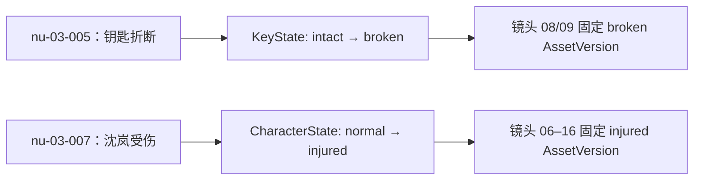

# MVP-A 合成黄金候选：《雾港倒计时》

- 状态：`product_accepted`（2026-08-14，产品负责人兼短剧制作人/QA 已接受当前黄金样本与 oracle）
- 日期：2026-08-13
- 用途：整剧导入、分集边界、叙事单元、资产状态、分镜多对多覆盖与 `@图片N` 引用契约
- 可直接上传的 UTF-8 原稿：[002-雾港倒计时整剧导入样例.txt](./002-雾港倒计时整剧导入样例.txt)
- 机器数据：[golden_candidate_harbor_countdown.json](../../../backend/tests/fixtures/mvp_a/golden_candidate_harbor_countdown.json)
- 契约测试：[test_mvp_a_golden_candidate_contract.py](../../../backend/tests/contract/test_mvp_a_golden_candidate_contract.py)

## 1. 结论和使用边界

这是一部为 Lanverse MVP-A 原创的 5 集合成短剧候选，不是用户参考稿的翻译、改编或节选。用户已明确允许把 mock 数据作为工程材料放入 `docs/`；参考 DOCX 只用于提取集标记、场标题、动作/对白交替和集尾钩子等结构特征，原文件、文件名、正文和本地路径均不进入仓库。

`002-雾港倒计时整剧导入样例.txt` 是当前整剧导入页面和 API 的人工联调输入，只包含下方五集原创原稿；文件采用 UTF-8、无 BOM，并保留一个常规文件末尾换行。正文（去除该末尾换行后）必须与机器 fixture 的 `full_script` 完全一致，防止文档样例和自动化 oracle 漂移。

本候选已经足以固定以下工程契约：

1. 5 集 UTF-8 原稿及 full-script half-open Unicode code-point 边界；
2. 选定第 3 集 20 个 NarrativeUnit，其中 19 个必拍、1 个批准省略；
3. 16 个 9:16 镜头、总时长 92 秒，单镜 4–8 秒；
4. NarrativeUnit 与 Shot 的一对多、多对一和整体多对多关系；
5. 角色、地点和道具的状态迁移，以及镜头固定 AssetVersion；
6. `@图片N` 与镜头内有序 `asset_refs[N-1]` 的严格对应；
7. 拆镜/合镜覆盖守恒、批准省略和创作性镜头豁免。

fixture 本身不能自动证明 AI 分集、改写或分镜质量，`G-MVPA-002` 也只在“可执行 fixture/oracle”意义上关闭。DEV-MVPA-10～12 完成真实 Provider 合同、覆盖和联合分镜包验收后，用户于 2026-08-14 以产品负责人兼短剧制作人/QA 身份明确作出 `accepted` 决定；该人工签字现与工程 Gate 分开记录。生产 parser 仍必须受独立 Red、migration 和公开 API 契约约束，AI 结果仍不得自动发布。

## 2. 参考稿只读取证

### 2.1 可验证事实

对用户提供的本地英文 DOCX 做了只读结构提取和 86 页逐页缩略图检查，未把生成 PDF/PNG 或原文写入仓库：

| 项目 | 结果 |
| --- | ---: |
| 明确集标记 | `EPISODE 1` 到 `EPISODE 60`，连续 60 集 |
| 页面数 | 86 页 |
| 非空段落 | 2,177 |
| 文本字符数 | 135,743 |
| 表格/评论 | 0 / 0 |
| 平均场标题 | 2.15 个/集，范围 1–6 |
| 平均英文词数 | 约 376 词/集 |
| 主要结构 | 集标记 → `INT./EXT.` 场标题 → 动作/对白 → 集尾钩子 |

### 2.2 对 MVP 的取舍

- 保留：独占一行且连续的集标记、场标题、动作/对白交替、状态递进和集尾钩子。
- 不照搬：原稿平均篇幅偏长，不能直接当作 60–120 秒验收样本；本候选按 92 秒、16 镜重新建立原创内容。
- 不推断：页面数不等于集数，段落也不等于镜头；剧本到分镜必须通过稳定 NarrativeUnit 和多对多引用表达。
- 内容评审：产品负责人兼短剧制作人/QA 已接受当前对白、节奏、表演可行性与必拍判断；后续改稿会形成新版本并重新触发评审，不能继承本次签字。

## 3. 故事与分集边界

### 3.1 故事概要

安全工程师沈岚在台风前夜发现雾港三号闸门的检修记录被人篡改。她与保安队长陈默在不断上涨的海水中手动开闸，并以原始日志、门禁备份和远程指令揭露航运主管罗擎。第五集完成当前事件，同时保留“四号闸门”作为可选后续钩子。

### 3.2 确定性分集 oracle

边界均是 `full_script[start:end]` 的 half-open Unicode code-point 范围；相邻集之间保留两个换行符，不把分隔符静默塞进正文。

| Episode | 标题 | 目标时长 | `full_script` 范围 | 长度 |
| --- | --- | ---: | --- | ---: |
| `ep-01` | 警报前夜 | 78s | `[0, 232)` | 232 |
| `ep-02` | 被删掉的检修记录 | 84s | `[234, 468)` | 234 |
| `ep-03` | 九十秒手动开闸 | 92s | `[470, 853)` | 383 |
| `ep-04` | 替罪签名 | 80s | `[855, 1078)` | 223 |
| `ep-05` | 公开日志 | 86s | `[1080, 1346)` | 266 |

### 3.3 五集原稿

#### 第一集《警报前夜》

```text
第一集
《警报前夜》
内景·雾港控制中心·傍晚
台风预警灯第一次闪红。安全工程师沈岚核对三号闸门的压力曲线，屏幕却显示“检修完成”。
沈岚：昨天还在漏压，谁签的完成？
值班员避开她的目光，把一个沾着机油的工具箱推到桌下。
内景·旧泵站检修廊·傍晚
沈岚打开工具箱，里面有一把铜制检修钥匙和一支黑色录音笔。
录音笔：零点前，别让三号闸门合上。
保安队长陈默从暗处走出。
陈默：你不该一个人来这里。
沈岚把录音笔藏进口袋。身后的备用泵突然自行启动，压力表指针冲进红区。
```

#### 第二集《被删掉的检修记录》

```text
第二集
《被删掉的检修记录》
内景·雾港控制中心·夜
航运主管罗擎把一份电子日志投到大屏，最后签名赫然是“沈岚”。
罗擎：系统不会说谎，是你批准停用备用泵。
沈岚：我的工号昨晚被冻结，这个签名是补写的。
陈默调出门禁记录，检修廊的九分钟影像被整段删除。
内景·旧泵站检修廊·夜
两人沿被割断的光缆追到三号闸门。防火门忽然落锁，海水从门缝漫入。
黑色录音笔被水打湿，断续播放：用她的工号覆盖原记录……
沈岚：有人要让整座港区替他灭口。
灯光熄灭。门外传来再次上锁的声音。
```

#### 第三集《九十秒手动开闸》

```text
第三集
《九十秒手动开闸》
内景·雾港旧泵站·夜
应急灯闪烁，海水没过脚踝，墙上倒计时只剩九十秒。
陈默：备用泵不响应，出口也被锁了。
沈岚：不是泵坏了，是总闸被远程锁死。
沈岚把铜制检修钥匙插进手动井，钥匙在锁芯里折断。
陈默：没时间换锁。
一股水浪撞开铁门，沈岚被掀向护栏，额角立刻渗血。
沈岚：把断钥匙给我，铜片能短接检修触点。
她拆下断钥匙的握柄，将裸露铜片压上两枚触点。
陈默转动生锈转盘，屏幕亮起“手动授权”。
系统播报：维护井盖将在三十秒后封闭。
沈岚：你继续转，我爬上去拉机械锁。
陈默咬牙转盘；沈岚带伤爬上维护梯。
三枚插销依次弹开，闸门却只抬起一掌宽。
陈默：还差半圈！
沈岚：别停！
海水轰然压来，两人同时扳下最后一道拉杆，三号闸门终于升起。
墙上的旧安全海报被水卷起一角。
监控屏突然出现新的远程闭锁指令，签发人是罗擎。
沈岚：他在控制中心。
```

#### 第四集《替罪签名》

```text
第四集
《替罪签名》
内景·雾港控制中心·深夜
三号闸门恢复，罗擎却向全港广播“沈岚违规操作导致险情”。
罗擎：她破坏检修锁，还伪造录音逃避责任。
浑身湿透的沈岚走进控制室，把折断的检修钥匙放到桌上。
沈岚：这把钥匙只登记给主管办公室，断口里还有你保险柜的蓝漆。
罗擎下意识看向自己的保险柜。陈默捕捉到这一眼。
技术员从进水的录音笔中取出存储芯片，恢复出被删日志的校验码。
陈默：补写签名的人就在这里。
罗擎按下总控台的清除键。所有屏幕同时变黑。
```

#### 第五集《公开日志》

```text
第五集
《公开日志》
内景·雾港控制中心·深夜
黑屏中，沈岚把个人终端接上备用线路，原始检修日志投到港区所有公告屏。
录音笔：用她的工号覆盖记录，零点后关闭三号闸门。
人群哗然。罗擎转身冲向出口，被陈默拦住。
罗擎：一段录音证明不了什么。
沈岚：所以我公开了日志哈希、门禁备份和你的远程指令，任何人都能核验。
监管员当场封存总控台，带走罗擎。
外景·雾港堤岸·黎明
潮水退去，三号闸门稳定开启。沈岚额角贴着纱布，重新挂起安全牌。
陈默递给她修复后的黑色录音笔。设备里多出一段未知录音：四号闸门，明晚。
沈岚望向远处仍在闪烁的警报灯。
```

## 4. 第三集 NarrativeUnit oracle

范围相对 `ep-03.source_text`，不是相对编辑器的 UTF-16 code unit，也不是 UTF-8 byte。稳定身份与顺序分离；将来改稿形成新的 NarrativeUnitVersion，不覆盖这些历史范围。

| NarrativeUnit | 类型 | 原文范围 | 覆盖决策 | 精确原文 |
| --- | --- | --- | --- | --- |
| `nu-03-001` | `scene_heading` | `[14, 24)` | 必拍 | 内景·雾港旧泵站·夜 |
| `nu-03-002` | `action` | `[25, 49)` | 必拍 | 应急灯闪烁，海水没过脚踝，墙上倒计时只剩九十秒。 |
| `nu-03-003` | `dialogue` | `[50, 67)` | 必拍 | 陈默：备用泵不响应，出口也被锁了。 |
| `nu-03-004` | `dialogue` | `[68, 86)` | 必拍 | 沈岚：不是泵坏了，是总闸被远程锁死。 |
| `nu-03-005` | `action` | `[87, 111)` | 必拍 | 沈岚把铜制检修钥匙插进手动井，钥匙在锁芯里折断。 |
| `nu-03-006` | `dialogue` | `[112, 121)` | 必拍 | 陈默：没时间换锁。 |
| `nu-03-007` | `action` | `[122, 146)` | 必拍 | 一股水浪撞开铁门，沈岚被掀向护栏，额角立刻渗血。 |
| `nu-03-008` | `dialogue` | `[147, 167)` | 必拍 | 沈岚：把断钥匙给我，铜片能短接检修触点。 |
| `nu-03-009` | `action` | `[168, 190)` | 必拍 | 她拆下断钥匙的握柄，将裸露铜片压上两枚触点。 |
| `nu-03-010` | `action` | `[191, 211)` | 必拍 | 陈默转动生锈转盘，屏幕亮起“手动授权”。 |
| `nu-03-011` | `narration` | `[212, 230)` | 必拍 | 系统播报：维护井盖将在三十秒后封闭。 |
| `nu-03-012` | `dialogue` | `[231, 248)` | 必拍 | 沈岚：你继续转，我爬上去拉机械锁。 |
| `nu-03-013` | `action` | `[249, 266)` | 必拍 | 陈默咬牙转盘；沈岚带伤爬上维护梯。 |
| `nu-03-014` | `action` | `[267, 286)` | 必拍 | 三枚插销依次弹开，闸门却只抬起一掌宽。 |
| `nu-03-015` | `dialogue` | `[287, 295)` | 必拍 | 陈默：还差半圈！ |
| `nu-03-016` | `dialogue` | `[296, 302)` | 必拍 | 沈岚：别停！ |
| `nu-03-017` | `action` | `[303, 332)` | 必拍 | 海水轰然压来，两人同时扳下最后一道拉杆，三号闸门终于升起。 |
| `nu-03-018` | `action` | `[333, 348)` | 批准省略 | 墙上的旧安全海报被水卷起一角。 |
| `nu-03-019` | `action` | `[349, 372)` | 必拍 | 监控屏突然出现新的远程闭锁指令，签发人是罗擎。 |
| `nu-03-020` | `dialogue` | `[373, 383)` | 必拍 | 沈岚：他在控制中心。 |

## 5. 资产圣经与剧情状态

`Asset` 是稳定身份，`AssetState` 表达剧情状态，`AssetVersion` 是镜头固定引用。名称、状态和媒体版本不能合并成一个可变字段。

| 资产 | 类型 | 状态 → 版本 | 出现范围/触发 |
| --- | --- | --- | --- |
| 沈岚 | 角色 | `normal` → `av-shen-lan-normal-001` | 第 1–3 集；第三集 `nu-03-001`～`006` |
| 沈岚 | 角色 | `injured` → `av-shen-lan-injured-001` | `nu-03-007` 受伤后到第 5 集 |
| 陈默 | 角色 | `on_duty` → `av-chen-mo-on-duty-001` | 第 1–5 集 |
| 罗擎 | 角色 | `supervisor` → `av-luo-qing-supervisor-001` | 第 2–5 集；第三集只以签发人信息出现 |
| 雾港旧泵站 | 地点 | `idle_evening` → `av-pump-station-idle-evening-001` | 第 1 集傍晚停机 |
| 雾港旧泵站 | 地点 | `flooded_night` → `av-pump-station-flooded-night-001` | 第 2–3 集夜间进水 |
| 雾港控制中心 | 地点 | `alert_night` → `av-control-center-alert-night-001` | 第 1、2、4、5 集 |
| 铜制检修钥匙 | 道具 | `intact` → `av-maintenance-key-intact-001` | 第 1 集出现；`nu-03-005` 开始折断 |
| 铜制检修钥匙 | 道具 | `broken` → `av-maintenance-key-broken-001` | `nu-03-008`～`009` 被改作短接铜片，第 4 集成为证据 |
| 黑色录音笔 | 道具 | `intact` / `water_damaged` / `restored` | 第 1 集完好，第 2/4 集进水，第 5 集修复 |

关键状态传播：



## 6. 第三集 16 镜分镜 oracle

总时长 92 秒。`NarrativeUnit` 与镜头不是逐段 1:1：同一叙事单元可以拆成多个镜头，多个相邻单元也可以合进一个镜头。每条镜头的 `@图片N` 必须和同镜头 `asset_refs` 的第 N 项严格一致；切换剧情状态只替换固定版本，不改变当前索引。

| 镜头 | 时长 | 景别/运动 | 叙事引用 | 画面意图 | 有序资产引用 |
| ---: | ---: | --- | --- | --- | --- |
| 01 | 4s | 大全景 / 缓推 | `001, 002` | 泵站、水位和九十秒倒计时同框 | `@图片1` 泵站进水；`@图片2` 沈岚常态；`@图片3` 陈默值勤 |
| 02 | 4s | 特写 / 快推 | `002` | 倒计时从九十跳到八十九 | `@图片1` 泵站进水 |
| 03 | 6s | 双人中景 / 手持 | `003, 004` | 失效报告与远程锁死判断合镜 | `@图片1` 沈岚常态；`@图片2` 陈默；`@图片3` 泵站 |
| 04 | 5s | 手部特写 / 下摇 | `005` | 钥匙插入并折断 | `@图片1` 沈岚常态；`@图片2` 完好钥匙；`@图片3` 泵站 |
| 05 | 6s | 中近景 / 后退 | `006, 007` | 对白后水浪撞门 | `@图片1` 沈岚常态；`@图片2` 陈默；`@图片3` 泵站 |
| 06 | 5s | 侧面中景 / 跟拍 | `007` | 沈岚撞上护栏并受伤 | `@图片1` 沈岚受伤；`@图片2` 泵站 |
| 07 | 4s | 面部特写 / 推近 | `007` | 伤口和水光同框 | `@图片1` 沈岚受伤 |
| 08 | 6s | 双人近景 / 越肩 | `008` | 提出断钥匙短接方案 | `@图片1` 沈岚受伤；`@图片2` 陈默；`@图片3` 断钥匙 |
| 09 | 6s | 微距 / 固定 | `009` | 铜片压上触点 | `@图片1` 断钥匙；`@图片2` 泵站 |
| 10 | 6s | 插入 / 横移 | `010, 011` | 转盘、授权和系统播报合镜 | `@图片1` 陈默；`@图片2` 泵站 |
| 11 | 5s | 双人中景 / 摇摄 | `012` | 分配双人动作 | `@图片1` 沈岚受伤；`@图片2` 陈默；`@图片3` 泵站 |
| 12 | 7s | 俯拍大全景 / 旋转 | `013` | 水面反光形成倒计时圆环 | 三个状态版本；绑定 `creative-shot-03-012` |
| 13 | 6s | 仰拍中景 / 上移 | `014` | 插销弹开、闸门受阻 | `@图片1` 沈岚受伤；`@图片2` 泵站 |
| 14 | 6s | 交叉特写 / 快切 | `015, 016` | 两句短对白合镜 | `@图片1` 沈岚受伤；`@图片2` 陈默 |
| 15 | 8s | 大全景 / 后拉 | `017` | 合力开闸并泄流 | `@图片1` 沈岚受伤；`@图片2` 陈默；`@图片3` 泵站 |
| 16 | 8s | 屏幕特写转双人近景 / 拉焦 | `019, 020` | 罗擎指令成为集尾钩子 | `@图片1` 沈岚受伤；`@图片2` 陈默；`@图片3` 泵站 |

机器 fixture 保存了每个 `@图片N` 对应的完整 `state_id` 和 `asset_version_id`，文档表只展示可读摘要，避免把名称当外键。

## 7. 覆盖、拆合和豁免判定

| 类型 | Oracle | 验收不变量 |
| --- | --- | --- |
| 一对多 | `nu-03-002 → shot-03-001/002` | 建立危机和倒计时特写都引用同一稳定叙事单元 |
| 多对一 | `nu-03-003/004 → shot-03-003` | 两句连续对白合镜，两个引用均保留 |
| 拆镜守恒 | `nu-03-007 → shot-03-005/006/007` | 三个子镜头引用并集仍包含受伤动作，不把对白/动作交给首镜后清空 |
| 合镜守恒 | `nu-03-015/016 → shot-03-014` | 合镜引用集合等于来源引用并集 |
| 批准省略 | `nu-03-018` | 只省略旧安全海报氛围，不影响因果、状态和集尾钩子 |
| 创作性镜头 | `shot-03-012` | 倒计时圆环是视觉化转场；有显式豁免，不新增剧情事实 |

CoverageReport 的候选判定：

- `required=19`，`covered=19`，`missing=0`；
- `optional=1`，`approved_omission=1`；
- 所有 16 镜至少引用一个 NarrativeUnit；
- 所有创作性镜头有明确 waiver；
- 任一 NarrativeUnitVersion、ShotSpecVersion 或 AssetVersion 改变后，旧报告必须 stale，不允许前端继续显示 ready。

## 8. 自动化验证与产品复核

契约测试固定以下失败路径：

1. 分集范围不能从原文精确切片、集号不连续或总拼接不守恒；
2. NarrativeUnit 范围漂移、顺序重复或 exact text 不匹配；
3. 镜头不足 12、超过 24、总时长不等于 92 秒；
4. 必拍单元缺覆盖、可省略单元没有批准决定；
5. `@图片N` 与 asset ref 数量、顺序或固定 AssetVersion 不一致；
6. 角色/地点/道具缺少指定状态迁移；
7. 创作性镜头没有匹配 waiver；
8. 把工程 Gate 关闭误写为制作人或 QA 已接受内容质量。

产品复核已接受当前 oracle，具体决定为：

- 接受 92 秒、16 镜的当前节奏；
- 接受省略 `nu-03-018` 的氛围动作；
- 保留镜头 12 的创作性转场；
- 接受沈岚与铜制检修钥匙的当前状态切换点；
- 接受镜头 04 的当前事件态引用，不增加 before/after 双版本；
- 接受当前对白与危险操作表达，不提出修改项。

产品决定：`accepted`；复核角色：产品负责人兼短剧制作人/QA；日期：2026-08-14；明确修改项：无。两个质量布尔值据此更新为 `true`，而不是由工程 G-MVPA-002 自动推导。未来任一剧本、叙事单元、资产状态或分镜 oracle 变化都必须形成新版本并重新复核。
