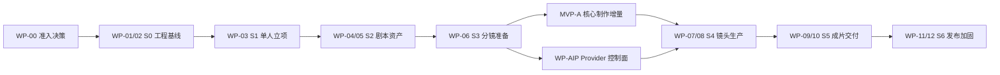

# PLAN-000 MVP 全栈实施总计划

- 状态：ready
- 日期：2026-07-27
- 最近审查：2026-08-13
- 输入：[PRD 索引](../prd/README.md)、[PRD-010 追踪矩阵](../prd/010-需求设计与产品任务追踪矩阵.md)、[DES-000 工程规范](../design/000-项目顶层结构与工程规范.md)、[DES-002 架构与技术选型](../design/002-人工智能短剧平台架构与技术选型.md)、[DES-MOD-001 模块总览](../design/模块设计/001-模块详细设计总览.md)
- 输出：S0–S6、AIP Provider 控制面与 MVP-A 核心制作增量的全栈工程任务、文件边界、Red 测试顺序、真实依赖验证和产品接受门禁
- 下游：当前工作包实现；完成后的 Acceptance 证据

## 1. 实施结论

本总 Plan 管理跨 PRD 的排序、技术基线和公共门禁；PLAN-001～PLAN-012 分别承接对应 PRD 的执行细节。全局以 S0–S6 纵向切片为历史主轴，并在已接受的 S3 与真实 S4 之间增加 [PLAN-012](./012-AI短剧MVP核心制作执行计划.md) 的 MVP-A 核心制作增量；AIP Provider 控制面仍是独立工作流。当前以 87 个 PT 为产品接受单元；既有切片使用本文 `DEV-Sx-xx`，AIP 使用 `DEV-AIP-*`，MVP-A 使用 `DEV-MVPA-*` 唯一工程单元。一个工程任务必须同时交付后端事实、OpenAPI/生成 client、需要的前端交互、失败恢复和自动化证据；不拆成“后端阶段”与“前端阶段”。

本 Plan 已具备可执行输入、任务、文件边界、验证命令和停止条件，文档状态为 `ready`。S0～S3 已通过真实实现和浏览器验收 accepted；D-003 已按“LangChain DeepSeek 1.1.0 + `deepseek-v4-pro` 非思考结构化输出”关闭，并在 2026-08-04 的真实联合契约中完成提取、人工修改/接受、结构确认和 current 切换。该链随后复用本机 MinIO、真实媒体探测、角色/声音/场景三类 ready 资产与真实 confirmed Scene/Dialogue，完成 Ready 分镜 1/1 和 ProductionSnapshot 90%，因此 `DEV-S2-06`、`DEV-S3-03` completed。2026-08-13 起，产品优先级调整为先完成 MVP-A 的整剧、改写、状态资产、分镜覆盖和分镜包；PLAN-012 仍需范围、黄金样本和 migration Gate，关闭前不改业务代码。S4 图片/视频继续受 D-004 约束，不与 MVP-A 偷换接受证据。

### 1.1 冻结的实施技术基线

| 领域 | 本 Plan 只允许的选型 |
| --- | --- |
| 后端 | Python 3.11.15 + PyCharm 标准 `.venv` + pip 26.1.2 + pip-tools 7.6.0；FastAPI/Uvicorn/Pydantic v2 |
| 数据 | 当前运行事实仍是 PostgreSQL 18.4 + SQLAlchemy 2 async + asyncpg + 空库 `metadata.create_all()`；MVP-A 新模型开始前必须按 PLAN-012 G-MVPA-003 接受 Alembic baseline/旧库演练并同步替换本行，未关闭时所有新增表任务 blocked |
| 异步与基础设施 | PostgreSQL Task/Attempt/Schedule/Fire + RabbitMQ/aio-pika；Redis cache-aside；MinIO，上线选定后才增 OSS adapter |
| 媒体 | FFmpeg/ffprobe 8.1.2；I/O 有界线程池与媒体子进程隔离 |
| AI 文本 | `langchain-deepseek==1.1.0` + DeepSeek `deepseek-v4-pro` 非思考结构化输出；不引入旧模型别名或 LangGraph |
| 前端 | Vercel 官方 create-next-app 16.2.12 基线；React 19 + TypeScript + Next.js App Router + Tailwind v4 + shadcn/ui + Radix UI；Redux Toolkit + RTK Query + axios |
| 契约与质量 | `@umijs/openapi` 1.13.15 生成 client；Ruff/Pyright/Pytest/Testcontainers/Vitest/Playwright；OpenTelemetry + JSON 日志 + Prometheus |
| 交付 | Docker 29.6.2 + Compose 5.3.1 + GitHub Actions；不引入 Kubernetes、微服务或第二任务系统 |

## 2. PRD 审查结果

| PRD | 已提取的工程输入 | Plan 落点 | 审查结论 |
| --- | --- | --- | --- |
| [PRD-001](../prd/001-MVP产品定义与范围.md) | MVP 用户结果、工作基线、非目标、D-001–D-007 | §3、§9、§10 | S0 范围已接受；后续外部决策按对应切片关闭 |
| [PRD-002](../prd/002-MVP纵向交付切片.md) | S0–S6 用户闭环与退出条件 | §6–§8 | 切片顺序清晰，必须串行接受 |
| [PRD-003](../prd/003-MVP执行计划与追踪矩阵.md) | WP-00–WP-12、DoR/DoD、统一命令 | §3–§10 | `PT-PRJ-004/005` 为跨切片任务，在本 Plan 中补充持续交付点 |
| [PRD-004](../prd/004-基础业务模块产品规格.md) | identity/projects/media/governance 事实与交接 | §7 S1/S2/S5 | 不创建全局 common/service，横向能力仅通过公开契约使用 |
| [PRD-005](../prd/005-创作生产模块产品规格.md) | scripts/assets/storyboards/production 不可变生产链 | §7 S2–S4 | 生产顺序不得跳过稳定版本和人工决议 |
| [PRD-006](../prd/006-剪辑交付与平台保障产品规格.md) | editing 与 RabbitMQ/Redis/存储/调度/可观测 | §7 S0/S2/S4–S6 | 平台能力由首个真实用例拉动，不提前建通用框架 |
| [PRD-007](../prd/007-基础业务模块PRD任务.md) | 20 个基础业务 PT | §7、§8 | P1 成员管理排除在 MVP 外 |
| [PRD-008](../prd/008-创作生产模块PRD任务.md) | 25 个创作生产 PT | §7、§8 | S2 只建最小 Task 基线，Provider/费用在 S4 增量完成 |
| [PRD-009](../prd/009-剪辑交付与平台保障PRD任务.md) | 24 个剪辑与平台 PT | §7、§8 | S0 的 Redis/RabbitMQ 连接是技术启用项，不伪造新 PT；PT-STO-002 为条件门禁 |
| [PRD-010](../prd/010-需求设计与产品任务追踪矩阵.md) | 461 个需求叶子的 Design/PT/验收归属 | §8 | 完整性基线；实施时每个 PT 必须取回相应 ENT/FR/IF/NFR |
| [PRD-011](../prd/011-AI提供方配置与启用PRD.md) | 7 个 Provider 管理 PT、量化安全/性能/真实 DeepSeek 门禁 | §5 AIP、§7.5.2、§8；细节见 PLAN-011 | 执行基线 accepted；DEV-AIP-01 completed，控制面证据不关闭 D-004 |
| [PRD-012](../prd/012-AI短剧MVP核心制作产品任务.md) | 11 个整剧/改写/叙事/状态资产/分镜覆盖/导出 PT | PLAN-012 | proposed；G-MVPA-001～003 关闭后先于真实 S4 激活 |

## 3. 准入、状态和责任

### 3.1 必须先关闭的决策

| 门禁 | 负责人 | 阻塞 | Plan 所需证据 |
| --- | --- | --- | --- |
| D-001 接受 MVP 范围/非目标、固定技术基线与 S0 工程边界 | 产品负责人/工程负责人 | S0 | REQ-001、DES-000/002、DES-MOD-001/011/012/013/014、PRD-001/002/003 中 PLAN-000 明列的 S0 局部接受记录与对应 commit |
| D-002 本地认证/JWT/恢复边界 | 产品+后端 | S1 | Argon2 与 JWT 契约测试，secret 不入库 |
| D-003 AI 服务接入边界 | 产品+AI | 已关闭 | LangChain DeepSeek 1.1.0、`deepseek-v4-pro` 非思考结构化输出、仅 `DEEPSEEK_API_KEY` |
| D-004 Image/Video Provider | 产品+AI | S4；公开契约已收窄 | 2026-07-31 已复核 `volcengine-python-sdk[ark]==5.0.43`、`AsyncArk` 和图片/视频 task 资源；方舟 `cn-beijing` 与两个精确模型 ID 仍为候选，真实账号权限/额度、参数、取消/回调和计价样例待验证；公开 SDK 不关闭门禁，AI Speech/Audio 不在当前范围 |
| D-005 地区/授权/审核/标识/留存 | 产品+合规 | 已关闭；S4/S5 仍需各自实现验收 | 2026-07-30 产品签认 [DES-005](../design/005-AI供应商与合规准入设计.md) 的地区、责任角色、fixture 和逐类删除触发条件 |
| D-006 基础设施提供方式 | 工程负责人 | DEV-S0-04/S0 退出；S4 | 本机优先/环境 Compose、端口与 env 契约；真实连接由 DEV-S0-04 验证 |
| D-007 性能环境/剧本/预算/故障窗口 | 产品+开发+QA | S3 profile 已固定；S4/S6 仍 open | §7.5.1 已固定 S3 fixture/机器/依赖/基准；仍需供应商预算和演练时段 |
| G-MVPA-001～003 MVP-A | 产品+制作人+技术负责人 | PLAN-012 全部 DEV | 接受 11 PT/非目标；提供自有黄金样本；接受 Alembic baseline 与旧库升级/恢复方案 |

### 3.2 状态与责任边界

- PT 状态仍只按 PRD 使用 `proposed → ready → in_progress → accepted`，外部条件缺失时为 `blocked`；Plan 不另建第二套产品状态。
- `DEV-*` 是唯一可领取、估算和维护工程状态的任务，状态固定为 `proposed → ready → in_progress → completed`，缺外部条件时为 `blocked`；`PT-*` 是唯一产品接受状态；`S*`、`WP-*`、`M*` 是排序/分组，只展示由门禁与子项汇总出的派生状态；子计划中的 `Pxxx-*` 只是检查项编号，不建立重复 Issue、不独立分配 owner 或维护状态。
- 工程负责人对一个 DEV 任务的前后端、数据、基础设施与回归负总责；模块负责人审查事实归属和公开契约；QA 维护验收 fixture；产品负责人决定 PT 是否 accepted。
- 一次只推进一个主切片。后续切片可进行 spike/契约调研，但不得创建业务表、空模块或宣布完成。
- 未提供团队人数、可用工时和速度数据，本 Plan 不伪造日期/故事点。DEV 进入 `in_progress` 前由领取人补充估算；估算只服务当前迭代，不成为产品范围事实。
- 在尚未启用外部 Issue 系统时，§3.3 是当前切片 DEV owner、状态、依赖和证据链接的唯一执行台账。若以后启用 GitHub Issues，只在本表记录 Issue 链接并停止在文档中重复维护状态。

### 3.3 当前切片执行台账

本节 DEV 行是既有 S0～S6 的工程执行台账；MVP-A 的唯一细化台账在 PLAN-012 §5，不在本文复制 12 行状态。S0～S3 已完成并链接 Acceptance；PLAN-012 的 `DEV-MVPA-01` 当前因 G-MVPA-001～003 blocked。真实 DeepSeek 起点的 S2→S3 联合 E2E 已于 2026-08-04 通过；既有证据不替代新增整剧、改写、状态资产、覆盖或 migration 验收。

## 4. 每个工程任务的交付契约

1. 范围确认：从 PRD-010 取回 PT 对应 ENT/FR/IF/NFR，确认非目标、依赖和外部决策。
2. Red：先在 `backend/tests/` 或 `frontend/tests/` 写失败验收；业务规则优先单元测试，事务/锁/JSONB 使用真实 PostgreSQL，基础设施使用真实契约测试。
3. Green：只创建当前用例用到的 module 文件、Model、Router、Service/Repository 和前端页面/组件，不预建其他模块。
4. Contract：更新 FastAPI OpenAPI，从 URL 生成 `frontend/src/api/`，检查无手写 URL/DTO 和未提交漂移。
5. Frontend：ViewModel 通过 RTK Query 读服务端事实；Redux slice 只保存未提交草稿/选择/布局；命令失败显示服务端 `next_action`。
6. Refactor：只消除当前切片已经出现的重复，运行架构测试，禁止新建全局 `utils/common/shared` 或空转层。
7. Evidence：运行定向测试和 README/CI 列出的完整直接质量命令，在实现完成后记录真实命令、环境、结果与未验证项；中断、skip 或 fake-only 不算通过。

PT-OBS-002 的已实现消息链路 W3C 传播增量已按计划完成：冻结 `request_id` 与 W3C `traceparent` 分离契约；Red 验证 HTTP 合法/非法上下文、Outbox 持久化、producer/consumer 父关系及真实 RabbitMQ header；Green 只新增语义化 `core/telemetry.py` 并增量修改消息契约、Scheduler Publisher 与现有 Worker；目标测试、全量门禁、真实 RabbitMQ/Scheduler/Media 栈、固定性能和无 Key E2E 全部通过，证据见[W3C 消息链路追踪上下文传播验收](../acceptance/arrived/017-W3C消息链路追踪上下文传播验收.md)。缺少 API Key 未阻塞本增量，环境示例继续保留空占位；本任务没有引入 Provider、FFmpeg、OTLP、告警或在线数据库迁移。

PT-OBS-002 的消息结果可观测性增量已按计划完成：Red 固定六个已实现 event type、受控 queue 和有限 result label，证明未知输入只能进入 `unregistered` sentinel；Green 以语义化 `modules/messaging/metrics.py` 接入 Publisher 与两个 Worker 的登记日志、结果计数和处理耗时；PostgreSQL 事实、真实 RabbitMQ/Scheduler/Media 栈、全量门禁、性能与无 Key E2E 最终通过，证据见[消息发布消费日志与低基数指标验收](../acceptance/arrived/018-消息发布消费日志与低基数指标验收.md)。该增量未创建 Collector/告警服务，未增加 API Key 或数据库表，也不提前接受 PT-OBS-002/003。

## 5. 按切片增量创建的文件边界

| 切片 | 后端主范围 | 前端主范围 | 测试/部署范围 |
| --- | --- | --- | --- |
| S0 | `backend/pyproject.toml`、`backend/app/main.py`、`core/`、当前需要的 `integrations/`；为真实存储契约创建最小 `modules/media/storage.py`，不创建 media Model/API/Service | `frontend/src/app/layout.tsx`、`app/page.tsx`、`api/`、`lib/request.ts`、样式入口和 shadcn/Radix 配置；首个真实组件再创建 `components/ui/` 文件 | 根 README/CI 直接命令；架构/集成/契约测试；backend/frontend Dockerfile 与依赖 Compose |
| S1 | `modules/identity/`、`modules/projects/` | `app/projects/`、`app/workspaces/`、`lib/server-state.ts`、`lib/redux-store.ts`；页面专属组件与路由同目录 | identity/projects 的 unit/integration 与项目、账户、生命周期 E2E |
| S2 | `scheduler.py`、`io_worker.py`、`modules/production/` 最小 Task、`scripts/`、`media/`、`governance/`、`assets/`；RabbitMQ/MinIO 真实适配 | `app/studio/[episodeId]/script/`、`app/studio/[episodeId]/assets/`、`components/studio/`、`components/tasks/` | 版本/上传/权利/消息契约、同一 backend 镜像运行 API/Scheduler/Worker 与剧本资产 E2E |
| S3 | `modules/storyboards/` | `app/studio/[episodeId]/storyboard/`；`components/storyboards/` | 重排/规格/readiness/影响集成与分镜 E2E |
| AIP 控制面 | `modules/production/providers/` 按真实职责增量出现；DeepSeek runtime config seam；不创建新业务模块 | `app/workspaces/providers/` 与现有 Workspace 设置/生成 client | 加密/租户/SSRF/Binding/DeepSeek 真实契约与三角色 E2E；不接受 Ark 执行 |
| MVP-A 核心制作 | `scripts/{documents,planning,adaptations,narrative}`、`assets/states`、`storyboards/{drafts,coverage,exports}` 按任务增量；正式 migration | 项目整剧向导和既有 Episode script/assets/storyboard 增量 | 详见 PLAN-012；三路径 migration、黄金剧、覆盖守恒、分镜包 E2E；不接受图片/视频 |
| S4 | 增量完成 `production/`、供应商适配、Scheduler/消息/费用 | `app/studio/[episodeId]/tasks/`；`components/tasks/`、`components/production/` | Provider/message/schedule/cost 真实契约和单镜头 E2E |
| S5 | `modules/editing/`、增量 governance/media；`integrations/ffmpeg.py` | `app/studio/[episodeId]/editing/`、`review/`、`delivery/`；`components/editing/`、`components/governance/` | Timeline/Review/FFmpeg/Manifest 集成、样片和交付 E2E |
| S6 | 只加固已有模块、缓存/存储/调度/可观测；不新建业务模块 | 可访问性、错误/降级和性能修正 | 故障注入、压测、secret 扫描、全量 E2E；选定后才加 OSS/部署配置 |

`api.py/schemas.py/service.py/models.py/repository.py` 只在当前用例需要时创建；`domain.py`只承载独立可测规则。页面直接进入 `app/<route>/`（Next.js App Router），不得增加会形成 `/pages` URL 的中间层，也不创建无独立 layout/访问边界的泛化 Route Group；页面专属 ViewModel 与页面同目录，可复用业务组件才进入 `components/<feature>/`。测试只进入 backend/frontend 各自 `tests/`。

## 6. 依赖与执行流

`PT-PRJ-004` 从 S2 接入 current ScriptVersion，在 S5 接入 current TimelineVersion；`PT-PRJ-005` 从 S1 空态 Snapshot 开始，每个切片增加已实现模块的公开摘要。两项不拆新 PT，只有 S5 组合全部已实现事实且无 N+1 后才提交最终 accepted。

## 7. 切片工程任务

### 7.1 WP-00：评审与实施准入

| ID | 责任人 | 当前状态 | 执行内容 | 完成证据/解除条件 |
| --- | --- | --- | --- | --- |
| DEV-GATE-01 | 产品负责人 + 工程负责人 | completed | 已接受 MVP 范围、非目标、固定技术基线与 S0 边界并关闭 D-001 | 2026-07-28 用户指令；基线 commit `199c94d` + 本次可执行化修订；DEV-S0-01 owner=`StephenQiu30` |
| DEV-GATE-02 | 工程负责人 | completed | 本地可复用现有依赖；共享全栈 Compose 提供 development 快速启动，production 薄覆盖层只表达安全和镜像差异，凭据只进 secret 注入 | D-006 closed；端口/env/健康依赖契约见 §7.2.1，未来切片不提前冻结 |
| DEV-GATE-03 | QA + 工程负责人 | completed | 已冻结无真实个人数据的 S0 fixture | fixture、规模和预期结果见 §7.2.1；实现时只把真实测试结果写入 Acceptance |

### 7.2 S0：WP-01/02 工程基线

| ID | 责任人/当前状态 | 估算 | 对应 PT | Red 与最小实现顺序 | 退出证据/解除条件 |
| --- | --- | --- | --- | --- | --- |
| DEV-S0-01 | StephenQiu30 / completed | 未预估（流程偏差） | 技术启用项 | 先做环境预检并固化文档追踪守卫；再建 README、gitignore、CI、backend/frontend 锁文件和无污染的直接安装流程 | commits `758ba53`、`5b13d8d`；[工程基线验收](../acceptance/arrived/001-工程基线验收.md) |
| DEV-S0-02 | StephenQiu30 / completed | 未预估（流程偏差） | PT-DAT-001 的 S0 基线、PT-OBS-001 | 先写空库/非空库拒绝、错误/脱敏测试；再建 FastAPI composition root、当前字段 Settings、async Session、Metadata 初始化和 JSON 日志 | commits `b302102`、`feb29be`；空库、日志和健康接口证据见 Acceptance |
| DEV-S0-03 | StephenQiu30 / completed | 未预估（流程偏差） | SYS-IF-001 工程门禁 | 先写前端目录/API 漂移与生成 client 编译测试；再建 Next.js/shadcn/Radix 基线、axios request adapter 和 `@umijs/openapi` 配置 | commits `969c223`、`b3be204`；client 重复生成无漂移，Playwright 通过 |
| DEV-S0-04 | StephenQiu30 / completed | 未预估（流程偏差） | PT-STO-001；Redis/RabbitMQ 连接启用 | 先写 PG/Redis/RabbitMQ/MinIO 真实连接和 MinIO 存储契约；再建类型化 adapter、显式环境 Compose 和 readiness | commit `0cf1369`；真实 MinIO 契约和四依赖 ready 通过 |
| DEV-S0-05 | StephenQiu30 / completed | 未预估（流程偏差） | S0 全部 | 串起 Ruff/Pyright/Pytest、前端 lint/type/Vitest、OpenAPI 漂移、Compose config 和受管文件卫生检查 | commits `aa2ee4c`、`99af078`；[GitHub Actions run 30376192417](https://github.com/StephenQiu30/lanverse/actions/runs/30376192417) 全部通过 |

### 7.2.1 S0 已冻结执行输入

| 输入 | 固定内容 | 通过条件 |
| --- | --- | --- |
| PostgreSQL 测试库 | 显式 `TEST_DATABASE_URL` 指向名称以 `_test` 结尾的专用数据库；不得等于 `DATABASE_URL` | 测试启动前双重校验 DSN；空库可初始化，含 `unexpected_table` 的非空错误库拒绝自动修补 |
| 测试隔离 | 默认复用显式本机测试库；每个测试事务回滚；并行执行时每个 worker 使用独立 schema | 测试结束无业务表残留；禁止访问非测试数据库 |
| Testcontainers | 仅在调用者显式设置 `LANVERSE_TEST_DATABASE_MODE=testcontainers` 时启动；默认 `.venv/bin/python -m pytest` 不隐式启动 | 未显式选择且缺 `TEST_DATABASE_URL` 时快速失败并提示前置条件 |
| 日志脱敏 | token、cookie、password、api_key、换行控制字符、剧本/prompt 样例 | 输出仍是一行合法 JSON；敏感原值不存在 |
| 依赖矩阵 | PostgreSQL 正常/失败；Redis、RabbitMQ、MinIO 分别正常/失败 | `/readyz` 只因 API 硬依赖失败返回 503，其余返回 200 + degraded 和稳定 reason |
| API 生成 | S0 的 healthz/readyz/metrics OpenAPI | 首次生成可编译；再次生成 `git diff --exit-code -- frontend/src/api` 为零 |
| 容器环境 | 根 `docker-compose.yml` 提供 PostgreSQL、Redis、RabbitMQ、MinIO、server、web；`docker-compose.prod.yml` 只隐藏基础设施端口、移除应用 build 并强制 production；基础镜像使用 `latest`，账号和密钥由未提交 env 注入，四项有状态依赖使用命名 volume | development 与 production 合并配置均通过；生产空 secret 快速失败且无基础设施宿主机端口/build；六服务均有 healthcheck/restart，server 等待四依赖健康、web 等待 server 健康；DEV-S0-04 真实连接和存储契约通过 |

### 7.3 S1：WP-03 单人立项（已接受）

| ID | 责任人/状态 | 估算 | 对应 PT | Red 与最小实现顺序 | 退出证据 |
| --- | --- | --- | --- | --- | --- |
| DEV-S1-01 | StephenQiu30 / completed | 8～12 小时 | PT-IDN-001–004、PT-DAT-003 首个增量 | 加入 `uuid6`、`pwdlib[argon2]` 后先写注册/错误凭据/JWT 撤销、UUIDv7、数据库复合租户引用、能力矩阵、归档/停用和跨空间测试；再实现 identity 事实、命令和 ActorContext | [账号与项目立项验收](../acceptance/arrived/002-账号与项目立项验收.md)；`ce06a24`、`39ad42c`、`d56d5c4` |
| DEV-S1-02 | StephenQiu30 / completed | 8～12 小时 | PT-PRJ-001–003 | 先写权限、预算字段夹带、重排、生命周期和删除竞态测试；再实现 Project/Episode 用例 | [账号与项目立项验收](../acceptance/arrived/002-账号与项目立项验收.md)；`b587dbe`、`8baf058`、`c1797fe` |
| DEV-S1-03 | StephenQiu30 / completed | 3～5 小时 | PT-PRJ-004/005 起始增量 | 先写空项目版本入口/Snapshot 契约；再返回服务端阶段、blockers、next_actions 和 partial_failures | S1 起始增量完成，PT 继续 in_progress；证据见 `a03bb99` 与 [账号与项目立项验收](../acceptance/arrived/002-账号与项目立项验收.md) |
| DEV-S1-04 | StephenQiu30 / completed | 8～12 小时 | S1 全部 | 加入 Redux Toolkit/RTK Query Provider（首个真实服务端状态用例），生成 client 后实现项目入口 View/ViewModel，再写 Playwright 闭环 | 浏览器 4/4、axe 0 violations、CI run 30432465777；详见 [账号与项目立项验收](../acceptance/arrived/002-账号与项目立项验收.md) |

### 7.4 S2：WP-04/05 剧本结构与资产

| ID | 责任人/状态 | 估算 | 对应 PT | Red 与最小实现顺序 | 退出证据 |
| --- | --- | --- | --- | --- | --- |
| DEV-S2-01 | StephenQiu30 / completed | 8～12 小时 | PT-PROD-001、PT-MQ-001/002 | 先写 Task 事实、Outbox/Inbox、confirm 丢失、ack 前后崩溃和重复投递测试；再创建真实使用的 `scheduler.py`/`io_worker.py`，实现 script_extraction 最小 Publisher/Worker | commits `197230e`、`132778a`、`fa7d6ae`、`6e30365`、`c1a1fef`、`19b04c6`；2026-08-03 增量已把现有剧本提取/媒体探测的 `task.started/succeeded/failed/unknown` 转换接入原事务审计，并通过 production 公开批量计数把 Task 引用接入 Project/Episode 删除预检与锁内重检；重放不重复、不记录错误摘要/input_hash，也不留下孤立 Task；真实 RabbitMQ、浏览器与共享镜像见 [CI 30455725779](https://github.com/StephenQiu30/lanverse/actions/runs/30455725779) |
| DEV-ARCH-01 | Codex / completed | 待实测 | SYS-NFR-008/009；DEV-S2-02 工程门禁 | R0–R5 已完成：公开 seam 与 allowlist 清零、官方脚手架基线、scripts/projects/identity 能力拆分、测试 fixture 收敛、production/messaging 生命周期守卫及临时 re-export 清理均已落地；DEV-S2-02 工程门禁解除 | 无 uv 环境/命令；requirements 锁可从 pyproject 重建；复杂模块根 API 仅组合能力 Router 且不再保留根 service/schema；integration 数据库/client fixture 唯一；公开 contracts 不依赖框架/ORM；OpenAPI 生成结果无漂移；当时完整门禁后端 80 项、前端 13 项通过，3 项外部契约按显式开关跳过 |
| DEV-S2-02 | StephenQiu30 / completed | 12～18 小时 | PT-SCR-001–005 | 版本、提取契约、候选决议、结构确认、current 影响摘要和安全删除已按 Red→Green 完成；真实 DeepSeek 适配与联合验收由 DEV-S2-06 收口 | 导入→发布→提取→决议→确认结构可恢复；切换并发只保留一个 winner 且不改历史结构；单版本删除只允许显式确认的未引用 draft，published/current/提取输入/确认结果均返回 blocker；2026-08-03 增量通过 scripts 公开批量计数把 active/archived 来源下的全部剧本版本接入 Episode 锁内和 Project 汇总删除门禁；PT-SCR-001–005 已随 S2 accepted |
| DEV-S2-03 | StephenQiu30 / completed | 12～18 小时 | PT-MED-001–003 | UploadSession 受限直传、大小/MIME/sha256 完成校验、不可变 MediaVersion/Location、短期访问、追加版本与 current/revision CAS、归档/恢复历史及 media_probe Task/Worker 已按 Red→Green 完成 | 真实 MinIO PUT→完成→GET 2/2、ffprobe 1/1、媒体联合栈 1/1，浏览器完成“追加 v2→ready→切回 v1→归档→恢复”；PT-MED-001–003 已随 S2 accepted |
| DEV-S2-04 | StephenQiu30 / completed | 12～18 小时 | PT-GOV-001/002 | 授权过期/撤销、证明访问、RightsGate unavailable、跨空间与未成年人测试；实现 Consent/Revision、RightsGate、生成 client、真实认证和治理工作台 | 真实 PostgreSQL + MinIO 完成登记 r1 → 修订 r2 → 撤销 r3 → RightsGate 阻断；[素材授权治理验收](../acceptance/arrived/003-素材授权治理验收.md)；PT-GOV-001/002 已随 S2 accepted |
| DEV-S2-05 | StephenQiu30 / completed | 16～24 小时 | PT-AST-001–003、PT-AST-005 | 六类规格、版本/current 并发、权利/媒体 readiness 和候选幂等均按 Red→Green 完成；assets 与 scripts/projects 只通过公开契约交接；生成 client 后接入真实资产工作台 | 角色/场景/声音三类 ready 与完整资产生命周期已由真实联合浏览器验证；PT-AST-001～003/005 已随 S2 accepted |
| DEV-S2-06 | StephenQiu30 / completed | 12～18 小时 | PT-PRJ-004/005 增量；S2 全部 | current ScriptVersion、ProductionSnapshot、真实剧本/媒体/资产/任务工作台与 DeepSeek 非思考结构化提取、未知防重调和人工决议均已完成 | [剧本资产联合工作台验收](../acceptance/arrived/005-剧本资产联合工作台验收.md)；2026-08-04 显式 `LANVERSE_RUN_DEEPSEEK_E2E=1` Playwright 契约的真实提取→人工修改/接受→确认结构→设为 current→三类 ready 资产→Ready 分镜联合链 1/1 通过（测试体 17.9 秒、总计 30.2 秒） |

PT-GOV-006 当前已覆盖身份、Workspace、Project/Episode、授权、媒体、任务、剧本、资产及 S3 分镜规格纵向切片；审核与交付动作仍须随 S5 真实实体接入，不能因为 S2/S3 accepted 而提前接受整个审计任务。

### 7.5 S3：WP-06 分镜准备

REQ-008、DES-MOD-007 的引用升级范围、DES-MOD-008 与 PRD-008 的 S3 PT 已完成设计、实现与验收，性能 profile 见 §7.5.1。2026-08-04 的真实 Provider 起点联合 E2E 已从 DeepSeek confirmed 结构继续到三类 ready 资产、真实 Scene/Dialogue ShotSpec 和 Ready 分镜 1/1，S3 accepted。

| ID | 责任人/状态 | 对应 PT | Red 与最小实现顺序 | 退出证据 |
| --- | --- | --- | --- | --- |
| DEV-S3-01 | StephenQiu30 / completed | PT-SBD-001–004 | ShotSpec、建镜、顺序、生命周期和变换按 Red→Green 完成 | commits `33e6e22`～`66f7182`；position 连续唯一，固定 Script/Scene/Dialogue/AssetVersion，变换零复制生产事实；[分镜制作工作台验收](../acceptance/arrived/006-分镜制作工作台验收.md) |
| DEV-S3-02 | StephenQiu30 / completed | PT-SBD-005/006、PT-AST-004 | readiness、usage、影响、升级和常数查询按 Red→Green 完成 | commits `d638f03`～`441cdf6`、`7ec4b78`、`206b004`、`4dd7db0`；36/120 Shot 无 N+1，current/授权变化不自动改旧 Spec，升级冲突整批零写入，剧本 current 切换返回真实 active Shot 影响；[分镜制作工作台验收](../acceptance/arrived/006-分镜制作工作台验收.md) |
| DEV-S3-03 | StephenQiu30 / completed | PT-PRJ-005 增量；S3 全部 | 生成 client、候选/手工建镜、完整规格、readiness、重排、变换、资产升级、影响、审计、删除门禁和 ProductionSnapshot 均已完成 | [分镜制作工作台验收](../acceptance/arrived/006-分镜制作工作台验收.md)；既有定向 Ready 2/2、完整无密钥 E2E 7/7、36/120 P95 与 120 重排证据有效；2026-08-04 真实 DeepSeek confirmed 起点联合链追加验证 Ready 分镜 1/1、单集 90% |

2026-08-04 当前代码显式复核已把默认跳过的所有非 Provider 门禁单独运行：MinIO、RabbitMQ、ffprobe 和媒体联合栈分别 2/2、2/2、1/1、1/1，固定性能 profile 1/1（36/120 镜头 P95 10.14/52.98 ms，120 镜头重排 30/30），语义化命名后的完整无密钥 E2E 7/7（46.3 秒）；真实 DeepSeek 起点的 S2→S3 联合契约随后 1/1 通过（测试体 17.9 秒、总计 30.2 秒），关闭 S2/S3 产品门禁。

#### 7.5.1 S3 固定 fixture 与性能 profile

本 profile 只接受 storyboards 的本地服务端查询/命令性能，不替代 S4 供应商预算或 S6 故障演练。基准机器固定为 macOS 26.5.2（Apple M5、24 GiB、arm64），Python 3.11.15、PostgreSQL 18.4、Node.js 22.23.1；PostgreSQL 使用本机 loopback，API 以 production 配置单进程运行，测试期间不并行执行构建或媒体任务。依赖版本继续以仓库 lock 为准，结果记录实际 commit 与工作区状态。

fixture 全部使用固定 seed 和虚构主体：1 个 owner/Workspace/Project/Episode、1 个 confirmed ScriptVersion；12/36/120 Shot 三档。每 Shot 固定 1 Scene、0～1 Dialogue、1 location、2 character、1 voice 和 1 visual_style AssetReference，2 个 action beat、3,000 ms，所有引用媒体/授权为可访问 ready；另建一组逐 code blocked/unavailable fixture，但不混入性能样本。重复执行先清理本 fixture 自己的 Workspace，不接触用户数据。

测量协议：新建隔离数据库后导入 fixture；运行 10 次 warm-up，再对 Episode Shot list+batch readiness 连续测量 50 次，以服务端完成时间计算 P95。36 Shot P95 ≤800 ms，120 Shot P95 ≤2 s；两档 SQL statement 总数均 ≤12，scripts/assets/media/governance 公开 contract 各最多一次批量调用，不允许按 Shot 循环。重排另以 120 Shot 连续 30 次验证 order_hash、连续唯一位置和零失败；性能未运行、样本不足、机器/版本不同或有 skipped 均不得报告通过。

#### 7.5.2 AIP Provider 控制面：WP-AIP

本工作流以 [PLAN-011](./011-AI提供方配置与启用执行计划.md) 为唯一详细执行台账。PRD-011 执行基线已于 2026-08-12 接受，DEV-AIP-01 已完成并由 Acceptance-027 接受，下一任务 DEV-AIP-02 保持 pending。PT-AIP-001～005 建立目录、加密配置、检查、Binding 和凭据生命周期；PT-AIP-006 以真实 DeepSeek 完成数据库 SSOT 切换；PT-AIP-007 通过生成 client 和 Workspace 页面收口。任何 catalog-only、健康或 Key 配置证据都不关闭 D-004，也不接受 Seedream/Seedance。

| DEV | 对应 PT | 当前状态 | 总计划退出事实 |
| --- | --- | --- | --- |
| DEV-AIP-01 | PT-AIP-002 安全事实子集 | completed；Acceptance-027 | 四类 Provider 数据事实、租户/唯一约束和 AES-GCM 凭据底座通过；不开放 API |
| DEV-AIP-02～05 | PT-AIP-001～005 | pending | 预设/Connection、SSRF 检查、唯一 Binding、轮换归档分层通过 |
| DEV-AIP-06 | PT-AIP-006 | pending；等待真实 DeepSeek 条件 | 新请求由数据库 Binding 执行，旧任务快照不漂移，无长期 env/DB 双读 |
| DEV-AIP-07 | PT-AIP-007 | pending | OpenAPI 生成无漂移，三角色管理页和全量回归通过，形成独立 Acceptance |

### 7.6 S4：WP-07/08 单镜头生产

2026-08-04 用户明确要求在不配置 Ark Key 的条件下完成其余功能。依照 PLAN-003 的 Provider 延期例外，调度平台已完成全量收口，`DEV-S4-01` 也已完成：内置 Seedream/Seedance 目录项只作为 `provider_contract_unverified` 的不可用稳定身份，空 Key 不激活能力；隔离 active Capability fixture 证明纯读预检、签名时效、原子提交、幂等和 Decimal 预占。`DEV-S4-02` 仍因 Attempt、ArkMediaAdapter、取消/unknown 对账和真实 Provider 证据保持 in_progress，S4 不随无 Key 事实层提前接受；证据见[生成预检与费用预占事实层验收](../acceptance/arrived/019-生成预检与费用预占事实层验收.md)与[持久调度、故障恢复与受控运维验收](../acceptance/arrived/014-持久调度故障恢复与受控运维验收.md)。

`DEV-S4-02` 的 queued 取消无 Provider 工程增量已完成：Task 行锁决定取消与 Worker 开始的唯一赢家，cancelled Task、released Reservation、全额 release CostEntry 和审计同事务收敛，不同命令幂等键回读同一释放事实。证据见[排队生成取消与预占释放验收](../acceptance/arrived/021-排队生成取消与预占释放验收.md)；DEV-S4-02 整体、PT-PROD-005/006/008 和 S4 仍 in_progress。

`DEV-S4-02` 的下一个无 Provider 增量按以下顺序执行：① 固定 Attempt 表、租户复合引用、唯一 provider_request_key 和 `prepared → failed` 边界；② 先写真实 PostgreSQL/RabbitMQ 的外部发送前持久化、无 Key release、重复投递和失败事务恢复 Red；③ 接入 `generation.requested` I/O consumer，事务 A 持久化 Attempt，事务 B 在零外部调用下失败并释放；④ 核对 Inbox/Task/Attempt/Reservation/Cost/Audit 同一事实链且无 Candidate/Media；⑤ 运行全量质量和空 Key E2E；⑥ 独立 Acceptance 后分层提交并推送 `main`。D-004 前不实现或模拟 Provider submit/query/cancel、unknown 对账和成功结果。

2026-08-04 上述增量已完成：真实 PostgreSQL 租户/唯一约束、真实 RabbitMQ generation 唤醒、事务 A/B、失败后同 Attempt redelivery、queued 取消 winner、全量门禁和空 Key E2E 均通过；Messaging 与 Production 只通过无框架 `PreparedGenerationAttempt` 公开契约交接，未放宽跨模块守卫。证据见[生成 Attempt 预持久化与无 Provider 失败收敛验收](../acceptance/arrived/025-生成Attempt预持久化与无Provider失败收敛验收.md)。DEV-S4-02、PT-PROD-005/006、PT-MQ-003 与 S4 仍为 `in_progress`。

`DEV-S4-02/PT-MQ-003` 的 generation 协议毒消息小任务按以下顺序执行：① 以已知 queued generation Task 的未知 schema/非法 payload 为唯一输入边界；② 先写 Task `failed/manual_attention`、Inbox manual_attention、Reservation/release、零 Attempt、ack 前提交与重投幂等 Red；③ 保持 Messaging/Production 公开契约边界实现；④ 以真实 PostgreSQL/RabbitMQ 证明业务事实提交后才 ack；⑤ 全量质量和空 Key E2E；⑥ 独立 Acceptance、分层提交并推送 `main`。本次不领取无法解析 body、未知 event type、计划重试/上限、Provider unknown/reconcile 或告警/运维重放。

2026-08-04 上述小任务已完成：两条 Red 精确证明 ack 后 Task/Reservation 悬挂；修复后 schema/payload、ack 前提交、同 event duplicate、新 event 终态保护、零 Attempt/单 release 通过，真实 RabbitMQ 6/6、全量质量和空 Key E2E 9/9 均通过。证据见[generation 协议毒消息终止收敛验收](../acceptance/arrived/026-generation协议毒消息终止收敛验收.md)。未知 event type、计划重试/上限、Provider unknown/reconcile 和运维重放仍未完成，PT-MQ-003、DEV-S4-02 与 S4 继续 `in_progress`。

| ID | 对应 PT | Red 与最小实现顺序 | 退出证据 |
| --- | --- | --- | --- |
| DEV-S4-01 | PT-PROD-002–004、PT-PROD-008 | completed；已按 Red→Green 实现能力/价格版本、纯读预检、HMAC 时效、原子幂等提交与 Decimal 预占 | 无 Key 默认能力明确阻断；高成本确认缺失零副作用；五事实同事务；[ACC-019](../acceptance/arrived/019-生成预检与费用预占事实层验收.md)；不接受 Provider 成功或终态结算 |
| DEV-S4-02 | PT-PROD-005/006、PT-MQ-003/004、PT-SCH-001/002 | in_progress；queued 取消已完成（[ACC-021](../acceptance/arrived/021-排队生成取消与预占释放验收.md)），Attempt 预持久化/无 Provider 失败收敛已完成（[ACC-025](../acceptance/arrived/025-生成Attempt预持久化与无Provider失败收敛验收.md)），generation schema/payload 毒消息也已完成（[ACC-026](../acceptance/arrived/026-generation协议毒消息终止收敛验收.md)）；仍待 Seedream 同步结果丢失、Seedance task ID 落库前/后超时、真实账号下各状态取消竞态、未知 event/重试上限等剩余毒消息 | 已证明真实 PG/RabbitMQ 下同 Attempt 恢复且无外部调用；全量退出仍需真实 Provider 重启/超时/乱序无重复外部调用，有 task ID 用原 ID 对账 |
| DEV-S4-03 | PT-PROD-007/009、PT-MED-004 | 先写输出槽幂等登记、候选版本冲突、批量局部失败和 Lineage 无自环；再实现 Candidate/Action/媒体登记 | 选用不删历史；成功但下载失败不重发模型 |
| DEV-S4-04 | PT-PRJ-005 增量；S4 全部 | 生成 client 后实现任务/费用/候选 ViewModel，再写真实 Image/Video Provider E2E | “预检 → 提交 → 刷新/恢复 → 候选 → 选择 → 费用收敛” |

### 7.7 S5：WP-09/10 审核、渲染与交付

| ID | 对应 PT | Red 与最小实现顺序 | 退出证据 |
| --- | --- | --- | --- |
| DEV-S5-01 | PT-EDT-001–004 | 先写缺候选、幂等初始化、operations 全或无、revision 冲突、来源差异和发布不变量；再实现 Timeline/预览/版本 | 旧 TimelineVersion/Source 不漂移；草稿失败不影响已发布版本 |
| DEV-S5-02 | PT-EDT-005、PT-GOV-003/004 | 先写固定版本 Review、blocking Issue/批准竞态、Moderation 重复回调/unknown；再实现返工和内容检查 | 新 TimelineVersion 必须新 Review；blocked/unknown 不得批准/交付 |
| DEV-S5-03 | PT-EDT-006、PT-GOV-005 | 先写渲染预检、中断恢复、FFmpeg 参数/探测、标识/hash 失败；再实现 Render/Task、ffmpeg adapter 和 Label 版本 | 验收样片满足 9:16/1080×1920/25fps/H.264/AAC/SRT；成功输出不覆盖 |
| DEV-S5-04 | PT-EDT-007、PT-PRJ-004/005 最终增量 | 先写 Manifest 部分结果/引用/hash/下载权限和 Snapshot N+1；再接入 current TimelineVersion、完整概览和受控下载 | 每个 Clip 可追到 Spec/Asset/Candidate/Task/Cost/Media/Review/Label |
| DEV-S5-05 | S5 全部 | 生成 client 后实现时间线/审核/交付 ViewModel，补键盘/焦点验收与 Playwright | “编辑 → Issue 返工 → 新版批准 → 渲染 → MP4/SRT/Manifest 下载” |

### 7.8 S6：WP-11/12 发布加固

2026-08-04 在 Ark Key 仍为空占位时完成 `DEV-S6-01` 的独立非 Provider 增量：Workspace 详情作为 PT-CCH-001 首个真实 cache-aside，已用本机 Redis 验证鉴权顺序、monotonic revision key、TTL+jitter、提交后失效、namespace CLI、故障回源和指标，并通过完整 E2E。PT-CCH-001 accepted；该增量不提前实现 PT-CCH-002，也不代表 `DEV-S6-01`、S6 或发布门禁完成，证据见[工作空间详情缓存验收](../acceptance/arrived/011-工作空间详情缓存验收.md)。

PT-MED-005 已 accepted：Acceptance 010/012 证明 one-off 与 interval/run_once 只清理未形成版本的过期上传；Acceptance 013 证明同一 MinIO profile/bucket 下服务端复制、size/hash、唯一 active 切换、回滚窗口、竞争任务与 one-off 到期退役。随后 Acceptance 014 独立接受 PT-SCH-001/002/003 的本地 MVP 和 `DEV-S6-02`；两项提前完成都不接受条件性 PT-STO-002、DEV-S6-01 或 S6 整体。

`DEV-S6-01` 的“当前事实租户最终防线”增量已完成：真实 PostgreSQL Red 测试先证明跨 Workspace 的 Outbox/Fire 拼接会被错误接受且 ShotTransform 缺少 episode_id，再补 `OutboxEvent(id,workspace_id)` 唯一键、ScheduleFire 三组复合外键、ShotTransform 的 `episode_id` 复合外键及所有变换写入。定向集成 26/26、完整质量门禁、固定分镜性能 profile、调度恢复契约和无 Key E2E 均通过，证据见[调度与分镜证据租户引用完整性验收](../acceptance/arrived/015-调度与分镜证据租户引用完整性验收.md)。该增量只为已实现表形成 PT-DAT-002/003 证据；未来 S4/S5 表、费用并发、Manifest 与未确认的 Outbox/Inbox/ScheduleFire 运维留存窗口仍不在本次接受范围。

`DEV-S6-03` 的首个不依赖 D-007 增量已完成：Red 证明非法 request ID 原样回显、动态资源缺少登记 event/模板路由且日志无白名单；Green 加入规范 UUIDv7、HTTP event allowlist、512 字符上限、丢弃计数和 method/route/status_class 指标。旧性能脚本使用文本 request ID，按新契约改为 UUIDv7 后保持原 36/120 镜头与 50 样本协议通过；完整质量与无 Key E2E 也通过，证据见[HTTP 结构化日志与低基数指标验收](../acceptance/arrived/016-HTTP结构化日志与低基数指标验收.md)。W3C span、消息/Worker/Provider/FFmpeg trace、OTLP exporter 和告警 runbook 保持在后续 PT-OBS-002/003，不因 HTTP 基线通过而提前接受。

`DEV-S6-03` 的第二个不依赖 D-007 增量也已完成：HTTP server、持久化 Outbox、RabbitMQ producer/header 与 IO/Media Worker consumer 共享 W3C trace，且不同阶段/重复 attempt 不复用 span；真实 RabbitMQ、Scheduler、MinIO Media 栈和无 Key E2E 均通过，证据见[W3C 消息链路追踪上下文传播验收](../acceptance/arrived/017-W3C消息链路追踪上下文传播验收.md)。`DEV-S6-03` 整体仍未 completed；Provider/FFmpeg 全链路、全指标、OTLP 降级、生产 `/metrics` 边界、告警/runbook 与 PT-GOV-006 仍待后续。

`DEV-S6-03` 的第三个不依赖 D-007 增量已完成：Publisher 与 IO/Media Worker 的登记日志、有限结果计数和 handler duration 可与真实消息/数据库事实核对；默认统一进程在子角色前固定 logging/telemetry resource，未知输入不制造 label，证据见[消息发布消费日志与低基数指标验收](../acceptance/arrived/018-消息发布消费日志与低基数指标验收.md)。全量 E2E 同时修复了资产当前版本切换后紧接归档读取旧 revision 的竞态。其余指标、独立进程 scrape、OTLP、告警与 PT-GOV-006 仍待后续。

`DEV-S6-01` 的 PT-CCH-002 无 Key 增量已完成：生成提交在 PostgreSQL 幂等回读和锁内预检通过后，使用 Redis Lua 原子执行全局/Workspace 高成本窗口与 input hash 去抖；依赖不可用、额度不足和摘要冲突均为零 GenerationRequest/Task/Reservation/CostEntry/Outbox 写入。真实 Redis 并发、TTL、断连和 Redis + API + PostgreSQL 事务重试通过，证据见[高成本生成原子限流与去抖验收](../acceptance/arrived/020-高成本生成原子限流与去抖验收.md)；不调用 Provider，也不提前接受 PT-CCH-002、PT-PROD-004 或 S4。

`DEV-S0-04` 的 PT-STO-001 已完成真实 MinIO 收口：八项端口、类型化元数据/错误、有界线程与逐操作超时、统一流式 SHA-256 校验和 composition root 边界落地；真实私有访问、预签名 PUT/GET、HEAD/copy/multipart、ETag 差异、半失败清理与完整媒体栈通过，证据见[MinIO 对象存储端口验收](../acceptance/arrived/022-MinIO对象存储端口验收.md)。PT-STO-002 在 OSS 未选型时保持条件性，不伪记 accepted。

`DEV-S6-03` 的第四个无 Key 增量已完成：已接受的 MinIO 八项端口与 ffprobe 媒体探测具备固定 CLIENT 子 span、登记集成日志和五项低基数 Prometheus 指标。真实契约证明成功/失败语义不变、Worker 父子 trace 连续、未知 label 收敛、敏感 key/endpoint/URL/路径/正文不外泄，且只有成功 put/完整 stream 计入 bytes；证据见[MinIO 与媒体探测可观测性验收](../acceptance/arrived/023-MinIO与媒体探测可观测性验收.md)。FFmpeg render、Provider、业务 MediaVersion/Task 关联、OTLP、生产 scrape 和告警仍不在本增量。

`DEV-S6-03` 的第五个无 Key 增量已完成，同时为 `DEV-S4-02/PT-MQ-004` 提供局部 accepted 证据：PostgreSQL Outbox backlog、Worker inflight/capacity 和真实 RabbitMQ prefetch 已形成可对账的有界执行指标，四项 Gauge、固定 label、best-effort 刷新和 I/O=4/Media=2 的 `capacity+1` broker 契约通过；证据见[Outbox 积压与 Worker 执行容量验收](../acceptance/arrived/024-Outbox积压与Worker执行容量验收.md)。D-007 阈值、积压拒绝、管理端 ready/unacked、独立进程 scrape/readiness 与告警仍不在本增量。

| ID | 对应 PT | Red 与最小实现顺序 | 退出证据 |
| --- | --- | --- | --- |
| DEV-S6-01 | PT-DAT-002/003、PT-CCH-001/002、PT-MED-005 | 先写归档/硬删/留存、缓存冷启/断连/失效竞态、高成本 fail-closed、存储位置切换/回滚测试；再加固现有用例 | Redis 清空不改变业务结果；无证据误删；位置切换前完整校验 |
| DEV-S6-02 | PT-SCH-003 | 先写 DST/时钟偏移、skip/run_once/catch_up、lease 回收和 manual_attention；再实现退避与运维命令 | 多 Scheduler/重启无重复 Fire/副作用；超限停止自动处理 |
| DEV-S6-03 | PT-OBS-002/003、PT-GOV-006 | 先写 trace 传播、低基数白名单、exporter 故障、脱敏和 Audit 访问控制；再补全 spans/metrics/alerts/runbook | HTTP→Outbox→MQ→Worker→Provider/FFmpeg 可串联；遥测故障不阻断业务 |
| DEV-S6-04 | 全部 P0 PT | 在固定环境运行基准数据、Workspace 越权、secret 扫描、键盘可访问性和容量故障测试，只修实测缺口 | PRD-001 P95/并发/恢复基线有环境证据；无 P0/P1 未解决缺陷 |
| DEV-S6-05 | M1–M8；PT-STO-002 条件性 | 固定剧本连续两次全链路，第二次注入 Redis/MQ/Scheduler/Worker 故障和局部返工；如选 OSS 再跑真实 OSS 契约/迁移 | 成片、费用、血缘、审核、trace 和恢复可核对；发布决策记录残余风险 |

## 8. 87 个 PT 到主工作包的完整覆盖

| PT 精确范围 | 主工作包 | 接受时点 |
| --- | --- | --- |
| PT-DAT-001、PT-OBS-001 | WP-01 | S0 建基线；后续每切片回归 |
| PT-DAT-003 | WP-03 起，WP-04～WP-11 持续 | S1 首个租户表开始，S6 最终接受 |
| PT-STO-001 | WP-02；当前真实 MinIO 收口 | S0/S2 联合契约接受 |
| PT-IDN-001–004、PT-PRJ-001–003 | WP-03 | S1 |
| PT-PRJ-004–005 | WP-03 起始，WP-04/06/08/10 增量 | S5 最终接受 |
| PT-PROD-001、PT-MQ-001–002、PT-SCR-001–005 | WP-04 | S2 |
| PT-MED-001–003、PT-GOV-001–002、PT-AST-001–003、PT-AST-005 | WP-05 | S2 |
| PT-SBD-001–006、PT-AST-004 | WP-06 | S3 |
| PT-PROD-002–006、PT-PROD-008、PT-MQ-003–004、PT-SCH-001–002 | WP-07 | S4 |
| PT-PROD-007、PT-PROD-009、PT-MED-004 | WP-08 | S4 |
| PT-EDT-001–005、PT-GOV-003–004 | WP-09 | S5 |
| PT-EDT-006–007、PT-GOV-005 | WP-10 | S5 |
| PT-DAT-002、PT-CCH-001–002、PT-MED-005、PT-SCH-003、PT-OBS-002–003、PT-GOV-006 | WP-11 | S6 |
| PT-STO-002 | WP-12 | 仅选定生产 OSS 时必须接受 |
| PT-AIP-001–007 | WP-AIP | S3 后、真实 S4 Provider 前；DeepSeek 与控制面分层接受 |
| PT-DAT-004、PT-SCR-006–009、PT-AST-006/007、PT-SBD-007–010 | PLAN-012 / MVP-A | S3 已接受事实后、真实 S4 前；11 项逐一接受，分镜包为联合出口 |

PRD-010 中的 ENT/IF/NFR 不单独创建“建表任务”或“NFR 任务”；它们是上表 PT 的数据、契约和验收组成部分。`IDN-FR-005`/`IDN-IF-006` 保持 P1，不出现在上表。

## 9. 验证命令与 Acceptance 产物

| 阶段 | 必须运行的命令类型 | 实现后的证据重点 |
| --- | --- | --- |
| 每个 DEV 任务 | 从根目录定向执行 `backend/.venv/bin/python -m pytest <test>`，前端定向 Vitest/Playwright，再直接执行 Ruff/Pyright 和 npm lint/typecheck | 先失败再通过的测试、真实错误输出和修复范围 |
| 每个接口变化 | 在 `frontend/` 执行 `OPENAPI_SCHEMA_URL=<url> npm run openapi2ts`，然后检查 `frontend/src/api/` 无漂移 | OpenAPI 与前端 client 同步，业务代码无手写 DTO/URL |
| 每个工作包 | 定向 unit/integration/contract/e2e + README/CI 中的完整直接质量命令 | 当前 PT 成功/失败/权限/并发/恢复条件 |
| S0/S2/S4/S5 | 真实 PG/Redis/RabbitMQ/MinIO/Provider/FFmpeg 契约；本地复用 `127.0.0.1:9000` 的 Homebrew MinIO，完整隔离开发环境执行 `docker compose up -d --build --wait`，生产使用两份 Compose 和 `.env.production` 直接执行 `up -d --no-build --pull always --wait`；RabbitMQ 契约使用 `lanverse_contract` 专用 vhost，拒绝 `/` | 依赖地址、环境、运行命令和非 mock 结果 |
| S6 | 全量直接质量命令、基准测试、故障注入和固定剧本 Playwright | 两次端到端、局部返工、恢复、费用/血缘/trace 核对 |

Acceptance 文件应在当前切片真实执行后才创建，文件名按 `三位序号-中文切片验收.md`；至少记录环境、commit、命令、结果、失败注入、未验证项、产品接受人和残余风险。

## 10. 风险、停止条件与变更策略

| 风险/停止条件 | 处理 |
| --- | --- |
| D-001 未关闭 | 停在 WP-00，不创建代码脚手架 |
| 认证 secret/Provider/合规未决 | 只允许契约测试或确定性 fake，相应切片不得退出 |
| RabbitMQ/MinIO 不可用 | DEV-S0-04 保持 blocked；API `/readyz` 对非硬依赖返回 200 + degraded，存储命令返回稳定依赖错误；setup 和 DEV-S0-01～03 不隐式安装或启动 Docker |
| MVP-A migration Gate 未关闭 | 保持现有空库 `metadata.create_all()`，不创建新增业务表；先按 PLAN-012 G-MVPA-003 接受 baseline、旧库演练和恢复方案 |
| Provider 主密钥/KMS 不可用或存量库需新增 Provider 表 | AIP 配置/检查/启用/运行 fail closed；新环境可按 PLAN-011 实施，存量环境必须先接受数据迁移与恢复方案 |
| 供应商返回 unknown | 使用原 provider_request_key 对账；未确认无副作用前禁止新 Attempt |
| 性能基线无固定环境 | 只报功能结果，不报 P95/恢复时限通过 |
| 前端开始复制 Task/readiness/审核状态 | 停止当前任务，删除平行状态机，改为服务端契约 + ViewModel |
| 发现新范围 | 先修 Requirement/Design/PRD/PRD-010，说明替代或推迟哪个 PT，再更新本 Plan |

## 11. 首个可执行交付

DEV-S0-01～05、DEV-S1-01～04、DEV-S2-01～06、DEV-S3-01～03 已完成，S0～S3 accepted；证据见对应 Acceptance。当前下一条产品主线是 PLAN-012 MVP-A，但 `DEV-MVPA-01` 仍被范围、黄金样本和 migration Gate 阻塞；三项关闭后它是唯一首个可领取任务。S4 在 D-004 真实账号能力、参数、额度和账单证据前保持 proposed，不与 MVP-A 并行冒充完成。

## 12. S0 逐步骤执行剧本

D-001、D-006 和 DEV-S0-01 owner 已关闭，按编号执行 12.1～12.5。每一步包含确切命令、创建文件和验证标准；开始前只需确认工作区没有与 S0 重叠的未说明修改并填写本任务估算。基础设施缺失时使用显式环境 Compose，不能因可选容器环境未启动反向阻塞本地开发。

### 12.1 环境预检（DEV-S0-01）

| 步 | 动作 | 命令 / 文件 | 成功标准 |
| --- | --- | --- | --- |
| 1 | 确认 Python 版本 | `python3.11 --version` | Python 3.11.15；不修改系统 Python |
| 2 | 确认 Node 版本 | `node -v && npm -v` | v22.23.1 + 10.9.8 |
| 3 | 确认 PostgreSQL | `psql -U postgres -c "SELECT version()"` | PostgreSQL 18.4 |
| 4 | 确认 Redis | `redis-cli PING` | PONG |
| 5 | 记录基础设施现状 | 检查已配置的 RabbitMQ/MinIO 地址；拟用 Compose 时执行 `docker --version && docker compose version && docker info` | Docker 29.6.2、Compose 5.3.1 且 daemon 可用；把“本机可复用/需 Compose/不可用”记录到 D-006；RabbitMQ/MinIO 缺失不阻塞本节后续脚手架，但必须在 DEV-S0-04 前关闭 |
| 6 | 初始化后端项目 | PyCharm 新建 FastAPI Project；解释器选 Python 3.11.15，Project venv 位置选 `backend/.venv`；等价 CLI 为 `python3.11 -m venv backend/.venv` | 包含 `backend/app/main.py`、`backend/test_main.http` 和标准 `pyvenv.cfg`；不建嵌套 Git，不提交个人 `.idea/` |
| 7 | 固定后端项目与质量配置 | 编辑 `backend/pyproject.toml` | `requires-python = ">=3.11,<3.12"`；运行/开发依赖分组声明；Ruff target=py311 并启用 E/F/I/UP/B/ASYNC，Pyright 对 `app`/`tests` 使用 strict，Pytest testpaths 指向 `tests`；不含 uv 配置 |
| 8 | 添加 S0 core 运行依赖 | 编辑 `backend/pyproject.toml`，在 `backend/` 执行 `.venv/bin/python -m piptools compile pyproject.toml --output-file requirements.txt --strip-extras` | 依赖只写入 backend，`backend/requirements.txt` 以 pip-tools 生成且无冲突；不手写修改生成锁 |
| 9 | 添加后端开发依赖 | 编辑 `backend/pyproject.toml#[project.optional-dependencies].dev`，在 `backend/` 执行 `.venv/bin/python -m piptools compile pyproject.toml --extra dev --output-file requirements-dev.txt --strip-extras` | `backend/requirements-dev.txt` 更新；只安装到 `backend/.venv`；Testcontainers 只有显式模式才启动 |
| 10 | 初始化前端项目 | `npx --yes create-next-app@16.2.12 frontend --typescript --tailwind --eslint --app --src-dir --empty --use-npm --disable-git --no-agents-md --yes` | `frontend/package.json` 存在；使用 React 19、Next.js 16.2.12 和 App Router；不建嵌套 Git/AGENTS；精确解析结果进入 lockfile；`frontend/README.md` 记录官方生成基线 |
| 11 | 添加 S0 前端运行依赖 | `cd frontend && npm install --save-exact axios` | `package-lock.json` 更新且 package.json 不使用浮动范围；Redux Toolkit/RTK Query 在 S1 第一个真实服务端状态用例再安装 |
| 12 | 添加前端开发/测试依赖 | `cd frontend && npm install -D --save-exact @umijs/openapi@1.13.15 vitest @vitest/coverage-v8 jsdom @testing-library/react @testing-library/jest-dom @testing-library/user-event @playwright/test` | OpenAPI 工具固定到仍指向原项目仓库的 1.13.15；其余解析版本精确写入 package.json/lockfile；升级必须复核 npm repository/provenance/integrity；浏览器安装不由 setup 隐式执行 |
| 13 | 初始化 shadcn/ui | `cd frontend && npx --yes shadcn@4.16.0 init --template next --base radix --yes` | `components.json` 存在，明确使用 Radix 基础；CLI 精确版本固定 |
| 14 | 创建仓库与最小 CI 配置 | 编写根 `README.md`、`.editorconfig`、`.gitignore`、`.env.example`、`.github/workflows/ci.yml` | CI 固定 Python/Node/pip 版本并使用 requirements/package lock；根 `.env.example` 是后端、前端、生成命令和 Compose 的唯一配置示例，不含真实凭据；README 和 CI 直接使用 Python/npm/Compose，不新增根命令转发层；忽略 `.venv/`、`.idea/`、`node_modules/`、`.env`、缓存、报告和日志但不忽略 `.codex/` |
| 15 | 固化文档追踪守卫 | 创建 `backend/tests/architecture/test_document_traceability.py`，运行 `backend/.venv/bin/python -m pytest backend/tests/architecture/test_document_traceability.py` | 测试从仓库根定位 `docs/`，验证需求叶子、PT、PRD↔Plan、Markdown 本地链接、Plan 状态与 P1/条件任务守卫；失败只报告差异，不修改文档 |
| 16 | 安装锁定依赖 | 创建 `backend/.venv`，执行 `.venv/bin/python -m pip install --requirement requirements-dev.txt`、`.venv/bin/python -m pip check` 与 `cd frontend && npm ci` | 只使用标准 venv 和锁文件；不全局安装、不启动容器、不自动下载 Playwright 浏览器 |

### 12.2 后端 core 与空库（DEV-S0-02）

| 步 | 动作 | 创建文件 | 验证 |
| --- | --- | --- | --- |
| 1 | Red：架构与测试库守卫 | `backend/tests/architecture/test_directory_structure.py`、`test_import_direction.py`、`test_test_boundaries.py`、`test_database_safety.py` | 运行失败（目录或安全守卫尚不存在）；测试库守卫拒绝非 `_test` DSN、与业务 DSN 相同的地址和未显式选择的容器模式 |
| 2 | 创建 Settings | `backend/app/core/config.py` | Pydantic BaseSettings 只含 DATABASE_URL、CORS、日志、环境和当前观测字段；其他依赖在对应真实用例加入；在 `backend/` 执行 `.venv/bin/pyright` 通过 |
| 3 | 创建 database.py | `backend/app/core/database.py` | async engine + session factory + `get_async_session()` + 空库 `metadata.create_all()` + 非空 DB 拒绝逻辑 |
| 4 | 创建 errors.py | `backend/app/core/errors.py` | 单一 `ApiError` + 稳定 ErrorCode/HTTP 映射 + `register_exception_handlers(app)`；不创建只转发参数的错误子类 |
| 5 | 创建当前响应 schema | `backend/app/core/schemas.py` | 只实现 S0 健康/错误实际使用的响应；`ApiResponse[T]`、分页类型等在首个业务接口需要时加入 |
| 6 | 创建 logging.py | `backend/app/core/logging.py` | JSON 日志 + RequestID middleware + access log middleware |
| 7 | 创建 observability.py | `backend/app/core/observability.py` | W3C trace 上下文、低基数 HTTP 指标与 `/metrics`；无 exporter 时业务可运行并标记 telemetry degraded |
| 8 | 创建 main.py | `backend/app/main.py` | 最小 FastAPI app + CORS/RequestID/Trace/Logging middleware + exception handler + `/healthz` + `/readyz` + `/metrics` |
| 9 | Green：架构测试 | 同步 1 | 所有架构测试通过 |
| 10 | 启动并测试 | 在 `backend/` 执行 `.venv/bin/python -m uvicorn app.main:app --reload --host 127.0.0.1 --port 8686`，再请求 `/healthz` 与 `/readyz` | healthz=200；PG 正常而 Redis/MQ/MinIO 尚未接通时 API readyz=200 + degraded，并逐项返回 critical/status/reason；PG 或结构基线失败才返回 503 |

### 12.3 前端基线（DEV-S0-03）

| 步 | 动作 | 创建文件 | 验证 |
| --- | --- | --- | --- |
| 1 | Red：API 漂移与生成代码编译测试 | `frontend/tests/architecture/api-drift.test.ts`、`generated-client-import.test.ts` | `src/api` 不存在时失败；测试被 Vitest 收集，后者在生成后导入实际 client 并校验 request adapter 类型兼容 |
| 2 | 创建 axios request adapter | `frontend/src/lib/request.ts` | 只实现 base URL、超时和统一错误信封映射；JWT Bearer 注入与 401 清理在 S1 真实登录时加入 |
| 3 | 配置类型检查和测试 runner | `frontend/tsconfig.json`、ESLint 配置、`frontend/vitest.config.ts`、`frontend/playwright.config.ts`、`frontend/tests/setup.ts` | authored TS/TSX 保持 strict，业务代码不得用 `any`/禁用规则绕过生成契约；Vitest 明确收集 `frontend/tests/**/*.test.ts(x)`；Playwright 只收集 `tests/e2e`，浏览器安装由 `cd frontend && npx playwright install chromium` 显式触发 |
| 4 | 配置 openapi2ts | `frontend/openapi2ts.config.ts` 与 `package.json#scripts.openapi2ts` | `schemaPath` 读取必填 `OPENAPI_SCHEMA_URL`，`serversPath: './src/api'`，`requestLibPath` 指向 `src/lib/request`；以生成器真实输出和 TypeScript 编译验证 adapter 签名，不手写猜测兼容层 |
| 5 | 创建根 layout 和最小首页 | `frontend/src/app/layout.tsx`、`frontend/src/app/page.tsx` | 只提供可启动壳和 API 状态入口；S0 无业务服务端状态，不提前创建 Redux store/Provider 或 `/projects` 伪业务页面 |
| 6 | 创建样式入口 | `frontend/src/app/globals.css` | Tailwind v4 + CSS 变量（shadcn 语义令牌） |
| 7 | 首次生成 client | 启动本地 API 后在 `frontend/` 执行 `OPENAPI_SCHEMA_URL=http://127.0.0.1:8686/openapi.json npm run openapi2ts` | `src/api/` 目录生成，无错误；生成命令未写死开发机 URL |
| 8 | 编译生成 client | 运行前端 typecheck 与 `generated-client-import.test.ts` | 生成函数能够通过实际 request adapter 编译和导入；不允许 `any` 兼容层掩盖签名不匹配 |
| 9 | Green：API 漂移测试 | 同步 1 | 先生成、记录工作区状态、再次生成并以 `git diff --exit-code -- frontend/src/api` 验证无漂移 |

### 12.4 基础设施连接（DEV-S0-04）

| 步 | 动作 | 创建文件 | 验证 |
| --- | --- | --- | --- |
| 1 | Red：存储契约测试 | `backend/tests/contract/test_minio_port.py` | 失败（MinIO 未配置） |
| 2 | 加入当前 adapter 依赖 | 编辑 `backend/pyproject.toml` 并直接使用 pip-tools 重建两份 requirements 锁 | 只增加本任务实际使用的 SDK 并更新 requirements 锁，无第二客户端 |
| 3 | 创建 Redis 连接 adapter | `backend/app/integrations/redis.py` | 只实现连接池、ping/readiness 和类型化连接错误；cache-aside/限流由 S6 首个真实用例拉动 |
| 4 | 创建 RabbitMQ 连接 adapter | `backend/app/integrations/rabbitmq.py` | 只实现连接、S0 topology 幂等预检和 readiness；Publisher/Consumer 业务语义在 S2 的 Outbox/Inbox 用例实现 |
| 5 | 创建存储端口与 MinIO adapter | `backend/app/modules/media/__init__.py`、`backend/app/modules/media/storage.py`、`backend/app/integrations/minio.py` | `ObjectStoragePort` 现为 8 个受控操作（包含服务端 `copy`）；同步 SDK 调用通过有界 thread limiter 离开事件循环，超时/取消映射稳定错误，不建立通用线程池框架 |
| 6 | 创建 backend 镜像 | `backend/Dockerfile` | 固定 Python 3.11.15 基础镜像，按 `requirements.txt` 锁定安装；S0 只验证 API command，不创建 Scheduler/Worker 占位入口 |
| 7 | 创建 frontend 镜像 | `frontend/Dockerfile`、`frontend/next.config.ts` | 固定 Node 22.23.1 构建，Next standalone 运行；依赖只来自 package-lock |
| 8 | 创建 Docker Compose | `docker-compose.yml`、`docker-compose.prod.yml` | 基础文件定义 PostgreSQL/Redis/RabbitMQ/MinIO/server/web；生产文件只表达端口、build 和 environment 差异；基础镜像使用 `latest`，服务 DNS 互联，具备健康依赖、持久卷和重启策略；本地开发不强制启动 |
| 9 | 验证依赖状态 | 本地确认 Homebrew MinIO 在 `127.0.0.1:9000` 可用；完整开发环境执行 `docker compose up -d --build --wait`，生产环境使用 `.env.production` 和两份 Compose 直接执行 `up -d --no-build --pull always --wait`，随后请求 `/readyz` | 本机 MinIO 健康且应用幂等建立私有桶，Compose 入口 `--wait` 后六服务健康；生产无基础设施宿主机端口且不现场构建；API 返回全部依赖明细，硬依赖失败时 unavailable/503 |
| 10 | Green：存储契约测试 | 同步 1 | 真实私有 MinIO 的直传/下载/HEAD/copy/分片/流式 hash/ETag 差异/类型化错误/临时删除/半失败通过；端口仍为八项且业务无 SDK/key/endpoint |

### 12.5 质量门禁整合（DEV-S0-05）

| 步 | 动作 | 命令 | 验证 |
| --- | --- | --- | --- |
| 1 | 校验直接命令入口 | 检查 README 与 CI 的 Python/npm/Compose 命令，并确认根目录无命令转发层 | 本地开发不启动或管理 Homebrew MinIO；Compose 保留六服务一键启动 |
| 2 | 运行快速门禁 | 执行 README/CI 中的 Ruff、Pyright、Pytest、npm lint/typecheck/test/build 与 Compose config | OpenAPI 编译与漂移、受管文件卫生检查全部通过；卫生检查使用 `git ls-files` 拒绝 `.env`、私钥、日志、数据和报告，不宣称替代 S6 的凭据扫描；不隐式安装浏览器或启动依赖 |
| 3 | 构建交付镜像 | `docker compose build server web` | backend API 与 frontend 镜像成功构建；S2 加入 Scheduler/Worker 后验证三者复用同一 backend image |
| 4 | 验证 CI 工作流 | 推送后观察 `.github/workflows/ci.yml`，或在具备 runner 的环境执行等价步骤 | CI 从 lockfile 安装、启动 API 后生成 client，并直接执行完整质量命令和 `docker compose build server web`；未实际运行不得记为通过 |
| 5 | 运行显式 E2E 门禁 | `cd frontend && npx playwright install chromium && npm run e2e` | 在 S0～S3 浏览器验收环境中安装 Chromium 并运行默认无密钥 Playwright；CI 使用固定缓存/镜像，缺浏览器不得把 E2E 报告为通过；真实 Provider E2E 仍由独立显式命令控制 |
| 6 | 验证无生成污染 | `git status --short` | 仅预期的源文件有修改 |

S0 退出条件：README/CI 中的完整直接质量命令在本地全绿，API `readyz` 正确区分 PG 硬依赖与 Redis/MQ/MinIO 降级能力，`npm run openapi2ts` 后 client 可编译且 `frontend/src/api/` 无漂移，当前 API/Web 镜像可构建。CI 只有真实 runner 成功后才形成通过证据。

## 13. 每切片 API 端点目录

本节是代码生成前唯一的 HTTP 路径基线；模块 Design 拥有业务事实和用例语义，不再维护另一套冲突路径。实现后 FastAPI OpenAPI 成为机器契约事实源，任何路径变化必须先更新当前切片 Design/PRD/本节，再重新生成 `frontend/src/api/`。

### S0 — 工程基线

| 方法 | 路径 | 用途 | 归属 |
| --- | --- | --- | --- |
| GET | `/healthz` | 进程存活 | core |
| GET | `/readyz` | 当前运行角色的硬依赖、降级能力与逐依赖状态 | core |
| GET | `/metrics` | Prometheus 指标（内网） | core |
| GET | `/openapi.json` | OpenAPI schema | FastAPI 内置 |

### S1 — 身份与立项

| 方法 | 路径 | 用途 | PT |
| --- | --- | --- | --- |
| POST | `/api/v1/auth/register` | 注册并原子创建账号、个人空间和 owner Membership | IDN-001 |
| POST | `/api/v1/auth/login` | 邮箱密码登录并签发短期 JWT | IDN-001 |
| POST | `/api/v1/auth/logout` | 递增 token_version，撤销既有 JWT | IDN-001 |
| POST | `/api/v1/auth/change-password` | 校验旧密码、更新摘要并撤销既有 JWT | IDN-001 |
| GET | `/api/v1/me` | 当前用户资料 | IDN-002 |
| PATCH | `/api/v1/me` | 修改 display_name/avatar_url | IDN-002 |
| GET | `/api/v1/workspaces` | 我的 Workspace 列表 | IDN-003 |
| POST | `/api/v1/workspaces` | 创建 Workspace | IDN-003 |
| GET | `/api/v1/workspaces/{id}` | Workspace 详情 | IDN-003 |
| PATCH | `/api/v1/workspaces/{id}` | 改名称 | IDN-003 |
| POST | `/api/v1/workspaces/{id}/archive` | 归档 | IDN-003 |
| POST | `/api/v1/workspaces/{id}/restore` | 恢复 | IDN-003 |
| POST | `/api/v1/me/deactivate` | 账户停用 | IDN-004 |
| GET | `/api/v1/projects` | 项目列表 | PRJ-001 |
| POST | `/api/v1/projects` | 创建项目 | PRJ-001 |
| GET | `/api/v1/projects/{id}` | 项目详情 | PRJ-001 |
| PATCH | `/api/v1/projects/{id}` | 修改元数据 | PRJ-001 |
| POST | `/api/v1/projects/{id}/budget-limit` | owner 预算命令 | PRJ-001 |
| POST | `/api/v1/projects/{id}/archive` | 归档项目 | PRJ-003 |
| POST | `/api/v1/projects/{id}/restore` | 恢复项目 | PRJ-003 |
| POST | `/api/v1/projects/{id}/delete-preflight` | 项目删除阻塞预检 | PRJ-003 |
| DELETE | `/api/v1/projects/{id}` | 删除无引用空项目 | PRJ-003 |
| GET | `/api/v1/projects/{id}/episodes` | 单集列表 | PRJ-002 |
| POST | `/api/v1/projects/{id}/episodes` | 创建单集 | PRJ-002 |
| GET | `/api/v1/episodes/{id}` | 单集详情 | PRJ-002 |
| PATCH | `/api/v1/episodes/{id}` | 修改元数据 | PRJ-002 |
| POST | `/api/v1/projects/{id}/episodes/reorder` | 完整集合重排 | PRJ-002 |
| POST | `/api/v1/episodes/{id}/archive` | 归档单集 | PRJ-003 |
| POST | `/api/v1/episodes/{id}/restore` | 恢复单集 | PRJ-003 |
| POST | `/api/v1/episodes/{id}/delete-preflight` | 单集删除阻塞预检 | PRJ-003 |
| DELETE | `/api/v1/episodes/{id}` | 删除无引用空单集 | PRJ-003 |
| GET | `/api/v1/projects/{id}/production-snapshot` | 项目生产概览 | PRJ-005 |
| GET | `/api/v1/episodes/{id}/production-snapshot` | 生产概览 | PRJ-005 |

### S2 — 剧本与资产

| 方法 | 路径 | 用途 | PT |
| --- | --- | --- | --- |
| POST | `/api/v1/episodes/{id}/script-sources` | 创建剧本来源 | SCR-001 |
| GET | `/api/v1/script-sources/{id}/versions` | 剧本版本列表 | SCR-001 |
| POST | `/api/v1/script-sources/{id}/versions` | 导入并发布新 ScriptVersion | SCR-001 |
| GET | `/api/v1/script-versions/{id}` | 版本详情 | SCR-001 |
| DELETE | `/api/v1/script-versions/{id}` | 删除未引用且未提取的草稿版本 | SCR-005 |
| POST | `/api/v1/episodes/{id}/current-script-version` | 比较切换当前版本 | SCR-001/PRJ-004 |
| POST | `/api/v1/script-versions/{id}/extractions` | 启动结构提取（Task + Outbox） | SCR-002 |
| GET | `/api/v1/extraction-batches/{id}` | 批次状态 | SCR-002 |
| GET | `/api/v1/extraction-batches/{id}/candidates` | 分页候选 | SCR-003 |
| POST | `/api/v1/extraction-candidates/{id}/decisions` | 提交单个候选决议 | SCR-003 |
| POST | `/api/v1/extraction-batches/{id}/confirm-structure` | 确认结构 | SCR-004 |
| GET | `/api/v1/scenes/{id}` | 场景详情 | SCR-004 |
| GET | `/api/v1/script-versions/{id}/continuity` | 连贯性证据与建议 | SCR-004 |
| POST | `/api/v1/media/uploads` | 初始化上传 | MED-001 |
| POST | `/api/v1/media/uploads/{id}/complete` | 完成上传 | MED-001 |
| GET | `/api/v1/media` | 媒体列表 | MED-002 |
| GET | `/api/v1/media/{version_id}` | 媒体版本详情 | MED-002 |
| POST | `/api/v1/media/{version_id}/access` | 短期访问 URL | MED-002 |
| POST | `/api/v1/media/{version_id}/probe-retry` | 重试媒体探测 | MED-002 |
| POST | `/api/v1/media-objects/{id}/versions` | 追加新媒体版本 | MED-003 |
| POST | `/api/v1/media-objects/{id}/current-version` | 比较切换当前媒体版本 | MED-003 |
| POST | `/api/v1/media-objects/{id}/archive` | 归档媒体对象 | MED-003 |
| POST | `/api/v1/media-objects/{id}/restore` | 恢复媒体对象 | MED-003 |
| POST | `/api/v1/consents` | 登记授权 | GOV-001 |
| POST | `/api/v1/consents/{id}/revisions` | 追加授权修订 | GOV-001 |
| POST | `/api/v1/consents/{id}/revoke` | 撤销授权 | GOV-001 |
| POST | `/api/v1/rights-gate/check` | 权利门禁查询 | GOV-002 |
| GET | `/api/v1/projects/{id}/assets` | 项目资产列表 | AST-001 |
| POST | `/api/v1/projects/{id}/assets` | 创建资产身份 | AST-001 |
| GET | `/api/v1/assets/{id}` | 资产详情 | AST-001 |
| PATCH | `/api/v1/assets/{id}` | 修改名称、别名和标签 | AST-001 |
| POST | `/api/v1/assets/{id}/archive` | 归档资产 | AST-001 |
| POST | `/api/v1/assets/{id}/restore` | 恢复资产 | AST-001 |
| POST | `/api/v1/assets/{id}/delete-preflight` | 空资产删除预检 | AST-001 |
| DELETE | `/api/v1/assets/{id}` | 删除无版本且无引用的资产身份 | AST-001 |
| GET | `/api/v1/assets/{id}/versions` | 资产版本列表 | AST-002 |
| POST | `/api/v1/assets/{id}/versions` | 追加 AssetVersion | AST-002 |
| GET | `/api/v1/asset-versions/{id}` | 版本详情 | AST-002 |
| POST | `/api/v1/assets/{id}/current-version` | 比较切换当前版本 | AST-002 |
| GET | `/api/v1/asset-versions/{id}/readiness` | 资产就绪度 | AST-003 |

### S3 — 分镜

| 方法 | 路径 | 用途 | PT |
| --- | --- | --- | --- |
| GET | `/api/v1/episodes/{id}/shots` | 镜头列表 | SBD-001 |
| POST | `/api/v1/episodes/{id}/shots` | 建立 Shot | SBD-001 |
| GET | `/api/v1/shots/{id}` | 镜头详情 | SBD-001 |
| PATCH | `/api/v1/shots/{id}` | 修改镜头元数据 | SBD-001 |
| POST | `/api/v1/shots/{id}/archive` | 归档镜头 | SBD-001 |
| POST | `/api/v1/shots/{id}/restore` | 恢复镜头并重排 | SBD-001 |
| POST | `/api/v1/shots/{id}/delete-preflight` | 空镜头删除预检 | SBD-001 |
| DELETE | `/api/v1/shots/{id}` | 删除无来源/规格/证据的空手工镜头 | SBD-001 |
| GET | `/api/v1/shots/{id}/spec-versions` | 镜头规格版本列表 | SBD-002 |
| POST | `/api/v1/shots/{id}/spec-versions` | 保存 ShotSpecVersion | SBD-002 |
| GET | `/api/v1/shot-spec-versions/{id}` | 规格版本详情 | SBD-002 |
| POST | `/api/v1/shots/{id}/current-spec-version` | 比较切换当前规格 | SBD-002 |
| POST | `/api/v1/episodes/{id}/shots/reorder` | 原子重排 | SBD-003 |
| POST | `/api/v1/shots/{id}/copy` | 复制 Shot | SBD-004 |
| POST | `/api/v1/shots/{id}/split-preflight` | 拆分影响预检 | SBD-004 |
| POST | `/api/v1/shots/{id}/split` | 拆分 Shot | SBD-004 |
| POST | `/api/v1/shots/merge-preflight` | 合并影响预检 | SBD-004 |
| POST | `/api/v1/shots/merge` | 合并 Shot | SBD-004 |
| GET | `/api/v1/shots/{id}/readiness` | 镜头就绪度 | SBD-005 |
| GET | `/api/v1/episodes/{id}/shots/readiness` | 整集就绪度摘要 | SBD-005 |
| GET | `/api/v1/asset-versions/{id}/usages` | 资产版本反向引用 | AST-004 |
| POST | `/api/v1/asset-versions/{id}/reference-upgrade-preflight` | 资产引用升级预检 | AST-004/SBD-006 |
| POST | `/api/v1/asset-versions/{id}/reference-upgrade-apply` | 资产引用升级执行 | AST-004/SBD-006 |

### AIP — Provider 控制面

| 方法 | 路径 | 用途 | PT |
| --- | --- | --- | --- |
| GET | `/api/v1/provider-presets` | 脱敏预设目录 | AIP-001 |
| GET/POST | `/api/v1/workspaces/{workspace_id}/provider-connections` | Connection 列表与创建 | AIP-002 |
| GET/PATCH | `/api/v1/workspaces/{workspace_id}/provider-connections/{id}` | Connection 详情与更新 | AIP-002 |
| POST | `/api/v1/workspaces/{workspace_id}/provider-connections/{id}/archive` | 归档 Connection | AIP-005 |
| POST | `/api/v1/workspaces/{workspace_id}/provider-connections/{id}/credential-versions` | write-only 凭据写入/轮换 | AIP-002/005 |
| POST | `/api/v1/workspaces/{workspace_id}/provider-connections/{id}/model-discovery` | 受控模型发现 | AIP-003 |
| POST | `/api/v1/workspaces/{workspace_id}/provider-connections/{id}/health-checks` | 无副作用健康检查 | AIP-003 |
| POST | `/api/v1/workspaces/{workspace_id}/provider-connections/{id}/bindings` | 启用/切换用途 | AIP-004 |
| POST | `/api/v1/provider-bindings/{id}/deactivate` | 停用用途 | AIP-004 |

### S4 — 生产

| 方法 | 路径 | 用途 | PT |
| --- | --- | --- | --- |
| GET | `/api/v1/model-capabilities` | 能力目录 | PROD-002 |
| POST | `/api/v1/shots/{id}/generation-preflight` | 生成预检（纯读取） | PROD-003 |
| POST | `/api/v1/shots/{id}/generation-requests` | 提交生成（原子事务） | PROD-004 |
| POST | `/api/v1/generation-requests/batch` | 批量生成 | PROD-009 |
| GET | `/api/v1/tasks` | Task 列表 | PROD-001 |
| GET | `/api/v1/tasks/{id}` | Task 详情 | PROD-001 |
| POST | `/api/v1/tasks/{id}/cancel` | 取消 | PROD-006 |
| POST | `/api/v1/tasks/{id}/retry` | 重试 | PROD-006 |
| POST | `/api/v1/tasks/{id}/reconcile` | 对账（unknown → 终态） | PROD-006 |
| GET | `/api/v1/candidates` | 候选列表 | PROD-007 |
| POST | `/api/v1/candidates/{id}/mark` | 标记候选 | PROD-007 |
| POST | `/api/v1/candidates/{id}/select` | 选用候选 | PROD-007 |
| POST | `/api/v1/candidates/{id}/unselect` | 取消选用 | PROD-007 |
| GET | `/api/v1/costs` | 费用汇总 | PROD-008 |

### S5 — 剪辑与交付

| 方法 | 路径 | 用途 | PT |
| --- | --- | --- | --- |
| GET | `/api/v1/episodes/{id}/timeline` | 获取 Timeline 草稿 | EDT-001 |
| POST | `/api/v1/episodes/{id}/timeline` | 幂等初始化 Timeline | EDT-001 |
| POST | `/api/v1/timelines/{id}/source-refresh-preflight` | 来源变化预检 | EDT-001 |
| POST | `/api/v1/timelines/{id}/source-refresh-apply` | 显式应用来源变化 | EDT-001 |
| POST | `/api/v1/timelines/{id}/operations` | 批量编辑操作 | EDT-002 |
| POST | `/api/v1/timelines/{id}/previews` | 预览 Render | EDT-003 |
| POST | `/api/v1/timelines/{id}/versions` | 发布 TimelineVersion | EDT-004 |
| POST | `/api/v1/timeline-versions/{id}/submit-review` | 提交审核 | EDT-005/GOV-003 |
| GET | `/api/v1/reviews/{id}` | 审核详情 | GOV-003 |
| POST | `/api/v1/reviews/{id}/issues` | 创建 Issue | GOV-003 |
| PATCH | `/api/v1/issues/{id}` | 修改 Issue 描述或指派 | GOV-003 |
| POST | `/api/v1/issues/{id}/resolve` | 解决 Issue | GOV-003 |
| POST | `/api/v1/issues/{id}/reopen` | 重新打开 Issue | GOV-003 |
| POST | `/api/v1/reviews/{id}/approve` | 批准 | GOV-003 |
| POST | `/api/v1/reviews/{id}/request-changes` | 退回 | GOV-003 |
| POST | `/api/v1/timeline-versions/{id}/renders` | 最终渲染 | EDT-006 |
| GET | `/api/v1/renders/{id}` | 渲染状态 | EDT-006 |
| POST | `/api/v1/renders/{id}/labels` | 标识处理 | GOV-005 |
| GET | `/api/v1/renders/{id}/delivery-manifest` | DeliveryManifest | EDT-007 |
| GET | `/api/v1/delivery-manifests/{id}/download` | 受控下载 MP4/SRT/Manifest | EDT-007 |

### S6 — 加固（无新业务端点）

S6 只加固已有端点；附加运维端点/runbook 入口为内部接口。

## 14. 前端路由设计

| 路由 | 页面 | 切片 | 核心 ViewModel 查询 |
| --- | --- | --- | --- |
| `/` | 重定向到 `/projects` | S1 | — |
| `/register` | 注册账号并创建个人空间 | S1 | `useRegisterViewModel()` → 注册 → 保存 token → 进入项目页 |
| `/login` | 邮箱密码登录 | S1 | `useLoginViewModel()` → 登录 → 保存 token → 重定向；401 清理登录态 |
| `/projects` | 项目列表 | S1 | `useListProjectsQuery()` + 创建/归档/删除 |
| `/projects/:id` | 项目详情 + Episode 列表 | S1 | `useGetProjectQuery(id)` + Snapshot |
| `/projects/:id/settings` | 项目设置（预算等） | S1 | owner 专用预算命令 |
| `/studio/:episodeId/script` | 剧本导入与结构确认 | S2 | `useListScriptVersionsQuery()` + 提取批次 + 候选决议 |
| `/studio/:episodeId/assets` | 资产工作区 | S2 | `useListAssetsQuery()` + readiness |
| `/studio/:episodeId/storyboard` | 分镜编辑器 | S3 | `useListShotsQuery()` + 重排 + Spec + readiness |
| `/studio/:episodeId/tasks` | 任务与费用 | S4 | `useListTasksQuery()` + 候选选择 + 费用 |
| `/studio/:episodeId/editing` | 时间线编辑器 | S5 | `useGetTimelineQuery()` + 操作 + 发布 |
| `/studio/:episodeId/review` | 审核面板 | S5 | Issue + Decision + Moderation |
| `/studio/:episodeId/delivery` | 交付下载 | S5 | Render status + Manifest + 下载 |
| `/workspaces` | Workspace 切换 | S1 | `useListWorkspacesQuery()` |
| `/workspaces/providers` | AI 提供方配置、检查与用途启停 | AIP | 生成 Provider client → owner 控制面；editor/viewer 无管理详情 |

每个页面直接按 `frontend/src/app/<route>/` 组织（Next.js App Router），动态路由使用 `[projectId]`、`[episodeId]`；页面专属 ViewModel hook 与页面同目录。S0 只实现 `frontend/src/app/page.tsx` 的可启动根首页和 API 状态入口；`/projects` 在 S1 出现真实身份与项目用例时创建。Route Group 只在多个路由确实共享独立 layout 或访问边界时引入，并使用能表达该边界的名称。

## 15. PT 间并行度标注

以下标注 PLAN-007～009/011 中 PT 的并发能力：**串行**（必须按序）vs **并行**（不同模块间可同时进行）。

### PLAN-007 基础业务

| PT | 切片:序 | 串行/并行 | 并行约束 |
| --- | --- | --- | --- |
| IDN-001 → IDN-002 | S1:1→2 | 串行 | IDN-002 依赖 ActorContext |
| IDN-002 → IDN-003, IDN-004 | S1:2→3,4 | 并行（IDN-003 ∥ IDN-004） | 两者只依赖 IDN-002 |
| PRJ-001 | S1:5 | 并行于 IDN-003/004 | 只依赖 IDN-002 |
| PRJ-002 | S1:6 | 串行于 PRJ-001 | Episode 依赖 Project |
| PRJ-003 | S1:7 | 串行于 PRJ-001/002 | 删除检查需完整事实 |
| PRJ-004, PRJ-005 | S1骨架 | 并行于 S1 其余 | 持续任务，S1 只建空入口 |
| MED-001 → MED-002 → MED-003 | S2:1→3 | 串行 | 版本链依赖 |
| GOV-001 → GOV-002 | S2:4→5 | 串行 | RightsGate 依赖 Consent |
| MED-001 ∥ GOV-001 | S2:1∥4 | 并行 | 不同模块，无依赖 |
| MED-004, MED-005 | S4/S6 | 串行于 MED-003 | 输出登记依赖基础媒体 |
| GOV-003 → GOV-004 → GOV-005 | S5:1→3 | 串行 | Review→Moderation→Label 链 |
| GOV-006 | 持续 | 并行于所有 | Audit 追加不阻塞业务 |

### PLAN-008 创作生产

| PT | 切片:序 | 串行/并行 | 并行约束 |
| --- | --- | --- | --- |
| SCR-001 → SCR-002 → SCR-003 → SCR-004 → SCR-005 | S2:1→5 | 串行 | 提取链严格有序 |
| AST-001 → AST-002 → AST-003 | S2:6→8 | 串行 | 身份→版本→就绪度 |
| AST-005 | S2:9 | 串行于 SCR-004 + AST-001 | 跨模块交接 |
| SCR-* ∥ AST-*（前置满足后） | S2 | 并行 | 剧本链与资产链可并行推进 |
| SBD-001 → SBD-002 → SBD-003 | S3:1→3 | 串行 | Shot→Spec→重排 |
| SBD-004, SBD-005 | S3:4,5 | 并行于 SBD-003 后 | 不同操作 |
| SBD-006 → AST-004 | S3:6→7 | 串行于 SBD-002/005；随后由 assets 接受公开 usage/preflight 交接 | storyboards 先提供升级执行，assets 再验收反向使用与委托交接，避免循环依赖 |
| PROD-001 | S2基线 | 先于所有 S4 PT | Task 模型必须先行 |
| PROD-002 → PROD-003 → PROD-004 | S4:1→3 | 串行 | 能力→预检→提交 |
| PROD-005 ∥ PROD-008 | S4:4∥7 | 并行 | Attempt 与 Cost 独立实现 |
| PROD-006, PROD-007 | S4:5,6 | 串行于 PROD-005 | Task ops + Candidate 依赖 Attempt |
| PROD-009 | S4:8 | 串行于 PROD-003～008 | 批量组合已有能力 |

### PLAN-009 剪辑与平台

| PT | 切片:序 | 串行/并行 | 并行约束 |
| --- | --- | --- | --- |
| DAT-001 基线 ∥ OBS-001 ∥ STO-001 | S0 | 并行接受 | 不同技术域；S0 不预建业务表 |
| DAT-003 | S1 起持续 | 随当前业务 DEV 验收 | 首个租户业务表出现后才有真实复合引用与并发约束 |
| MQ-001 → MQ-002 | S2:1→2 | 串行 | Inbox 依赖 Publisher |
| MQ-003, MQ-004 | S4:1,2 | 并行于 MQ-002 后 | 不同关注点 |
| EDT-001 → EDT-002 → EDT-003 → EDT-004 | S5:1→4 | 串行 | Timeline 链 |
| EDT-005 ∥ EDT-006 | S5:5∥6 | 并行（合同一 TimelineVersion） | Review 与 Render 独立 |
| EDT-007 | S5:7 | 串行于 EDT-006 + GOV-005 | Manifest 聚合全部产出 |
| CCH-001 → CCH-002 | S6:2→3 | 串行 | 限流依赖缓存基础 |
| CCH-* ∥ SCH-003 ∥ OBS-002 ∥ OBS-003 | S6 | 并行 | 不同技术域 |
| STO-002 | 条件 | 独立于所有 | 仅目标 OSS 确定后触发 |

### PLAN-011 AI 提供方控制面

| PT | 工作流:序 | 串行/并行 | 并行约束 |
| --- | --- | --- | --- |
| AIP-001 → AIP-002 → AIP-003 → AIP-004 | AIP:1→4 | 串行 | 目录→安全配置→检查→Binding 门禁 |
| AIP-005 | AIP:5 | 串行于 AIP-002/004 | 轮换/撤销需要配置和任务引用事实 |
| AIP-006 | AIP:6 | 串行于 AIP-004/005 | 真实 DeepSeek 切换需要稳定 Binding/凭据生命周期 |
| AIP-007 | AIP:7 | 串行于 AIP-001～006 | 页面必须调用完整真实 API；无 DeepSeek 时只能验收局部 UI |

**规则**：本节只表达 PT 的产品接受依赖，不产生可领取任务。工程并行只通过当前切片 `DEV-*` 安排；同一依赖链按顺序提供证据，集成点（如 AST-005、EDT-007）必须在双方完成后才能验收。
