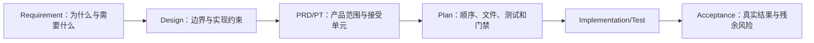

# PLAN-010 需求追踪与变更治理执行计划

- 状态：proposed
- 日期：2026-07-27
- 输入：[PRD-010 需求、设计与产品任务追踪矩阵](../prd/010-需求设计与产品任务追踪矩阵.md)
- 上游：[PLAN-000 MVP 全栈实施总计划](./000-MVP全栈实施总计划.md)
- 输出：379 个需求叶子、69 个 PT、10 份 PRD 与后续 Acceptance 的完整性审计和变更门禁

## 1. 执行目标

本计划不重复业务需求，而是确保每个 Requirement 叶子都有 Design 解释和唯一产品验收归属，每个 MVP PT 都进入对应执行计划，每次变更按事实来源顺序传播。编号齐全只代表“可追踪”，不能代表“已实现”或“已验收”。

## 2. 审计任务

| 任务 | 执行动作 | 通过条件 | 失败处理 |
| --- | --- | --- | --- |
| P010-01 | 扫描 Requirement 文档，展开 `001–005` 等连续范围并收集 ENT/FR/IF/NFR 叶子 | 恰好 379 个唯一叶子；无重复、断号或无法解析范围 | 停止 PRD 接受，先修 Requirement 编号/索引 |
| P010-02 | 逐叶检查 PRD-010 的 Design 落点 | 379/379 均指向存在的顶层或模块 Design；无“相关设计”等模糊占位 | 先补 Design 或明确非目标，禁止直接补代码 |
| P010-03 | 逐叶检查 PT/里程碑和验收归属 | 379/379 有唯一可执行归属；跨切片 NFR 可列多个共同 PT，但主接受门禁明确 | 修订 PRD-010 与对应任务，不用 Acceptance 临时兜底 |
| P010-04 | 提取 PRD-007～009 的 PT 定义并与 PLAN-007～009 首列比对 | 20+25+24=69 个 PT；定义和计划均唯一；无缺失或额外伪 PT | 缺失计划先补齐；额外任务回到 PRD 立项 |
| P010-05 | 检查 PRD-001～010 与 PLAN-001～010 一一回链 | 10/10 PRD 的下游元数据包含唯一同号执行计划；子计划反向链接正确 | 修复元数据和索引，不改变业务事实 |
| P010-06 | 检查跨切片与条件项 | PRJ-004/005 有持续交付点；IDN-FR-005、IDN-IF-006 保持 P1 无 MVP PT；STO-002 明确条件性 | 发现混入则阻止当前切片 accepted |
| P010-07 | 检查所有 Markdown 本地链接、状态和日期 | 本地目标存在；状态只使用约定值；无 Plan/Acceptance 提前声称通过 | 修复链接/状态并重新执行全量审计 |
| P010-08 | 当前 PT 完成时回填 Acceptance 链接与真实证据 | Requirement→Design→PRD/PT→Plan→Test/Evidence→Acceptance 可双向导航 | 缺真实命令或外部条件时保持 in_progress/blocked |

## 3. 当前基线

| 审计对象 | 期望基线 | 特殊规则 |
| --- | --- | --- |
| Requirement 叶子 | 379 个 | 范围必须机械展开，不能以模块名代替叶子 |
| PRD | PRD-001～PRD-010，共 10 份 | 每份对应 PLAN-001～PLAN-010 |
| 产品任务 | 共 69 个 | PRD-007 为 20、PRD-008 为 25、PRD-009 为 24 |
| 全局计划 | PLAN-000 一份 | 只管理跨 PRD 排序、技术事实和公共门禁 |
| P1 排除 | IDN-FR-005、IDN-IF-006 | 不得塞入 PT-IDN-003 或借 CRUD 顺手实现 |
| 条件任务 | PT-STO-002 | 仅生产 OSS/地区确定后进入 ready；不阻塞 MinIO MVP |
| 跨切片任务 | PT-PRJ-004、PT-PRJ-005、PT-GOV-006 | 在每个事实接入点留证，不能在首次骨架时提前 accepted |

## 4. 单个 PT 开始前的追踪门禁

1. 从 PRD-010 找到覆盖该 PT 的所有实体、功能、接口和非功能叶子，并展开范围。
2. 打开对应 Design 段落，确认事实所有者、依赖方向、状态、失败和并发约束仍与 PRD 一致。
3. 在 PLAN-007～PLAN-009 定位唯一任务行，补充当前切片的测试 fixture、外部决定和文件范围。
4. 检查依赖 PT 已 accepted、相关 D-001～D-007 已关闭；否则任务不得进入 ready。
5. 在 Red 测试名称或验收清单中记录需求/PT 标识，保证失败能定位回产品规则。

## 5. 变更传播协议

- 新增/修改业务行为：先更新 Requirement 编号和索引，再改 Design、PRD/PT、Plan，最后实施和验收。
- 纯实现细节变化且不改变产品事实：更新 Design/Plan；若接口或验收变化，仍需同步 PRD-010。
- 删除需求：不得直接删编号；先记录废弃/替代关系及受影响 PT、数据和 Acceptance，再按已接受的保留规则处理。
- 外部事实变化（Provider、价格、合规、OSS）：更新决策记录和 Design/PRD 基线，重新打开受影响 PT；不能只改配置后继续沿用旧验收。

## 6. 里程碑与接受治理

| 里程碑 | 追踪检查重点 | 允许创建的 Acceptance |
| --- | --- | --- |
| M1/S0 | 工程结构、数据、MinIO、日志、OpenAPI 契约 | 只记录真实环境和门禁结果 |
| M2/S1 | identity/projects 全部 P0 叶子，P1 排除未混入 | 登录立项与隔离证据 |
| M3/S2 | scripts/assets/media/governance 与最小异步链 | 剧本结构、授权和资产证据 |
| M4/S3 | storyboards 与资产升级影响 | 固定 ShotSpec/readiness 证据 |
| M5/S4 | production/MQ/Scheduler/费用/Provider | 单镜头生成、unknown 和费用证据 |
| M6/S5 | editing/review/render/label/manifest | 审核返工与可下载交付证据 |
| M7/S6 | 缓存、恢复、性能、安全、告警 | 故障演练和非功能证据 |
| M8/发布 | 379 叶子、69 PT、S0～S6 和 P0/P1 缺陷总审计 | MVP 发布判定记录 |

## 7. 自动化时机与输出

- 当前设计阶段先使用只读脚本/命令执行文档审计并保存控制台结果，不为尚未接受的目录预建校验框架。
- D-001 关闭并进入 S0 后，如果同类追踪漂移已重复出现，再把稳定规则写入 `backend/tests/architecture/test_document_traceability.py`，由根 `make check` 和 CI 调用；测试仍与 `backend/app` 分离。
- 自动化只检查可机械判定的数量、唯一性、范围展开、链接和一一映射；“Design 是否充分”“证据是否可信”必须保留人工评审。
- 输出至少包含：叶子总数/重复/缺失、PT 总数/重复/缺失、PRD↔Plan 映射、坏链接、P1/条件任务守卫和退出码。

## 8. 完成门禁

- P010-01～P010-07 全部通过后，当前文档集合才具备实施准入资格；这不自动关闭 D-001。
- 每个工作包完成时执行 P010-08；缺 Acceptance 回链、真实测试结果或外部依赖结论时，PT 不得 accepted。
- 任一需求叶子缺 Design 或验收归属、任一 PT 缺对应执行计划、或本地链接失效时，相关 PRD/切片不得进入 accepted。
