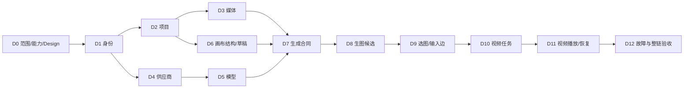

# Plan 06：画布生图生视频 Demo

设计入口：[Design 06](../design/06-画布生图生视频Demo.md)。当前是待评审方案，接受后再按本次闭环细化技术工作项；原始需求与验收标识不变。

## 1. 执行目标与边界

交付[Demo PRD](../prd/06-画布生图生视频Demo.md)定义的真实闭环：登录/项目→图片生成节点→图片候选→明确选图与视频输入边→视频生成节点→真实视频播放→刷新与重启恢复。

原规划已进入M0执行：本轮按用户明确的本地优先策略完成接入准备和适用自动化，详见第8节。下表D1～D12仍是后续业务工作包，未实现的新数据/API设计保持待评审。真实生成、数据库DDL/旧数据迁移与发布不在本轮范围；供应商/费用条件在启用真实接入前落实，不阻塞本地工程准备。

模块业务规则仍分别维护在06～19；本Plan统一调度Demo切片，避免在14和16重复安排两套生成实现。后续完整模块顺序见[总Plan](00-执行顺序.md)。

## 2. 关键路径



默认执行顺序按总Plan阶段组织：M0(D0)→M1(D1→D2→D6)→M2(D3→D4→D5)→M3(D7→D8)→M4(D9→D10→D11)→M5(D12)。D编号保持原工作包身份，不再按数字直接推定排期。图中明确真实依赖：身份之后供应商/模型与项目/媒体可以独立推进，但有多个执行者和容量确认后才安排并行，本文不虚构团队。D0先核已有本地适配合同并显式记录视频未接入；真实首帧能力在开启视频接入前核验。

D6提前于完整11～15模块，是本次用户强调Demo优先所需调整。先保存结构再接生成；生图通过后才接图片到视频。权限、审计、费用确认、幂等及恢复从所属工作包开始实现，D12是综合验证，不能把这些能力留到最后补。

## 3. Ready、容量与责任

后续业务实施工作包的Ready（本轮M0本地合同检查范围单列于第8节）：PRD相关范围/政策已接受；Demo Design说明项目归属、节点与边、草稿/任务/候选、输入版本、媒体可用、并发/幂等、失败与恢复、费用/外发；对应测试可执行且外部依赖明确。

当前没有人员可用时间或近三轮速度，不能计算真实产能、故事点与日期，也不将全部工作包承诺为一个Sprint。排期时按实际人时/历史速度估算，只纳入Ready项；建议将确认容量的80%用于计划，20%预留缺陷和供应商不确定性。尚未Ready的工作先解决问题，不以“已排期”掩盖阻塞。

| 决策/工作                    | 责任角色              | 当前未落实信息                  |
| ---------------------------- | --------------------- | ------------------------------- |
| 范围、节点语义与业务政策接受 | 产品负责人            | 实际人员、接受记录与基线        |
| Design、运行条件与实现       | 工程负责人            | 实际人员、可用时间与估算        |
| 配置、模型及未知任务核对     | 管理员/工程负责人     | 供应商条件、账户/预算与核对能力 |
| 测试、浏览器与媒体证据       | 测试负责人            | 环境/数据集/设备与性能尺度      |
| 最终Demo用户验收             | 制作者代表/产品负责人 | 验收者、演示窗口与结果接受      |

## 4. 工作项

各项均按“明确合同→核心测试Red→实现Green→Refactor→跨边界验证”推进。表中“真实验证”是未来验收要求，当前没有执行结果。

| ID / 用户结果          | 依赖与范围追踪                                     | 实施动作与最小产物                                                                                                                           | 验证与退出条件                                                                                                             |
| ---------------------- | -------------------------------------------------- | -------------------------------------------------------------------------------------------------------------------------------------------- | -------------------------------------------------------------------------------------------------------------------------- |
| D0 可实施且不误收费    | 本次优先级；PRD决策门                              | 本轮核页面差异、Codex适配协议/回执恢复和生成规范门禁；形成身份/项目/草稿与生成接入切片。真实供应商、首帧能力、数据外发与费用在真实启用前另核 | 本地合同有可执行证据；Codex仅单图文生图、视频未接入、运行限制明示；不承诺真实链通过，真实模型/费用不作M0前置               |
| D1 用真实身份进入      | D0；06 US-USER-01、FR-USER-02～03                  | 接入真实登录、授权会话、退出与必要受限账号控制；每请求取服务端身份，提供Demo账号的明确取得途径                                               | 错密不登录；刷新/退出/禁用后的访问正确；制作者不能调用管理配置；不能固定user_id                                            |
| D2 打开本人项目画布    | D1；07 US-PROJECT-01、FR-PROJECT-01、FR-PROJECT-05 | 最小空白项目创建/查询/打开，规格和身份持久；进入画布传真实项目身份；新项目允许空画布                                                         | 创建后刷新读回；项目A/B切换不串内容；他人和不存在ID安全失败；不自动打开样例项目                                            |
| D3 真实授权媒体基础    | D2；08 US-ASSET-01、FR-ASSET-01、FR-ASSET-04       | 确认格式/就绪/审核规则；媒体写入、类型探测、元数据、授权读取；先用测试文件核基础，不建整套素材管理                                           | 图片可解码、视频可播放且元数据一致；类型/超限/越权拒绝；链接过期重取授权；测试文件不计真实生成成功                         |
| D4 可用服务端凭据      | D1；09 US-PROVIDER-01～03                          | 最小安全配置/摘要/候选测试后替换；失败保留旧配置；测试若收费需同样确认；实现必要配置事件记录                                                 | 鉴权/配额/连通/超时有安全结果；普通用户无法读配置；失败与并发替换不覆盖旧值；不输出实际秘密                                |
| D5 两类真实发布模型    | D4；10 US-MODEL-01～03                             | 最小草稿→校验→不可变发布→可选查询；明确图片与首帧图生视频能力及参数；新任务复核启停                                                          | 模型不是占位名称；不支持参数不能选择或提交；停用/未发布拒绝；历史版本不随编辑变化                                          |
| D6 保存两类节点草稿    | D2；16 US-CANVAS-01、D-US-01                       | 新增/编辑/移动图片与视频生成节点；保存/加载结构、草稿、revision与准确保存状态；视口与节点坐标分开；不要求镜头存在                            | D-AC-01与10保存部分；刷新读回节点/草稿；冲突和丢回执留输入；适应不重置布局；按需媒体边界与键盘操作方案明确                 |
| D7 统一提交与任务合同  | D3、D5、D6；14 US-GEN-01～03、D-US-02/05           | 输入能力/权限校验→必要报价/确认→冻结→幂等任务→状态查询；确认绑定快照；未知先核对，关键执行/确认事件记录；不按节点类型复制框架                | 核同键同输入、异输入、确认后改参、提交丢回执、权限与模型失效；刷新找原任务；queued不报成功；Design明确费用与核对事实       |
| D8 图片节点真实生图    | D7；14 US-GEN-02、16 US-CANVAS-02、D-US-02         | 对已接受图片模型实现实际调用/异步合同；获取输出→媒体可用处理→追加候选；图片节点列表/预览/选择；回执按原任务关联                              | D-AC-02、05图片部分、09；真实图片字节/模型/参数/来源可核；重复回执无重复发布；生成不自动选图，保存采用事实                 |
| D9 选图接入视频输入    | D8；16 US-CANVAS-02、D-US-03                       | 建立源节点+候选+媒体版本到目标视频首帧的输入边；视频节点展示图与来源；保存/刷新；上游改选显式更新，不自动传播                                | D-AC-03、06、07输入部分；缺图/未就绪/无权/自连/错误边拒绝；一个视频节点一张输入；连线与更新不调用供应商                    |
| D10 视频节点真实提交   | D7、D9；14 US-GEN-01～03、16 US-CANVAS-02、D-US-04 | 加运动描述与支持时长/画幅；冻结明确图片版本与视频模型；单独费用确认；真实图生视频调用与状态恢复，不重复图片生成                              | D-AC-04任务部分、05视频部分、08；证据能核实际传入图片；双击/超时不重复收费；缺视频能力时明确阻塞而非退成文生视频           |
| D11 视频结果播放与重开 | D10、D3；08 US-ASSET-01、14 US-GEN-02、D-US-04     | 视频输出转为授权媒体/候选并内嵌可用播放器；显示原输入；历史只读与草稿分开；刷新/重登/重启恢复；卸载清理播放/监听                             | D-AC-04完整、07、09、11；实际媒体可播放且时长来源真实；过期URL重授权；输出已返回但媒体失败不报可播放；迟到结果不覆盖新草稿 |
| D12 整链故障与用户验收 | D1～D11；D-US-01～05                               | 在接受的真实环境跑全链与反例；自动化注入重复/冲突/未知/迟到/转存失败；核关键事件与调用事实；补浏览器/响应式/按需加载证据                     | D-AC-01～12全部接受项有独立证据；不足的真实外部条件单列；产品接受Demo并记录剩余模块；不得以lint/fixture替代用户验收        |

D4依赖D1、D6依赖D2，可在对应Ready后启动，不必等无关完整模块。D8的“采用图片”仅是Demo节点/输入选择；镜头正式选定与设定锁定继续归13/12，不能混写为同一事实。

## 5. 里程碑与停止条件

里程碑与T任务统一以[总Plan](00-执行顺序.md#里程碑编排与分阶段验收)为准，本文件维护Demo工作包与D-AC工程验收。此前M1生图/M2视频/M3整链改对应M3/M4/M5，避免两套M编号；原D0～D12与D-AC-01～12不改名。实际状态只在[BACKLOG](../../BACKLOG.md#里程碑执行台账)维护。

| 里程碑                | 原工作包     | 总Plan任务     | 可演示结果与退出证据                                                                                      |
| --------------------- | ------------ | -------------- | --------------------------------------------------------------------------------------------------------- |
| M0 基线与可行性       | D0           | T00-01～T00-04 | 本地切片设计/用户策略、已有适配器合同和生成门禁核验；真实能力后置至启用前，运行异常有记录。本轮无真实调用 |
| M1 身份/项目/画布保存 | D1、D2、D6   | T01-01～T01-04 | 真登录→空白项目→同一画布节点/草稿保存读回，退出/越权/冲突/丢回执可核；不等待生成供应商，也不报告生图通过  |
| M2 真实生成条件       | D3、D4、D5   | T02-01～T02-03 | 授权媒体真实读取，安全配置/候选测试/原子替换，两类实际发布模型及参数准入可核                              |
| M3 画布真实生图       | D7、D8       | T03-01～T03-03 | 单独确认/冻结/幂等任务、真实图片候选和明确选择；状态/原件/输入及未知恢复有证据，不能以fixture验收         |
| M4 选图到真实视频     | D9、D10、D11 | T04-01～T04-03 | 明确图片版本与首帧边，单独提交真实视频、播放/刷新/重开/恢复；连线不收费、改图不改历史                     |
| M5 Demo整链接受       | D12          | T05-01～T05-02 | D-AC-01～12逐项记录对应证据与接受者；越权、重复收费、未知任务丢失、冲突丢输入、转存恢复是阻塞             |

M1～M4分别验收子链，M5验收真实整链；M6～M9是Demo后的页面/完整模块工作，不在本文件重复定义。阶段证据与推进规则见总Plan，外部条件不足保留已完成工作和原任务，完整Demo仍未通过。

## 6. 验证策略与证据

### 验证分层

- **核心自动化**：节点/边允许类型、版本冻结、选图/改图不改已提交、确认绑定、幂等、未知恢复；新增或修改核心逻辑先Red。
- **真实存储集成**：画布/草稿/边、任务/候选、媒体引用、权限、并发与服务重启读回；不止测内存。
- **供应商合同验证**：以可控响应覆盖已受理丢响应、迟到/重复、失败、转存失败；单独确认真实供应商支持查询与幂等的边界，不假定客户端request_key天然保证外部一次执行。
- **有限真实外部验收**：至少一条已接受模型的图片→视频链；记录安全供应商任务关联、输入版本、媒体身份/实际文件与费用事实。只证明该模型/样本，不证明规模和长期可靠。
- **浏览器验收**：从空白项目亲自走节点操作与恢复；核Network/实际文件/安全任务关联；按接受设备与1440/1280/390宽检查关键操作，手机限制单列。

### 实施阶段命令

只在相应代码有变更时运行；本轮M0已执行范围见第8节，未执行项目不得报告为通过。

| 范围       | 在相应目录执行                                                                                                                                                               |
| ---------- | ---------------------------------------------------------------------------------------------------------------------------------------------------------------------------- |
| Go         | 对任务Go文件执行gofmt/goimports；在backend运行go vet ./...、golangci-lint run、go test -race ./...、govulncheck ./...；生成一致性按Design变更范围验证                        |
| 前端       | 在frontend运行pnpm exec eslint .、pnpm exec prettier --check .、pnpm exec next typegen、pnpm exec tsc --noEmit、pnpm exec vitest run、pnpm exec next build；交互补浏览器验证 |
| 合同与文档 | 新Handler/DTO及swag注解→swag公开规范→openapi2ts生成；不手改生成文件；核Schema唯一事实及文档链接/来源                                                                         |
| 真实验收   | 接受环境内执行D-AC；不提供能误执行真实收费的无条件命令模板                                                                                                                   |

工具缺失、环境阻塞、中断、历史无关失败均如实记录。lint/类型/构建通过不等于最佳实践审查或Demo通过。

### 证据记录格式

每个场景记录：需求/场景ID、基线与代码版本、执行环境/时间、输入/对象版本、步骤、预期、实际、自动化/浏览器/存储/供应商类别、安全任务关联、媒体核验、费用/调用事实、缺陷与限制、接受者。凭据、会话和签名URL不进入记录。

| 场景组          | 自动化/故障           | 真实存储       | 浏览器                      | 真实供应商             | 本轮实际结果   |
| --------------- | --------------------- | -------------- | --------------------------- | ---------------------- | -------------- |
| D-AC-01、10     | 并发/失败             | 画布/权限      | 保存/切换                   | 不适用                 | 未执行，仅定义 |
| D-AC-02～04     | 输入/候选合同         | 草稿/边/媒体   | 选图/播放                   | 图片及图生视频         | 未执行，仅定义 |
| D-AC-05～09、11 | 重复/丢响应/迟到/恢复 | 任务/引用/结果 | 安全状态与恢复              | 关键供应商合同实证另记 | 未执行，仅定义 |
| D-AC-12         | 可辅助交互检查        | 按需读取证据   | 设备/键盘/主题/媒体生命周期 | 不适用                 | 未执行，仅定义 |

## 7. 风险处理与交接

- 图生视频输入方式或费用不确定：本轮明确未接入，在真实启用前收敛；不能以占位模型通过M2或进入真实生成验收。
- 供应商无稳定查询或幂等：Design明确unknown/manual与人工核对，不盲重发；内部幂等与外部计费实证分开。
- 上游多次生成/选图变化：边显式绑定版本，原任务冻结，更新草稿必须明确；D9/D11验证迟到与来源差异。
- 媒体转存/链接过期：媒体就绪与生成终态分开，恢复媒体处理不自动重做收费生成。
- “本机保存”与外发矛盾：在调用前确认数据流与产品说明；本轮不擅自修改首页文案为已解决。
- 旧后端与新需求不同：只评估可复用逻辑，先接受新合同；不恢复旧拓扑/兼容路由或清理已有数据。
- 并发任务与工作区：后续实施前重新核Git/分支/修改，保留其他工作；任务自身状态由根BACKLOG单独维护。

M5通过后，按总Plan的M6～M9补齐基础管理、剧本设定、镜头故事板/完整画布及运营查询。14/16已验Demo部分复用本次合同与证据，其余FR仍未完成。先前编排轮仅修改文档；本轮M0实施/测试见第8节，未发布或真实调用。

## 详细工程合同与开工输入

本轮已补[Demo工程切片](../design/06-画布生图生视频Demo.md#工程合同demo工程切片与端到端提交)及[系统/数据库/HTTP全局合同](../design/00-项目需求设计.md#工程合同架构与运行边界)。D1～D12的工程输入不再只列概念对象：身份/项目表与权限、媒体/授权/转存表、模型发布版本、Canvas输入/选择/边复合FK、Preflight/Consent/Task/Attempt/Event/Output/费用及实际DTO均有对应Design。
接受后每个工作包补精确源码改动/Handler注解、最终态Schema与旧库增量差异，以及数据库约束/接口/故障测试清单；D7特别先验证并发键、preflight后改输入、dispatching后崩溃、持久输出到转存交接。D11重启不重置未知任务，D12保留外部费用/媒体/浏览器/产品验收边界。后续新业务仍是实施准备，本轮M0仅核已有合同并修复门禁，结果见下节；不编造估算或真实生成验收。

## 8. M0本地执行记录

本节保留首轮准备快照，包含当时的运行受阻与检查结果；后续完整执行和验收见第9节。当前状态以BACKLOG为准。

执行日期：2026-10-09。代码基线：main / cc4cfdbcc9ad1add48b60a9de98123b507badb46；沿用本轮开始前20份未提交的里程碑编排文档。执行者：Codex；用户已明确本地优先、不要求真实生成。未确认其他人员、产能与工期。实际任务状态只维护在[BACKLOG](../../BACKLOG.md#里程碑执行台账)。

### T00-01：页面、原始需要与切片交接

[总Plan页面矩阵](00-执行顺序.md#页面实现盘点)保留16个业务入口与阶段归属；本轮再次核首页创建/打开和画布入口。当前首页创建跳分析页、画布入口未携带真实项目身份，不能作为M1已完成。M1设计交接：创建返回服务端project_id，打开同一项目的画布；没有身份/项目、越权或不存在时安全失败，切换项目取消旧读取并隔离状态。实际路由参数/API按已接受设计实施，不添加旧工作台兼容路由。

| 差异/取舍            | 本轮可审阅设计基线                                                                                     | 后续验证/边界                              |
| -------------------- | ------------------------------------------------------------------------------------------------------ | ------------------------------------------ |
| 风格四类与页面五标签 | 新业务先按原始字段写实/动漫/国风/胶片；展示标签与存储枚举分离，不把旧样例变为第五种业务风格            | M1持久保存三种画幅/四类风格；政策接受另记  |
| 最近打开与最近更新   | 原始需求的最近更新作为真实排序；名称排序保留，不为演示标签新增打开历史机制                             | M6核筛选后分页与两视图一致                 |
| 空白项目与剧本导入   | M1只创建空白项目，不依赖镜头或剧本；txt/md/docx导入留M7，PDF仍待决定                                   | 首页创建/打开均传真实project_id            |
| 本机文件与外发       | 本轮没有推理外发；本地优先不是对Codex离线执行的声明                                                    | 真实接入前接受数据流/文案与授权            |
| Demo账号取得         | M1使用Design01受控账号创建/初始管理员方案及真实会话；建号由服务端执行，不写固定user_id或前端管理员标记 | 不提前恢复旧已删除登录路由；注册全流程留M6 |
| 选图与视频首帧       | 保留单图first_frame与版本冻结；改选后显式更新边，连线/保存不执行生成                                   | 视频未接入时拒绝提交；原任务输入不变       |

这些是本次工程取舍与接入准备，不改变原FR/US/AC，不代表全部产品政策已接受。原始文件未修改，M1～M9业务未开工。

### T00-02：本地生成接入边界

架构/数据/API继续以[整体Design](../design/00-项目需求设计.md)和[Demo Design](../design/06-画布生图生视频Demo.md)为审阅基线。本轮只确认本地执行策略并落实已有合同检查；不预建全部候选表或第二套生成框架。

已有接入位置为[Codex适配器](../../backend/internal/operation/adapter/codex/adapter.go)：显式注入DispatchStore、Launcher、ReceiptWriter；冻结模型/请求身份→持久派发标记→受控进程协议→实际字节验证→持久回执。重复派发先恢复原回执，不能再开一次生成；可能已发送而无法核实时保留unknown，不自动重发。后续接入应复用这些职责，先完成新Design与旧数据/费用合同的明确映射，不能直接把旧计费预留流程当作免费本地模式。

| 能力         | 当前实现事实                                                                        | 本轮核验                                                               | 后续接入条件                                                  |
| ------------ | ----------------------------------------------------------------------------------- | ---------------------------------------------------------------------- | ------------------------------------------------------------- |
| Codex文生图  | 旧工作流仅image.generate/text_to_image/output_count=1；无供应商异步query/cancel能力 | 可控Launcher/协议响应、能力拒绝、冻结模型、重复派发/回执与未知恢复测试 | 实际CLI握手/模型能力与输出需另核；安装CLI不等于已兼容或可推理 |
| 首帧图生视频 | 未发现对应Codex视频执行路径；通用输入结构不是已实现视频能力                         | 本轮明确未接入，不构造视频成功/费用记录                                | 实现符合共享合同的真实视频适配器，并核实际输入版本/输出/失败  |
| 页面生成     | 仍是演示状态，未接新任务API                                                         | 本轮没有浏览器生成验收                                                 | 后续以真实任务/媒体状态替代演示；未接入应拒绝而非伪候选       |

本轮无真实生图/视频、供应商调用或计费。Fixture不进入正式候选，也不关闭D-AC-02～04；数据库、媒体、浏览器和产品接受各自保留验收门。

### T00-03：本地运行与验证条件

本地工具只读核验：Codex CLI 0.159.2；backend所用Go工具链1.26.8；Node24.19.0；pnpm12.4.2。协议/工作流测试使用现有Go测试与可控响应，不需要真实供应商、密钥或预算。历史测试名中的M1是旧测试标识，不表示本轮里程碑M1已实现。

运行探针结果：frontend容器healthy，`http://127.0.0.1:3200/healthz`返回200；backend容器running但unhealthy、restart=0，容器内8080探针连接失败，宿主8080断开响应。只读进程检查仅见Air/代理，没有运行中的Go API进程；有限且筛选过的日志样本未定位编译/启动原因。不能据此猜测配置错误或宣称服务正常。5432/6379/7233/9000/9092 TCP可连接只说明端口，不证明服务身份、鉴权、数据库约束或Worker可用。

本轮本地合同测试可独立执行；后端服务恢复与真实存储/Worker健康必须在M1页面/数据库联调前核实。不读取或打印.env/凭据、不修改既有数据、不重启容器来代替原因核对。真实账号、SQL约束、媒体存储与服务重启恢复均未验收。

### T00-04：生成合同门禁修复与验证

Red证据：[cc4cfdbc远端CI](https://github.com/StephenQiu30/lanverse/actions/runs/37806397347)比较未跟踪的backend/docs失败。运行后端与容器不再依赖该目录，在线Swagger及旧auth路由已有删除契约；不能恢复旧产物或接口来掩盖失败。

Green改动：[public_contract_test.go](../../backend/tests/app/public_contract_test.go)新增TestPublicRouterGeneratedSwaggerContract，使用模块固定版本swag从当前Handler注解生成内存规范，与NewBusinessRouter实际/api路由双向核对，并检查operationID。现有负例验证新增/缺失路由、内部接口及参数规范化能被检测。[ci.yml](../../.github/workflows/ci.yml)移除失效目录比较，执行实际存在的生成合同及已删除公开接口安全检查。生成物不落盘，不修改依赖，不恢复在线Swagger。它验证当前源码合同，不证明Design中候选API已接通；未来新Handler/DTO仍按swag→openapi2ts生成。

本轮执行结果：

| 命令/范围（backend目录，除格式与文档外）                                                                                                       | 实际结果                                    | 证明边界                                                  |
| ---------------------------------------------------------------------------------------------------------------------------------------------- | ------------------------------------------- | --------------------------------------------------------- |
| `go test -race ./tests/app -run '^TestPublicRouterGeneratedSwaggerContract$' -count=1 -v`                                                      | 通过                                        | 当前源码生成规范与实际路由一致                            |
| CI修改后的7组合同测试（精确命令见下方）                                                                                                        | 通过，无跳过                                | 本地执行CI对应命令；非远端CI通过                          |
| `go test -race ./tests/operation -run`筛选CodexImageProtocol、ReceiptRecovery、SyncCostAndManual及receipt/dispatch合同测试（`-count=1 -json`） | 退出0                                       | 本地可控响应/Temporal TestSuite；不是真实生成或数据库验证 |
| `gofmt`、`goimports -d tests/app/public_contract_test.go`                                                                                      | 已格式化，goimports无差异                   | 仅本轮Go文件                                              |
| `go vet ./...`                                                                                                                                 | 通过                                        | 静态检查                                                  |
| `golangci-lint run ./...`                                                                                                                      | 0 issues                                    | 静态检查                                                  |
| `govulncheck ./...`                                                                                                                            | 无被调用的漏洞；另有1项未调用的依赖模块漏洞 | 不报告依赖模块完全无漏洞                                  |

精确测试筛选命令如下（在backend执行）：

```sh
go test -race ./tests/app -run '^Test(PublicRouterGeneratedSwaggerContract|PublicRouterRemovedAuthenticationRoutes|PublicRouterRemovedSwaggerRoutes|WorkspaceAPIDoesNotExposeAnonymousAccessOutsideThisHost|PublicSwaggerRejectsContractDrift|PublicSwaggerNormalizesPathParameters|SwaggerRuntimeDefaultsDoNotHideNonEmptyDrift)$' -count=1 -v
go test -race ./tests/operation -run '^TestM1(CodexImageProtocol.*|ReceiptRecovery$|ReceiptRecoveryRejects.*|SyncCostAndManualKeepsReservationWithoutQueryOrMockReview|SyncWorkflowReplayDefaultVersionCannotStartNewProvider|SyncCostAndManualQueuedCancellationRequiresDefiniteNoSend|SyncCostAndManualExecutedReceiptRejectsNotExecutedSignal|SyncCompletedContract|ReceiptStrictJSON|ReceiptRejectsInvalidEvidence|ReceiptValidateBoundaries|CompletedCallBindsReceipt|BeginProviderCallDispatchMarker|DispatchMarkerRejectsExistingTask|DispatchIdentityValidate|SubmitDTOHistoricalJSON|CompletedUsageIsNormalized)$' -count=1 -json
```

Go风格按Google规范检查，测试保留在backend/tests；未改生产Go逻辑。前端业务代码未改，不执行前端业务测试/构建或浏览器验收。全量数据库/Race集成、真实CLI推理和新Schema/API/媒体验证未执行。远端CI未重跑，本轮没有提交/推送/发布；文档/范围核对见[交付记录](../需求拆解交付核对.md#本轮m0本地执行)。

## 9. M0完整执行与验收

2026-10-09用户再次明确“开始完整的执行我们的m0并进行测试和验收”。本轮按其本地优先策略执行T00-01～04；工程自验收的范围为本地基线、接入协议、运行条件及适用门禁，不代签全量产品Design/真实媒体验收，不推进M1业务实现。执行前冻结26份已有修改的SHA256清单，保留既有里程碑编排。

### 运行故障的Red与恢复

安全筛选的后端日志明确：`worker role: initialize flow worker: connect worker Temporal: describe Temporal namespace: Namespace lanverse-local is not found`。CLI查询同样返回不存在，证明不是Air命令或Go编译失败。按设计补齐本项目本地namespace（72小时历史保留、无归档），没有修改其他namespace、业务Schema、用户数据或凭据：

```sh
temporal operator namespace describe --address 127.0.0.1:7233 --namespace lanverse-local --disable-config-file --disable-config-env --command-timeout 10s
temporal operator namespace create --address 127.0.0.1:7233 --namespace lanverse-local --description 'Lanverse local development' --retention 72h --disable-config-file --disable-config-env --command-timeout 10s
```

注册后Air自动重试并恢复API/Worker/Relay；首次恢复时四个healthz（3200/8080/8081/8082）均200、backend healthy、restart=0、flow队列有1个workflow poller；namespace内工作流数量为0。没有安装维护清理Schedule或提交生成任务。新增TestPingRejectsMissingNamespace只查询随机缺失namespace，以NamespaceNotFound错误链证明缺少依赖时仍拒绝；首次测试错误地断言通用NotFound，按已安装SDK的专用错误类型修正，生产Ping未放宽。

### Codex真实进程协议与本地能力边界

新增[TestCodexProcessHandshake](../../backend/tests/operation/codex_process_integration_test.go)，用ProcessLauncher启动已安装Codex CLI0.159.2，实际完成initialize→initialized→modelProvider/capabilities/read，imageGeneration=true。测试只读能力，结束关闭并等待子进程，不执行thread/start、turn/start或推理，不打印账号诊断/原始响应。仍不能由此声称账户/发布模型已可真实生图、Codex本机离线推理或视频可用。

明确的测试开关为LV_TEST_CODEX_BINARY的绝对可执行文件路径；不读取密钥。该集成测试在未显式配置时会跳过，本轮明确配置并实际通过。后端flow健康不代表注册了agent.codex生成队列；真实生图接入属于后续M2/M3，首帧视频属于M4，本轮均不开启。

### 安全门禁的Red与修复

本轮首次govulncheck退出3，扫描命中12个不同漏洞标识，涉及Go1.26.8标准库及x/net0.59.0。[Go官方1.26.9发布记录](https://go.dev/doc/devel/release#go1.26.0)及[官方漏洞记录](https://pkg.go.dev/vuln/GO-2026-6617)已核验修复版本。本轮保持go1.26.0语言基线，将工具链升到1.26.9、x/net升到0.60.0，并同步Dockerfile的dev/build镜像。go mod tidy去除未再使用的在线Swagger依赖及冗余校验条目，保留swag源码生成器；没有恢复旧接口。

修复后govulncheck退出0：0个被调用漏洞、0个导入包漏洞；仍提示1个未调用的依赖模块漏洞，记录为非阻塞残余，不能报告整个依赖图绝对无漏洞。工具链/依赖变更后重新执行Go检查与完整后端Race套件，并重建本地backend镜像；最终结果在下方验收表记录。

### M0场景与工程验收表

场景的起始条件：main/cc4cfdbc及当前任务diff、本地前后端和现有宿主基础设施、用户已明确不执行真实生成。执行角色为Codex工程执行/自验收；产品角色/真实演示账号的业务验收不属于M0。

| 场景                        | 目标、操作与预期结果                                                                               | 本轮实际证据                                                                                 |
| --------------------------- | -------------------------------------------------------------------------------------------------- | -------------------------------------------------------------------------------------------- |
| M0-AC-01 页面/需要基线      | 核16业务入口及原FR/US/AC；页面字段/项目上下文缺口定位到后续任务，不把固定样例当真数据              | 总Plan页面矩阵；16路由HTTP200；浏览器实际读取首页、登录、画布                                |
| M0-AC-02 本地工程切片       | 明确身份/项目/CAS草稿、首帧边/选择/冻结、任务/媒体唯一Design与分阶段交接；真实生成条件在启用前落实 | 第8节取舍与整体/用户/项目/生成/画布Design；本轮执行授权只覆盖M0，不接受所有未来政策或执行DDL |
| M0-AC-03 运行依赖失败与恢复 | 缺namespace应失败；显式补依赖后API/Worker/Relay可服务，flow Worker实际轮询                         | 缺失日志/CLI Red、注册及HTTP/容器/poller Green；永久缺失namespace测试                        |
| M0-AC-04 Codex接入协议      | 真实进程可握手/读能力并退出；缺/禁用/格式错误能力在推理前拒绝                                      | 新真实CLI集成测试＋原CodexImageProtocol反例；未推理、视频未接入                              |
| M0-AC-05 幂等与未知回执     | 重复派发不启动第二次；不确定传输/超时/无效产物/回执失败保持unknown，可恢复原回执                   | 原协议、ReceiptRecovery、SyncCostAndManual及dispatch/receipt Race测试                        |
| M0-AC-06 生成HTTP合同门禁   | 固定版本swag从源码生成，与实际路由双向核对；缺/多路由或内部接口应失败；旧auth/Swagger保持404       | 前轮永久生成测试及CI对应7组检查，本轮复验；远端CI另记                                        |
| M0-AC-07 Go工程门禁         | 格式/静态/Race/漏洞/构建通过，失败照实修复，存储/真实媒体未验证单列                                | 精确命令与最终结果见下节；保留漏洞Red及修复版本                                              |
| M0-AC-08 交付范围与边界     | 原始需要/未来任务不改、旧工作区保留；不提交凭据/本地数据/产物，不虚构M1或真实Demo通过              | 本轮SHA256/追踪/链接/diff/status核对与交付清单；未提交、推送或发布                           |

浏览器读取确认现状：首页最近打开/固定项目/无真实项目参数，登录固定样例，画布固定“所有更改已保存”和占位模型/媒体仍存在；未点击生成、提交登录或创建项目。HTTP200只证明页面可加载，不能关闭M1～M5。文档打开请求返回queued；Codex原生UI被工具安全策略禁止访问，未验证实际编辑器渲染或Obsidian。正文已逐项静态阅读，UI阅读限制单列，不写成通过。

### 本轮精确命令与最终结果

```sh
# backend目录；显式提供无秘密的工具路径与本地Temporal测试地址
LV_TEST_CODEX_BINARY=/Users/stephenqiu/.local/npm/bin/codex LV_TEST_TEMPORAL_ADDR=127.0.0.1:7233 LV_TEST_TEMPORAL_NAMESPACE=lanverse-local go test -race -p 2 ./... -count=1 -json
# 新/受影响文件按实际清单运行gofmt/goimports；其他门禁
 go vet ./...
 golangci-lint run ./...
 govulncheck ./...
# 仓库根，本地镜像与运行恢复
 docker compose build backend
 docker compose up -d --no-deps backend
```

最终结果（补丁工具链与依赖上的复验）：

| 检查               | 实际结果与边界                                                                                                                                                           |
| ------------------ | ------------------------------------------------------------------------------------------------------------------------------------------------------------------------ |
| 完整后端Race套件   | 23个含测试包通过；523个顶层测试通过，含子测试共1526条通过记录；561个顶层测试跳过，含子测试共699条跳过记录；无失败，退出0。外部DB/存储/供应商等专用条件未配置，不能算通过 |
| M0指定场景复核     | 从完整结果再次核对上述协议/回执/公开合同/角色健康/Temporal及新CLI的40个顶层测试，40个全部通过，无跳过                                                                    |
| 格式与静态门禁     | 全backend goimports无输出；go vet通过；golangci-lint为0 issues；go mod verify为all modules verified；backend命令构建通过（产物在/tmp）                                   |
| 漏洞门禁           | Go1.26.9/x/net0.60.0下退出0，无被调用/导入包漏洞；1项未调用的模块漏洞单列，Red结果未抹去                                                                                 |
| Docker及实际二进制 | 本地dev镜像build成功，compose只重建backend容器；最终运行二进制为Go1.26.9/x/net0.60.0，容器healthy、restart=0；开发镜像及运行可用不代表生产镜像已构建/发布                |
| 运行验收           | 3200/8080/8081/8082 healthz均HTTP200且status=ok；flow有poller（重建前1条、重建后返回2条含未过期历史poller，不宣称有2个运行Worker）；当前无Running工作流                  |
| 页面基线验收       | 16业务路由HTTP200；浏览器实际读取首页、登录、画布；只验页面盘点/缺口，未验登录/项目持久保存或生成                                                                        |
| 文档/范围验收      | 35任务/10阶段/42故事/13 Demo工作包、73 FR/43原AC及原需求全文保留；链接/锚点、Prettier和git diff范围核对；新文件与保留修改逐项列在交付记录                                |

M0八个场景的本地工程验收已完成；执行授权来自用户本轮明确要求，验证执行和工程结论由Codex记录。真实产品/媒体、未执行的新业务SQL/API集成、生产发布与用户产品签收均不在本轮关闭范围。没有把699项跳过或编辑器UI阅读限制写成通过。实际任务状态只更新BACKLOG，不自动关闭后续里程碑。完整后端套件中的外部数据库/对象存储集成若缺少专门测试条件会跳过，必须单独计数；M0选定场景不允许用跳过抵扣。远端CI没有重跑，历史失败记录仍保留。本轮没有提交/推送、业务DDL、真实生成或发布。
