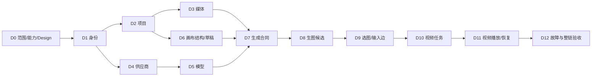

# Plan 06：画布生图生视频 Demo

设计入口：[Design 06](../design/06-画布生图生视频Demo.md)。当前是待评审方案，接受后再按本次闭环细化技术工作项；原始需求与验收标识不变。

## 1. 执行目标与边界

交付[Demo PRD](../prd/06-画布生图生视频Demo.md)定义的真实闭环：登录/项目→图片生成节点→图片候选→明确选图与视频输入边→视频生成节点→真实视频播放→刷新与重启恢复。

本次只创建规划文档。下面是可审阅的依赖与业务工作包，不表示Design已接受、真实调用已授权或代码已开工。数据库DDL、旧数据清理/迁移、服务启动、发布和收费调用均不在本次文档任务内。供应商/模型、参数、费用、环境与实际承担者在D0落实后才能承诺实施周期。

模块业务规则仍分别维护在06～19；本Plan统一调度Demo切片，避免在14和16重复安排两套生成实现。后续完整模块顺序见[总Plan](00-执行顺序.md)。

## 2. 关键路径

默认执行顺序D0→D1→D2→D3→D4→D5→D6→D7→D8→D9→D10→D11→D12。图中明确真实依赖：身份之后供应商/模型与项目/媒体可以独立推进，但有多个执行者和容量确认后才安排并行，本文不虚构团队。D0先做有限能力与风险核验，避免基础完成后才发现无可用图生视频。

D6提前于完整11～15模块，是本次用户强调Demo优先所需调整。先保存结构再接生成；生图通过后才接图片到视频。权限、审计、费用确认、幂等及恢复从所属工作包开始实现，D12是综合验证，不能把这些能力留到最后补。

## 3. Ready、容量与责任

所有实施工作包的Ready：PRD相关范围/政策已接受；Demo Design说明项目归属、节点与边、草稿/任务/候选、输入版本、媒体可用、并发/幂等、失败与恢复、费用/外发；对应测试可执行且外部依赖明确。

当前没有人员可用时间或近三轮速度，不能计算真实产能、故事点与日期，也不将全部工作包承诺为一个Sprint。排期时按实际人时/历史速度估算，只纳入Ready项；建议将确认容量的80%用于计划，20%预留缺陷和供应商不确定性。尚未Ready的工作先解决问题，不以“已排期”掩盖阻塞。

| 决策/工作                    | 责任角色              | 当前未落实信息                  |
| ---------------------------- | --------------------- | ------------------------------- |
| 范围、节点语义与业务政策接受 | 产品负责人            | 实际人员、接受记录与基线        |
| Design、运行条件与实现       | 工程负责人            | 实际人员、可用时间与估算        |
| 配置、模型及未知任务核对     | 管理员/工程负责人     | 供应商条件、账户/预算与核对能力 |
| 测试、浏览器与媒体证据       | 测试负责人            | 环境/数据集/设备与性能尺度      |
| 最终Demo用户验收             | 制作者代表/产品负责人 | 验收者、演示窗口与结果接受      |

## 4. 工作项

各项均按“明确合同→核心测试Red→实现Green→Refactor→跨边界验证”推进。表中“真实验证”是未来验收要求，当前没有执行结果。

| ID / 用户结果          | 依赖与范围追踪                                     | 实施动作与最小产物                                                                                                                                                                                  | 验证与退出条件                                                                                                             |
| ---------------------- | -------------------------------------------------- | --------------------------------------------------------------------------------------------------------------------------------------------------------------------------------------------------- | -------------------------------------------------------------------------------------------------------------------------- |
| D0 可实施且不误收费    | 本次优先级；PRD决策门                              | 核候选供应商的生图/单图首帧视频、发布参数、异步查询/结果交付/计费；确认真实账号、数据外发、预算、核对政策；评审本次Demo Design并明确接受范围。能力核验先查一手资料，有限真实实验须满足费用/执行条件 | 明确图片/视频模型及输入用途；不能支持首帧时先变更并接受PRD；列不能核对的风险；真实条件缺失则不承诺全链通过                 |
| D1 用真实身份进入      | D0；06 US-USER-01、FR-USER-02～03                  | 接入真实登录、授权会话、退出与必要受限账号控制；每请求取服务端身份，提供Demo账号的明确取得途径                                                                                                      | 错密不登录；刷新/退出/禁用后的访问正确；制作者不能调用管理配置；不能固定user_id                                            |
| D2 打开本人项目画布    | D1；07 US-PROJECT-01、FR-PROJECT-01、FR-PROJECT-05 | 最小空白项目创建/查询/打开，规格和身份持久；进入画布传真实项目身份；新项目允许空画布                                                                                                                | 创建后刷新读回；项目A/B切换不串内容；他人和不存在ID安全失败；不自动打开样例项目                                            |
| D3 真实授权媒体基础    | D2；08 US-ASSET-01、FR-ASSET-01、FR-ASSET-04       | 确认格式/就绪/审核规则；媒体写入、类型探测、元数据、授权读取；先用测试文件核基础，不建整套素材管理                                                                                                  | 图片可解码、视频可播放且元数据一致；类型/超限/越权拒绝；链接过期重取授权；测试文件不计真实生成成功                         |
| D4 可用服务端凭据      | D1；09 US-PROVIDER-01～03                          | 最小安全配置/摘要/候选测试后替换；失败保留旧配置；测试若收费需同样确认；实现必要配置事件记录                                                                                                        | 鉴权/配额/连通/超时有安全结果；普通用户无法读配置；失败与并发替换不覆盖旧值；不输出实际秘密                                |
| D5 两类真实发布模型    | D4；10 US-MODEL-01～03                             | 最小草稿→校验→不可变发布→可选查询；明确图片与首帧图生视频能力及参数；新任务复核启停                                                                                                                 | 模型不是占位名称；不支持参数不能选择或提交；停用/未发布拒绝；历史版本不随编辑变化                                          |
| D6 保存两类节点草稿    | D2；16 US-CANVAS-01、D-US-01                       | 新增/编辑/移动图片与视频生成节点；保存/加载结构、草稿、revision与准确保存状态；视口与节点坐标分开；不要求镜头存在                                                                                   | D-AC-01与10保存部分；刷新读回节点/草稿；冲突和丢回执留输入；适应不重置布局；按需媒体边界与键盘操作方案明确                 |
| D7 统一提交与任务合同  | D3、D5、D6；14 US-GEN-01～03、D-US-02/05           | 输入能力/权限校验→必要报价/确认→冻结→幂等任务→状态查询；确认绑定快照；未知先核对，关键执行/确认事件记录；不按节点类型复制框架                                                                       | 核同键同输入、异输入、确认后改参、提交丢回执、权限与模型失效；刷新找原任务；queued不报成功；Design明确费用与核对事实       |
| D8 图片节点真实生图    | D7；14 US-GEN-02、16 US-CANVAS-02、D-US-02         | 对已接受图片模型实现实际调用/异步合同；获取输出→媒体可用处理→追加候选；图片节点列表/预览/选择；回执按原任务关联                                                                                     | D-AC-02、05图片部分、09；真实图片字节/模型/参数/来源可核；重复回执无重复发布；生成不自动选图，保存采用事实                 |
| D9 选图接入视频输入    | D8；16 US-CANVAS-02、D-US-03                       | 建立源节点+候选+媒体版本到目标视频首帧的输入边；视频节点展示图与来源；保存/刷新；上游改选显式更新，不自动传播                                                                                       | D-AC-03、06、07输入部分；缺图/未就绪/无权/自连/错误边拒绝；一个视频节点一张输入；连线与更新不调用供应商                    |
| D10 视频节点真实提交   | D7、D9；14 US-GEN-01～03、16 US-CANVAS-02、D-US-04 | 加运动描述与支持时长/画幅；冻结明确图片版本与视频模型；单独费用确认；真实图生视频调用与状态恢复，不重复图片生成                                                                                     | D-AC-04任务部分、05视频部分、08；证据能核实际传入图片；双击/超时不重复收费；缺视频能力时明确阻塞而非退成文生视频           |
| D11 视频结果播放与重开 | D10、D3；08 US-ASSET-01、14 US-GEN-02、D-US-04     | 视频输出转为授权媒体/候选并内嵌可用播放器；显示原输入；历史只读与草稿分开；刷新/重登/重启恢复；卸载清理播放/监听                                                                                    | D-AC-04完整、07、09、11；实际媒体可播放且时长来源真实；过期URL重授权；输出已返回但媒体失败不报可播放；迟到结果不覆盖新草稿 |
| D12 整链故障与用户验收 | D1～D11；D-US-01～05                               | 在接受的真实环境跑全链与反例；自动化注入重复/冲突/未知/迟到/转存失败；核关键事件与调用事实；补浏览器/响应式/按需加载证据                                                                            | D-AC-01～12全部接受项有独立证据；不足的真实外部条件单列；产品接受Demo并记录剩余模块；不得以lint/fixture替代用户验收        |

D4依赖D1、D6依赖D2，可在对应Ready后启动，不必等无关完整模块。D8的“采用图片”仅是Demo节点/输入选择；镜头正式选定与设定锁定继续归13/12，不能混写为同一事实。

## 5. 里程碑与停止条件

| 里程碑            | 完成后可演示                                                     | 不足时如何判断                                                                                          |
| ----------------- | ---------------------------------------------------------------- | ------------------------------------------------------------------------------------------------------- |
| M0 条件与方案可用 | 模型/输入/费用/环境/核对及Design明确，工作可估算                 | 关键能力/预算/外发不明则不开始真实收费执行                                                              |
| M1 画布生图       | D1～D8的必要依赖完成：创建项目、保存图片节点、真实图片候选与选择 | 只能标生图子链通过；没有真实图片或存储则未通过                                                          |
| M2 图到视频       | D9～D11完成：输入边、实际图生视频、真实播放与重开                | 只有mock视频、没有输入证据或不能播放均未通过                                                            |
| M3 Demo验收       | D12综合场景与实际用户验收完成                                    | 未知费用、重复收费风险、越权、任务丢失或保存冲突丢输入属于闭环阻塞；未经确认的性能/手机完整编辑另列限制 |

供应商暂不可用时保留已完成工作及原任务，继续可执行的本地合同/存储验证；真实全链仍明确未通过。不能用演示候选填补外部能力。

## 6. 验证策略与证据

### 验证分层

- **核心自动化**：节点/边允许类型、版本冻结、选图/改图不改已提交、确认绑定、幂等、未知恢复；新增或修改核心逻辑先Red。
- **真实存储集成**：画布/草稿/边、任务/候选、媒体引用、权限、并发与服务重启读回；不止测内存。
- **供应商合同验证**：以可控响应覆盖已受理丢响应、迟到/重复、失败、转存失败；单独确认真实供应商支持查询与幂等的边界，不假定客户端request_key天然保证外部一次执行。
- **有限真实外部验收**：至少一条已接受模型的图片→视频链；记录安全供应商任务关联、输入版本、媒体身份/实际文件与费用事实。只证明该模型/样本，不证明规模和长期可靠。
- **浏览器验收**：从空白项目亲自走节点操作与恢复；核Network/实际文件/安全任务关联；按接受设备与1440/1280/390宽检查关键操作，手机限制单列。

### 实施阶段命令

只在相应代码有变更时运行；当前文档任务不执行这些检查、不报告为通过。

| 范围       | 在相应目录执行                                                                                                                                                               |
| ---------- | ---------------------------------------------------------------------------------------------------------------------------------------------------------------------------- |
| Go         | 对任务Go文件执行gofmt/goimports；在backend运行go vet ./...、golangci-lint run、go test -race ./...、govulncheck ./...；生成一致性按Design变更范围验证                        |
| 前端       | 在frontend运行pnpm exec eslint .、pnpm exec prettier --check .、pnpm exec next typegen、pnpm exec tsc --noEmit、pnpm exec vitest run、pnpm exec next build；交互补浏览器验证 |
| 合同与文档 | 新Handler/DTO及swag注解→swag公开规范→openapi2ts生成；不手改生成文件；核Schema唯一事实及文档链接/来源                                                                         |
| 真实验收   | 接受环境内执行D-AC；不提供能误执行真实收费的无条件命令模板                                                                                                                   |

工具缺失、环境阻塞、中断、历史无关失败均如实记录。lint/类型/构建通过不等于最佳实践审查或Demo通过。

### 证据记录格式

每个场景记录：需求/场景ID、基线与代码版本、执行环境/时间、输入/对象版本、步骤、预期、实际、自动化/浏览器/存储/供应商类别、安全任务关联、媒体核验、费用/调用事实、缺陷与限制、接受者。凭据、会话和签名URL不进入记录。

| 场景组          | 自动化/故障           | 真实存储       | 浏览器                      | 真实供应商             | 本轮实际结果   |
| --------------- | --------------------- | -------------- | --------------------------- | ---------------------- | -------------- |
| D-AC-01、10     | 并发/失败             | 画布/权限      | 保存/切换                   | 不适用                 | 未执行，仅定义 |
| D-AC-02～04     | 输入/候选合同         | 草稿/边/媒体   | 选图/播放                   | 图片及图生视频         | 未执行，仅定义 |
| D-AC-05～09、11 | 重复/丢响应/迟到/恢复 | 任务/引用/结果 | 安全状态与恢复              | 关键供应商合同实证另记 | 未执行，仅定义 |
| D-AC-12         | 可辅助交互检查        | 按需读取证据   | 设备/键盘/主题/媒体生命周期 | 不适用                 | 未执行，仅定义 |

## 7. 风险处理与交接

- 图生视频输入方式或费用不确定：在D0收敛；不能以占位模型进入M2。
- 供应商无稳定查询或幂等：Design明确unknown/manual与人工核对，不盲重发；内部幂等与外部计费实证分开。
- 上游多次生成/选图变化：边显式绑定版本，原任务冻结，更新草稿必须明确；D9/D11验证迟到与来源差异。
- 媒体转存/链接过期：媒体就绪与生成终态分开，恢复媒体处理不自动重做收费生成。
- “本机保存”与外发矛盾：在调用前确认数据流与产品说明；本轮不擅自修改首页文案为已解决。
- 旧后端与新需求不同：只评估可复用逻辑，先接受新合同；不恢复旧拓扑/兼容路由或清理已有数据。
- 并发任务与工作区：后续实施前重新核Git/分支/修改，保留其他工作；任务自身状态由根BACKLOG单独维护。

M3通过后，把未覆盖06～10切片按原顺序补齐，再进入11～19的完整创作与管理查询。14/16已验Demo部分复用本次合同与证据，其余FR仍未完成。此次仅新增文件，未执行代码、测试、发布或真实调用。

## 详细工程合同与开工输入

本轮已补[Demo工程切片](../design/06-画布生图生视频Demo.md#工程合同demo工程切片与端到端提交)及[系统/数据库/HTTP全局合同](../design/00-项目需求设计.md#工程合同架构与运行边界)。D1～D12的工程输入不再只列概念对象：身份/项目表与权限、媒体/授权/转存表、模型发布版本、Canvas输入/选择/边复合FK、Preflight/Consent/Task/Attempt/Event/Output/费用及实际DTO均有对应Design。
接受后每个工作包补精确源码改动/Handler注解、最终态Schema与旧库增量差异，以及数据库约束/接口/故障测试清单；D7特别先验证并发键、preflight后改输入、dispatching后崩溃、持久输出到转存交接。D11重启不重置未知任务，D12保留外部费用/媒体/浏览器/产品验收边界。当前是实施准备，未接受或执行，不编造估算和已过门禁。
