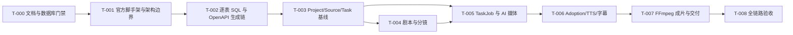

# AI短剧端到端实施计划

## 1. 准入与完成定义

本 Plan 当前为 `draft`，不得开始应用实现。只有 REQ-01～08、DESIGN-01～07、PRODUCT-01 与本 Plan 全部为 `accepted`，且 `database_design_ready` 通过，才能执行 T-001。上游变化必须先更新本 Plan；Acceptance 只在实现完成后创建和回填。

MVP 完成不是“接口可调用”，而是固定六镜头样例能从正文连续运行到可播放 MP4，并保留 Task/Attempt/TaskJob、候选采用、MinIO 媒体和完整谱系。范围固定如下：

- 仅有 `backend/`、`frontend/` 两个应用根；后端只有 `backend-api` 与 `backend-worker` 两个入口。
- PostgreSQL 是业务与任务恢复事实源，TaskJob lease 是唯一持久后台执行机制；不引入 Temporal、Celery、Redis、Dramatiq、LangGraph 或进程内后台任务。
- MinIO 是唯一对象存储；复用用户现有 PostgreSQL/MinIO，不由仓库 Compose 管理其生命周期。
- Redux Toolkit 是唯一前端状态容器；RTK Query 管服务端缓存，普通 Slice 只管未提交编辑状态。
- FastAPI OpenAPI 是唯一 HTTP 契约；`@umijs/openapi` 只生成 DTO/请求函数，手写 RTK Query 层负责缓存与轮询。
- 数据库运行时仅用 asyncpg 参数化 SQL；物理 Schema 的唯一来源是根 `sql/` 中按表拆分的标准 SQL，Alembic 只排序执行，不使用 ORM/Metadata/autogenerate。

每个任务完成需同时满足：目标测试 Green、相关 lint/type/build 通过、只提交本任务文件、记录命令与结果。功能切片提交顺序固定为 `test:` → `impl:`/`feat:` → 可选 `refactor:`/`docs:`。

## 2. 目标目录

```text
backend/
├── pyproject.toml, uv.lock, .python-version, alembic.ini
├── openapi/openapi.json
├── migrations/{env.py,versions/0001_mvp.py}
├── scripts/export_openapi.py
├── src/lanverse/
│   ├── entrypoints/{api.py,worker.py}
│   ├── bootstrap/{api.py,worker.py,container.py,lifespan.py}
│   ├── shared_kernel/{config.py,errors.py,ids.py,clock.py,logging.py}
│   ├── infrastructure/{database,idempotency}/
│   ├── integrations/{ai,minio,ffmpeg}/
│   ├── jobs/{runner.py,handlers.py}
│   └── modules/{project_catalog,story_development,generation,production_jobs,media_library,delivery}/
└── tests/{unit,architecture,contract,migrations,integration,jobs,fixtures,e2e}/
frontend/
├── package.json, pnpm-lock.yaml, components.json, openapi2ts.config.ts
├── src/app/, src/features/, src/components/ui/
├── src/lib/request.ts
├── src/services/{api.ts,generated/}
├── src/store/{make-store.ts,hooks.ts,slices/}
└── e2e/
sql/{01_projects.sql,...,20_delivery_versions.sql,README.md} # 20 个自包含逐表 SQL
docker-compose.yml
```

根目录不创建 `deploy/`、`env/` 或提交 `.env`。其他环境只有在正式进入范围后才创建 `docker-compose-<env>.yml`，生产名称固定 `docker-compose-prod.yml`。

## 3. 依赖与生成策略

| 领域 | 锁定基线 | 约束 |
| --- | --- | --- |
| Python | Python 3.13.14、uv/uv_build 0.11.31 | `uv.lock` 提交，所有直接依赖 exact pin |
| API/契约 | FastAPI 0.139.2、Pydantic 2.13.4、pydantic-settings 2.14.2 | 开发 `/docs`、`/openapi.json`；生产默认关闭 Swagger |
| 数据 | asyncpg 0.31.0、Alembic 1.18.5、PostgreSQL | 应用源码不导入 SQLAlchemy；Alembic 的传递依赖不作为 ORM 使用 |
| AI/媒体 | langchain-core 1.5.1、批准 Provider 集成、MinIO 7.2.20、HTTPX 0.28.1、rfc8785 0.1.4、FFmpeg/ffprobe | 文本可用 LangChain Core；图片/视频/TTS 可用直接 Adapter；无自动 fallback |
| 前端 | Node 24.18.0 LTS、pnpm 11.15.1、Next.js 16.2.11、React 19.2.4 | 官方 create-next-app，App Router |
| UI/状态 | shadcn 4.14.1、radix-ui 1.6.5、Redux Toolkit 2.12.0、React-Redux 9.3.0 | shadcn base=radix；不用 Zustand/TanStack Query |
| 客户端生成 | `@umijs/openapi` 1.14.1 | `schemaPath=../backend/openapi/openapi.json`、`serversPath=./src/services/generated`、`requestLibPath=@/lib/request` |

`contracts-check` 顺序固定为：导出 FastAPI OpenAPI → 断言 OpenAPI 3.1 artifact operation exact-set → 执行 `openapi2ts` → TypeScript 编译生成目录 → `git diff --exit-code`。若锁定版 `@umijs/openapi` 不能消费 FastAPI 3.1 artifact，T-002 直接失败并回到 Design，不生成第二份 3.0 契约。

## 4. 任务依赖图



## 5. TDD 实施任务

| 任务 | Red 证据 | 最小 Green 实现 | 完成证据 |
| --- | --- | --- | --- |
| T-000 文档与数据库门禁 | 校验状态、追踪矩阵、20 个根 SQL 的文件/表/列/内联 FK/partial、20 表/51 FK/15 候选 UQ/13 partial UQ/4 partial index/22 JSONB 映射；任一上游非 accepted 必须失败 | 只修正式 Markdown、逐表 SQL 和 gate Markdown，不在 `docs/` 增加机器 artifact | 20 个 SQL 通过 PostgreSQL parser；`docs/` 只有 `.md`；不执行 DDL、不创建应用目录 |
| T-001 官方脚手架与边界 | 架构测试先断言两个应用根、两个后端入口、六模块、public-only、无 ORM/工作流框架/第三入口、根 Compose 三服务 | 用 uv/create-next-app/shadcn 官方命令生成；建立 Composition Root、Redux Provider、健康检查和根 Compose | `make test-architecture`、后端 import、前端 lint/typecheck、`docker compose config --services` 恰为三项 |
| T-002 SQL 执行与契约生成 | migration test 先以根 SQL 静态 exact-set 为输入，并断言空 catalog 尚未满足；contract test 断言 operation exact-set、Problem、幂等/ETag/202；OpenAPI 3.1→umi 生成先失败 | 完成只读取根 SQL 的 `0001_mvp`、asyncpg pool/transaction、OpenAPI 导出、`openapi2ts.config.ts`、request sender、生成目录和手写 RTK Query 层 | 隔离空库双 `alembic upgrade head`；catalog exact-set；`make contracts-check` 零 diff |
| T-003 Project/Source/Task 基线 | normalization、权利声明、幂等 20 并发、ETag、Task 初始事实与轮询测试 Red | Project/Episode/Source、IdempotencyRecord、Snapshot/Task/Attempt/Event/TaskJob Repository 与页面壳 | 目标 unit/integration/contract 与 Playwright 基线路径 Green |
| T-004 剧本与分镜 | 严格 Pydantic 契约、哈希、版本确认、派生、旧输入冲突、6～10 镜头测试 Red | Mock TextProvider、Script/Asset/Shot handlers、Story UI；只实现已定义 Operation | 固定夹具生成并确认 Script/Shot，重复执行结果稳定 |
| T-005 TaskJob 与 AI 媒体 | lease 竞争、心跳、过期恢复、提交超时 unknown、Provider 对账、取消、迟到、部分失败测试 Red | Job runner/handlers、Registry、文本/图片/视频/TTS 确定性 Mock、真实 Adapter 端口、MinIO 下载/探测/登记 | 双 Worker 竞争仅一方领取；五个故障点恢复≤120秒且不重复副作用 |
| T-006 Adoption/TTS/字幕 | active slot 并发唯一、input_hash、逐句失败、Cue 边界/重叠/舍入、授权 TTL/CORS 测试 Red | Studio、Adoption、TTS 媒体、SubtitleVersion 与预览授权 | 固定六镜头具备视频和所需 TTS Adoption，字幕确认通过 |
| T-007 FFmpeg 与交付 | RenderSnapshot 幂等、缺项、资源上限、ffprobe、Manifest/下载授权测试 Red | Render Job Handler、Delivery、MP4/SRT/Manifest、Delivery UI | 720×1280、24fps、H.264/AAC、30～60秒、音画差≤100ms，三件产物 hash 可追溯 |
| T-008 全链路验收 | Playwright 全故事、第三镜首次失败、Worker 重启、刷新恢复、20 次幂等重放先 Red | 仅修已接受契约内缺口；执行 Mock 全闭环和一次真实 Provider smoke | Mock 连续 3 次通过；真实 smoke 有输入、费用、产物或明确失败证据；创建并回填 ACCEPTANCE-01 |

## 6. TaskJob 执行契约

API 受理异步命令时在同一 PostgreSQL transaction 写 Snapshot、Task、初始 Attempt、TaskEvent、TaskJob 和 IdempotencyRecord。Worker 用短事务按 `(next_attempt_at,created_at,id)` 执行 `FOR UPDATE SKIP LOCKED`，写 owner/deadline 后提交；外部调用期间不持有数据库锁，并按固定间隔心跳续租。

每次外部提交前先保存稳定 `provider_request_key`。Worker 崩溃后，继任者只领取已过期 lease，并优先以本地 Attempt、Provider request ID/client token、MinIO object key/hash 对账。无法证明受理与否时写 `unknown` 并停止自动提交；不得换 Provider、伪造 failed 或重复高成本副作用。failed TaskJob 只允许显式 replay。

MVP 不选 Temporal 的原因是当前只有单体、单 Worker、无跨服务补偿或长周期人机等待；PostgreSQL 已是事实源，TaskJob 可减少一套控制面和本地基础设施。若以后出现多服务 Saga、跨天 timer/signal、Worker 版本路由或大规模并发，再单独立 Design/ADR 评估 Temporal。FastAPI BackgroundTasks 不持久；Celery/Dramatiq 需新 broker；LangGraph 适合 Agent 图而非本次任务事实源，均不作为当前替代实现。

## 7. 本地环境与 Compose

`docker-compose.yml` 只构建/运行 frontend、backend-api、backend-worker。必须从当前 shell 读取 `DATABASE_URL`、MinIO endpoint/public endpoint/bucket/region/credentials 和 Provider 配置；变量缺失时 Compose/config 或应用启动快速失败，只输出变量名，不输出值。不得扫描、复制或提交用户现有 env 文件。

```bash
docker compose -f docker-compose.yml config --services
docker compose -f docker-compose.yml up --build
docker compose -f docker-compose.yml stop -t 30 frontend backend-api
docker compose -f docker-compose.yml stop -t 660 backend-worker
```

只停止应用服务；不得执行会删除 volume 的命令，也不得停止或修改用户现有 PostgreSQL/MinIO。未来生产叠加命令为 `docker compose -f docker-compose.yml -f docker-compose-prod.yml ...`，但 T-001 不预建该文件。

## 8. 验证命令与证据

| 证据 | 命令/结果要求 | 覆盖 |
| --- | --- | --- |
| EV-000 | PostgreSQL parser 检查 20 个根 SQL；`find docs -type f ! -name '*.md'` 无输出；门禁 Markdown 记录输入版本与评审结论 | Design、根 SQL 与数据库门禁 |
| EV-001 | `make test-architecture`、`docker compose ... config --services` | 目录、依赖、三应用服务、无禁用技术 |
| EV-002 | `make test-migration contracts-check test-contract`；空测试库双 upgrade/catalog exact-set，OpenAPI/umi 零漂移 | 逐表 SQL、Swagger、HTTP、生成客户端 |
| EV-003 | Project/Source/Task 集成测试与 20 次并发幂等查询 | 受理、幂等、状态分离 |
| EV-004 | `make test-jobs test-integration` | TaskJob lease、unknown、重启、局部失败、观测 |
| EV-005 | Adoption/MinIO 谱系集成测试 | 候选、采用、媒体追踪 |
| EV-006 | Render/字幕/ffprobe 集成测试 | TTS、字幕、成片、规格 |
| EV-007 | `pnpm --dir frontend exec playwright test` | 完整用户流与 2 秒轮询 |
| EV-008 | `make test-e2e lint typecheck build`，Mock 连续 3 次 | CI、Mock 闭环、构建 |
| EV-009 | `make acceptance-real` 与 secret/network scan（显式受控凭据） | 真实 Provider 与安全 |
| EV-010 | 机器追踪检查和 Delivery 反向查询 | Requirement→证据与完整谱系 |

测试数据库必须使用独立名称并在命令开始前验证目标；不能指向用户现有业务库。测试对象使用专用 bucket/prefix，清理只允许删除本次 run_id 创建且已核对的对象。

## 9. 风险、回滚与 Acceptance

| 风险 | 预防/证据 | 回滚 |
| --- | --- | --- |
| umi 不兼容 OpenAPI 3.1 | T-002 最先运行兼容测试 | 阻断并回到 Design 选型，不维护双契约 |
| 租约过期导致重复提交 | stable request key、远端查询、输出唯一键、故障注入 | Task unknown/人工对账，不伪成功 |
| 现有本地环境配置不一致 | 启动诊断只显示缺失变量名和脱敏 endpoint | 停止应用容器，不修改基础设施 |
| AI 输出或媒体不合规 | 严格 Schema、MIME/字节/ffprobe、Candidate blocked | 保留历史，按失败 usage slot 新 Task |
| 资源耗尽 | Worker 并发/临时目录/FFmpeg 限制 | 停止领取，等待 lease/Attempt 安全收敛 |

回滚顺序为停止 frontend/backend-api 接收命令，再让 worker 停止领取并等待当前任务；超时退出后由 lease expiry 与对账恢复。数据库只前滚修正，不破坏性 downgrade；不得删除 PostgreSQL 事实、MinIO 对象或用户环境。

T-008 完成后才创建 `docs/acceptance/01-AI短剧端到端验收.md`，逐项记录 EV-000～010 的精确命令、退出码、摘要、产物/截图、残余风险与结论。Mock 通过但真实 Provider 未验证时，结论必须是 `insufficient`，不能判定 accepted。
