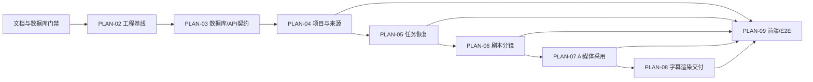

# MVP总执行计划

## 1. 准入状态与目标

本 Plan 与 PLAN-02～09 已完成评审并进入 `accepted`。只有当前输入完全匹配的 `database_design_ready` 与 `implementation_start` 依次 `passed` 后，才能从 PLAN-02 的首个脚手架任务开始。

交付目标是固定六镜头 fixture 能从获权正文连续运行到可播放 MP4，并保留来源/创作版本、Task/Attempt/TaskJob、Candidate/Adoption、MinIO MediaVersion、Subtitle/RenderSnapshot/Delivery 和完整谱系。Acceptance 只在全部实现完成后创建。

## 2. 实现 allowlist

- 应用根只有 `backend/` 与 `frontend/`，后端入口只有 `backend-api` 与 `backend-worker`。
- PostgreSQL 是业务与恢复事实源，TaskJob lease 是唯一后台机制；MinIO 是唯一对象存储。
- FastAPI/Pydantic OpenAPI 是唯一 HTTP 契约，`@umijs/openapi` 生成前端 DTO/请求，页面只经手写 RTK Query 层访问。
- 后端为六模块 FastAPI 模块化单体，asyncpg 参数化 SQL；根 `sql/` 的 20 个逐表文件是物理 Schema 唯一源。
- 前端使用官方 create-next-app、shadcn/Radix 和 Redux Toolkit；RTK Query 管服务端缓存，Slice 只管未提交编辑。
- AI 经 `langchain-core` 能力端口、Registry 和 Adapter 支持多 Provider/模型；无自动 fallback。
- FFmpeg/ffprobe 在服务端合成和质检；Compose 位于根且只管理三个应用服务。

未能同时映射正式输入、Test ID 和 Evidence ID 的目录、接口、表、依赖、Feature Flag 或占位代码不允许实现。

## 3. 计划依赖图



同一时刻只启动直接上游已 Green 的切片，执行顺序固定为 PLAN-02→03→04→05→06→07→08→09；发现范围缺口先回到对应正式文档，不跨计划预建实现。

## 4. 子计划责任

| Plan | 交付责任 | 核心 Test ID | Evidence |
| --- | --- | --- | --- |
| PLAN-02 | 官方脚手架、目录/依赖边界、Composition Root、根 Compose | `T-SCOPE/T-ARCH/T-BOUNDARY/T-BUILD` | EV-001 |
| PLAN-03 | 逐表 SQL 迁移、asyncpg、OpenAPI/umi 生成链 | `T-DATABASE-DESIGN-GATE/T-MIGRATION/T-DB-CONSTRAINTS/T-CONTRACT` | EV-000～002 |
| PLAN-04 | Project/Episode/Source | `T-PROJECT-SOURCE` | EV-003 |
| PLAN-05 | Task/Attempt/TaskJob、幂等、重试、恢复 | `T-TASK-ACCEPT/T-TASK-IDEM/T-TASK-RECOVERY/T-UNKNOWN/T-PARTIAL` | EV-004 |
| PLAN-06 | Script/Assets/Storyboard 与版本规则 | `T-STORYBOARD/T-VERSION` | EV-003 |
| PLAN-07 | AI Registry、Media、Candidate、Adoption | `T-ADOPTION/T-MEDIA-TRACE` | EV-005 |
| PLAN-08 | TTS 字幕、Render、ffprobe、Delivery | `T-TTS/T-RENDER/T-FFPROBE` | EV-006 |
| PLAN-09 | 五工作区、轮询、Mock E2E、真实 smoke、安全与追踪 | `T-POLL/T-FLOW/T-E2E-MOCK/T-REAL-SMOKE/T-CI/T-SECURITY/T-TRACE` | EV-007～010 |

## 5. 里程碑与关闭条件

| 里程碑 | 必须 Green | 允许进入 |
| --- | --- | --- |
| M0 文档/数据库准入 | 所有上游 accepted；database gate passed；根 SQL 静态 exact-set | PLAN-02 |
| M1 工程可构建 | 架构边界、两个 lockfile、三服务 Compose、lint/typecheck/build | PLAN-03 |
| M2 基础契约可执行 | 空库双迁移、catalog exact-set、OpenAPI 3.1/umi 兼容探针 | PLAN-04～06 |
| M3 创作基线可确认 | Project/Source/Script/Assets/Storyboard 集成测试 | PLAN-07 |
| M4 生产可恢复 | TaskJob 故障注入、媒体探测、采用唯一、部分重试 | PLAN-08 |
| M5 成片可交付 | 字幕、FFmpeg、ffprobe、谱系全部 Green | PLAN-09 |
| M6 MVP 可接受 | Mock E2E 连续 3 次、真实完整样片、全门禁 Green | ACCEPTANCE-01 |

## 6. TDD、提交与验证纪律

每个行为切片先提交能证明当前契约未满足的 `test:` Red，再提交最小 `impl:`/`feat:` Green，必要时追加 `refactor:`/`docs:`/`chore:`。Red 必须展示预期失败信号；Green 必须运行子计划指定目标命令。每次只显式暂存任务文件，提交前后执行 `git diff --check` 和 `git status --short`。

子计划命令由根 Makefile 暴露，最终至少包含：

```bash
make test-architecture test-migration contracts-check test-jobs test-e2e
make lint typecheck build
```

测试数据库与 bucket/prefix 必须隔离并核对目标；清理只删除当前 run_id 创建的对象，不修改用户既有 PostgreSQL/MinIO。

## 7. 风险与总回滚

| 风险 | 阻断证据 | 回滚 |
| --- | --- | --- |
| OpenAPI 3.1 无法被 umi 消费 | PLAN-03 兼容 Red/Green | 回到 Design，不维护第二契约 |
| 租约导致重复供应 | PLAN-05 五点故障注入 | unknown/人工对账，不伪成功 |
| AI 媒体无效或额度不足 | PLAN-07 技术探测、PLAN-09 真实 smoke | Mock 仅保留工程验证，Acceptance 不通过 |
| FFmpeg 资源耗尽 | PLAN-08 限制与故障测试 | 停止领取新 Job，保留快照 |
| 本地环境配置错误 | 启动只报告缺失变量名/脱敏 endpoint | 只停止三个应用服务，不改基础设施 |

总回滚先停止 frontend/backend-api 接收新命令，再使 Worker 停止领取并等待当前 Job；超时退出后依靠 lease 和对账恢复。数据库只前滚修复，绝不删除 PostgreSQL 事实或 MinIO 对象。

## 8. Definition of Done

- PLAN-02～09 的全部任务、Test ID、Evidence ID 与 AC 映射完成，无未追踪 P0。
- 目标测试、`lint/typecheck/build`、Mock E2E 3 次和真实 smoke 均有精确命令、退出码和制品。
- Delivery 可反查全部来源、版本、任务、模型、采用、媒体与工具版本。
- 实现后创建并回填 ACCEPTANCE-01；任一证据缺失或失败时结论不得为 `accepted`。
