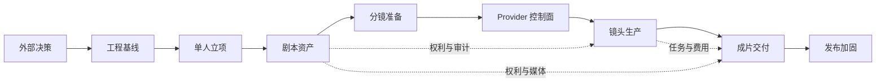

# PRD-003 MVP 执行计划与追踪矩阵

- 状态：proposed
- 日期：2026-07-27
- 输入：[MVP 产品定义](./001-MVP产品定义与范围.md)、[纵向交付切片](./002-MVP纵向交付切片.md)、[基础业务模块任务](./007-基础业务模块PRD任务.md)、[创作生产模块任务](./008-创作生产模块PRD任务.md)、[剪辑交付与平台保障任务](./009-剪辑交付与平台保障PRD任务.md)、[AI 提供方配置与启用](./011-AI提供方配置与启用PRD.md)、[需求设计与产品任务追踪](./010-需求设计与产品任务追踪矩阵.md)、[项目工程规范](../design/000-项目顶层结构与工程规范.md)
- 输出：决策顺序、工作包、依赖、交付门禁、需求追踪和完成定义
- 下游：[PLAN-003 MVP 工作包与交付门禁执行计划](../plan/003-MVP工作包与交付门禁执行计划.md)；实现后创建 Acceptance 证据

## 1. 执行结论

执行以 S0–S6 为主排序轴，新增 AIP Provider 控制面作为 S3 后、真实 S4 Provider 执行前的独立工作流；以 PRD-007 至 PRD-009 和 PRD-011 的 PT（Product Task）为产品范围与接受单位，以 PLAN-000/011 的唯一 `DEV-*` 为工程排期、领取和完成单位；WP 只负责组合 PT/DEV，不再充当模糊任务。一个时间点只允许一个主实施工作流处于本地工程 `in_progress`；仅等待外部 API Key/额度的上游 Provider 验收作为发布门禁跟踪，不占用本地工程在制品，也不能被后续完成状态覆盖。每项 PT 采用 `确认范围 → 写失败验收/测试 → 最小实现 → OpenAPI/client → 前端闭环 → 真实依赖验证 → 产品接受`，不按“先做完后端所有表、再做前端”推进。

本文件是产品级执行分解，不替代代码级 Plan。[PLAN-000](../plan/000-MVP全栈实施总计划.md) 统一跨 PRD 的全栈实施基线，[PLAN-003](../plan/003-MVP工作包与交付门禁执行计划.md) 承接本 PRD 的具体编排；只有本 PRD 中当前切片范围在确定 commit 上形成接受记录、且当前切片准入条件关闭后，对应 DEV/PT 才可进入实施。全局文档中尚未进入的切片可继续保持 `proposed`。

## 2. 决策与准入清单

| 编号 | 当前状态 | 必须决策 | 责任角色 | 阻塞切片 | 关闭证据 |
| --- | --- | --- | --- | --- | --- |
| D-001 | closed | 接受 MVP 范围/非目标、固定技术基线与 S0 工程边界 | 产品负责人/工程负责人 | S0 | 2026-07-28 用户明确要求全部 Plan 转为可执行；局部接受 REQ-001、DES-000/002、DES-MOD-001/011/012/013/014、PRD-001/002/003 中 PLAN-000 明列的 S0 范围；基线从 commit `199c94d` 开始并包含本次可执行化修订；DEV-S0-01 owner=`StephenQiu30` |
| D-002 | closed | 本地账号、JWT 参数、注销和恢复边界 | 产品/后端 | S1 | 2026-07-29 用户固定 FastAPI + JWT，不使用 Keycloak/OIDC；邮箱登录、Argon2、HS256、issuer=`lanverse-api`、audience=`lanverse-web`、30 分钟访问令牌；注销/改密递增 token_version，MVP 不做 refresh token/MFA/邮件找回 |
| D-003 | closed | Text Provider、模型、框架与默认配置 | 产品/AI | S2 | 2026-07-30 产品负责人明确：使用 `langchain-deepseek==1.1.0` 接入 DeepSeek 官方 `deepseek-v4-pro` 非思考结构化输出；只增加 `DEEPSEEK_API_KEY`，真实调用与固定剧本验收后才接受 S2 |
| D-004 | open（公开契约已收窄） | Image/Video Provider、参数、取消/查询能力和计价 | 产品/AI | S4 | 2026-07-31 已复核官方 SDK 5.0.43 的 `AsyncArk`、图片与视频 task 资源；公开 SDK 不证明模型开通。D-004 仍保持 open，唯一候选仍为北京地域的 `doubao-seedream-5-0-lite-260128`/`doubao-seedance-2-0-260128`；待真实账号确认权限/额度/并发、逐参数、取消/回调竞态和账单。2026-08-04 按用户决定在统一环境契约中保留 `ARK_API_KEY=` 空占位，空值归一化为未配置且不安装 SDK；AI Speech/Audio 不在范围 |
| D-005 | closed | 上线地区、授权模板、审核责任、内容检查、标识和留存 | 产品/合规 | PT-GOV-001/002 与 S2 accepted；S4 真实生成；S5 公开交付 | 2026-07-30 产品负责人确认 [DES-005 中国大陆工程基线](../design/005-AI供应商与合规准入设计.md)：面向中国大陆公众首发；产品负责人承担合规责任角色；无标识导出不进入 MVP；未成年人材料默认阻断；接受五个脱敏 fixture 及逐类最短必要删除/匿名化触发条件。该决策解锁 GOV-001/002 实现，不替代 S4/S5 真实 Provider、内容检查、标识样片及上线材料验收 |
| D-006 | closed | 本地开发不强制 Docker；根 `docker-compose.yml` 是共享全栈事实源，`docker-compose.prod.yml` 只表达生产安全与镜像差异，基础镜像使用 `latest` | 开发负责人 | DEV-S0-04/S0 退出；S4 | 2026-07-31 用户明确 Docker 应承担部署和快速启动职责，并区分 development/production；基础文件包含四项基础设施、server/web、健康依赖、持久化和失败重启，生产薄覆盖层隐藏基础设施端口、禁用 build 并拉取已发布镜像，本地仍可直接使用 venv/npm 与本机服务；[隔离全栈验收](../acceptance/arrived/008-D006全栈Compose部署验收.md)通过 |
| D-007 | open | 固定供应商预算和 S4/S6 故障演练窗口；S3 性能 profile 已固定 | 产品/开发/QA | S4/S6 | S3 的 M5/24 GiB 本机、依赖版本、36/120 Shot fixture 与基准协议见 PLAN-000 §7.5.1；剩余关闭证据为真实供应商预算和演练窗口 |

本表是 D-001～D-007 状态的唯一事实源，只允许 `open`、`blocked`、`closed`。关闭时必须在“关闭证据”中补充可访问记录或仓库内文件位置、日期和对应 commit，不能只修改状态字符串。未关闭的决策允许做不依赖它的测试和内部契约，但不得把被阻塞切片标记完成。D-001 只冻结 S0 必需的范围、非目标和工程基线，不要求 S1～S6 的全部模块细节提前进入 `accepted`；每个后续切片仍必须在开始前接受该切片对应的 Requirement、Design 与 PRD。任何密钥只进入本地 secret 配置，不进入决策文档或 Git。

## 3. 依赖关系

## 4. 工作包与产品任务顺序

| 工作包 | 切片 | 包含的 PT | 前置 | 工作包退出结果 |
| --- | --- | --- | --- | --- |
| WP-00 | 全局 | 当前切片所需决策 | 用户确认 | 只关闭当前切片门禁；决定有证据，密钥不入库 |
| WP-01 | S0 | PT-DAT-001 的初始化基线、PT-OBS-001 | D-001（S0 基线） | setup 无污染、空库增量初始化、日志基线和架构测试通过；不预建业务 Model |
| WP-02 | S0 | PT-STO-001；Redis/RabbitMQ 连接基线 | D-006、WP-01 | API 按硬依赖/降级能力报告状态，MinIO 契约真实，OpenAPI client 无漂移 |
| WP-03 | S1 | PT-IDN-001–004、PT-PRJ-001–003；开始 PT-DAT-003 | D-002、WP-02 | 真实注册/登录、JWT 撤销、数据库租户约束、空间隔离、Project/Episode 生命周期闭环 accepted |
| WP-04 | S2 | PT-PROD-001、PT-MQ-001/002、PT-SCR-001–005 | D-003、WP-03 | 剧本版本、异步提取、人工决议和确认结构 accepted |
| WP-05 | S2 | PT-MED-001–003、PT-GOV-001/002、PT-AST-001–003/005 | D-005、WP-04 | 私有媒体、授权和 ready 资产闭环 accepted |
| WP-06 | S3 | PT-SBD-001–006、PT-AST-004 | WP-05 | 镜头规格、顺序、变换、准备度和升级 accepted |
| WP-AIP | AIP 控制面 | PT-AIP-001–007 | WP-06、DES-009 accepted、PRD-011 accepted；PT-AIP-006 另需真实 DeepSeek | 预设、加密配置、检查、唯一用途绑定、轮换、DeepSeek 切换和管理页分层 accepted；不关闭 D-004 |
| WP-07 | S4 | PT-PROD-002–006、PT-PROD-008、PT-MQ-003/004、PT-SCH-001/002 | D-004/D-006、WP-06 | 预检、提交、任务/Attempt、unknown 对账和费用链 accepted |
| WP-08 | S4 | PT-PROD-007/009、PT-MED-004 | WP-07 | 候选选择、批量局部失败、媒体血缘和真实 Provider E2E accepted |
| WP-09 | S5 | PT-EDT-001–005、PT-GOV-003/004 | WP-08 | 时间线编辑、发布、Issue 返工和重新批准 accepted |
| WP-10 | S5 | PT-EDT-006/007、PT-GOV-005；依赖已 accepted 的 PT-MED-004 | D-005、WP-09 | FFmpeg 渲染、标识、Manifest 和下载 accepted |
| WP-11 | S6 | PT-DAT-002/003、PT-CCH-001/002、PT-MED-005、PT-SCH-003、PT-OBS-002/003、PT-GOV-006 | D-007、WP-10 | 故障、性能、安全、可访问性和告警加固任务 accepted |
| WP-12 | S6 | M1–M8；PT-STO-002 仅在 OSS 上线时 | WP-11 | 固定剧本两次闭环、一次恢复演练、残余风险评审完成 |

## 5. 模块到工作包映射

工作包按纵向结果组合模块，但不能替代模块负责制。工作包退出时，除 PRD-002 切片证据外，还必须通过下表所指 PRD 的模块验收。

| 模块/能力 | PT 范围 | 主工作包 | 首次用户结果 |
| --- | --- | --- | --- |
| identity | PT-IDN-001–004 | WP-03 | S1 登录与隔离空间 |
| projects | PT-PRJ-001–005 | WP-03，PT-PRJ-004/005 随下游接入 | S1 立项与下一动作 |
| media | PT-MED-001–005 | WP-05/08/10/11 | S2 私有上传和稳定版本 |
| governance | PT-GOV-001–006 | WP-05/09/10/11 | S2 授权与权利门禁 |
| scripts | PT-SCR-001–005 | WP-04 | S2 确认结构 |
| assets | PT-AST-001–005 | WP-05/06 | S2 ready 资产 |
| storyboards | PT-SBD-001–006 | WP-06 | S3 ready 镜头规格 |
| production | PT-PROD-001–009 | WP-04/07/08 | S2 可恢复提取任务；S4 镜头生成 |
| AI Provider 控制面 | PT-AIP-001–007 | WP-AIP | 主流预设、安全配置、用途切换与 DeepSeek 数据库绑定 |
| editing | PT-EDT-001–007 | WP-09/10 | S5 可下载成片 |
| PostgreSQL | PT-DAT-001–003 | WP-01/11 | S0 可验证事实结构 |
| RabbitMQ | PT-MQ-001–004 | WP-04/07 | S2 可恢复异步提取 |
| Redis | PT-CCH-001/002 | WP-11 | S6 正确回源和成本保护 |
| MinIO/OSS | PT-STO-001/002 | WP-02；OSS 上线门禁 | S0 MinIO 端口；条件性 OSS |
| Scheduler | PT-SCH-001–003 | WP-07/11 | S4 持久到期任务 |
| 日志/trace/metrics | PT-OBS-001–003 | WP-01/11 | S0 日志；S6 全链路告警 |

## 6. 每个工作包的执行循环

1. Product/Design gate：绑定用户故事、需求编号、输入事实、非目标、错误与下一动作；外部决定未关闭则停止。
2. Red：先写领域规则、真实 PostgreSQL/基础设施契约或浏览器验收，使缺失行为可见；无法自动化的判断记录具体人工步骤。
3. Green：只创建当前用例使用的模块文件、表、接口和组件；不预建未来模块、兼容层或万能抽象。
4. Refactor：测试通过后消除当前切片内的真实重复，保持模块公开依赖单向，不扩张范围。
5. Contract：更新 FastAPI OpenAPI，通过 URL 生成 `frontend/src/api/`，禁止手写平行 URL/DTO。
6. Frontend：ViewModel 读取服务端状态与 next_action；Redux slice 只保留未提交草稿/选择/布局；页面和测试分别进入规定目录。
7. Evidence：运行当前切片全部门禁，记录真实命令和未验证外部条件；中断或 fake-only 不能报告为完成。
8. Review：产品负责人按 PRD-002 退出条件接受切片后，才切换下一个主切片。

## 7. 需求追踪摘要

本节只用于执行视角的模块级导航；461 个 ENT/FR/IF/NFR 叶子的精确 Design 与 PT/验收归属以 [PRD-010](./010-需求设计与产品任务追踪矩阵.md) 为准。

| 需求 | PT 覆盖 | 主切片 | 关键退出证据 |
| --- | --- | --- | --- |
| REQ-001 平台总体 | M1–M8、PT-DAT | S1–S6 | 单人单集端到端、版本/成本/交付追踪、非目标守卫 |
| REQ-002 用户空间 | PT-IDN-001–004 | S1 | 注册原子性、JWT 撤销、角色矩阵、跨空间不可探测 |
| REQ-003 项目 | PT-PRJ-001–005 | S1–S5 | 生命周期、重排、版本入口、服务端 Snapshot |
| REQ-004 媒体 | PT-MED-001–005 | S2/S4/S5 | 私有直传、hash、不可变版本、Lineage、位置切换 |
| REQ-005 审核治理 | PT-GOV-001–006 | S2/S5 | Consent、RightsGate、Issue/Decision、标识和审计 |
| REQ-006 剧本 | PT-SCR-001–005 | S2 | 来源/版本、提取、人工决议、结构确认和影响 |
| REQ-007 资产 | PT-AST-001–005 | S2/S3 | 六类规格、readiness、反向引用和升级 |
| REQ-008 分镜 | PT-SBD-001–006 | S3 | ShotSpec、重排/变换、readiness、版本冲突 |
| REQ-009 生产 | PT-PROD-001–009 | S2/S4 | 预检、Task/Attempt、unknown、Candidate、费用 |
| REQ-010 剪辑交付 | PT-EDT-001–007 | S5 | TimelineVersion、返工、Render、Manifest、下载 |
| REQ-011 消息队列 | PT-MQ-001–004 | S2/S4/S6 | Outbox/Inbox、confirm/manual ack、重投和有界执行 |
| REQ-012 日志可观测 | PT-OBS-001–003 | S0/S6 | JSON/trace、脱敏、低基数指标、告警与降级 |
| REQ-013 缓存存储调度 | PT-CCH、PT-STO、PT-SCH | S0/S4/S6 | Redis 回源、存储契约、Fire 防重和 misfire |
| REQ-014 AI 提供方配置 | PT-AIP-001–007 | AIP 控制面/S4 前置 | 预设、加密凭据、健康、唯一 Binding、DeepSeek 切换与页面 |

## 8. Definition of Ready

一个 PT 只有满足以下条件才进入 ready：所属 Design/PRD 的当前切片范围已在确定 commit 上被接受；PRD-010 中所有对应叶子均有 Design 和验收归属；依赖 PT 已 accepted；相关决策关闭；用户结果、范围、非目标、事实所有者和交接明确；验收中的成功、失败、权限、并发、恢复 fixture 可执行；样例不含真实个人数据或密钥。WP 不能绕过其中任一 PT 的准入条件。

## 9. Definition of Done

- PT 的需求/设计追踪、交付边界和逐项验收全部有真实证据；对应 PRD-002 切片退出条件与 PRD-007 至 PRD-009 或独立 PRD-011 里程碑同时通过。
- 核心规则遵循 Red → Green → Refactor；真实 PostgreSQL 和当前使用的 Redis/RabbitMQ/MinIO/Provider/FFmpeg 契约通过。
- Ruff、Pyright、Pytest、前端 lint/type/Vitest、OpenAPI 漂移检查和相关 Playwright 通过；中断/跳过项明确列出。
- Workspace 权限、幂等、不可变、费用、unknown 恢复、日志脱敏和 secret 扫描没有高风险缺口。
- diff 只含当前工作包，测试与生产目录分离，工作区无缓存、日志、媒体、报告或 `.env`。
- 产品负责人把 PT 状态改为 accepted；代码合并、接口可用或页面存在均不能自动改变产品状态。真实供应商/合规/性能未验收时只能保持 in_progress 或 blocked。

## 10. 计划命令契约

本地与 CI 直接使用 Python、npm 和 Docker Compose，不维护根命令转发层。外部契约只通过对应 `LANVERSE_RUN_*` 开关显式执行，缺少服务或凭据时快速失败，不进入默认 Pytest；六服务定义只存在于共享基础 Compose，生产文件只维护必要差异。

## 11. 风险控制

- 供应商/价格变化：只有实际接入后才版本化对应能力与价格；D-004 未关闭时不写死模型枚举，不把替身当真实验收。
- 生成一致性不足：固定资产/ShotSpec、候选选择和审核；不承诺提示词一次解决。
- 外部状态未知：稳定请求键、对账和人工处理；禁止盲目重发。
- 范围膨胀：任何 P1 项进入 MVP 必须先指出它替代或推迟的工作包并修订本 PRD。
- 指标无环境：没有固定 fixture、机器和依赖版本时只报告功能结果，不报告性能通过。
