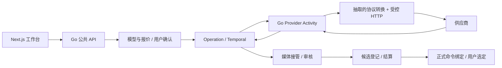

# BeefTV 增量能力与服务适配评估

日期：2026-09-30。状态：**增量调研及服务适配设计建议，待评审；不扩大已接受的无限画布迁移范围，不代表新增能力已实现。**

## 1. 结论

BeefTV 的参考价值成立。Lanverse 已经实际迁入其无限画布核心，接下来最值得吸收的是供应商协议转换、任务失败与恢复、参考素材编辑、提示词优化和素材加工。推荐将可抽取的 Go 协议代码改造成 Lanverse 现有 Worker 内的供应商适配器，将独立前端交互改造成现有业务组件；保留 Lanverse 的 Operation、报价确认、预算、Temporal、PostgreSQL 和媒体接管。

**不建议把 BeefTV 整个后端直接改名并作为第二套生成服务运行。** 那样会同时存在两套任务、状态、重试、媒体和配置所有者。源码能减少协议与交互开发，但服务接线、同步结果合同、计费证据和真实供应商验证仍需完成。

当前最大的实际缺口是生成执行端，而不是画布引擎。公开 API 尚未装配模型目录、报价、确认和任务查询；工作流仍限制为 mock；独立 Python 执行端删除后尚无 Go 承接。这些结论来自当前源码，不能使用旧调研里“只有健康路由”或“仍应保留 React Flow”的历史判断。

## 2. 本次基线与证据边界

| 对象 | 基线 | 用途 |
| --- | --- | --- |
| Lanverse | `main`，读取时 HEAD `8be01b3fc7c8a870a58a29ce5f8e92583ba320b4`，包含已有未提交修改 | 判断当前代码、正式合同和已有移植范围 |
| 已批准的 BeefTV 画布来源 | `0d9e9f48d407570cd431ad9730cdd522b06810c0` | 继续按现有迁移设计固定，不因本次调研自动升级 |
| 本次 BeefTV 公开源码 | `1ae25027f7ea1c2178e1e4133c36a0f2995d0e98`，v1.6.15 | 增量评估协议、交互及新增诊断证据 |

调研期间其他会话提交了起始已有修改；交付检查 HEAD 为 `de289018f91fd66a752dd99f36265244366e3a85`，仍在 `main`。本次没有发起提交或处理其工作区；关键代码结论按交付时文件重新核对，公开路由行号已更新。

在仓库外建立稀疏只读调研副本，读取源码、内置文档、许可证与测试源码；没有安装或运行 BeefTV，也没有调用真实供应商、读取本地凭据或启动服务。测试文件存在只作为场景线索，不作为通过证据。

`git diff --stat 0d9e9f48... 1ae25027...` 显示 38 个文件变化，948 行增加、78 行删除，主要集中在任务请求证据、错误来源和诊断展示。它不是新的画布核心选型。已有[历史调研](BeefTV能力调研与借鉴评估.md)保留其原快照；现有[无限画布迁移设计](../design/BeefTV能力引入设计.md)继续决定已批准范围。

源码来源方面，BeefTV 的 [NOTICE](https://github.com/glanderness/BeefTV/blob/1ae25027f7ea1c2178e1e4133c36a0f2995d0e98/NOTICE)记录其衍生于 `basketikun/infinite-canvas`。它与 LibTV 的产品形态相近，但这不能证明它是 LibTV 的官方实现、具备同等产品能力或具有兼容的服务协议。NOTICE 明确其主要定位为单用户、本地工作区、Wails 桌面和 Go loopback 后端。

## 3. Lanverse 已有能力与当前缺口

| 能力 | 当前事实与证据 | 对本次迁移的影响 |
| --- | --- | --- |
| 无限画布核心 | [第三方声明](../../THIRD_PARTY_NOTICES.md)已列 InfiniteCanvas、选择、视口、布局、历史、LOD、媒体预览等实际移植文件 | 继续复用现有 `components/canvas/engine`，无需再迁一套引擎 |
| 正式画布持久化 | [queries.ts](../../frontend/src/components/canvas/queries.ts)第 16–17、49 行只接受五类 `resource` 节点与 `annotation` 边 | 资源画布已接线；生成节点、业务引用和运行连线仍需正式 DTO 与命令扩展 |
| 公开服务 | [public_api.go](../../backend/internal/app/public_api.go)第 68–74 行装配工作区、项目、画布与媒体读取 | 模型、报价、确认、任务查询不能仅靠增加前端按钮变为可用 |
| 模型注册表 | [model_registry.go](../../backend/internal/catalog/domain/model_registry.go)第 149–165 行已有参数 schema、能力与版本；[参数表单](../../frontend/src/components/catalog/model-params-form.tsx)已有 | 借鉴交互与协议约束，沿用现有注册表，不建立第二份模型事实 |
| 生成工作流 | [workflow.go](../../backend/internal/operation/adapter/workflow/workflow.go)第 127–138 行限制 `mock/agent.mock` | 不只缺 Activity 注册，还缺真实模型与输入执行路径 |
| 媒体 | [handler.go](../../backend/internal/media/adapter/http/handler.go)第 24–26 行仅注册列表与 preview；已有[接管 Activity](../../backend/internal/media/adapter/workflow/activities.go) | 公开上传、完成确认与加工结果登记仍需接线 |
| 执行端与 Agent | [服务目录清理设计](../design/Agent服务目录清理设计.md)明确 Python 执行端删除、Go 承接待 M1-12 | 本次协议抽取可以补执行能力，不能顺带宣称 Harness、审核或对话式 Agent 已迁移 |
| 其他工作台 | [data.ts](../../frontend/src/components/workbench/data.ts)第 1 行注明固定演示样例 | 剧本、镜头和任务页面外观不证明真实领域闭环 |

当前工作区也在做登录清理和业务组件目录迁移。本次不覆盖这些修改；长期消费者身份能力与本次本机工作区模式分别遵循现有设计。

## 4. 可以迁入的能力

下表优先级为本次建议，尚未改写 BACKLOG 或批准新增实施范围。

| 优先级 | 能力及用户收益 | 可复用单位 | Lanverse 必须适配的部分 |
| --- | --- | --- | --- |
| 最高 | 文本、图片、视频、音频的供应商协议：减少请求字段、响应解析和协议差异的重复开发 | [protocol.Adapter](https://github.com/glanderness/BeefTV/blob/1ae25027f7ea1c2178e1e4133c36a0f2995d0e98/backend/internal/protocol/adapter.go#L5-L14)、选定协议的 manifest 与解析测试场景 | Go Activity、凭据注入、出站策略、持久上下文、原有输入/用量合同；每个供应商独立验收 |
| 最高 | 任务错误与恢复：告诉用户失败阶段及正确下一步，保留已提交任务 | [provider_error.go](https://github.com/glanderness/BeefTV/blob/1ae25027f7ea1c2178e1e4133c36a0f2995d0e98/backend/internal/generation/provider_error.go)、[任务详情 hook](https://github.com/glanderness/BeefTV/blob/1ae25027f7ea1c2178e1e4133c36a0f2995d0e98/web/src/hooks/use-task-details.ts) | 映射 Operation 状态与 RFC 9457；重查、下载恢复、新报价分别处理，不能按 `retryable` 自动再次付费 |
| 高 | 媒体上传、拖入、预览与引用：让用户自己的素材进入正式画布 | 上游素材选择与媒体节点交互、现有移植媒体生命周期 | 上传走 Lanverse 媒体合同；预签名、探测、审核和接管后才引用正式 asset ID |
| 高 | 提示词智能引用、优化与采用：减少参考素材指代错误和提示词重写 | [prompt optimizer](https://github.com/glanderness/BeefTV/blob/1ae25027f7ea1c2178e1e4133c36a0f2995d0e98/web/src/lib/plugins/builtin/prompt-optimizer.ts)、输入编辑与结果采用交互 | 保留结构化素材 ID、顺序、角色和最终编译文本；采用前不覆盖原输入；文本模型调用走正式 Operation |
| 高 | 裁切、标注、宫格拆分与局部重绘：继续加工现有素材，减少导出再上传 | [宫格算法](https://github.com/glanderness/BeefTV/blob/1ae25027f7ea1c2178e1e4133c36a0f2995d0e98/web/src/lib/canvas/canvas-grid-split.ts)、图片工具与遮罩编辑交互 | 区分本地编辑与付费生成；产物登记为新资产，保留来源；遮罩能力由模型版本声明，重绘仍报价确认 |
| 高 | 分镜/批量创作表：逐行组织提示词、参考图和候选 | 上游表格编辑、参考重排与行级反馈交互 | 镜头继续是一等业务对象；任务由现有 BatchWorkflow 控制，不能把浏览器循环请求当可靠批量服务 |
| 中 | 结果绑定与迟到结果保护：任务完成后不覆盖用户新选择 | [materializer](https://github.com/glanderness/BeefTV/blob/1ae25027f7ea1c2178e1e4133c36a0f2995d0e98/web/src/services/generation-task-materializer.ts)、[封面写入保护](https://github.com/glanderness/BeefTV/blob/1ae25027f7ea1c2178e1e4133c36a0f2995d0e98/web/src/lib/canvas/director/director-cover-write.ts) | 媒体登记归服务端；绑定经 revision/对象版本命令，任务结果、候选与正式选定分开 |
| 中 | 诊断信息与用户导出：识别本地校验、HTTP、响应解析和下载失败 | [请求证据](https://github.com/glanderness/BeefTV/blob/1ae25027f7ea1c2178e1e4133c36a0f2995d0e98/backend/internal/app/task_request_evidence.go#L72-L130)、[诊断脱敏](https://github.com/glanderness/BeefTV/blob/1ae25027f7ea1c2178e1e4133c36a0f2995d0e98/backend/internal/generation/diagnostics.go#L23-L88) | 接现有审计/OTel/provider_call；输出有界结构化信息，不导出密钥、完整请求、素材地址或原始文本 |
| 中 | 排布、保存冲突与历史预览：提高大画布整理与恢复体验 | 已移植布局核心及上游恢复交互 | 服务端 revision/命令是事实；不迁入“以本地为准强制覆盖云端”策略 |
| V2 | 时间线、字幕、粗剪与成片导出：连成完整视频生产链 | 上游时间线命令状态机、渲染计划与字幕任务设计 | 当前[需求池](../requirement/34-V2与待定需求池.md)第 23–35 行明确为 V2；后续采用服务端媒体 Worker 与 FFmpeg |
| 后续实验 | 3D 导演台、多角度与深度参考视频：加强构图及运动控制 | 镜头编辑交互、相机数据和深度参考处理思路 | 独立验证真实效果、设备、运行时与模型许可；不作为当前生成链的前置条件 |

最先完成供应商、媒体和任务闭环，再加入提示词与图片工具。已经有设计的能力属于实现与联调缺口；新增优化器、诊断包、3D 等先作为设计候选，不自动变成产品要求。

几项容易被功能名称掩盖的限制也须保留：

- **智能引用**是对已连接素材名称和序号的规则匹配；[引用算法](https://github.com/glanderness/BeefTV/blob/1ae25027f7ea1c2178e1e4133c36a0f2995d0e98/web/src/lib/canvas/canvas-resource-references.ts#L59-L146)跳过歧义和已有 mention，不是全库语义搜索。
- **优化器**支持结构化建议，但[解析失败会回退原 prompt](https://github.com/glanderness/BeefTV/blob/1ae25027f7ea1c2178e1e4133c36a0f2995d0e98/web/src/lib/plugins/builtin/prompt-optimizer.ts#L312-L342)。Lanverse 应显示未产生有效建议；模型适配改用能力目录，不复制名称匹配规则。
- **宫格切图**是[浏览器几何裁切](https://github.com/glanderness/BeefTV/blob/1ae25027f7ea1c2178e1e4133c36a0f2995d0e98/web/src/lib/canvas/canvas-image-data.ts#L35-L62)，不是 AI 分割或抠图；[图片标注](https://github.com/glanderness/BeefTV/blob/1ae25027f7ea1c2178e1e4133c36a0f2995d0e98/web/src/components/canvas/canvas-node-annotation-dialog.tsx#L69-L76)合成为 PNG，不能据此承诺可再次编辑的标注图层。
- **局部重绘**先[核验 maskSupported](https://github.com/glanderness/BeefTV/blob/1ae25027f7ea1c2178e1e4133c36a0f2995d0e98/web/src/pages/canvas/use-canvas-media-tools.ts#L960-L978)，适配时也必须校验遮罩尺寸、语义、素材归属和模型支持。
- **批量表**的[浏览器并发调度](https://github.com/glanderness/BeefTV/blob/1ae25027f7ea1c2178e1e4133c36a0f2995d0e98/web/src/pages/canvas/use-canvas-generation-batches.ts#L158-L228)不能作为服务端可靠执行器；参考/行级反馈可复用，预算和任务恢复继续由 BatchWorkflow 负责。

## 5. 应当谨慎或暂缓的能力

1. **旧内置画布 Agent 没有可迁移成品。** 当前[功能文档第 41–47 行](https://github.com/glanderness/BeefTV/blob/1ae25027f7ea1c2178e1e4133c36a0f2995d0e98/docs/content/docs/overview/features.mdx#L41-L47)明确旧 Agent 从入口、接口与调度退场，替换内核仍选型。`cloud_agent*.go` 和 `protocol.AgentAdapter` 可以提供工具协议及恢复思路，不能证明可直接得到 Lanverse 的 AG-UI/Harness/用户确认闭环。[creation-runs 提案/批准/执行/画布 commit](https://github.com/glanderness/BeefTV/blob/1ae25027f7ea1c2178e1e4133c36a0f2995d0e98/backend/internal/handler/creation.go#L71-L83)仍存在，可以参考受控创作合同；时间线 AI 命令助手也仍是另一项能力。旧 Agent 退场不等于所有提案与工具调用均被删除。
2. **运行模式必须按入口核对。** 当前 server 和 desktop profile 共用本地组合根、工作区身份与 SQLite；[bootstrap](https://github.com/glanderness/BeefTV/blob/1ae25027f7ea1c2178e1e4133c36a0f2995d0e98/backend/internal/bootstrap/runtime.go#L88)与[数据库实现](https://github.com/glanderness/BeefTV/blob/1ae25027f7ea1c2178e1e4133c36a0f2995d0e98/backend/internal/database/database.go#L18-L48)支持这一判断。[代码地图](https://github.com/glanderness/BeefTV/blob/1ae25027f7ea1c2178e1e4133c36a0f2995d0e98/docs/content/docs/backend/code-map.mdx#L37-L42)明确不提供登录、计费、支付、公开分享和云存储。功能清单和遗留源码混有这些 hosted 能力，部分文档仍指向已不存在的 `internal/service`，不能将它们当当前可迁移的 SaaS 后端。
3. **本地持久化不能替代正式业务事实。** Wails、SQLite、IndexedDB、本地路径、浏览器配置和整份画布同步不迁入当前服务模型；画布保存继续使用现有 Go/PostgreSQL 命令。
4. **插件平台不是接供应商的必要前置。** 可先提取受审计的选定协议；不为一个供应商引入插件市场、动态脚本执行、整套宿主权限与自动更新。
5. **3D/深度不是通用容器服务。** 上游[深度设备选择](https://github.com/glanderness/BeefTV/blob/1ae25027f7ea1c2178e1e4133c36a0f2995d0e98/backend/internal/app/task_depth_device.go#L19-L25)只接受 darwin/arm64 与 windows/amd64，Linux 不在当前支持范围；深度参考是灰度深度视频，不等同骨骼动捕、角色一致性或最终视频生成。导演台可先参考[机位提示词编译](https://github.com/glanderness/BeefTV/blob/1ae25027f7ea1c2178e1e4133c36a0f2995d0e98/web/src/lib/canvas/director/director-prompt-compiler.ts#L26-L49)。
6. **时间线有两条导出路径。** [画布弹窗](https://github.com/glanderness/BeefTV/blob/1ae25027f7ea1c2178e1e4133c36a0f2995d0e98/web/src/components/canvas/canvas-timeline-dialog.tsx#L499-L525)使用浏览器 FFmpeg.wasm，[独立 editor](https://github.com/glanderness/BeefTV/blob/1ae25027f7ea1c2178e1e4133c36a0f2995d0e98/web/src/lib/plugins/builtin/editor/editor-export.tsx#L52-L73)提交后端渲染任务；[wasm 字幕烧录失败会回退无字幕](https://github.com/glanderness/BeefTV/blob/1ae25027f7ea1c2178e1e4133c36a0f2995d0e98/web/src/lib/timeline/timeline-export.ts#L67-L76)。Lanverse V2 应收敛服务端导出，并把字幕失败作为明确失败/用户选择，不能静默交付不符合同的成片。

## 6. 改造成适配服务的设计建议

### 6.1 方案比较

| 方案 | 收益 | 成本与判断 |
| --- | --- | --- |
| 提取交互与纯协议代码，接入现有 Next.js/Go 模块 | 最大程度利用当前画布、注册表、账本和工作流；只有一份业务事实 | **推荐**。只引入有明确消费者的模块；逐供应商迁移 |
| 整个 BeefTV backend 外挂一个 HTTP 门面 | 短期能利用更多原始代码 | 需要桥接第二份任务数据库、worker、配置、媒体和取消；以当前项目状态不值得 |
| 整体 fork 并改造成 Lanverse | 对独立单用户桌面产品较直接 | 对当前项目相当于重选架构并重做业务边界；当前目标不支持此路线 |

推荐方案所说的“适配服务”是当前 Go Worker 内的执行模块，并不要求新增独立网络服务、数据库或进程。若以后有明确的 GPU/系统依赖隔离需求，再针对该能力设计执行边界。

### 6.2 责任边界



| 所有者 | 必须负责 | 不由上游模块接管 |
| --- | --- | --- |
| `catalog` | 模型能力/参数与价格版本、供应商配置、凭据授权 | 上游静态渠道表、浏览器原始密钥 |
| `operation` | 报价、确认、request key、任务状态、unknown/对账、取消、输入冻结 | 上游任务 worker、重试队列、claim/lease 数据库 |
| Provider Activity 的适配器 | 单次 submit/query/cancel 的协议转换、受控调用、错误与用量归一化 | 编排轮询、预算结算、画布保存 |
| `media` | 下载接管、元数据、内容审核、授权预览与结果身份 | 上游本地文件/任意 URL 直接成为正式资产 |
| `billing` 与正式命令 | 幂等结算、候选和正式选定、文档 revision | 浏览器成功回调直接覆盖选定 |

上游 [protocol.Adapter](https://github.com/glanderness/BeefTV/blob/1ae25027f7ea1c2178e1e4133c36a0f2995d0e98/backend/internal/protocol/adapter.go#L5-L14)恰好声明“只负责协议转换”，宿主负责凭据、出站安全、轮询租约、下载与恢复。它比 `internal/app` 更合适。`internal/generation` 主要是类型、registry 与错误，不能误认为完整执行器；真实 HTTP、输入 hydration、结果下载和任务运行仍在 app 中。

`internal/provider.Registry` 注册的是模型目录插件，见 [ModelCatalogPlugin](https://github.com/glanderness/BeefTV/blob/1ae25027f7ea1c2178e1e4133c36a0f2995d0e98/backend/internal/provider/interface.go#L3-L18)，不能因为名字将它当执行器。上游 [fallback registry](https://github.com/glanderness/BeefTV/blob/1ae25027f7ea1c2178e1e4133c36a0f2995d0e98/backend/internal/generation/registry.go#L139-L227)还按环境和目录隐式发现插件制品，迁移时须改为显式构造与固定协议版本注入。

跨仓库不能直接 import 上游 `internal` 包。实施时将选定的源码和必要依赖带许可移入当前 adapter 边界，或另行抽出公开模块；本次不预建目录或通用 SDK。不复制上游全局配置、依赖定位、Wails/SQLite 启动逻辑。

### 6.3 输入输出合同与阻塞点

现有 [Provider Activity 合同](../../backend/internal/operation/adapter/workflow/provider_contract.go)已承载 `operation_id`、`provider_request_key`、能力/模式/参数、带 role 的输入、加密凭据与 accepted/rejected/not_submitted/unknown。原 Operation 状态和账本不重新设计，但不能把上游方法机械套进这些 DTO。

| 边界 | 当前不匹配 | 拟定处理 |
| --- | --- | --- |
| submit | BeefTV `CreateResult` 可同步返回 succeeded + result；Lanverse submit 只有 outcome/task ID/error，accepted 无任务 ID 会转 unknown | 第一条链优先选具有真实异步 task ID 的供应商。同步 text/image 须先评审 completed result/usage 返回合同，或明确 durable execution receipt；不可伪造供应商任务 ID |
| query/cancel | Lanverse 当前输入只有 task ID/request key；BeefTV PollContext 还需 BaseURL、模型和原始请求 | 显式获得已冻结的操作、协议/版本、路由和 credential reference。任务 ID 按供应商/路由限定；必要 DTO 变化先更新 DES-03/04 并处理真实历史回放 |
| 幂等 | 上游组合执行路径缺 request key 时可新建 UUID；支持查询 task ID 不等于支持按 request key 对账 | 永远使用 Lanverse 持久 request key。供应商无幂等/按键查询证据时，提交不确定进入对账/人工，不能重发 |
| 用量 | 通用 `Usage` map 不证明每条协议都能提供账本所需计费用量 | 按选定能力明确单位、来源、原始回执与冻结价格版本映射；缺证据不能记零费或直接终态 |
| 结果 | 上游可返回 text、base64、本地媒体或需认证的二进制，而现有 query 主体是 result URLs | 文本/二进制按正式结果合同承接；不能伪造 URL 或先写浏览器资产再登记；临时传输方式须有大小、生命周期和授权约束 |
| 取消 | BuildCancel 方法存在不保证选定供应商支持取消，停止本地请求也不证明上游未执行 | 用模型版本能力与真实回执决定 cancelled/not_cancelled/unknown；已产生用量继续核定 |

上游 [组合执行路径](https://github.com/glanderness/BeefTV/blob/1ae25027f7ea1c2178e1e4133c36a0f2995d0e98/backend/internal/app/provider_protocol.go#L59-L130)将 create、poll、download 放在同一次宿主执行中。Lanverse 应拆成单次 Activity 调用，由 Temporal 持有循环、定时与恢复；不能把整个组合函数放进 submit，随后又让 Temporal 再次轮询。

### 6.4 状态与失败路径

- 发送前可判定失败：明确 `not_submitted` 或 `rejected`，按既有规则处理预留与失败。
- 已发出但回执丢失：`unknown`，保留同一 request key，按供应商证据查询；不可直接创建新请求。
- 已 accepted：持久保存真实任务身份和冻结路由；Worker 重启后继续 query，不重新 submit。
- 上游 succeeded、下载失败：只恢复接管，既有任务和费用证据保留；不重新生成。
- 读取失败、SSE 断线、用户切换项目：只影响查询与 UI；不改变 Operation、不自动绑定迟到结果。
- 用户删除节点或更改参考/选定：结果仍可成为原任务候选；绑定必须校验项目、对象版本与 document revision。
- 任务终态与账本：复用现有原子结算与去重，不能凭错误重试标记推断费用。

## 7. 建议先验证的闭环

先接通一个经 P0 确认、具有异步任务与用量证据的真实供应商能力：项目中上传自己的参考素材 → 模型与参数 → 报价 → 明确确认 → submit → 刷新/重启继续 query → 接管/审核 → 候选可预览 → 正式选择及画布绑定 → 账本一致。沿既有 E-30、E-07/08、E-21/24/22 和 M1-12 合同推进，不新增平行任务系统。

评审服务合同后再细化实施任务与验收。必须分别保留三类证据：

1. **技术证据**：协议请求/响应、状态映射、错误脱敏、幂等与并发的单元/合同测试；适用 Go/前端门禁。上游测试场景迁到 `backend/tests/<模块>`，不照搬其测试目录。
2. **真实集成证据**：真实 Go Worker/Temporal/PostgreSQL/对象存储；提交丢回执、Worker 重启、下载失败、取消及重复结算；真实供应商任务、产物与用量可核对。
3. **产品验收**：正式浏览器页面用用户素材走完整链，刷新可恢复、正确解释失败、候选与选定一致。单条链通过仍不替代九个 MVP 场景。

待确认事项是主供应商/线路、当前官方参数与参考限制、测试预算、实际用量价格和审核责任。源码中的品牌、网关约束和 manifest 不能替代供应商当期官方合同。本次没有使用真实凭据或产生付费调用。

## 8. 许可与交付记录

根 [LICENSE](https://github.com/glanderness/BeefTV/blob/1ae25027f7ea1c2178e1e4133c36a0f2995d0e98/LICENSE)为 MIT，保留 BeefTV、basketikun 与 ddcat 声明。新增代码移植须逐文件记录来源 SHA 和改造，并补现有 THIRD_PARTY_NOTICES 与许可公示；本次没有复制生产代码，不改现有来源清单。

其 [THIRD_PARTY_NOTICES](https://github.com/glanderness/BeefTV/blob/1ae25027f7ea1c2178e1e4133c36a0f2995d0e98/THIRD_PARTY_NOTICES.md#L26-L33)明确 FFmpeg.wasm 的 `@ffmpeg/core@0.12.10` 为 GPL-2.0-or-later；根 MIT 不覆盖这些组件。Lanverse 当前继续采用服务端 FFmpeg，不为复用界面引入该 wasm 二进制。3D 模型、GPU 权重和 bundled assets 的许可另行核验，不与根许可证合并判断。

深度运行时所用 Video Depth Anything 的[官方许可](https://github.com/DepthAnything/Video-Depth-Anything#license)区分 Small 的 Apache-2.0 与 Base/Large 的 CC-BY-NC-4.0，不能把升级模型视为单纯配置变更。这里记录公开许可文本，不代表本次已验证模型安装、推理效果或完整分发清单。

本次只新增本文，保留历史调研、已批准设计及所有已有修改。未修改生产代码、依赖、数据库、生成契约或 BACKLOG；未提交、推送、创建分支、PR 或发布。验证为固定源码及版本 diff 核对、文档链接/证据路径检查和 Git 工作区检查；未运行应用、业务测试、构建或真实供应商验收。

文档验证结果：Python 检查 14 个本地文件链接、32 个固定源码链接及源码引用行号，0 错误；`git diff --no-index --check /dev/null docs/prd/BeefTV增量能力与服务适配评估.md` 无格式诊断（退出 1 是 no-index 检测到新增内容）。独立只读复核未发现重大事实或范围问题。上述检查仅验证调研文档，不验证业务运行。

## 附录：本次工作区保留清单

起始已有修改在调研过程中由并行会话提交，之后仍有并行文档工作。本次没有覆盖、回滚、暂存或提交这些文件。交付时 `git status --short` 如下；只有新增增量评估报告属于本次修改：

```text
 M docs/design/BeefTV能力引入设计.md
 M docs/operation/01-环境与部署.md
?? docs/acceptance/F2-单一工作区与登录清理记录.md
?? docs/prd/BeefTV增量能力与服务适配评估.md
```

本轮报告未提交；代码与数据改造未实施；其他三项为并行文档修改并保留。该状态不作为并行会话修改或远端 CI 的验收证据。
