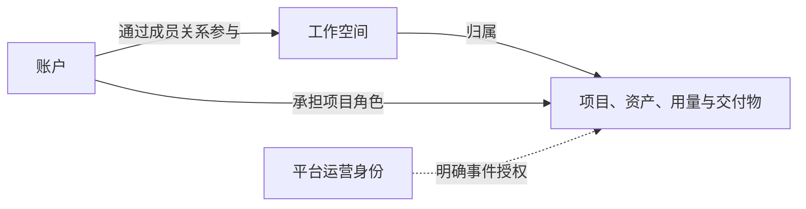

# 用户、组织与权限需求分析

## 1. 本模块要回答的问题

平台在任何业务操作前都需要回答：谁在操作、代表哪个工作空间、针对哪个项目、当前承担什么业务责任、是否允许该操作。

当前 MVP 优先服务个人创作者，但业务概念不能把“账户”和“作品归属”混为一件事。团队工作空间、邀请和多人分工在真实用户证据确认前列为 P1。

## 2. 身份与归属关系

| 业务概念 | 功能含义 | 不能混淆的边界 |
| --- | --- | --- |
| 账户 | 用户进入平台并承担行为责任的持续身份 | 不等同于某个工作空间或项目 |
| 工作空间 | 项目、资产、成员、用量和交付物的共同归属边界 | 不等同于一名用户的个人资料 |
| 成员关系 | 账户参与工作空间的有效业务关系 | 邀请待接受时尚不是有效成员 |
| 工作空间角色 | 所有者、管理员或成员的组织管理责任 | 不自动代表可编辑或审核项目内容 |
| 项目角色 | 创作者、审核者或查看者在特定项目的生产责任 | 不超出所属工作空间的成员边界 |
| 权限决策 | 对一个明确身份、对象和操作给出允许或拒绝 | 不代替预算、权利、内容安全等业务门禁 |
| 运营事件访问 | 客服、安全或故障事件所需的有限访问 | 平台人员不因职位默认成为用户成员 |

## 3. 功能目录

| 功能 | 触发或前提 | 业务结果 | 协作模块 | 阶段 |
| --- | --- | --- | --- | --- |
| 建立账户身份 | 用户首次使用平台 | 后续创作、审核、消耗和交付有明确责任人 | 全部模块 | MVP |
| 确认并恢复账户访问 | 用户再次进入平台、会话失效或需要恢复访问 | 返回同一业务身份和已有工作，不让未验证主体进入工作空间 | REQ-007, REQ-008 | MVP |
| 建立个人工作空间 | 账户开始首个项目 | 项目、资产、用量和交付物有稳定归属 | REQ-003—REQ-007 | MVP |
| 识别当前业务上下文 | 账户可参与多个工作空间或项目 | 操作不会误归属到其他空间 | 全部业务模块 | MVP |
| 停用或注销账户 | 用户主动离开或账户不再可用 | 未解决所有者责任前不遗弃工作空间，历史责任不被抹除 | REQ-007, REQ-008 | MVP |
| 请求导出或删除个人数据 | 个人用户管理账户或工作空间数据 | 请求具有明确范围并交由 REQ-007 跟踪处理状态、保留例外和最终结果 | REQ-007 唯一维护请求生命周期，REQ-008 提供约束证据 | MVP |
| 建立团队工作空间 | 团队生产被验证为首要需求 | 多人共用组织归属，又与个人或其他团队隔离 | REQ-003—REQ-007 | P1 |
| 邀请并建立成员关系 | 有权成员发出邀请，对方接受 | 被邀请者按明确角色和范围加入 | REQ-003, REQ-007 | P1 |
| 调整成员责任 | 分工或项目范围变化 | 后续操作按新角色决定，历史记录保留 | REQ-003—REQ-007 | P1 |
| 移除或主动退出 | 成员关系结束 | 未来访问停止，已有内容、任务、决定和费用仍归属工作空间 | REQ-003—REQ-007 | P1 |
| 转让或关闭工作空间 | 所有者需要离开或结束工作空间 | 所有者责任不会意外中断，内容处置范围明确 | REQ-003, REQ-004, REQ-007 | P1 |
| 分配固定业务角色 | 团队成员已加入工作空间 | 组织管理和项目生产责任可区分或兼任 | 全部业务模块 | P1 |
| 分配项目参与范围 | 成员已加入且项目已建立 | 成员只看到并操作获授权项目 | REQ-003—REQ-006 | P1 |
| 判定关键业务操作 | 用户查看、修改、生产、审核、导出或管理时 | 允许或拒绝有明确的对象、业务上下文和原因 | REQ-003—REQ-007 | MVP/P1 |
| 授权运营事件访问 | 存在明确客服、安全、费用或故障事件 | 平台人员仅在必要范围内处置，原因和结果可查 | REQ-007, REQ-008 | MVP |

## 4. 业务角色目录

| 角色 | 作用范围 | 负责的决定 | 不自动获得 | 阶段 |
| --- | --- | --- | --- | --- |
| 个人所有者 | 个人工作空间 | 工作空间存续与本人项目的创作、审核和交付 | 不获得平台运营操作 | MVP |
| 团队所有者 | 团队工作空间 | 成员、归属、关键费用、转让和关闭 | 不因所有者身份获得内容编辑或审核权 | P1 |
| 管理员 | 团队工作空间 | 普通成员与项目参与范围 | 不能转让/关闭空间，不默认查看项目内容 | P1 |
| 创作者 | 获授权项目 | 内容与资产编辑、制作发起和审核提交 | 不因创作身份获得正式审核结论 | P1 |
| 审核者 | 获授权项目 | 内容、候选和交付阶段的指定确认 | 不能编辑或发起生产，除非同时兼任创作者 | P1 |
| 查看者 | 获授权项目 | 无正式决定权，仅阅读指定内容与进度 | 不能修改、生产、审核或导出 | P1 |
| 平台运营 | 明确平台事件 | 职责内的故障、费用与风险处置 | 不能代替用户作出创作、审核或交付决定 | MVP |

个人 MVP 中同一人可兼任所有者、创作者和审核者，但三类业务决定仍需保持语义区别。

## 5. 权限决策顺序

1. 确认账户当前是否可以承担业务责任。
2. 确认当前工作空间及成员关系是否有效。
3. 确认操作对象归属该工作空间，不因同名项目或资产误跨边界。
4. 对组织操作检查工作空间角色，对创作操作检查项目参与范围和项目角色。
5. 对导出、高成本生产、权利受限或正式审核等操作，再交给对应业务模块判定门禁。
6. 返回明确的允许或拒绝结果；敏感操作的身份、对象、原因和结果需要可查。

“没有权限”和“有权限但业务条件未满足”必须区分；例如创作者可发起制作，仍可能因资产未确认、预算不足或内容受限而无法继续。

## 6. 权限边界

| 关键操作 | 个人所有者 | 团队所有者 | 管理员 | 创作者 | 审核者 | 查看者 | 平台运营 |
| --- | --- | --- | --- | --- | --- | --- | --- |
| 管理工作空间与普通成员 | 允许 | 允许 | 允许 | 不允许 | 不允许 | 不允许 | 不允许 |
| 转让或关闭工作空间 | 允许 | 允许 | 不允许 | 不允许 | 不允许 | 不允许 | 不允许 |
| 建立项目与安排参与者 | 允许 | 允许 | 允许 | 按单独授权 | 不允许 | 不允许 | 不允许 |
| 查看项目内容 | 允许 | 默认仅已参与项目，边界待验证 | 仅已参与项目 | 仅已参与项目 | 仅已参与项目 | 仅已参与项目 | 仅事件授权 |
| 编辑内容与资产 | 允许 | 需兼任创作者 | 需兼任创作者 | 允许 | 不允许 | 不允许 | 不允许 |
| 发起或取消制作 | 允许 | 需兼任创作者 | 需兼任创作者 | 允许 | 不允许 | 不允许 | 不得代替用户发起 |
| 做出内容或候选审核决定 | 允许 | 需兼任审核者 | 需兼任审核者 | 不默认允许 | 允许 | 不允许 | 不允许 |
| 导出正式交付物 | 按交付门禁 | 按项目授权与交付门禁 | 按项目授权与交付门禁 | 按项目授权与交付门禁 | 不默认允许 | 不允许 | 不允许 |
| 查看全工作空间用量与费用 | 允许 | 允许 | 按所有者授权 | 仅已参与项目 | 不允许 | 不允许 | 仅处置职责所需 |
| 实施平台级账户或风险限制 | 不允许 | 不允许 | 不允许 | 不允许 | 不允许 | 不允许 | 专项授权并留下原因 |

## 7. 成员生命周期决策

| 事件 | 必须产生的业务结果 |
| --- | --- |
| 邀请发出 | 记录预期工作空间、初始责任和发起人；对方接受前不获得内容访问 |
| 邀请拒绝、撤销或失效 | 不建立成员关系，重复邀请不产生多个有效成员身份 |
| 接受邀请 | 成员获得明确的工作空间角色，再按项目参与关系获得内容访问 |
| 角色或项目范围变更 | 新边界对后续操作生效，过往创作、审核和费用记录不改写 |
| 移除或退出 | 后续访问终止；已有项目内容、资产、任务与决定保留在工作空间 |
| 成员离开时仍有运行任务 | 任务和结果不被删除，由当前有权成员继续处置 |
| 唯一所有者需离开 | 必须先完成所有者转让或明确关闭工作空间，不得留下无人负责的空间 |
| 已经导出或下载内容 | 平台说明后续权限变更无法召回外部副本，因此导出权必须独立控制 |

## 8. 当前边界与待验证项

MVP 只确定个人工作空间、用户侧业务责任区分、工作空间隔离、关键权限决策和运营事件访问边界。P1 才引入团队工作空间、邀请、成员生命周期、固定团队角色和项目参与范围。

暂不建设自定义权限编辑器、多层组织树、成员组、公开社交关系、创作者市场或默认公开分享。本文不决定页面、登录方式、认证框架、接口、数据表或授权技术。

仍需要验证：

- 真实创作者是否在首轮制作中必须邀请第二个人，以决定团队能力是否提升至 MVP。
- 团队所有者是否应默认可见所有项目，管理员是否只能看到已参与项目。
- 个人与小团队的创作、审核、导出和费用权限需要分离到什么程度。
- 外部客户或审片人是否需要不加入工作空间的限时访问。
- 哪些客服、安全或故障情形允许运营人员查看原始内容，应如何告知用户。

## 9. 变更记录

- 2026-07-23：创建 0.1.0 草案，定义账户、工作空间、成员、角色与权限的业务需求。
- 2026-07-24：升级至 0.2.0，改为身份关系、功能目录、权限决策、权限边界与成员生命周期结构。
