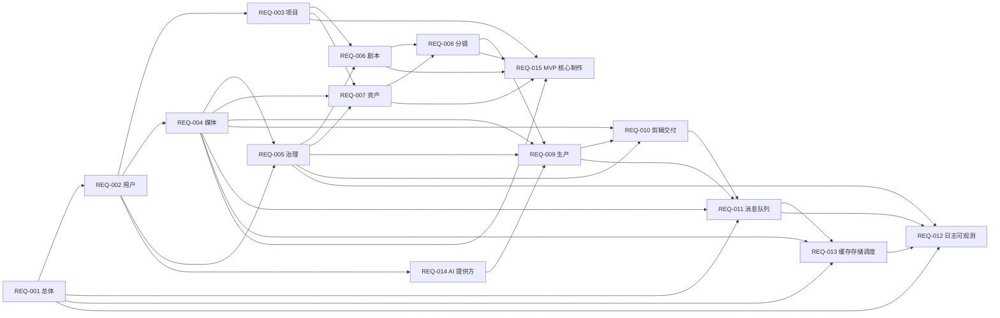

# Lanverse 需求索引

本目录是业务需求事实来源，回答“系统必须提供什么、满足什么约束”。架构、技术和目录选择仍以 `../design/` 为准；需求不得反向复制实现细节。

2026-08-13 新增 REQ-015，把 DES-012 的 MVP-A“整剧到可信分镜包”转换为 43 个可追踪需求叶子。截至 2026-08-14，11 个 PT 已由 Acceptance 028～038 逐项接受，产品负责人兼短剧制作人/QA 已接受黄金样本；REQ-015 仍以 `proposed` 标记整份文档的后续演进边界，不把真实图片、视频或商业化混入 MVP-A 的 accepted 范围。

整份需求文档仍按切片逐步接受。已经完成实现和验收的模块需求移入 [`arrived/`](./arrived/README.md)，归档不改变其事实来源地位。S0～S3 与 MVP-A 已 accepted；MVP-A 真实链路已闭合为“整剧导入 → 分集/改写 → 稳定叙事单元 → 资产状态/影响 → AI 分镜草案 → 多对多 coverage/readiness → 固定版本分镜包”。S4～S6 仍按依赖顺序推进；在用户明确延期 Ark 凭据后，可继续实现不依赖 Provider 的本地能力。PT-MED-005 已由真实 PostgreSQL/RabbitMQ/MinIO 接受，PT-SCH-001/002/003 的本地 MVP 也已由 cron/DST/misfire、并发故障矩阵和真实 RabbitMQ 恢复接受；两者均不关闭 DEV-S4-02 的 Provider/Attempt 部分、DEV-S6-01 或 S4/S6。火山方舟未取得真实账号证据前不得用假调用替代 Provider 证据。

2026-07-30 的历史澄清仍有效：前端采用“创作首页 + 项目工作台 + 单集生产阶段 + 统一资产信息管理”的方案三，Mock 页面只冻结信息架构和视觉风格，不代表功能 accepted。当前实施状态以 2026-08-14 的 [现状能力基线与需求差距](./现状能力基线与需求差距.md)、对应 Plan 和 Acceptance 为准；不得继续把旧日的“S2 正在推进”当作当前状态。

## 需求治理与产品发现

以下文档不新增 Requirement 叶子，而是帮助团队正确阅读、研究和维护 REQ-001～015：

| 文档 | 作用 |
| --- | --- |
| [产品需求工程总纲](./产品需求工程总纲.md) | 事实等级、文档职责、Gate、状态、优先级、追踪和变更规则 |
| [产品发现与竞品需求分析](./产品发现与竞品需求分析.md) | 目标用户/JTBD、VibeReels 审计、GitHub 参考、产品原则与待决策事项 |
| [现状能力基线与需求差距](./现状能力基线与需求差距.md) | `main@SHA` 能力、Acceptance、外部门禁、P0 Gap 与里程碑 |

## 需求文档

| 编号 | 文档 | 事实范围 | 状态 |
| --- | --- | --- | --- |
| REQ-001 | [平台总体需求概述](./001-平台总体需求概述.md) | 用户、业务闭环、全局功能与非功能约束 | S0～S3 与 MVP-A accepted；S4～S6 proposed |
| REQ-002 | [用户与空间模块](./arrived/002-用户与空间模块需求.md) | 身份映射、Workspace、成员与角色 | arrived；S1 accepted |
| REQ-003 | [项目模块](./003-项目模块需求.md) | Project、Episode 与生产概览 | PT-PRJ-001～003 accepted；生命周期/概览增量 in progress |
| REQ-004 | [媒体模块](./004-媒体模块需求.md) | 文件上传、版本、访问、探测与血缘 | S2、临时清理与本地位置迁移 accepted；生成输出/Lineage proposed |
| REQ-005 | [审核治理模块](./005-审核治理模块需求.md) | 授权、审核、问题、内容标识与审计 | S2 Consent/RightsGate 范围 accepted；其余 proposed |
| REQ-006 | [剧本模块](./arrived/006-剧本模块需求.md) | 原文、版本、结构化场景与提取决议 | arrived；S2 accepted |
| REQ-007 | [资产模块](./arrived/007-资产模块需求.md) | 角色、场景、道具、服装、风格与声音版本 | arrived；S2/S3 accepted |
| REQ-008 | [分镜模块](./arrived/008-分镜模块需求.md) | Shot、ShotSpecVersion、顺序、变换证据与 readiness | arrived；S3 accepted |
| REQ-009 | [生产模块](./009-生产模块需求.md) | 生成请求、任务、候选、恢复与成本 | 控制/事实层部分 accepted；真实 Provider、Candidate 与 settle proposed |
| REQ-010 | [剪辑交付模块](./010-剪辑交付模块需求.md) | 时间线、渲染、审核交接与交付清单 | 待确认 |
| REQ-011 | [消息队列与异步投递](./011-消息队列与异步投递需求.md) | RabbitMQ、Outbox、消费幂等、重试与恢复 | 当前登记工作流部分 accepted；后续消费者/运维范围 proposed |
| REQ-012 | [日志与可观测性](./012-日志与可观测性需求.md) | JSON 日志、trace、指标、告警、脱敏与留存 | HTTP/消息/存储遥测部分 accepted；外部采集、告警与 SLO proposed |
| REQ-013 | [缓存、对象存储与任务调度](./013-缓存存储与任务调度需求.md) | Redis 缓存、MinIO/OSS 适配、持久调度与恢复 | MinIO、PT-CCH-001、PT-MED-005、PT-SCH-001/002/003 本地 MVP accepted；其余待确认 |
| REQ-014 | [AI 提供方配置与启用](./014-AI提供方配置与启用需求.md) | 主流平台预设、Workspace 配置、加密凭据、健康检查、用途绑定、启停与轮换 | 需求 accepted；凭据安全底座 accepted；API/UI/runtime Binding proposed |
| REQ-015 | [AI 短剧 MVP 核心制作能力](./015-AI短剧MVP核心制作能力需求.md) | 整剧导入/分集、改写、叙事单元、资产状态、分镜草案/覆盖和分镜包 | proposed（整份文档）；MVP-A 11/11 PT accepted |

## 文档依赖

箭头表示后者使用前者的需求事实；运行时协作不得造成文档推导环。

## 编号和表达规则

- `FR`：用户可观察的功能性需求。
- `NFR`：安全、性能、一致性、恢复、可维护性等非功能性要求。
- `IF`：模块公开查询、命令、事件或外部系统交接需求，不等同于最终 URL。
- `ENT`：业务实体、身份、生命周期、不可变性和引用约束，不等同于数据库表设计。
- 每个编号在仓库内唯一；需求变更必须先更新所属文档和受影响的交接关系。
- “待量化”表示业务目标已存在，但阈值依赖尚未确认的单集规模、供应商或上线环境，不得在实现时自行猜测。

## 设计依据

- [项目顶层结构与工程规范](../design/000-项目顶层结构与工程规范.md)
- [产品调研与核心能力](../design/001-人工智能短剧平台产品调研与核心能力.md)
- [架构与技术选型](../design/002-人工智能短剧平台架构与技术选型.md)
- [业务闭环与模块协作](../design/003-业务闭环与模块协作设计.md)
- [核心业务模块与通用增删改查](../design/004-核心业务模块与通用增删改查设计.md)
- [AI 提供方配置与启用](../design/009-AI提供方配置与启用设计.md)
- [模块详细设计索引](../design/模块设计/README.md)
