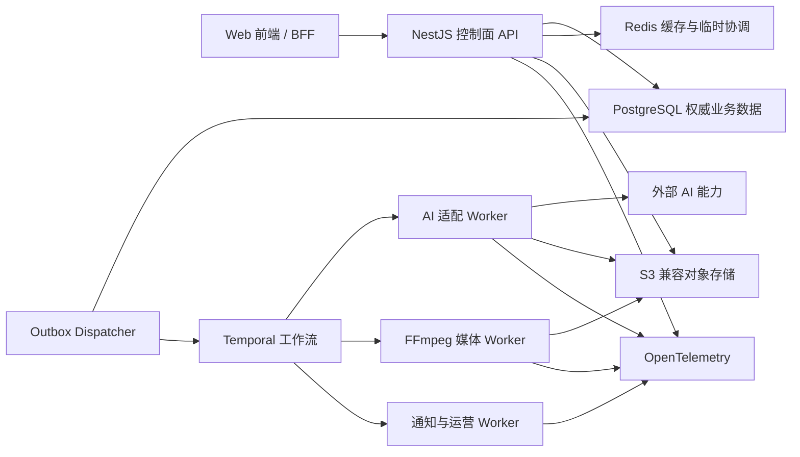

# TCR-002 后端服务架构与工程约束需求规格说明书

## 1. 目的与适用范围

本规格定义后端控制面、异步任务、AI 接入、媒体处理、数据持久化和运行管理的强制架构边界。这里的“模块”是逻辑事实边界，不预先等同为独立微服务。

## 2. 首发逻辑架构

控制面 API 负责授权、校验和业务事实；Temporal 负责持久执行过程；Worker 负责副作用和重计算；PostgreSQL 负责权威业务状态；对象存储负责媒体二进制。

## 3. 业务模块与唯一事实归属

| 后端模块 | 独占维护的业务事实 | 主要关联需求 |
| --- | --- | --- |
| 身份与租户 | 账户、工作空间、成员、角色和授权结果 | FR-001 |
| 项目与内容 | 项目、系列、分集、来源内容、结构化剧本和内容基线 | FR-002～FR-004 |
| 故事连续性 | 世界规则、剧情事实、人物关系和剧情状态 | FR-005 |
| 创作资产 | 可生产的角色、场景、服装、道具、风格和声音资产版本 | FR-006～FR-007 |
| 分镜生产 | ShotSpec、分镜版本、镜头依赖和生产基线 | FR-008 |
| 能力与任务 | 能力目录、策略快照、任务、批次、尝试、候选和执行状态 | FR-009～FR-011 |
| 声音与后期 | 配音、口型、音乐、音效、字幕、时间线和成片快照 | FR-012～FR-015 |
| 审核与采用 | 审核轮次、意见、决定和当前采用关系 | FR-016 |
| 成本账本 | 预算、预占、结算、释放、退款和冲正 | FR-017 |
| 合规与交付 | 权利、安全、标识、保留删除、个人数据请求、质检、交付包和正式交付版本 | FR-018～FR-019；FR-020 个人数据请求 |
| 通知与运营 | 通知投递、运营事件、处置过程和生产分析投影 | FR-020 通知/运营/分析 |
| Agent 协作 | AgentRun、Step、Review、Prompt/Skill 版本、工具授权快照和受控记忆 | FR-021 |

故事连续性模块维护“人物与故事发生了什么”，创作资产模块维护“人物如何被生产和呈现”；双方仅通过稳定身份与版本引用关联，不得复制并分别修改同一事实。

## 4. 模块化与应用层约束

| 编号 | 规范性约束 | 优先级 |
| --- | --- | --- |
| TCR-002-001 | 后端必须按第 3 节的事实所有权组织模块，每项正式事实只能有一个写入责任模块。 | P0 |
| TCR-002-002 | 模块必须区分领域规则、应用用例、基础设施适配和传输层，领域规则不得依赖 HTTP、供应商 SDK 或数据库客户端。 | P0 |
| TCR-002-003 | 跨模块调用必须通过公开应用接口、领域事件或工作流命令完成，不得直接写入他域数据。 | P0 |
| TCR-002-004 | 同一进程内需要原子完成的权限、基线、采用、账本和交付决定必须使用数据库事务与唯一性约束保护。 | P0 |
| TCR-002-005 | 跨事务副作用必须使用事务发件箱或等效可靠发布机制，禁止依赖“先写数据库再尽力发消息”。 | P0 |
| TCR-002-006 | 应用用例必须显式接收主体、工作空间、请求关联标识和幂等上下文。 | P0 |
| TCR-002-007 | 领域对象和公开契约不得直接暴露 Prisma 模型、Temporal 内部状态或供应商响应结构。 | P0 |

## 5. 数据、一致性与生命周期

| 编号 | 规范性约束 | 优先级 |
| --- | --- | --- |
| TCR-002-008 | PostgreSQL 必须保存正式业务事实、不可变版本、引用关系、审计索引和可查询任务状态。 | P0 |
| TCR-002-009 | 内容基线、当前采用、有效授权、账本余额和正式交付必须具有数据库级并发与唯一性保护。 | P0 |
| TCR-002-010 | 审核决定、费用分录、合规结论和正式交付记录必须追加写入；纠正应形成新记录而非覆盖历史。 | P0 |
| TCR-002-011 | 任务进度、通知和分析投影可最终一致，但必须定义最大延迟、重建来源和用户可见的未知状态。 | P0 |
| TCR-002-012 | Redis 缓存键必须包含租户作用域；权限撤销、基线变化和登出必须触发相应失效。 | P0 |
| TCR-002-013 | 对象存储记录必须绑定媒体版本、校验和、大小、格式、来源、状态和保留策略。 | P0 |
| TCR-002-014 | 数据库迁移必须版本化、可在生产规模演练，并为不可逆变化提供备份、双写或分阶段迁移方案。 | P0 |
| TCR-002-015 | 删除流程必须协调数据库、对象存储、缓存、搜索投影、备份例外和供应商侧数据，并保留执行证据。 | P0 |

## 6. API 与集成契约

| 编号 | 规范性约束 | 优先级 |
| --- | --- | --- |
| TCR-002-016 | HTTP API 必须以 OpenAPI 3.1 为契约源，服务端实现、生成客户端和契约测试必须来自同一接受版本。 | P0 |
| TCR-002-017 | 普通查询与命令使用 REST/JSON；错误响应使用统一 Problem Details 结构并包含稳定错误码、可重试标记和关联请求标识。 | P0 |
| TCR-002-018 | 创建任务、上传会话、费用操作和交付创建等可重放写入必须接受幂等键并返回同一业务结果。 | P0 |
| TCR-002-019 | 可并发修改的资源必须提供版本号或 ETag，并通过条件写入阻止静默最后写入覆盖。 | P0 |
| TCR-002-020 | 列表接口必须使用稳定排序和游标分页；不得以无界结果集满足编辑器或运营查询。 | P0 |
| TCR-002-021 | 日期时间使用 UTC RFC 3339，金额使用货币代码与最小货币单位整数，媒体位置使用 timebase 与整数 tick/帧，禁止浮点秒作为权威值。 | P0 |
| TCR-002-022 | 任务进度和终态通知默认使用可续接 SSE；只有实时协同在证明确有需要后才可使用 WebSocket。 | P0 |
| TCR-002-023 | 大文件必须由 API 签发短期、对象级、操作级上传或下载授权，文件数据不得经控制面 API 常驻转发。 | P0 |
| TCR-002-024 | 外部回调必须校验来源、签名、时效和防重放信息，并在处理前保留原始回调证据。 | P0 |

## 7. 工作流、AI 与媒体 Worker

| 编号 | 规范性约束 | 优先级 |
| --- | --- | --- |
| TCR-002-025 | 长任务必须将业务任务、工作流运行、尝试和候选分开建模，重试不得覆盖既有尝试或候选。 | P0 |
| TCR-002-026 | Temporal Workflow 代码必须确定性执行；网络、数据库、对象存储、AI 和媒体副作用只能在 Activity 或受控适配层中发生。 | P0 |
| TCR-002-027 | Workflow 必须为超时、重试、取消、部分成功、人工等待、状态未知和迟到结果定义确定行为。 | P0 |
| TCR-002-028 | 每次 AI 尝试必须固定输入快照、能力版本、策略、价格、许可和供应商请求标识。 | P0 |
| TCR-002-029 | AI 适配器必须把供应商限流、失败、内容拦截、部分结果和用量统一映射为平台语义，同时保留原始诊断。 | P0 |
| TCR-002-030 | FFmpeg Worker 必须以固定输入和版本化参数生成结果，并记录命令摘要、工具版本、校验和和运行资源。 | P0 |
| TCR-002-031 | 媒体任务必须隔离 CPU、内存、磁盘和执行时长，单个异常文件不得拖垮控制面或其他租户任务。 | P0 |

## 8. 安全、运行与质量门禁

| 编号 | 规范性约束 | 优先级 |
| --- | --- | --- |
| TCR-002-032 | 每个受保护用例必须在服务端重新验证身份、租户、项目、对象和动作；前端隐藏控件不构成授权。 | P0 |
| TCR-002-033 | 供应商密钥、数据库凭据和签名密钥必须来自受控秘密存储，支持轮换、撤销和访问审计。 | P0 |
| TCR-002-034 | API 和 Worker 必须提供存活、就绪、版本和依赖健康信号；就绪失败时不得继续接收无法处理的新任务。 | P0 |
| TCR-002-035 | 日志不得记录令牌、密钥、完整提示词、未发布剧本或可直接访问媒体的签名 URL。 | P0 |
| TCR-002-036 | 后端 CI 必须执行格式、静态检查、严格类型检查、单元测试、数据库集成测试、OpenAPI 契约测试、安全扫描和生产构建。 | P0 |
| TCR-002-037 | 发布必须支持向前兼容的滚动升级和受控回滚，不得使运行中工作流或旧版客户端失去可判断状态。 | P0 |
| TCR-002-038 | Agent 只能通过公开应用用例和白名单工具读取或修改业务对象；模型输出不得直接写表、批准基线、采用媒体或形成交付。 | P0 |
| TCR-002-039 | AgentRun 必须固定输入、模型、Prompt/Skill、工具权限和记忆引用版本，并记录步骤、费用、复核与人工决定。 | P0 |
| TCR-002-040 | Agent 记忆、向量索引、聊天和画布必须可丢失重建，不得参与权限、余额、唯一基线或当前采用的权威判断。 | P0 |

## 9. 验收标准

- AC-TCR-002-001：架构设计给出全部模块的唯一事实归属、公开契约和禁止依赖，并通过依赖规则自动检查。
- AC-TCR-002-002：使用重复请求、重复回调、并发写入、进程终止和供应商超时验证幂等与恢复语义。
- AC-TCR-002-003：从任一交付媒体可追溯到请求、任务、尝试、输入、能力、费用和审核记录。
- AC-TCR-002-004：缓存清空、Worker 重启和单个供应商不可用时，正式事实不丢失且用户能够获得明确状态。
- AC-TCR-002-005：代表性 180 秒项目通过上传、生成、局部重做、审核、结算、渲染和导出的后端闭环测试。
- AC-TCR-002-006：提示注入、越权工具调用、记忆污染和重复 AgentRun 测试无法改变工具权限、正式事实或重复计费。

## 10. 依赖

本规格必须与 [TCR-001](TCR-001-平台技术栈与总体架构约束需求规格说明书.md)、[TCR-003](TCR-003-前端应用架构与工程约束需求规格说明书.md) 和 [ADG-001](ADG-001-前后端集成契约与设计完整性评审门禁.md) 共同评审。
