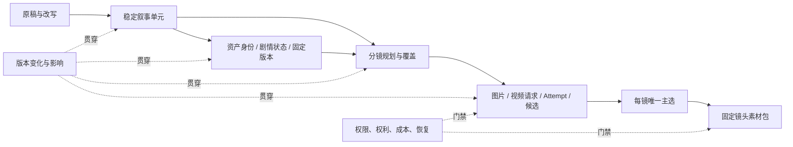

# AI 短剧平台产品发现与竞品需求分析

- 状态：研究快照（不新增需求叶子）
- 调研日期：2026-08-14
- 调研对象：[VibeReels](https://drama.moyuai.com.cn/)、GitHub AI 短剧/视频制作项目、AI 短剧目标用户与制作流程
- 方法：公开页面与一手仓库审阅；VibeReels 已授权会话只读审计；未创建/修改第三方数据，未提交生成或付费
- 证据来源：VibeReels 公开页面与已授权只读会话、GitHub 固定仓库快照、目标制作流程分析
- 当前下游：[CUR-* 当前需求集](./README.md)、[DES-013 镜头视频素材包核心设计](../design/013-AI短剧镜头视频素材包核心产品模块设计.md)

## 1. 产品结论

AI 短剧平台当前最有价值的产品形态不是“一句话生成视频”，而是可审计的逐镜制作工作台：把剧本拆成稳定叙事事实，以版本化资产保持角色/场景/道具一致性，用可审核分镜承接叙事，再把每次图片/视频生成当成有成本、有候选、有主选、有血缘的生产任务，最后导出固定、有序、可追溯的独立镜头视频素材包。

VibeReels 证明了这种工作台在产品层面可成立：项目级剧本、资产和逐镜生成被放在同一上下文中，资产有剧情状态，镜头有 Prompt、资源引用、生成历史、唯一主选、星标和批量下载。公开证据不能确认真正的时间线或整集成片导出。竞品共同没有充分解决的，是“改稿后叙事事实是否遗漏、哪些镜头/资产/主选过期、历史素材包能否解释”；这应继续作为 Lanverse 的差异化核心。

当前 CUR-* 需求均为 proposed，不继承历史实现完成度。产品优先级必须按“项目/剧本 → 资产 → 分镜 → 关键帧 → 逐镜视频候选与唯一主选 → 镜头素材包”逐模块评审；声音/字幕、时间线、剪辑、成片与商业运营不进入当前范围。不能把竞品完整页面、开源 README 或历史代码当成当前产品已完成能力。

## 2. 目标用户与待验证 JTBD

| 用户 | 核心任务（JTBD） | 当前痛点假设 | 成功信号 |
| --- | --- | --- | --- |
| 独立创作者/小团队 owner | 用有限预算把已有故事推进到可供外部后期使用的镜头视频包 | 工具分散、状态丢失、返工重跑、成本不可解释 | 能从中断处恢复，局部返工，不重复扣费并拿走有序素材 |
| 编剧/改编者 | 在保留原稿的同时完成短剧化改写 | AI 改写覆盖原文、前后事实不一致、缺少影响说明 | 原文/候选差异清晰，发布后下游失效可见 |
| 导演/分镜师 | 把每个必拍叙事事实安排到镜头 | 模型漏拍、镜号漂移、拆合镜头丢对白/动作 | 必拍内容有镜头去向，孤儿和过期关系可定位 |
| 资产/生成操作员 | 保持跨镜角色与场景一致，选择可用候选 | 同一角色状态混淆、提示词/参考图漂移、任务失败难恢复 | 固定资产状态/版本，候选可比较、可追溯、可局部重试 |
| 制作人 | 控制进度、预算、质量和风险 | 成本只在调用后出现、阻塞分散、审核概念重复 | 可看预计/预占/结算、阻塞与下一动作 |
| 制作人/后期交接人员 | 确认每镜当前视频并把素材交给外部剪辑 | 缺镜头、误用候选、文件顺序和来源不清 | 每镜有显式主选，完整包按顺序且有 Manifest |

这些是基于公开流程和制作场景的产品假设，不等于真实用户研究结论。访谈与任务观察仍是进入真实生成前的产品 Gate。

## 3. 用户问题地图

需要优先解决的不是“更多生成按钮”，而是五类跨阶段损失：

1. 语义损失：分集、改写、拆镜/合镜时原文内容静默丢失；
2. 一致性损失：资产状态、参考图或 Prompt 变化后旧镜头继续被误认为可用；
3. 决策损失：AI 候选、人工修改和主选被覆盖，无法解释为什么使用某个结果；
4. 恢复损失：刷新、超时、Worker 重启或供应商未知状态导致重复提交/扣费；
5. 导出损失：只下载零散文件，无法证明一个镜头素材包由哪些固定镜头、选择和媒体版本产生。

## 4. VibeReels 产品审计

### 4.1 证据边界

本次审计覆盖公开首页及已授权项目的只读页面。它能证明当前客户端可见的信息架构、字段、状态、交互和价格提示，不能证明后端数据库、算法、供应商合同、生成质量、账单准确性、SLA 或权限隔离。未触发创建、编辑、生成、下载或付费。

当前页面公开构建表现为 React/TypeScript 单页客户端与 API 服务分离，并存在客户端路由、任务轮询和页面模块。该事实只支持“前端采用模块化 SPA + API”的判断，不支持对服务端语言、数据库、队列和部署架构的推断。

### 4.2 审计步骤

| 步骤 | 观察 | 健康度 | 对 Lanverse 的启示 |
| --- | --- | --- | --- |
| 1. 新建项目 | 先选择漫剧或真人/3D；类型创建后不可修改，真人/3D 明示角色审核要求 | 中等 | 类型会改变资产/审核策略，但不可逆影响应在选择前解释，必要时提供复制迁移 |
| 2. 剧本信息 | 项目内同时展示整剧、分集、角色、场景/道具、世界观、剧情和镜头进度 | 良好 | 先形成项目事实和分集，再进入生成；不能把长文本直接交给视频模型 |
| 3. 资产设计 | 角色/场景/道具分区，角色有基础图、多剧情状态、出现集、音频和参考图 | 良好但密集 | Asset、AssetState、AssetVersion 和媒体候选必须分开；批量筛选和影响视图是长剧刚需 |
| 4. 资源审核 | 镜头生产前检查角色、场景、道具资源；缺失项阻断 | 良好 | readiness 必须来自服务端事实，并提供阻塞对象和下一动作 |
| 5. 逐镜制作 | 单镜头包含时长、详细 Prompt、资产引用、资源上传/选择、历史版本、成功/失败、主选/星标和费用 | 很强但很密集 | 以 Shot 为局部返工边界；Prompt/引用/模型/费用应固定到 Attempt/Candidate |
| 6. 风格与模型 | 基础图、状态图和视频可分别选模型，另有风格预设、Prompt 前后缀和项目参考图 | 良好 | 需要按用途绑定能力；普通用户不应被供应商渠道/审核等级等技术名词淹没 |
| 7. 项目成本 | 按文本、图片、视频展示调用、模型、操作和成本 | 良好 | 预计、预占、结算、释放和调整要分开，项目汇总可下钻到任务 |
| 8. 最终输出 | 官网展示竖屏结果；只读审计未验证真实整集导出 | 待验证 | 不能把连续预览或逐镜下载等同 MP4/SRT/Manifest 交付 |

### 4.3 关键界面证据

项目类型在创建时即形成不可逆分叉：

只读审计确认项目类型会在创建时形成不可逆分叉；为避免保存第三方项目界面，本仓库不再保留对应截图。

模型/风格按基础图、状态图和视频用途分别配置：

只读审计确认基础图、状态图和视频可分别配置模型，并配置风格与 Prompt 前后缀；本仓库不再保留对应截图。

公开首页还展示剧本分析、资产设计、逐镜视频制作和竖屏输出；这些页面只证明可见产品流程，不证明服务端实现、真实生成质量或整集导出。

### 4.4 最值得借鉴的亮点

1. 同一项目上下文：剧本、资产、视频、风格、协作者和成本不被拆成无关联工具；
2. 资产状态：角色身份与服装/伤势/年龄等剧情状态分开，状态图可复用；
3. 逐镜上下文：镜头同时展示文本、导演信息、Prompt、资源、模型、时长和历史版本；
4. 显式资源槽位：Prompt 的 `@图片N/@视频N/@音频N` 与有序资源卡对应，创作者容易理解；
5. 候选与选择：成功/失败、生成历史、主选/星标、下载和局部修复集中在单镜头；
6. 生成前审核：角色/场景/道具资源先过门禁，减少高成本无效调用；
7. 用途级模型配置：不同资产/视频用途可以选择不同能力，而非一个全局模型；
8. 成本透明：在项目和操作入口展示类别、调用和消耗，降低预算不确定性。

### 4.5 主要体验风险

- 信息密度过高：长页面、嵌套卡片和大量小按钮会让 30 集以上项目难以扫描，应提供批量队列、问题视图和“只看阻塞”；
- 阶段语义可能混乱：页面出现“等待生成分镜”与已有镜头/版本并存的可见状态，说明阶段、任务和结果需要拆开表达；
- 不可逆选择解释不足：项目类型不能改，但用户在选择时难以看到对资产、审核、模型和迁移的全部影响；
- 技术细节暴露：供应商通道、模型版本和审核等级直接呈现会增加普通创作者认知负担，也使 UI 易受供应商变化影响；
- 多套审核概念：资源审核、镜头审核、导演映射、评论和主选若没有统一 Issue/Decision 语义，跨阶段返工难追踪；
- 可访问性待测：暗色低对比、小标签、图标按钮、长滚动和密集网格存在风险；键盘、焦点、读屏和对比度尚未验证；
- 营销指标不可作基线：官网的产能/效率描述未在本次审计中验证，不能直接转为 Lanverse KPI。

## 5. GitHub 开源项目参考

以下为 2026-08-14 的一手仓库快照。许可证仅作初筛，不构成法律意见；任何代码进入产品前仍需固定 commit、逐文件许可证、依赖/SBOM、安全和同构失败测试审查。

| 项目 | 可借鉴的产品/实现模式 | Lanverse 用法 | 许可与成熟度边界 |
| --- | --- | --- | --- |
| [LumenX](https://github.com/alibaba/lumenx) | Studio/Playground 分层、剧本分析、资产/分镜、多视角角色、批量候选、TTS、时间线与 FFmpeg | 参考“专业工作台 vs 快速试验”信息架构、用途能力目录和批量候选 | MIT；项目较新，不能据 README 推断多租户、恢复和成本完整性 |
| [Jellyfish](https://github.com/Forget-C/Jellyfish) | FastAPI、Celery/Redis、S3；资产候选、人工确认、使用关系、ready 门禁、异步任务中心 | 优先参考候选确认、资产复用、ready 与 generating 分离、任务恢复界面 | Apache-2.0；部分版本/前端能力仍不完整，需逐路径验证 |
| [LocalMiniDrama](https://github.com/xuanyustudio/LocalMiniDrama) | 故事到合成的 8 步本地流、缺失项补生成、重试、ZIP 导入导出、列表/画布同源、FFmpeg | 参考离线/本地创作流、局部重试、导入导出和多图引用体验 | MIT；SQLite/单机边界，不适合作为 SaaS 权限与审计底座 |
| [Toonflow](https://github.com/HBAI-Ltd/Toonflow-app) | 多 Agent、事件图、无限画布、资产与分镜交互 | 只借鉴可视化编排和资产/镜头组织 | LICENSE 含附加商业/去标条款，不能按标准 Apache-2.0 直接复用 |
| [wind-comic](https://github.com/ChrisChen667788/wind-comic) | 多 Agent、质量循环、stale/cost、Yjs 协作、FFmpeg 与 EDL/FCPXML/AAF | 参考质量回路、变更失效、协作和专业导出方向 | MIT；项目年轻，名称/镜号弱身份模式不符合当前血缘要求 |
| [aid-server](https://github.com/gzxx-2025/aid-server) | SaaS 运营、统一任务、余额冻结/结算、管理与内容审核 | 参考费用预占/结算、运营后台与内容治理的问题清单 | MIT；体量和运行史有限，不能作为成熟计费事实源 |
| [dramai](https://github.com/hyyyyyyz/dramai) | 浏览器内创作、Dexie、ffmpeg.wasm、MP4/SRT/剪映 ZIP、BYOK | 参考纯客户端导出和本地优先体验 | Apache-2.0；浏览器密钥/刷新恢复与团队协作边界需谨慎 |
| [AI Video Production Editor](https://github.com/LudwigKienle/ai-video-production-editor) | 连续性审核→返拍队列、专业时间线与导出 | 参考 QA 问题进入局部返工闭环 | GPL-3.0；不得无评审合入当前产品 |
| [MoneyPrinterTurbo](https://github.com/harry0703/MoneyPrinterTurbo) | 成熟的 TTS、字幕、素材、BGM 和 FFmpeg 合成 | 作为后续音频/字幕/合成横向证据 | MIT；不是剧本—资产—分镜一致性平台 |
| [drama-skills](https://github.com/worldwonderer/drama-skills) | 独立 coverage ledger、版本/hash 驱动的审查和 stale 判定 | 参考叙事覆盖、独立审查与失效证明 | MIT；领域技能项目较新，只作规则/测试事实源 |

只作产品参考、不进入商业复用候选：DramaClaw 为 ELv2 source-available；BigBanana 含非商业/SaaS 限制；无明确 LICENSE 的项目不能因公开可见就复制；CC BY-NC-SA 等非商业许可也不能作为当前 SaaS 代码底座。

## 6. 跨项目共同模式

| 共同模式 | 需求判断 | 当前正式入口 |
| --- | --- | --- |
| 结构化剧本与人工确认 | 解析/改写输出先是候选，原稿和已发布版本不可被覆盖 | CUR-SCR |
| 版本化一致性资产 | Asset 身份、剧情状态、固定版本、候选媒体和主选分层 | CUR-AST、CUR-KFR |
| 可审核分镜 | Shot 有稳定身份、详细规格、资源引用和人工决议 | CUR-SBD |
| 叙事覆盖与失效 | 改稿/改资产/改 Spec 后旧关系 stale，必拍内容无未解释遗漏 | CUR-SCR、CUR-AST、CUR-SBD |
| 统一生成任务 | 请求、Attempt、Candidate、Selection、Media 和费用不可拆成供应商私有事实 | CUR-VID、CUR-PLT |
| 局部质量回路 | 问题固定到镜头/候选并进入局部重生成，不重跑整集 | CUR-KFR、CUR-VID、CUR-EXP |
| 镜头主选与素材包 | 每镜显式唯一主选，按固定顺序导出独立视频与 Manifest | CUR-VID、CUR-EXP |
| 音频、时间线与成片 | TTS/字幕、剪辑、渲染与成片能力 | 当前非范围 |
| 权利与内部成本 | 输入权利、真人授权、生成标识、预计/预占/结算/释放可追溯 | CUR-PLT |

## 7. 由研究推导的产品原则

1. 候选优先：AI 输出默认不进入正式事实，必须经过人工决议；
2. 版本优先：任何被下游引用的剧本、资产、规格、媒体、选择和素材包只能追加版本；
3. 影响先行：改名、禁用、换图、改稿、拆合镜头前先展示受影响对象与 stale 结果；
4. 镜头是局部返工边界：批量操作可以提高效率，但每个任务、结果、失败和费用独立恢复；
5. 叙事关系是多对多：镜号和字符位置只做显示/证据，不做长期身份；
6. 成本在提交前可见：高成本操作需要预计消耗、显式确认和取消/失败释放；
7. 任务状态来自服务端：刷新/断线后恢复真实 Task/Attempt，不靠页面内存；
8. 供应商是可替换能力：普通用户先选择用途和质量/成本档位，技术通道放到高级配置；
9. 导出固定输入：镜头素材包必须带 Manifest，后续重排或重选不篡改历史；
10. 完成度由门禁计算：页面按钮、Mock、routing key 或字段占位不等于 capability。

## 8. 范围优先级

| 顺序 | 用户结果 | 当前判断 |
| ---: | --- | --- |
| 0 | 项目、剧集、剧本和稳定叙事结构 | 当前 P0，待 CUR-PRJ/CUR-SCR 评审 |
| 1 | 角色/场景/道具资产与镜头关键帧候选 | 当前 P0，待 CUR-AST/CUR-KFR 评审 |
| 2 | 可审核分镜、叙事覆盖与固定 StoryboardBaseline | 当前 P0，待 CUR-SBD 评审 |
| 3 | 真实镜头视频候选、局部返工和每镜唯一当前主选 | 当前 P0，待 CUR-VID/CUR-PLT 评审和真实 Provider PoC |
| 4 | 按固定镜头顺序导出独立主选视频与 Manifest | 当前 P0，待 CUR-EXP 评审 |
| 5 | 声音/字幕后期、时间线、剪辑、整集渲染与成片 | 当前非范围 |
| 6 | 商业计费、渠道发布、营销运营和规模化商业后台 | 当前非范围 |

## 9. 待产品决策

| 决策 | 需要的证据 | 未决定前的处理 |
| --- | --- | --- |
| 漫剧 vs 真人/3D 是否创建后不可变 | 用户访谈、资产/审核差异、迁移成本 | 不新增不可逆类型；若必须分型，创建前展示影响并允许复制迁移 |
| 首发导入格式 | 真实用户剧本样本与失败频率 | 保持严格 UTF-8 txt/md；DOCX/PDF/OCR 不进入当前承诺 |
| 首发图片/视频供应商与模型 | 真实账号、参数、价格、并发、权利、失败补偿 | capability fail closed，不用假 Provider 通过验收 |
| 素材包默认格式 | 制作人/后期实际交接流程、包大小和浏览器稳定性 | 当前建议服务端 ZIP + JSON/CSV Manifest；不生成整集 MP4/SRT |
| stale 主选是否允许沿用 | 真实返工场景和质量风险 | 默认阻断；如开放，必须显式确认并写入 Manifest |
| 协作优先级 | 团队规模、审批链、外部审片频率 | owner 单人闭环优先，保留 owner/editor/viewer 基础模型 |

## 10. 研究限制与下一步验证

- VibeReels 未执行真实生成、结算、取消、断线恢复或实际批量下载；整集成片导出也未获证明，相关能力保持待确认；
- GitHub 项目多数创建于 2026 年，适合证明产品流和失败模式，不足以单独证明生产成熟度；
- 本轮未完成真实用户访谈、可用性测试、付费意愿和工作流量化；
- 供应商能力、模型名、价格、stars 和活跃度会变化，进入实施时必须重新核验；
- 法律/许可证结论只是工程初筛，最终由法务和依赖审查确认。

下一次产品发现应以 3 个真实剧本验证从导入到可信分镜、再到镜头视频素材包的 proposed 流程，记录每个手工修正、阻塞、等待和返工；并以真实 Provider 账号、合同、价格和失败样本冻结图片/视频生成工作台与成功指标。
