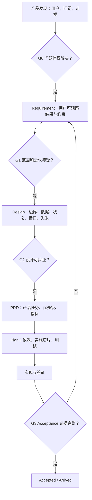

# AI 短剧平台产品需求工程总纲

- 状态：active（需求治理规则；不新增需求叶子）
- 日期：2026-08-14
- 适用范围：Lanverse AI 短剧平台的产品发现、Requirement、Design、PRD、Plan、测试与 Acceptance
- 事实入口：[需求索引](./README.md)

## 1. 结论

本目录只回答“为什么做、为谁做、系统必须提供什么、在什么约束下算完成”。架构、技术栈、数据库和目录选择属于 Design；开发拆解属于 Plan；真实完成证据属于 Acceptance。现有 REQ-001～015 是正式需求树，本总纲、产品发现和差距文档是治理与决策输入，不创建第二套需求编号。

需求工程采用 brownfield 方式：先记录当前 `main` 已有能力、Acceptance、在制工作和外部门禁，再决定缺口。字段、枚举、路由、OpenAPI 类型、Mock 卡片或 README 声明只能算线索，不能单独证明能力完成。

## 2. 产品目标与北极星结果

平台长期目标是帮助个人创作者和小型制作团队，把已有故事/剧本制作成可审核、可局部返工、可追溯来源与成本的 AI 短剧。核心价值不是封装一次模型调用，而是让剧本、资产、分镜、候选、音画、审核和交付之间的变化可解释、可恢复。

阶段结果必须分开：

| 范围 | 用户拿到什么 | 不得声称什么 |
| --- | --- | --- |
| 当前 MVP-A | 固定版本、无未解释遗漏的可信分镜制作包 | 已生成图片、视频或短剧成片 |
| MVP-B | 真实图片候选、主选、媒体血缘和真实成本闭环 | 已有视频、时间线或可发布成片 |
| MVP-C | 真实视频、声音/字幕、最小时间线、审核、渲染与交付 | 已具备企业协作、发行或商业化平台能力 |
| 后续生产化 | 协作、合规运营、发布和商业能力 | 无人审核的一键稳定成片 |

## 3. 事实等级

| 等级 | 定义 | 可以形成什么 | 不能形成什么 |
| --- | --- | --- | --- |
| 公开事实 | 官方页面、公开接口/客户端、许可证、固定提交源码或本仓库代码可直接复现 | 研究证据、失败模式、需求输入 | 对私有后端、SLA、算法质量的结论 |
| 已授权只读事实 | 在合法会话中看到的页面、状态和交互，不产生外部写入或费用 | 产品流程与可见门禁判断 | 生成质量、结算准确性、并发/恢复保证 |
| 合理推断 | 多个一手信号共同支持，但内部实现不可见 | 设计假设和待验证用例 | accepted 需求或实现事实 |
| 待确认 | 需要用户访谈、真实账号、合同、付费调用、压测或法务意见 | 决策清单和 Gate | 默认值、承诺或静默实现选择 |
| 仓库实现事实 | 固定 Git SHA 上存在真实路由、状态、持久化和失败路径 | `main` 能力判断 | 产品 accepted |
| Acceptance 事实 | 真实命令、测试、基础设施或浏览器证据已形成且记录残余边界 | 指定范围 accepted | 文档未覆盖的相邻能力 |

任何研究文档都必须记录日期、来源、访问边界和不可证明事项。营销数字、stars、Mock 和项目自述只能作为线索，不能直接成为产品 KPI 或采购结论。

## 4. 软件工程链路与 Gate

| Gate | 必须回答 | 最小退出证据 |
| --- | --- | --- |
| G0 产品发现 | 用户是否真实存在，问题频率/损失如何，为什么现在解决 | 访谈/行为证据、竞品事实、问题假设和反证 |
| G1 需求接受 | 用户结果、范围、非目标、优先级和外部门禁是否明确 | 唯一需求叶子、可观察验收、决策记录 |
| G2 设计接受 | 模块事实、状态、版本、接口、失败、迁移和安全是否闭合 | 可审阅 Design、替代方案、风险与回滚策略 |
| G3 实施准入 | 上游接受、依赖可用、测试 oracle 和数据迁移是否准备好 | PRD/Plan、Red 或等价失败验收、真实测试条件 |
| G4 产品接受 | 用户主路径、失败路径、数据/权限/成本和恢复是否真实通过 | Acceptance、命令与结果、Git 提交、残余边界 |

## 5. 文档职责

| 文档 | 必须包含 | 不得包含 |
| --- | --- | --- |
| Requirement | 角色/JTBD、业务规则、实体语义、功能、接口结果、NFR、失败与非目标 | ORM/表名、具体文件路径、空实现层、未经接受的技术选型 |
| Design | 问题、范围、模块边界、依赖、数据/状态/接口、失败恢复、安全、迁移、替代方案 | 未追踪的业务范围、把实现完成写成产品完成 |
| PRD | 用户任务、优先级、黄金路径、量化验收、发布边界 | 只有工程动作而没有用户结果的任务 |
| Plan | 可领取 DEV、依赖、Red/Green、迁移、验证命令、停止条件 | 新增业务需求或绕过上游门禁 |
| Acceptance | 对应需求/PT/DEV、真实环境、命令、结果、提交、残余边界 | 预期结果、未运行测试、Mock 或占位能力 |

## 6. 需求质量规则

每个正式需求叶子都应满足：

1. 单义：只有一个主要行为或质量结果；
2. 可观察：描述用户/相邻模块可验证的结果，而非内部动作；
3. 有边界：包含权限、输入规模、生命周期、失败和非目标；
4. 可追踪：唯一归属一份 Requirement，并关联 Design、PT、DEV、Test 和 Acceptance；
5. 可否证：存在明确的失败样例，不能只写“友好、智能、高效”；
6. 不预设实现：除已接受的外部约束外，不把数据库、队列或 SDK 写成需求本身；
7. 不静默放宽：容量、成本、恢复和合规阈值变化必须先更新事实源。

推荐句式：`在 <前置条件> 下，<角色/相邻模块> 必须能 <可观察行为>；当 <失败条件> 时，系统必须 <稳定结果/下一动作>，且不得 <禁止副作用>。`

## 7. 状态语义

| 状态 | 含义 |
| --- | --- |
| `proposed` | 已形成可审阅事实，但未整体接受；可以存在明确的局部 accepted 范围 |
| `active` | 已接受当前范围并进入执行；不代表已完成 |
| `accepted` | 指定范围有真实 Acceptance；整份文档只有全部范围完成时才可整体 accepted |
| `arrived` | 已完成且移入历史入口；保留事实来源地位 |
| `deferred` | 已明确延期，不是遗漏，也不得被其他任务静默带入 |
| `blocked` | 明确外部依赖阻止进入下一 Gate，并有 owner/关闭条件 |

Requirement、Design、PT、DEV 和 Acceptance 的状态属于不同对象。工程 Green、前端页面存在、数据库迁移完成都不能自动把需求标记为 accepted。

## 8. 优先级和范围决策

优先级不只按用户想要程度排序，还必须同时考虑闭环依赖、不可逆数据风险、外部不确定性和学习价值：

| 优先级 | 判定 |
| --- | --- |
| P0 | 没有它无法完成当前里程碑，或会造成越权、数据丢失、重复扣费、不可追溯/不可恢复 |
| P1 | 显著提高结果质量、效率或成本可控性，但可在 P0 闭环后增量加入 |
| P2 | 协作、规模、体验增强或商业化能力，不阻塞首个可信闭环 |

任何 P0 新增都必须说明它阻塞哪个用户结果；不能因为竞品有某页面就直接进入 P0。

## 9. Brownfield 现状记录

每次范围评审至少记录五列：

| 维度 | 记录要求 |
| --- | --- |
| 目标需求状态 | 需求是 proposed、局部 accepted 还是 accepted |
| `main@SHA` 实现状态 | 已实现、部分实现或未发现，并给出代码/迁移/测试入口 |
| 当前工作区状态 | 与 `main` 分开；未提交在制品不得算基线 |
| Acceptance 状态 | 对应编号、已接受范围和明确排除项 |
| 外部门禁 | 账号、合同、额度、法务、真实数据、生产环境或用户决策 |

“存在字段/枚举/routing key”必须标记为 placeholder，只有端到端持久化、失败收敛、用户入口和验收证据共同存在时才称为 capability。

## 10. 变更控制

1. 发现问题：记录来源、影响范围和是否改变用户可观察行为；
2. 需求变化：先改 Requirement 与决策记录，再更新 Design、PRD、Plan；
3. 设计变化：用户结果不变时从 Design 向下更新，不改写历史 Acceptance；
4. 已接受事实变化：创建新版本/新 Acceptance，说明兼容、迁移和回退；
5. 状态变化：同步正文头部、各层索引和追踪矩阵；
6. 验证：运行追踪、链接、状态和语义冲突检查；
7. 交付：列出变更文件、真实命令、残余风险和 Git 状态。

## 11. 产品研究与指标待办

当前公开研究充分证明行业流程和失败模式，但还缺真实用户证据。进入 MVP-B 前至少完成：

- 5–8 名目标创作者/制作人的问题访谈，覆盖个人创作者、漫剧团队和真人/3D 团队；
- 3 个真实剧本的观察式任务测试，记录首次可信分镜包耗时、卡点和人工修正；
- 供应商真实账号下的图片首轮通过率、平均候选数、失败/退款和单位可用结果成本；
- 对“项目类型不可修改、资产审核、分镜审核、最终交付”的心智模型测试；
- 付费意愿与采购流程访谈，不以竞品营销数字代替。

指标先定义口径，阈值由基线数据后冻结：首次获得可信分镜包耗时、草案采用率、叙事遗漏率、资产复用率、人工修正分钟数、可用候选成本、任务恢复成功率、导出成功率和返工影响范围。
