# AI 短剧平台现状能力基线与需求差距

- 状态：active（Brownfield 需求基线；不新增需求叶子）
- 审计日期：2026-08-14
- Git 实现基线：`main@b38d14b64735894c30c583bbdf359c173b5c2c23`
- 数据库迁移基线：`b4e8c2d1a703 (head)`
- 方法：本地源码、迁移、测试源码、文档和 Acceptance 只读审计；未提交工作区不计入 capability；本文件不把历史测试记录描述为本轮复跑
- 需求入口：[需求索引](./README.md)

## 1. 结论

当前 `main` 已完成“项目/单集 → 整剧导入 → 分集/改写 → 稳定叙事单元 → 资产状态/影响 → AI 分镜草案 → 人工审核 → 多对多 coverage/readiness → 固定版本分镜包”的内部制作核心。MVP-A 的 11 个产品任务已由 Acceptance 028～038 独立接受，并完成产品负责人兼短剧制作人/QA 的黄金样本签字。

这不等于 AI 短剧平台已经完成：真实图片/视频 Provider 调用、生成 Candidate/Media、真实成本结算、时间线、声音/字幕、统一 Review/Issue、渲染、DeliveryManifest 和 MP4/SRT 仍未形成端到端能力。后续必须按真实依赖增量加入现有模块化单体，不能因为目标能力多就重画成未授权微服务，也不能把字段、routing key 或占位模型当成功能。

## 2. 状态口径

实现审计快照固定在 `b38d14b`：该提交已包含 DEV-MVPA-12 Green、联合 E2E、Acceptance 038 和工程门禁收口。产品签字及本轮需求文档属于后续状态变更；下面的 capability 结论只引用已经提交的实现证据，不把未提交工作区当作实现事实。

| 标记 | 判定标准 |
| --- | --- |
| 已实现 | 固定 `main@SHA` 有真实领域事实、接口/入口、失败路径和测试源码；若有 Acceptance 单独列出 |
| 部分实现 | 只有控制面、底座或部分用户路径，关键外部副作用/结果/恢复尚未闭环 |
| 未发现 | 在路由、模型注册、迁移、服务、前端和 Acceptance 中未发现相应 capability 证据 |
| 外部门禁 | 需要真实账号、合同、额度、法务、生产环境或用户决策；不能用 Mock 关闭 |
| Acceptance | 指定产品任务的真实历史证据；不自动外推相邻能力 |

## 3. 端到端能力矩阵

| 能力 | 目标需求状态 | `main@b38d14b` 实现状态 | Acceptance 状态 | 主要缺口 / 外部门禁 |
| --- | --- | --- | --- | --- |
| 项目与单集 | 已接受基础范围，生产概览持续增量 | 已实现 Project/Episode 创建、编辑、重排、生命周期、删除预检和阶段快照 | 002 accepted | 成员邀请、项目 ACL、完整成本/交付摘要未进入当前闭环 |
| 整剧导入与解析 | MVP-A accepted | 已实现粘贴或严格 UTF-8 `.txt/.md`、100k code points、格式体检和确定性解析 | 029 accepted | DOCX/PDF/Fountain/FDX/OCR、超 10 集不在当前范围 |
| 分集计划与物化 | MVP-A accepted | 已实现确定性/AI 建议、移动边界、拆合/改名、确认、原子物化与幂等 | 030 accepted | 一个 revision 仅一份计划、最多 10 集；方案历史/Top-3 未实现 |
| 剧本改写与叙事单元 | MVP-A accepted | 已实现候选、diff、编辑、显式发布、稳定 NarrativeUnit 与失效传播 | 031、032 accepted | 复杂逐单元接受/拒绝、跨修订自动迁移未实现 |
| 媒体素材 | 上传/私有存储和分镜包交付范围部分 accepted | 已实现上传、版本、探测、私有位置迁移/退役，以及分镜包 MediaVersion/Lineage/受控下载；生成/渲染媒体未实现 | 003、013、022、023、038 等指定范围 accepted | Candidate 生成媒体、转码/渲染和成片交付媒体链路未闭合 |
| 资产与剧情状态 | MVP-A accepted | 已实现版本化资产、状态、出现证据、readiness、变更影响与镜头阻断 | 033、034 accepted | 跨项目资产库、自动语义去重、真实生成候选未实现 |
| 分镜、coverage 与分镜包 | MVP-A accepted | 已实现手工增删改排、拆/合/复制、AI 草案决议/批准/原子 Apply、多对多 coverage/readiness，以及固定快照、确定性 ZIP、JSON/CSV/HTML/Manifest、失败恢复与历史下载 | 035～038 accepted | 真实图片候选和后续成片链路不属于 MVP-A |
| 生成控制面 | 部分 accepted | 已有能力目录、预检、生成请求/任务、费用预占、取消与无 Provider 失败收敛 | 019～021、025、026 指定范围 accepted | 无真实 Provider submit/query/cancel、Candidate/Media 和真实 settle |
| Provider 管理 | 需求 accepted，底座局部 accepted | 已有 Connection/CredentialVersion/Binding/HealthCheck 模型与 AES-GCM；主应用无完整 API/UI/runtime binding | 027 仅安全底座 accepted | 真实账号、合同、额度；配置/健康/用途绑定 UI 与运行时解析未完成 |
| 队列与恢复 | 当前登记工作流部分 accepted | RabbitMQ durable topic、Outbox/Inbox、publisher confirm、scheduler/consumer 幂等与恢复已实现 | 018、024～026 等指定范围 accepted | 白名单 routing key 不代表 provider query/cancel、moderation、render 已有消费者 |
| 成本 | 生成预占范围部分 accepted | 已有 Reservation/CostEntry、预占/释放/查询和高成本确认 | 019～021 accepted | 无真实账单 settle/adjust、退款/对账和可用候选单位成本 |
| 审核与治理 | Consent/Audit/局部人工门禁部分 accepted | 有 Consent/Audit、提取决议、改写发布、AI 分镜决议 | 003、031、036、037 等局部 accepted | 无统一 Review/Issue、内容 Moderation、交付批准与跨阶段问题闭环 |
| 时间线、渲染与成片交付 | proposed | 未发现 editing/timeline/render/delivery 模块、模型或迁移；Episode 仅有 timeline 引用占位；Storyboard Export 只交付制片前分镜包 | 无 | 视频/音频/字幕候选、TimelineVersion、Render、DeliveryManifest、MP4/SRT 全部待建 |
| 权限与协作 | 基础 RBAC accepted/部分实现 | owner/editor/viewer 与 Workspace 隔离已实现 | 002 指定范围 accepted | 邀请、成员/角色管理、项目 ACL、外部审片、MFA 未实现 |
| 可观测 | 基础范围部分 accepted | health/ready/metrics、JSON 日志、低基数指标、W3C 消息 trace 已实现 | 016～018、023 accepted | 无 OTLP exporter/collector、仪表盘、告警和生产 SLO 证据 |

## 4. 当前业务闭环

```mermaid
flowchart LR
    A["Project / Episode"] --> B["ScriptDocument / Revision"]
    B --> C["EpisodePlan / ImportCommit"]
    C --> D["Adaptation / NarrativeUnit"]
    D --> E["AssetState / Occurrence / Impact"]
    D --> F["Storyboard Draft / Decision / Apply"]
    E --> F
    F --> G["Coverage / Readiness"]
    G --> H["Storyboard Package"]
    H --> I["Real Image Candidate"]
    I --> J["Real Video / Audio / Subtitle"]
    J --> K["Timeline / Review / Render / Delivery"]

    classDef done fill:#d8f3dc,stroke:#2d6a4f,color:#081c15;
    classDef next fill:#fff3bf,stroke:#e67700,color:#3d2b00;
    classDef future fill:#f1f3f5,stroke:#868e96,color:#343a40;
    class A,B,C,D,E,F,G,H done;
    class I next;
    class J,K future;
```

当前可以描述为“MVP-A 可信分镜制作闭环已接受”。在 I/J/K 完成前仍不能称“AI 短剧制作平台已可生成画面或成片”。

## 5. 架构约束与增量方向

现有事实架构是 FastAPI + Next.js 模块化单体，PostgreSQL/Alembic 保存业务事实，RabbitMQ + Outbox/Inbox 承担长任务通知与幂等恢复，MinIO 保存私有媒体，Redis 用于可重建缓存/协调。详细事实以 [DES-002](../design/002-人工智能短剧平台架构与技术选型.md)和[DES-003](../design/003-业务闭环与模块协作设计.md)为准。

后续能力按 bounded context 增量接入现有架构：

| 缺口 | 应归属的事实边界 | 关键用户可观察要求 |
| --- | --- | --- |
| 分镜包（已关闭） | storyboards + media | 导出固定版本、失败不登记成功、历史可下载、current 变化不篡改 |
| Provider 控制面 | production/providers | owner 可配置/轮换/检查/绑定用途；凭据不回显；不可用时明确原因 |
| 真实图片/视频 | production + media | Request/Attempt/Candidate/Selection/Lineage/Cost 唯一；局部重试和 unknown 对账 |
| 声音/字幕/时间线 | assets/media + editing | 固定音色/媒体版本、可编辑字幕、不可变 TimelineVersion、局部返工 |
| 审核与交付 | governance + editing | Issue 固定对象版本，阻塞/批准可审计；渲染与 Manifest 可重放 |

不得为每个 Provider 建私有 Task/Candidate/成本表，不得在 assets 或 storyboards 内建立第二套生成任务，也不得仅因将来可能拆服务就预建微服务边界。

## 6. P0 差距与依赖顺序

### 6.1 GAP-00：可信分镜包（已由 Acceptance 038 关闭）

用户结果：制作人能拿走一个不会随 current 漂移、能解释剧本/资产/分镜/coverage 的制作包。以下要求均已形成工程与验收证据，保留为后续回归基线：

必须满足：

- 只接受 coverage/readiness 通过的固定 Script/Narrative/AssetState/AssetVersion/ShotSpec 输入；
- 生成 JSON、CSV/HTML 和 Manifest，并保存文件 hash、大小、媒体引用和输入 hash；
- 对象写入成功并校验后才能登记成功；失败/超时可恢复，不产生“成功记录但文件缺失”；
- 相同幂等键与输入回读同一导出；输入变化产生新版本；
- 下载受 Workspace/角色/对象状态门禁，历史包不被后续改稿篡改；
- 通过旧库迁移、对象存储故障、并发 current 变化和浏览器联合 E2E。

追踪：MVP-FR-012、MVP-IF-008、PT-SBD-010、DEV-MVPA-12。

### 6.2 GAP-01：Provider 管理与真实图片闭环（当前下一缺口）

依赖已接受的 MVP-A 和真实供应商账号/合同/额度。用户必须能配置连接、加密凭据、健康检查和用途绑定；生成必须沿用唯一 GenerationRequest/Task/Attempt/Candidate/MediaLineage/CostEntry。验收需要真实 submit/query/cancel、至少一条成功与失败/unknown 路径、账单结算和候选主选，不接受固定 unavailable、Mock URL 或手工上传冒充真实生成。

### 6.3 GAP-02：真实视频与局部质量回路

依赖真实图片闭环稳定。按 Shot 提交视频，Attempt 固定当时的规格/资产/Prompt/模型；单镜失败不重跑整集；主选/备选保留；Review Issue 能回到目标镜头创建新版本。供应商无法确认是否受理时必须对账，不盲目重发。

### 6.4 GAP-03：声音、字幕、时间线、审核与交付

以最小顺序时间线开始，不建设专业 NLE。固定 Video/Audio/Subtitle 版本形成 TimelineVersion；审核围绕固定版本；渲染成功后生成 MP4、SRT 和 DeliveryManifest。生成标识、权利、阻塞 Issue、媒体完整性和成本未闭合时不得交付。

## 7. 里程碑与发布边界

| 里程碑 | 进入条件 | 退出条件 | 当前状态 |
| --- | --- | --- | --- |
| MVP-A 可信分镜包 | 11 个 PT 和黄金样本 Gate 已关闭 | PT-SBD-010 独立 Acceptance；黄金整剧执行两次并含失效/恢复 | accepted；Acceptance 028～038 |
| MVP-B 真实图片 | MVP-A accepted；Provider 真实 Gate 关闭 | 配置→预检→提交→Attempt→Candidate/Media→主选→settle 全链真实通过 | proposed / blocked by external provider evidence |
| MVP-C 内部动态样片 | MVP-B accepted；视频/声音供应商准入 | 单集真实视频+音频/字幕+最小时间线+审核+固定下载 | proposed |
| 发布型 MVP | MVP-C accepted；合规/生产 Gate 关闭 | MP4/SRT/Manifest、权利/标识/审计、恢复与生产可观测通过 | proposed |

## 8. 非功能缺口

| 维度 | 当前事实 | 进入发布前的需求缺口 |
| --- | --- | --- |
| 容量 | 单 Episode active Shot 硬上限 120；36/120 镜性能 profile 有历史 Acceptance | 固定生产环境、真实生成队列和媒体容量基线 |
| 恢复 | Outbox/Inbox、Worker/Publisher/Scheduler 恢复已覆盖当前任务 | Provider unknown 对账、渲染/导出对象写入补偿、灾备演练 |
| 成本 | 预计/预占/取消释放已覆盖 | 真实 settle/adjust/退款、供应商账单对账、项目预算告警 |
| 安全 | Workspace 隔离、私有媒体、凭据加密底座 | Provider API/UI 威胁面、分享/下载、审片链接、MFA/成员治理 |
| 合规 | Consent/Audit 基础 | 目标地区、真人肖像/声音、内容 Moderation、生成标识和留存周期 |
| 可观测 | 本地日志/指标/trace 基础 | OTLP/采集、仪表盘、告警、SLO、值班与故障演练 |
| 可访问性 | Requirement 有键盘约束，部分 E2E | 系统化键盘/焦点/读屏/对比度验收与辅助技术实测 |

## 9. 容量口径

本轮统一以下不改变现有行为的口径：

- 黄金内容样本：单集 60–120 秒、12–24 镜；
- 典型生产规模：单集 12–36 个 active Shot；
- 产品硬上限与性能压力规模：单 Episode 120 个 active Shot；
- MVP-A 整剧：3–5 集黄金样本，Project 上限 10 集。

早期 REQ-001/PRD-001 的 60 镜硬上限属于文档漂移；已接受 REQ-008、现有 `MAX_ACTIVE_SHOTS = 120`、性能测试和 Acceptance 均使用 120。本轮将总览统一为 120，不改变代码或已接受行为。

## 10. Acceptance 最小门禁

每个新增能力至少绑定：

1. Requirement 叶子与用户结果；
2. Design 中的数据/状态/接口/失败和安全边界；
3. PRD 产品任务、黄金样本与量化退出条件；
4. 正式 Alembic migration（如有持久化变化）；
5. API/service/frontend 主路径与权限；
6. 幂等、并发、stale、unavailable、对象/Provider 失败和恢复路径；
7. 单元、真实 PostgreSQL 集成、契约、架构、性能和浏览器证据；
8. 独立 Acceptance、固定提交、真实命令与残余边界。

真实 Provider 与导出额外需要：外部契约/账号证据、对象存储失败恢复、费用结算、媒体血缘和下载权限；真实交付额外需要权利、内容审核、生成标识、媒体完整性和可重复渲染。

## 11. 外部门禁与产品决策

| 门禁 | owner | 关闭证据 | 当前行为 |
| --- | --- | --- | --- |
| 图片/视频 Provider | 产品 + 工程 + 采购/法务 | 真实账号、模型权限、参数、价格、并发、取消/查询、账单与权利 | capability unavailable，禁止假成功 |
| 首发合规地区 | 产品 + 法务 | 适用法规、授权模板、审核责任、标识/留存方案 | 不进入公开发布 |
| 声音/TTS | 产品 + 法务 | 音色权利、供应商合同、质量/价格样本 | 仅上传/版本化，不承诺 AI 声音 |
| 发布质量阈值 | 制作人/QA | 真实剧本盲评、返工率和通过率基线 | 只定义指标口径，不猜阈值 |
| 协作范围 | 产品 | 团队访谈、审片链和权限需求 | owner 单人闭环优先 |

## 12. 已知文档状态漂移

本轮收敛不改变业务行为的项目：

- REQ-001/PRD-001 单集硬上限由过期的 60 统一到现有 120；
- REQ-015/PRD-012 精确记录 11 个 PT 已由 Acceptance 028～038 accepted；
- Requirement、PRD、Design、Plan 索引不再把 MVP-A 写成尚未启动；
- Acceptance 归档索引补入 036～038；
- DES-011/012 保持整份未完全接受，但明确 MVP-A 已实施/accepted 范围和后续 proposed 范围。

后续状态变化应由对应 Acceptance 同步更新，不能等待大版本结束后一次性补账。
