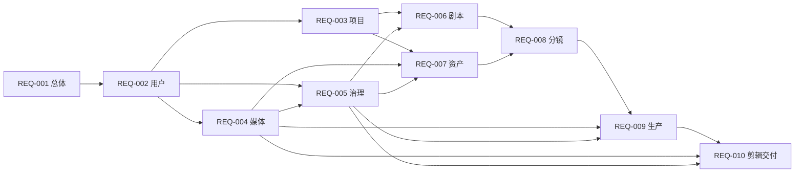

# Lanverse 需求索引

本目录是业务需求事实来源，回答“系统必须提供什么、满足什么约束”。架构、技术和目录选择仍以 `../design/` 为准；需求不得反向复制实现细节。

当前文档均为 `待确认`。业务确认后才能进入 MVP PRD、接口契约、数据模型和实施 Plan；实现完成后再形成 Acceptance 证据。

## 需求文档

| 编号 | 文档 | 事实范围 | 状态 |
| --- | --- | --- | --- |
| REQ-001 | [平台总体需求概述](./001-平台总体需求概述.md) | 用户、业务闭环、全局功能与非功能约束 | 待确认 |
| REQ-002 | [用户与空间模块](./002-用户与空间模块需求.md) | 身份映射、Workspace、成员与角色 | 待确认 |
| REQ-003 | [项目模块](./003-项目模块需求.md) | Project、Episode 与生产概览 | 待确认 |
| REQ-004 | [媒体模块](./004-媒体模块需求.md) | 文件上传、版本、访问、探测与血缘 | 待确认 |
| REQ-005 | [审核治理模块](./005-审核治理模块需求.md) | 授权、审核、问题、内容标识与审计 | 待确认 |
| REQ-006 | [剧本模块](./006-剧本模块需求.md) | 原文、版本、结构化场景与提取决议 | 待确认 |
| REQ-007 | [资产模块](./007-资产模块需求.md) | 角色、场景、道具、服装、风格与声音版本 | 待确认 |
| REQ-008 | [分镜模块](./008-分镜模块需求.md) | Shot、ShotSpecVersion、顺序与 readiness | 待确认 |
| REQ-009 | [生产模块](./009-生产模块需求.md) | 生成请求、任务、候选、恢复与成本 | 待确认 |
| REQ-010 | [剪辑交付模块](./010-剪辑交付模块需求.md) | 时间线、渲染、审核交接与交付清单 | 待确认 |

## 文档依赖

箭头表示后者使用前者的需求事实；运行时协作不得造成文档推导环。

## 编号和表达规则

- `FR`：用户可观察的功能性需求。
- `NFR`：安全、性能、一致性、恢复、可维护性等非功能性要求。
- `IF`：模块公开查询、命令、事件或外部系统交接需求，不等同于最终 URL。
- `ENT`：业务实体、身份、生命周期、不可变性和引用约束，不等同于数据库表设计。
- 每个编号在仓库内唯一；需求变更必须先更新所属文档和受影响的交接关系。
- “待量化”表示业务目标已存在，但阈值依赖尚未确认的单集规模、供应商或上线环境，不得在实现时自行猜测。

## 设计依据

- [产品调研与核心能力](../design/001-人工智能短剧平台产品调研与核心能力.md)
- [架构与技术选型](../design/002-人工智能短剧平台架构与技术选型.md)
- [业务闭环与模块协作](../design/003-业务闭环与模块协作设计.md)
- [核心业务模块与通用增删改查](../design/004-核心业务模块与通用增删改查设计.md)
