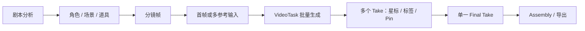

# LumenX 项目研究

- 编号：RES-003
- 调研日期：2026-08-14
- 分类：AI 短漫剧垂直制作工作台
- 固定快照：[alibaba/lumenx@`f2a02e23171447c939e7d8e1386b24d17049bbf1`](https://github.com/alibaba/lumenx/tree/f2a02e23171447c939e7d8e1386b24d17049bbf1)
- 快照提交时间：2026-08-11
- Stars 快照：1,061，仅作检索记录，不代表成熟度
- 许可证证据：[根 LICENSE 为 MIT](https://github.com/alibaba/lumenx/blob/f2a02e23171447c939e7d8e1386b24d17049bbf1/LICENSE)
- 研究结论：本轮最直接的“逐镜视频候选—人工选择—最终使用项”证据

## 1. 公开事实

LumenX 把产品分成 Studio 和 Playground：Studio 承担剧本、分镜、资产、视频与合成流程；Playground 是无剧本上下文的独立图片/视频工具台。[README 明确给出这两个模块及技术目录](https://github.com/alibaba/lumenx/blob/f2a02e23171447c939e7d8e1386b24d17049bbf1/README.md)。

仓库中的 Studio 领域模型提供了比 README 更强的证据：

- `ImageAsset` 保存多个图片变体与一个 `selected_id`；收藏变体不会被自动清理；
- `VideoTask` 保存项目/镜头/资产关系、状态、错误、Prompt、模型参数、参考输入、供应商名称、供应商 task/request ID、星标和短标签；
- `StoryboardFrame` 保存 `selected_video_id`、人工 pin 标志与单数 `final_take_id`；
- `is_video_pinned` 的注释明确说明，新生成结果不能覆盖人工挑选；
- `final_take_id` 被描述为最终交付使用的单一结果，而星标允许多选。

以上字段均可在固定提交的 [`models.py`](https://github.com/alibaba/lumenx/blob/f2a02e23171447c939e7d8e1386b24d17049bbf1/src/apps/comic_gen/models.py) 复核。

任务恢复方面，Pipeline 在进程启动时扫描持久化的 `pending/processing` 视频任务，将其标记为失败并给出可读原因；注释明确拒绝自动重跑，因为供应商可能已经收费，自动重提会重复扣费。[恢复策略与原因](https://github.com/alibaba/lumenx/blob/f2a02e23171447c939e7d8e1386b24d17049bbf1/src/apps/comic_gen/pipeline.py) 有直接代码说明。

## 2. 工作流与模块

### 2.1 Studio 与 Playground 分离

**事实**：有项目上下文的生产流与独立生成工具台是两个产品模块。

**推断**：探索型生成与正式制作的状态要求不同。Playground 可以快速试错；Studio 的每次输入、结果和选择必须回到项目/镜头。

**Lanverse 决策**：当前只定义正式制作链；将来如有快速试验台，其媒体只有经过显式“纳入项目”才成为项目资产。

### 2.2 资产变体与选择

**事实**：图片资产保存变体历史与单一选择，收藏变体有保留语义；视频任务也保存审阅标记。[模型证据](https://github.com/alibaba/lumenx/blob/f2a02e23171447c939e7d8e1386b24d17049bbf1/src/apps/comic_gen/models.py)

**推断**：生成结果不应写回一个可覆盖的 `url`；“生成”“候选”“收藏”“当前选择”是不同概念。

**Lanverse 决策**：图片和视频都采用不可变候选；Selection 是独立决议，不由结果创建自动隐式完成。

### 2.3 镜头视频审阅

**事实**：同镜头可有多个 `VideoTask`，可多选星标、添加短标签、人工 pin 当前视频，Assembly 再选一个 `final_take_id`。[字段注释](https://github.com/alibaba/lumenx/blob/f2a02e23171447c939e7d8e1386b24d17049bbf1/src/apps/comic_gen/models.py) 清楚区分 shortlist 与 final take。

**推断**：星标服务“快速缩小候选”，主选服务“导出确定性”，两个操作不能共用一个布尔值。

**Lanverse 决策**：首版可以不实现标签和星标，但必须实现“多个成功候选 + 唯一显式主选”；新候选不得覆盖主选。

## 3. 任务、恢复与失败边界

| 观察 | 事实 | Lanverse 判断 |
| --- | --- | --- |
| 供应商标识 | VideoTask 持久化 provider、task ID、request ID | ProviderExecution 必须保存可诊断标识 |
| 状态 | `pending/processing/completed/failed` 与 error | Lanverse 还需 `cancelled` 和 `unknown`，避免把不确定提交误写失败 |
| 启动恢复 | 遗留任务标失败，不自动恢复 | 在没有可靠 provider task ID 时，这是安全默认值 |
| 重试 | 用户看到失败后可显式 Retry | 重试产生新 Attempt，不改写旧 Attempt |
| 防覆盖 | pin 后自动选择最新结果会跳过该镜头 | 主选必须受人工决议保护 |

LumenX 的恢复证据同时暴露边界：它承认 FastAPI `BackgroundTasks` 在进程重启后丢失；部分资产任务仍在进程内字典，而持久化扫描主要覆盖视频任务。[Pipeline 注释](https://github.com/alibaba/lumenx/blob/f2a02e23171447c939e7d8e1386b24d17049bbf1/src/apps/comic_gen/pipeline.py)

**待验证**：

- 供应商已经返回 task ID 时，是否能在重启后继续轮询而非统一失败；
- 请求超时但供应商已接收时，是否表达 `unknown`；
- 并发点击、重复回调和刷新重试是否有业务幂等键；
- 取消是否只改变本地状态，还是能取消供应商任务。

## 4. 媒体与版本边界

### 4.1 已有证据

- 图片和视频存在变体/任务历史；
- `prompt_used`、模型参数、参考图片 URL 与供应商标识伴随生成任务保存；
- 镜头对当前选择和最终 take 使用 ID，而不是只保存 URL；
- 用户上传源文件有显式来源标记。[`models.py`](https://github.com/alibaba/lumenx/blob/f2a02e23171447c939e7d8e1386b24d17049bbf1/src/apps/comic_gen/models.py)

### 4.2 风险

- 多处仍直接保存 URL，不能从字段本身证明内容哈希、对象存储 key、MIME、尺寸、时长和来源血缘完整；
- 变体清理与删除逻辑可能在选中项删除后自动选最后一项，这不适合“导出主选”语义；
- 未看到明确的上游版本依赖或 stale 传播字段；
- `selected_video_id` 与 `final_take_id` 同时存在，需要非常清楚的阶段语义，否则用户会看到两套“选中”。

**Lanverse 决策**：MediaAsset 负责文件事实，VideoCandidate 负责生成血缘，ShotSelection 只负责当前导出决议；删除候选不得静默替换主选。

## 5. 导出边界

**事实**：README 声明 Studio 有时间线、FFmpeg 合成与导出，模型将 `final_take_id` 定义为 Assembly 的最终选择。[README](https://github.com/alibaba/lumenx/blob/f2a02e23171447c939e7d8e1386b24d17049bbf1/README.md) 与 [模型](https://github.com/alibaba/lumenx/blob/f2a02e23171447c939e7d8e1386b24d17049bbf1/src/apps/comic_gen/models.py) 可交叉验证产品意图。

**边界**：当前 Lanverse 不做 Assembly 时间线、配音、FFmpeg 拼接或成片。LumenX 的 Final Take 思想仍适用，因为导出有序独立镜头前也必须确定每镜使用哪个结果。

**Lanverse 决策**：借鉴“最终 take 是单数且显式”的语义，不借鉴其成片链；素材包以 ExportManifest 固定镜头顺序、候选 ID 和媒体校验信息。

## 6. 安全边界

**事实**：README 将应用描述为本地优先，凭据可通过 `.env` 或应用设置配置，并支持可选 OSS。[配置说明](https://github.com/alibaba/lumenx/blob/f2a02e23171447c939e7d8e1386b24d17049bbf1/README.md)

**不可推断**：本地优先不自动等于安全。仅凭 README 不能证明凭据加密、日志脱敏、SSRF 防护、上传扫描、路径隔离、租户隔离或对象存储签名策略。

**Lanverse 决策**：不吸收凭据存储方式；Provider 密钥只能进入受控服务端配置，任务/错误/导出不得回显密钥或完整鉴权头。

## 7. 测试证据与边界

固定提交包含 Pipeline、Provider 路由、媒体引用、参数、FFmpeg 路径安全和视频任务恢复等测试，例如 [`tests/test_video_task_recovery.py`](https://github.com/alibaba/lumenx/blob/f2a02e23171447c939e7d8e1386b24d17049bbf1/tests/test_video_task_recovery.py) 与 [`tests/test_ffmpeg_path_safety.py`](https://github.com/alibaba/lumenx/blob/f2a02e23171447c939e7d8e1386b24d17049bbf1/tests/test_ffmpeg_path_safety.py)。

这些测试证明固定提交对部分失败路径有可执行约束，但不证明：

- 真实供应商的未知提交、重复回调和长时间轮询；
- 多用户并发选择同一镜头的冲突；
- 大型项目恢复、对象存储故障和导出一致性；
- 安全、负载、灾备和长期迁移。

## 8. 可吸收模式

1. Studio 与 Playground 的责任隔离；
2. 生成结果以候选集合存在，不覆盖单一 URL；
3. 星标 shortlist 与最终选择分离；
4. 人工 pin 后，新结果不能自动覆盖；
5. Provider task/request ID 进入可诊断任务记录；
6. 对重启遗留任务采用“停止自动动作、向用户解释”的保守恢复；
7. 每镜最终交付项必须为显式单选。

## 9. 明确拒绝点

- 不移植 LumenX 代码、模型适配器或页面；
- 不照搬 `pending/processing/completed/failed` 四态，Lanverse 必须表达取消与未知；
- 不用进程内后台任务作为正式异步执行底座；
- 不让删除选中候选后自动切换到“最后一个”；
- 不同时暴露两套含义不清的“selected/final”给用户；
- 不把时间线、配音和成片引入当前范围；
- 不因 Alibaba 组织或 Stars 数量推断生产成熟度。

## 10. Lanverse 决策

LumenX 是当前逐镜视频模块的第一优先产品证据。Lanverse 将采用 `Shot -> VideoGenerationTask[] -> VideoCandidate[] -> ShotSelection(0..1)` 的语义，并增加 LumenX 未完整表达的 ProviderExecution、请求快照、`unknown` 状态、stale 与不可变 ExportManifest。最终产品文案只保留“候选”和“当前主选”两个面向用户的核心概念。
