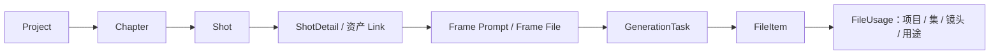

# Jellyfish 项目研究

- 编号：RES-004
- 调研日期：2026-08-14
- 分类：AI 影视/短剧垂直制作平台
- 固定快照：[Forget-C/Jellyfish@`a9678194ddf2d9be3ccbe78d4287d87d5089e123`](https://github.com/Forget-C/Jellyfish/tree/a9678194ddf2d9be3ccbe78d4287d87d5089e123)
- 快照提交时间：2026-04-20
- Stars 快照：5,966，仅作检索记录，不代表成熟度
- 许可证证据：[根 LICENSE 为 Apache-2.0](https://github.com/Forget-C/Jellyfish/blob/a9678194ddf2d9be3ccbe78d4287d87d5089e123/LICENSE)
- 研究结论：模块边界、统一任务中心、文件与使用关系的最佳对照之一

## 1. 公开事实

Jellyfish 的仓库结构包含前端、FastAPI 后端、异步 Worker 和对象存储部署配置；README 描述从剧本、资产到分镜与生成的 Studio 流程。[项目定位与运行结构](https://github.com/Forget-C/Jellyfish/blob/a9678194ddf2d9be3ccbe78d4287d87d5089e123/README.md) 属于公开声明。

固定提交的模型提供以下直接证据：

- `Project` 下有 `Chapter`，项目/章节/镜头以 ID 与唯一序号组织；
- `Shot` 与 `ShotDetail` 分开，详情承载景别、角度、运镜、时长、氛围、动作拍点和首/尾/关键帧 Prompt；
- 角色、演员、场景、道具、服装通过项目/章节/镜头范围的 Link 表关联；
- `GenerationTask` 统一保存任务类型、交付方式、状态、进度、payload、result、error、取消请求、开始/结束时间及执行器任务 ID；
- `FileUsage` 将 FileItem 与项目、章节、镜头、用途和 `source_ref` 分开，且用唯一约束支持同槽位 upsert。

直接证据见 [`studio_projects.py`](https://github.com/Forget-C/Jellyfish/blob/a9678194ddf2d9be3ccbe78d4287d87d5089e123/backend/app/models/studio_projects.py)、[`studio_shots.py`](https://github.com/Forget-C/Jellyfish/blob/a9678194ddf2d9be3ccbe78d4287d87d5089e123/backend/app/models/studio_shots.py)、[`task.py`](https://github.com/Forget-C/Jellyfish/blob/a9678194ddf2d9be3ccbe78d4287d87d5089e123/backend/app/models/task.py) 与 [`studio_file_usages.py`](https://github.com/Forget-C/Jellyfish/blob/a9678194ddf2d9be3ccbe78d4287d87d5089e123/backend/app/models/studio_file_usages.py)。

## 2. 工作流与模块边界

### 2.1 Project—Chapter—Shot

**事实**：`project_id + chapter index`、`chapter_id + shot index` 有唯一约束；镜头以 ID 作为主键。[项目模型](https://github.com/Forget-C/Jellyfish/blob/a9678194ddf2d9be3ccbe78d4287d87d5089e123/backend/app/models/studio_projects.py) 与 [镜头模型](https://github.com/Forget-C/Jellyfish/blob/a9678194ddf2d9be3ccbe78d4287d87d5089e123/backend/app/models/studio_shots.py)

**推断**：显示序号可重排，但稳定身份不能依赖镜号文本；这是历史候选与导出清单长期可追踪的基础。

**Lanverse 决策**：Episode 与 Shot 使用稳定 ID，序号只作当前排序属性；拆镜、合镜产生显式谱系，不复用旧 ID 冒充同一镜头。

### 2.2 镜头主表与详情

**事实**：Shot 保存稳定列表信息，ShotDetail 保存较重的导演与 Prompt 字段；关键帧文件另表关联。[`studio_shots.py`](https://github.com/Forget-C/Jellyfish/blob/a9678194ddf2d9be3ccbe78d4287d87d5089e123/backend/app/models/studio_shots.py)

**推断**：列表扫描与详细编辑可以共用同一领域事实，但读取模型不同；无需为了画布、列表或详情页复制数据。

**Lanverse 决策**：产品模块按领域职责划分，视图不创建第二套镜头数据；镜头规格独立版本化，避免高频状态更新改写规格事实。

### 2.3 多范围资产关系

**事实**：Actor、Scene、Prop、Costume 通过 Link 表绑定项目、章节和镜头范围。[`studio_projects.py`](https://github.com/Forget-C/Jellyfish/blob/a9678194ddf2d9be3ccbe78d4287d87d5089e123/backend/app/models/studio_projects.py)

**推断**：资产“属于项目”与“在本镜使用”不同；直接在 Shot 上保存一串 URL 无法表达复用、状态和影响范围。

**Lanverse 决策**：Asset 是可复用身份，ShotAssetBinding 固定某个用途、状态/版本与顺序。

## 3. 任务中心、恢复与失败边界

`GenerationTaskStatus` 包含 `pending/running/streaming/succeeded/failed/cancelled`，并记录 `cancel_requested` 与实际 `cancelled_at`；`mode` 区分流式和异步轮询；`executor_task_id` 连接执行器。[任务模型](https://github.com/Forget-C/Jellyfish/blob/a9678194ddf2d9be3ccbe78d4287d87d5089e123/backend/app/models/task.py)

| 模式 | 事实 | Lanverse 吸收判断 |
| --- | --- | --- |
| 任务类型 | `task_kind` 路由不同业务任务 | 统一任务外壳，内部按能力路由 |
| 交付方式 | streaming 与 async_polling 分开 | 视频首版只承诺异步；事件通知不改变服务端事实 |
| 取消 | 请求取消与实际取消分别记录 | 前端“已请求取消”不能马上显示“已取消” |
| 结果与错误 | payload/result/error 在任务上 | 结果媒体仍须独立实体，不能长期只塞 JSON |
| 执行器关联 | 保存 executor task ID | 还需保存 provider task/request ID，二者责任不同 |

**待验证**：

- Worker 重启后的租约、抢占、超时和重投策略；
- 供应商提交不确定时是否有 `unknown`；
- 取消与供应商取消的最终一致性；
- 同一业务幂等键如何防止双提交；
- 任务日志和 payload 是否进行凭据、隐私与 Prompt 脱敏。

**Lanverse 决策**：任务状态采用 `queued/running/succeeded/failed/cancel_requested/cancelled/unknown` 的业务语义；ExecutorExecution 与 ProviderExecution 分开。未知状态不自动重投。

## 4. 镜头就绪与生成状态

**事实**：镜头具有 `pending/generating/ready` 状态；仓库还存在镜头准备状态服务和对应测试，例如 [`test_shot_preparation_state.py`](https://github.com/Forget-C/Jellyfish/blob/a9678194ddf2d9be3ccbe78d4287d87d5089e123/backend/tests/test_shot_preparation_state.py) 与 [`test_shot_status_service.py`](https://github.com/Forget-C/Jellyfish/blob/a9678194ddf2d9be3ccbe78d4287d87d5089e123/backend/tests/test_shot_status_service.py)。

**推断**：一个镜头“输入齐全可提交”和“一次任务正在生成”是两条不同轴。即使 UI 最终聚合显示，也不应只存一个混合状态。

**风险**：`ShotStatus` 本身仍混入 generating 与 ready；若实现只依赖一个字段，多个并行任务、失败后仍可重试和已有主选等场景会难表达。

**Lanverse 决策**：持久化 `ShotReadiness`/阻塞原因与 GenerationTask 状态，镜头汇总状态由这些事实计算，不作为唯一真相。

## 5. 媒体与使用关系

**事实**：Shot 的生成视频通过 `generated_video_file_id` 指向 FileItem；关键帧通过 `ShotFrameImage.file_id` 关联；`FileUsage` 再表达文件在项目/集/镜头中的用途和幂等 `source_ref`。[镜头模型](https://github.com/Forget-C/Jellyfish/blob/a9678194ddf2d9be3ccbe78d4287d87d5089e123/backend/app/models/studio_shots.py) 与 [使用关系](https://github.com/Forget-C/Jellyfish/blob/a9678194ddf2d9be3ccbe78d4287d87d5089e123/backend/app/models/studio_file_usages.py)

**可吸收点**：

- 物理文件事实与业务使用位置分开；
- 同一媒体可被多个业务对象复用；
- 删除一个使用关系不必删除物理文件；
- `source_ref` 可为有序槽位提供幂等定位。

**拒绝点**：Shot 上单一 `generated_video_file_id` 不足以表达多候选、星标、主选与 stale；Lanverse 不能只复制这一关系。

**Lanverse 决策**：MediaAsset、MediaUsage、VideoCandidate 与 ShotSelection 四层分开；物理回收由引用计数/保留策略决定，不随界面删除即时执行。

## 6. 导出边界

**事实**：本轮固定证据主要覆盖项目、镜头、任务和文件，未从这些模型证明“固定版本素材包 Manifest”。README 中更广的制作目标不等于已经存在符合 Lanverse 边界的导出契约。[README](https://github.com/Forget-C/Jellyfish/blob/a9678194ddf2d9be3ccbe78d4287d87d5089e123/README.md)

**待验证**：导出是否固定镜头/选择版本、如何处理缺失/过期媒体、导出重试是否幂等。

**Lanverse 决策**：Jellyfish 只为媒体与使用关系提供参考；导出采用独立 ExportPackage/ExportManifest，不直接遍历“当前文件字段”。

## 7. 安全边界

**事实**：模型层多处使用外键、级联/SET NULL、唯一约束和项目范围字段；ShotDetail 注释明确要求应用层防止跨项目资产引用。[`studio_shots.py`](https://github.com/Forget-C/Jellyfish/blob/a9678194ddf2d9be3ccbe78d4287d87d5089e123/backend/app/models/studio_shots.py)

**推断**：数据库约束不能替代每次资源访问的项目/租户授权；“应用层保证”是必须测试的安全边界。

**待验证**：对象存储签名、上传类型与大小、SSRF、任务 payload 脱敏、租户级队列限流和文件删除授权。

**Lanverse 决策**：所有项目级 ID 在服务端重新解析归属；不得因前端传入 project_id 就信任跨项目 FileItem 或 Asset。

## 8. 测试证据与边界

固定提交包含任务执行/注册/管理、异步 Worker、视频服务、文件使用、镜头状态、供应商适配器等测试。例如：

- [`test_task_manager.py`](https://github.com/Forget-C/Jellyfish/blob/a9678194ddf2d9be3ccbe78d4287d87d5089e123/backend/tests/test_task_manager.py)
- [`test_async_worker_services.py`](https://github.com/Forget-C/Jellyfish/blob/a9678194ddf2d9be3ccbe78d4287d87d5089e123/backend/tests/test_async_worker_services.py)
- [`test_file_usages.py`](https://github.com/Forget-C/Jellyfish/blob/a9678194ddf2d9be3ccbe78d4287d87d5089e123/backend/tests/test_file_usages.py)
- [`test_generated_video_service.py`](https://github.com/Forget-C/Jellyfish/blob/a9678194ddf2d9be3ccbe78d4287d87d5089e123/backend/tests/test_generated_video_service.py)

这能证明模块已有可执行契约，不证明真实供应商压力、多租户攻击面、灾备、长时间运行或所有 README 能力。

## 9. 可吸收模式

1. 项目—剧集—镜头的稳定身份和唯一顺序约束；
2. 轻量镜头主表与较重规格详情分责；
3. 资产身份与项目/剧集/镜头使用关系分开；
4. 统一任务中心承载状态、进度、错误、取消和执行器关联；
5. 取消请求与取消完成分开；
6. FileItem 与 FileUsage 分开，槽位通过 source_ref 幂等定位；
7. 准备就绪与任务执行应为不同状态轴；
8. API/服务/模型都有针对性测试，而不是只测页面。

## 10. 明确拒绝点

- 不移植 Jellyfish 代码或沿用其技术栈作为默认答案；
- 不把所有能力塞进 task payload/result JSON；
- 不用 Shot 单一 generated video 字段替代候选集合；
- 不把 `ready/generating` 继续混成唯一镜头状态；
- 不把数据库外键当租户授权；
- 不提前采用微服务，只因仓库有 Worker/Redis/S3；
- 不因测试数量或 Stars 推断线上成熟度。

## 11. Lanverse 决策

Jellyfish 是 Lanverse 领域模块和平台支撑边界的主要参考：项目、剧集、镜头、资产关系、任务中心和媒体使用必须是明确模块。当前建议保持模块化单体 API 与独立异步 Worker；任务和媒体形成跨模块平台能力，但每个业务模块拥有自己的准备规则、候选和选择语义。
