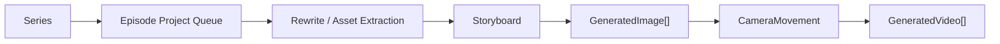

# ai-story 项目研究

- 编号：RES-007
- 调研日期：2026-08-14
- 分类：AI 短剧垂直生产平台
- 固定快照：[xhongc/ai_story@`dce13ea9fa32c81b82aa392f6a0f6e4e540a12e7`](https://github.com/xhongc/ai_story/tree/dce13ea9fa32c81b82aa392f6a0f6e4e540a12e7)
- 快照提交时间：2026-08-06
- Stars 快照：1,339，仅作检索记录，不代表成熟度
- 许可证证据：[README 声明 CC BY-NC-SA 4.0](https://github.com/xhongc/ai_story/blob/dce13ea9fa32c81b82aa392f6a0f6e4e540a12e7/README.md)，固定提交无根 LICENSE
- 研究结论：阶段责任链、分集串行队列、生成结果一对多和 Prompt 版本的有力证据；许可边界显著

## 1. 公开事实

项目采用 Django、Celery/Redis 与 Vue 的公开架构，围绕项目阶段执行文案、资产提取、分镜、图片、运镜和视频任务。[README](https://github.com/xhongc/ai_story/blob/dce13ea9fa32c81b82aa392f6a0f6e4e540a12e7/README.md)

领域模型和任务代码提供以下事实：

- `ProjectStage` 分阶段保存 input/output、状态、重试次数、错误与开始/完成时间；
- `EpisodeTaskQueue` 将同一系列的分集任务排队，并保存 Celery task ID；
- Storyboard 与 GeneratedImage、GeneratedVideo 是一对多关系；
- GeneratedVideo 明确关联源 GeneratedImage 和 CameraMovement；
- PromptTemplate 按阶段组织，具有版本、启用状态和唯一活动模板约束；
- Celery 任务采用 `acks_late`、`reject_on_worker_lost` 和时间限制，并通过 Redis Stream 推进阶段事件。

证据见 [`projects/models.py`](https://github.com/xhongc/ai_story/blob/dce13ea9fa32c81b82aa392f6a0f6e4e540a12e7/backend/apps/projects/models.py)、[`content/models.py`](https://github.com/xhongc/ai_story/blob/dce13ea9fa32c81b82aa392f6a0f6e4e540a12e7/backend/apps/content/models.py)、[`projects/tasks.py`](https://github.com/xhongc/ai_story/blob/dce13ea9fa32c81b82aa392f6a0f6e4e540a12e7/backend/apps/projects/tasks.py) 与 [`prompts/models.py`](https://github.com/xhongc/ai_story/blob/dce13ea9fa32c81b82aa392f6a0f6e4e540a12e7/backend/apps/prompts/models.py)。

## 2. 工作流与模块

### 2.1 阶段责任链

**事实**：阶段有独立输入、输出、错误和重试计数，Prompt 模板也按阶段划分。

**推断**：不同阶段应拥有自己的准备条件和失败解释；“项目正在生成”不足以告诉用户是资产提取失败还是第 17 镜视频失败。

**风险**：把大量事实放入 `input_data/output_data` JSON 会削弱长期查询、引用和版本约束。

**Lanverse 决策**：保留阶段化用户体验，但核心剧本、资产、镜头、任务和媒体必须是显式领域对象；阶段汇总由对象状态计算。

### 2.2 分集串行队列

**事实**：仓库有 Series 与 EpisodeTaskQueue，队列记录 waiting/running 等状态和 Celery task ID。[项目模型](https://github.com/xhongc/ai_story/blob/dce13ea9fa32c81b82aa392f6a0f6e4e540a12e7/backend/apps/projects/models.py)

**推断**：同系列分集共享角色/世界观，盲目全并发可能带来上下文竞争、成本峰值和一致性问题；串行是一种保护策略，不一定是永久产品限制。

**Lanverse 决策**：首版以镜头任务限流和项目级并发配额控制；不强制所有剧集串行，但涉及共享资产基线变更时需要冻结输入版本。

### 2.3 一对多生成结果

**事实**：一个 Storyboard 可关联多个 GeneratedImage 和多个 GeneratedVideo；视频还保留源图与运镜关系。[内容模型](https://github.com/xhongc/ai_story/blob/dce13ea9fa32c81b82aa392f6a0f6e4e540a12e7/backend/apps/content/models.py)

**推断**：领域模型已为多候选保留空间，但没有等同于已完成人工主选。

**Lanverse 决策**：吸收一对多与源图血缘；另建 ShotSelection，不能用最新 created_at 推断当前主选。

## 3. 任务恢复与失败边界

**事实**：Celery 任务开启 worker 丢失后拒绝、延迟确认与软/硬超时；阶段错误会写入 ProjectStage 并发布错误事件；项目暂停/任务撤销有单独分支。[任务实现](https://github.com/xhongc/ai_story/blob/dce13ea9fa32c81b82aa392f6a0f6e4e540a12e7/backend/apps/projects/tasks.py)

**推断**：事件流只负责通知，数据库阶段/队列事实负责刷新后恢复；这比把前端 SSE 内存当真相更可靠。

**风险**：

- `acks_late + reject_on_worker_lost` 可能重跑已产生外部副作用的任务；AI 供应商提交必须另外幂等；
- 代码中部分 Celery task 配置 `max_retries=0`，模型里的 `max_retries=3` 不代表执行器真的自动重试；
- 阶段级重试可能重复整批镜头，而不是只恢复失败项；
- 没有直接证据证明 provider task/request ID 被完整持久化。

**Lanverse 决策**：队列投递重试与供应商提交重试分开；任务先生成业务幂等键，供应商提交结果不确定时进入 `unknown`。

## 4. Prompt 版本与执行快照

**事实**：PromptTemplate 有 version、is_active，并约束一个模板集每阶段只有一个活动模板；生成对象保存 `prompt_used` 和 generation metadata。[Prompt 模型](https://github.com/xhongc/ai_story/blob/dce13ea9fa32c81b82aa392f6a0f6e4e540a12e7/backend/apps/prompts/models.py) 与 [内容模型](https://github.com/xhongc/ai_story/blob/dce13ea9fa32c81b82aa392f6a0f6e4e540a12e7/backend/apps/content/models.py)

**推断**：活动模板会变，但历史结果必须能解释当时实际使用的 Prompt；只保存 template_id 不够。

**Lanverse 决策**：Attempt 保存编译后的最终 Prompt、模板版本 ID、模型参数和参考输入快照。

## 5. 媒体与选择边界

**事实**：GeneratedImage/Video 保存 URL、尺寸、文件大小、参数、模型、状态和重试计数；视频绑定源图与运镜。

**缺口**：

- 未见内容哈希、长期对象存储 key 与 URL 过期策略的直接证据；
- 未见 favorite/selected/selection history；
- 未见上游图或镜头规格变化后的 stale；
- `retry_count` 在媒体记录上可能把多次 Attempt 混成一条可变记录。

**Lanverse 决策**：一次 Attempt 只代表一次提交；重试新建 Attempt；每个成功输出形成独立 Candidate 和 MediaAsset。

## 6. 导出边界

**事实**：Project 有 `jianying_draft_path`，任务代码引用 JianyingDraftGenerator；仓库有剪映草稿相关测试 [`test_jianying_draft.py`](https://github.com/xhongc/ai_story/blob/dce13ea9fa32c81b82aa392f6a0f6e4e540a12e7/backend/apps/projects/tests/test_jianying_draft.py)。

**边界**：Lanverse 当前不承诺剪映草稿、时间线或成片。该证据只说明“外部后期交接”是独立模块，不支持照搬格式。

**Lanverse 决策**：输出标准化镜头素材包与 Manifest；如未来适配编辑器，通过导出适配器读取固定 Manifest，而不改变核心选择模型。

## 7. 安全与许可边界

README 声明 CC BY-NC-SA 4.0，但根目录没有 LICENSE 文件，且非商业/相同方式共享条款与商业 SaaS 目标存在显著边界。这不是代码复用候选。

模型提供用户级关系，任务中部分查询使用 user_id；但这不能证明所有任务、媒体、Prompt 全部完成对象级授权。Redis channel 中含 project_id 也需要鉴权订阅。

**Lanverse 决策**：只研究模式；不复制代码、Prompt 或剪映适配。异步任务必须在执行时重新验证项目归属，事件订阅必须授权。

## 8. 测试证据与边界

固定提交包含模型服务、供应商批量、分集队列、Prompt 调试、剪映草稿和图生视频客户端测试，例如：

- [`test_queue.py`](https://github.com/xhongc/ai_story/blob/dce13ea9fa32c81b82aa392f6a0f6e4e540a12e7/backend/apps/projects/tests/test_queue.py)
- [`test_vendor_batch.py`](https://github.com/xhongc/ai_story/blob/dce13ea9fa32c81b82aa392f6a0f6e4e540a12e7/backend/apps/models/tests/test_vendor_batch.py)
- [`test_image2video_client.py`](https://github.com/xhongc/ai_story/blob/dce13ea9fa32c81b82aa392f6a0f6e4e540a12e7/backend/apps/models/tests/test_image2video_client.py)

仍不能证明真实供应商未知提交、多租户安全、灾备、长剧容量或许可适用性。

## 9. 可吸收模式

1. 各生产阶段有独立状态、错误与时间；
2. 分集任务有持久队列，不依赖页面顺序；
3. 事件通知与数据库事实分开；
4. Storyboard 对 GeneratedImage/Video 一对多；
5. 视频保留源图片与运镜血缘；
6. Prompt 模板版本与最终 prompt_used 同时保留；
7. 项目暂停需要传播到正在执行的阶段。

## 10. 明确拒绝点

- 不复用 CC BY-NC-SA/无根 LICENSE 边界不清的代码或 Prompt；
- 不把 ProjectStage JSON 当核心领域存储；
- 不让 Celery 自动重投直接重放供应商提交；
- 不把 retry_count 当多次 Attempt 历史；
- 不用最新 GeneratedVideo 推断主选；
- 不把剪映草稿和成片带入当前范围；
- 不因阶段齐全推断工作流已达生产级。

## 11. Lanverse 决策

Lanverse 吸收“阶段责任链 + 持久队列 + 生成结果一对多 + Prompt 执行快照”，但领域事实不塞入阶段 JSON，任务重试不重放外部副作用，视频必须另有显式主选与 stale。
