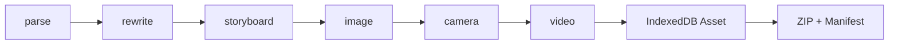

# dramai 项目研究

- 编号：RES-008
- 调研日期：2026-08-14
- 分类：浏览器内 AI 短剧工作台
- 固定快照：[hyyyyyyz/dramai@`2ec38104380823aff711c96ed852d5f713b8ac5a`](https://github.com/hyyyyyyz/dramai/tree/2ec38104380823aff711c96ed852d5f713b8ac5a)
- 快照提交时间：2026-05-04
- Stars 快照：24，仅作检索记录，不代表成熟度
- 许可证证据：[根 LICENSE 为 Apache-2.0](https://github.com/hyyyyyyz/dramai/blob/2ec38104380823aff711c96ed852d5f713b8ac5a/LICENSE)
- 研究结论：浏览器内持久化、异步事件与 Manifest-first 导出的有用样本；视频覆盖是明确反例

## 1. 公开事实

架构文档声明“零后端、静态托管、数据本地化”，React/Zustand 之下由 Core 层负责 Pipeline、Provider、Dexie 存储与导出。[架构文档](https://github.com/hyyyyyyz/dramai/blob/2ec38104380823aff711c96ed852d5f713b8ac5a/docs/ARCHITECTURE.md)

Dexie schema 定义 projects、characters、materials、storyboards、assets、generations 六张表；迁移注释要求 schema 变更必须新增 version。[`db.ts`](https://github.com/hyyyyyyz/dramai/blob/2ec38104380823aff711c96ed852d5f713b8ac5a/src/core/storage/db.ts)

单镜视频生成使用 AsyncGenerator 依次发出 submitting、queued、processing、downloading、persisting、done/error 事件；供应商 task handle 会写入 storyboard 以支持刷新恢复。[`video-shot.ts`](https://github.com/hyyyyyyz/dramai/blob/2ec38104380823aff711c96ed852d5f713b8ac5a/src/core/pipeline/video-shot.ts)

## 2. 工作流与模块

### 2.1 浏览器内责任链

**事实**：架构将 Pipeline 与 UI 分离，以 tagged event/AsyncGenerator 向界面报告阶段。[架构文档](https://github.com/hyyyyyyz/dramai/blob/2ec38104380823aff711c96ed852d5f713b8ac5a/docs/ARCHITECTURE.md)

**推断**：用户可见进度应来自结构化事件，不应解析日志文本；取消应通过明确控制信号。

**Lanverse 决策**：服务端任务产生结构化事件，前端可用 SSE/WebSocket 接收，但刷新后必须重新读取持久任务。

### 2.2 IndexedDB 领域表

**事实**：项目、人物、素材、分镜、媒体和生成记录分表，而不是一个浏览器 JSON。[`db.ts`](https://github.com/hyyyyyyz/dramai/blob/2ec38104380823aff711c96ed852d5f713b8ac5a/src/core/storage/db.ts)

**推断**：即使纯本地产品也需要领域边界和迁移；“本地优先”不等于无数据库设计。

**边界**：浏览器表不提供服务端授权、跨设备同步、队列租约或多用户并发。

## 3. 任务恢复与失败处理

**事实**：视频 submit 成功后，`taskId/apiFlavor/submittedAt` 写入 `pendingVideoTask`；轮询支持 queued/processing/failed/succeeded；超时、下载失败和取消均产生 error 事件。[`video-shot.ts`](https://github.com/hyyyyyyz/dramai/blob/2ec38104380823aff711c96ed852d5f713b8ac5a/src/core/pipeline/video-shot.ts)

**亮点**：先持久化 provider handle，再持续 poll；任务与下载/落库阶段分别可见。

**风险**：

- 用户取消后直接清除 pending handle，但不能证明供应商任务已取消；
- 轮询超时也清除 handle，可能丢失仍在供应商运行的任务；
- task handle 存在 storyboard 上，不是独立 Attempt，难保留多次历史；
- 浏览器关闭期间没有独立 Worker 继续推进。

**Lanverse 决策**：保留 provider handle；超时进入 `unknown` 或可继续查询，不能清除恢复证据；取消请求与取消完成分开。

## 4. 媒体、候选与覆盖反例

**事实**：视频下载为 Blob 后，在创建新 Asset 前会删除 `shot.videoAssetId` 指向的旧 Asset，然后把新 ID 写回 Storyboard。[`video-shot.ts`](https://github.com/hyyyyyyz/dramai/blob/2ec38104380823aff711c96ed852d5f713b8ac5a/src/core/pipeline/video-shot.ts)

这是本研究的明确反例：

- 再生成会删除上一结果，无法比较候选；
- 若新媒体落库后更新 Storyboard 失败，会存在不一致；
- 人工选择没有独立记录；
- 导出只能读取“当前槽位”，无法证明用户为何选它；
- 回滚与 stale 无法表达。

**Lanverse 决策**：新结果永远追加 Candidate/MediaAsset；只有用户切换 ShotSelection；媒体回收需经过保留期和引用检查。

## 5. 导出：Manifest-first 的价值与命名风险

`buildJianyingPackage` 生成 assets、SRT、自定义 `manifest.json` 和 README。源码注释明确承认这不是真正的剪映 draft_content，而是建议用户手工拖入素材的 alpha 包。[`jianying.ts`](https://github.com/hyyyyyyz/dramai/blob/2ec38104380823aff711c96ed852d5f713b8ac5a/src/core/export/jianying.ts)

**可吸收点**：

- 先构造有序 Manifest，再把媒体放入 ZIP；
- 文件名包含镜头顺序；
- 包内 README 说明使用边界；
- 导出适配器与核心数据分开。

**拒绝点**：不能把“素材 + SRT + 自定义清单”命名为剪映草稿或暗示可直接打开。

**Lanverse 决策**：准确命名为“镜头视频素材包”；Manifest 记录 shot ID、序号、candidate ID、media ID、文件名、校验和、时长与 stale 状态，不生成 SRT 或剪映格式。

## 6. 安全边界

架构文档声明 API Key 默认存在 localStorage，浏览器直接 fetch 用户配置的 base URL，并声称对 AI 返回内容转义。[安全模型说明](https://github.com/hyyyyyyz/dramai/blob/2ec38104380823aff711c96ed852d5f713b8ac5a/docs/ARCHITECTURE.md)

**风险**：

- localStorage 凭据可被同源 XSS 读取；
- 用户自定义 base URL 与浏览器 CORS/恶意端点形成复杂信任边界；
- 第三方脚本、浏览器扩展和共享设备可能接触密钥/剧本；
- IndexedDB 没有租户隔离与集中备份。

**Lanverse 决策**：不采用浏览器 BYOK 密钥模型；供应商调用由服务端执行，页面不接触密钥。

## 7. 测试证据与边界

本轮固定树只发现连接测试辅助 [`src/core/llm/test-connection.ts`](https://github.com/hyyyyyyz/dramai/blob/2ec38104380823aff711c96ed852d5f713b8ac5a/src/core/llm/test-connection.ts)，未发现覆盖视频重生成、超时恢复、IndexedDB 迁移、导出清单和恶意导入的完整自动化测试证据。

因此本文把代码路径当行为证据，但不把它升级为可靠性结论。

## 8. 可吸收模式

1. Pipeline 以结构化事件报告进度；
2. submit 后立即持久化供应商 handle；
3. 下载、持久化与完成是不同任务阶段；
4. 本地数据库 schema 也必须版本迁移；
5. 导出先固定有序 Manifest，再装入媒体；
6. 导出 README 明确能力边界。

## 9. 明确拒绝点

- 不移植代码或采用浏览器零后端架构；
- 不把 API Key 存 localStorage；
- 不在再生成时删除旧视频；
- 不在超时/取消时清除 provider handle；
- 不把 Storyboard 单一 videoAssetId 当候选选择；
- 不把素材 ZIP 命名为真正剪映草稿；
- 不进入 SRT、剪辑、FFmpeg.wasm 或成片范围。

## 10. Lanverse 决策

dramai 为 Lanverse 提供了“结构化任务事件 + provider handle + Manifest-first 导出”的正面模式，也提供了“再生成覆盖旧视频”和“误导性导出命名”的反例。Lanverse 保留所有候选与恢复证据，并准确承诺独立镜头素材包。
