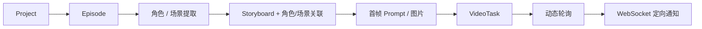

# Yihen-Drama 项目研究

- 编号：RES-010
- 调研日期：2026-08-14
- 分类：AI 短剧垂直平台
- 固定快照：[CszYihen/Yihen-Drama@`2b79d9b6ef56085ecc58ec4f0a4bc0469c38518c`](https://github.com/CszYihen/Yihen-Drama/tree/2b79d9b6ef56085ecc58ec4f0a4bc0469c38518c)
- 快照提交时间：2026-04-09
- Stars 快照：213，仅作检索记录，不代表成熟度
- 许可证证据：固定提交无根 LICENSE，GitHub API 未识别许可证
- 研究结论：持久供应商任务、延迟轮询和定向状态通知可参考；基础设施规模与单视频字段不适合当前 Lanverse

## 1. 公开事实

README 描述项目、章节、信息提取、角色/场景资产、分镜、逐镜视频、模型与 Prompt 管理。后端为 Spring Boot，前端 Vue 3；部署同时包含 MySQL、Redis、RabbitMQ、MinIO、Elasticsearch 和 Qdrant。[README](https://github.com/CszYihen/Yihen-Drama/blob/2b79d9b6ef56085ecc58ec4f0a4bc0469c38518c/README.md)

初始化 schema 显示：

- Project—Episode—Storyboard 的层级；
- Storyboard 保存单一 thumbnail/video URL 及图片/视频 Prompt；
- Storyboard 与角色、场景有关系表；
- `video_task` 保存 project、模型实例、目标对象、供应商 task ID、task type、status、progress、video URL、error、`next_poll_at` 与 `poll_count`；
- 模型实例表把 API Key 与模型参数持久化；操作日志表可保存 request_params/response_data。

直接证据见 [`init_schema.sql`](https://github.com/CszYihen/Yihen-Drama/blob/2b79d9b6ef56085ecc58ec4f0a4bc0469c38518c/yihen-drama/sql/init_schema.sql)。

README 还声明后端轮询第三方任务并通过项目级 WebSocket 按 `targetId + taskType` 精确更新前端实体。

## 2. 工作流与模块

### 2.1 项目步骤条

**事实**：Episode 有 `current_step`，README 表示步骤跳转受进度约束。[schema](https://github.com/CszYihen/Yihen-Drama/blob/2b79d9b6ef56085ecc58ec4f0a4bc0469c38518c/yihen-drama/sql/init_schema.sql) 与 [README](https://github.com/CszYihen/Yihen-Drama/blob/2b79d9b6ef56085ecc58ec4f0a4bc0469c38518c/README.md)

**风险**：单一 current_step 容易把“用户所在页面”“最高完成阶段”“当前有任务执行”混为一体，也无法表达返回上游修改。

**Lanverse 决策**：界面阶段导航不是业务真相；服务端按对象 readiness、issue 和 selection 计算可进入性。

### 2.2 镜头资产关系

**事实**：Storyboard 关联最多多个角色和一个场景，关系另表保存；Prompt 模板明确要求从已有资产选择。[schema](https://github.com/CszYihen/Yihen-Drama/blob/2b79d9b6ef56085ecc58ec4f0a4bc0469c38518c/yihen-drama/sql/init_schema.sql)

**推断**：分镜生成不能凭空创造不在资产库的角色/场景；生成前可验证引用闭包。

**Lanverse 决策**：ShotAssetBinding 只能引用项目可用的已接受资产版本；模型输出的新实体先成为候选问题，不静默入库。

## 3. 视频任务、轮询与通知

### 3.1 持久任务

**事实**：`video_task` 保存供应商 task ID、下次轮询时间和轮询次数；仓库有动态轮询器 [`VideoTaskDynamicPoller.java`](https://github.com/CszYihen/Yihen-Drama/blob/2b79d9b6ef56085ecc58ec4f0a4bc0469c38518c/yihen-drama/src/main/java/com/yihen/core/model/schedule/VideoTaskDynamicPoller.java)。

**推断**：将 `next_poll_at` 持久化可以跨进程调度并实施退避，避免每个任务常驻线程。

**Lanverse 决策**：ProviderExecution 保存 next_poll_at、poll_count、last_provider_status 和 deadline；Worker 拉取到期任务。

### 3.2 定向 WebSocket

**事实**：README 表示 WebSocket 按 `targetId + taskType` 更新具体实体；仓库有 [`TaskStatusWebSocketHandler.java`](https://github.com/CszYihen/Yihen-Drama/blob/2b79d9b6ef56085ecc58ec4f0a4bc0469c38518c/yihen-drama/src/main/java/com/yihen/websocket/TaskStatusWebSocketHandler.java)。

**推断**：事件必须包含业务对象 ID，前端无需收到一个全局“任务完成”后刷新所有镜头。

**Lanverse 决策**：事件至少包含 project_id、task_id、target_type、target_id、status、sequence；事件丢失时仍可通过 API 重建。

### 3.3 失败边界

**事实**：VideoTask 保存 error_message 和 progress；README 表示前端展示后端错误。

**缺口**：schema 里的 status 注释只有示例 `success`，没有严格状态枚举、取消、未知提交、租约与幂等键的直接证据。

**Lanverse 决策**：不复用字符串自由状态；采用受控状态机和结构化错误 code/stage/retryability。

## 4. 媒体与候选边界

**事实**：Storyboard 与 VideoTask 都有单一 video_url；没有从 schema 看到每镜多 VideoCandidate、favorite、selection 或 stale。[`init_schema.sql`](https://github.com/CszYihen/Yihen-Drama/blob/2b79d9b6ef56085ecc58ec4f0a4bc0469c38518c/yihen-drama/sql/init_schema.sql)

**风险**：任务成功回写 Storyboard URL 会覆盖历史语义；即使 VideoTask 行保留，用户当前主选仍不明确。

**Lanverse 决策**：持久任务轮询模式可吸收，媒体模型不可照搬。每个成功 ProviderExecution 形成 Candidate，不自动写 ShotSelection。

## 5. 导出边界

README 将视频编辑与导出标记为持续迭代，固定 schema 没有提供符合 Lanverse 当前需要的 ExportManifest 证据。[README](https://github.com/CszYihen/Yihen-Drama/blob/2b79d9b6ef56085ecc58ec4f0a4bc0469c38518c/README.md)

**Lanverse 决策**：不吸收视频编辑/拼接；独立设计素材包 Gate 与冻结清单。

## 6. 架构规模适用性

**事实**：项目同时依赖 MySQL、Redis、RabbitMQ、MinIO、Elasticsearch、Kibana 与 Qdrant。[README 部署说明](https://github.com/CszYihen/Yihen-Drama/blob/2b79d9b6ef56085ecc58ec4f0a4bc0469c38518c/README.md)

**推断**：这套组合解决搜索、消息、对象存储和向量检索等不同问题，但每个中间件都增加部署、监控、备份和故障面。

**Lanverse 决策**：首版不因参考项目而引入完整中间件矩阵。采用模块化单体 + 关系数据库 + 对象存储 + 独立 Worker 的最小闭环；只有出现可测量瓶颈再引入搜索/向量/专用消息基础设施。

## 7. 安全边界

**事实**：模型 API Key 直接存在 `model_instance.api_key`；operation_log 可保存请求与响应；初始化数据出现 `sk-` 占位值。[schema](https://github.com/CszYihen/Yihen-Drama/blob/2b79d9b6ef56085ecc58ec4f0a4bc0469c38518c/yihen-drama/sql/init_schema.sql)

**风险**：

- 密钥需要加密、访问控制与轮换，不能仅作为普通业务字段；
- 请求/响应日志可能泄露 Prompt、素材 URL、个人信息或鉴权头；
- WebSocket 项目频道必须验证成员身份；
- target_id 必须服务端校验项目归属。

固定提交无根 LICENSE，禁止从公开代码推导复用许可。

## 8. 测试证据与边界

固定提交有 Storyboard、Prompt、模型服务、MinIO、Redis、搜索和供应商策略等测试，例如 [`StoryboardServiceTest.java`](https://github.com/CszYihen/Yihen-Drama/blob/2b79d9b6ef56085ecc58ec4f0a4bc0469c38518c/yihen-drama/src/test/java/com/yihen/service/StoryboardServiceTest.java)。

未看到专门验证 VideoTaskDynamicPoller 重启恢复、重复 poll、未知提交、WebSocket 授权和多候选选择的测试证据，因此这些保持待验证。

## 9. 可吸收模式

1. provider task ID、next_poll_at、poll_count 持久化；
2. 到期任务由 Worker 重新获取，不让前端承担轮询真相；
3. WebSocket 事件定向到 targetId + taskType；
4. 模型输出引用已有角色/场景资产，生成前检查闭包；
5. 用户错误信息来自持久任务而非临时 toast。

## 10. 明确拒绝点

- 不移植无明确许可证代码；
- 不采用 current_step 作为唯一流程状态；
- 不用自由字符串表示任务状态；
- 不把 VideoTask/Storyboard 单一 URL 当候选选择；
- 不默认引入 RabbitMQ、ES、Qdrant、Kibana 等整套基础设施；
- 不明文保存供应商密钥或无差别记录完整请求/响应；
- 不进入视频编辑和成片。

## 11. Lanverse 决策

Yihen-Drama 只影响异步 Provider 调度和事件通知：持久化外部任务、按 next_poll_at 退避、把状态定向推送到镜头。Lanverse 不沿用其基础设施规模、步骤条状态或单视频字段。
