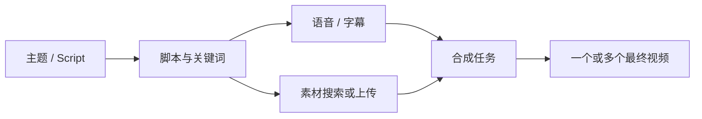

# MoneyPrinterTurbo 项目研究

- 编号：RES-012
- 调研日期：2026-08-14
- 分类：旁白/B-roll 通用短视频自动化管线
- 固定快照：[harry0703/MoneyPrinterTurbo@`1f9f19c2021a68d04df228f33e9099a0c947f6f8`](https://github.com/harry0703/MoneyPrinterTurbo/tree/1f9f19c2021a68d04df228f33e9099a0c947f6f8)
- 快照提交时间：2026-08-13
- Stars 快照：103,218，仅作检索记录，不代表成熟度
- 许可证证据：[根 LICENSE 为 MIT](https://github.com/harry0703/MoneyPrinterTurbo/blob/1f9f19c2021a68d04df228f33e9099a0c947f6f8/LICENSE)
- 研究结论：它不是短剧领域样本；原子任务补丁、失败阶段和原子产物清单是可迁移的可靠性模式

## 1. 公开事实

MoneyPrinterTurbo 将主题或脚本转为旁白、字幕、网络/本地 B-roll、音乐与最终视频，并提供 WebUI 与 API。[固定提交 README](https://github.com/harry0703/MoneyPrinterTurbo/blob/1f9f19c2021a68d04df228f33e9099a0c947f6f8/README.md) 可核验其定位。它主要解决解说类短视频自动化，不具备可直接证明的“角色—场景—稳定镜头—多候选主选”短剧领域模型。

固定提交中，与 Lanverse 更相关的是任务可靠性：

- 状态层提供 Memory 与 Redis 两种实现，公开 `update/get/list/patch` 契约；
- Redis 的 `patch_task` 用 Lua 将“存在性判断 + 字段更新”原子化，避免任务删除后被后台线程复活为残缺记录；
- 管线失败保存 `failed_stage` 和具体 `error`，并保留已经达到的 progress；
- `script.json` 通过同目录临时文件、flush/fsync、`os.replace` 原子写入；
- WebUI 提交前先保存任务状态，并对调度失败和后台线程异常写入可查询终态。

直接证据见 [`app/services/state.py`](https://github.com/harry0703/MoneyPrinterTurbo/blob/1f9f19c2021a68d04df228f33e9099a0c947f6f8/app/services/state.py)、[`app/services/task.py`](https://github.com/harry0703/MoneyPrinterTurbo/blob/1f9f19c2021a68d04df228f33e9099a0c947f6f8/app/services/task.py)、[`app/services/task_artifacts.py`](https://github.com/harry0703/MoneyPrinterTurbo/blob/1f9f19c2021a68d04df228f33e9099a0c947f6f8/app/services/task_artifacts.py) 和 [`app/services/webui_task.py`](https://github.com/harry0703/MoneyPrinterTurbo/blob/1f9f19c2021a68d04df228f33e9099a0c947f6f8/app/services/webui_task.py)。

## 2. 工作流与模块

### 2.1 产品边界

**事实**：`VideoParams` 围绕视频主题、脚本、关键词、旁白、字幕、BGM、素材来源、片段长度、拼接和转场建模。[参数模型](https://github.com/harry0703/MoneyPrinterTurbo/blob/1f9f19c2021a68d04df228f33e9099a0c947f6f8/app/models/schema.py)

**推断**：这个对象适合“脚本配图库素材”的单任务管线，不适合表达短剧中可复用角色、场景状态、分镜版本和逐镜 AI 视频候选。

**Lanverse 决策**：不从其 VideoParams 推导短剧需求；只把它作为异步任务和文件落盘的对照样本。

### 2.2 任务状态与附属动作分离

**事实**：视频生成完成状态与跨平台发布状态分开；发布失败不会把已经完成的视频任务改成失败。后台发布只使用 `patch_task` 补充字段，保留原视频结果。[任务实现](https://github.com/harry0703/MoneyPrinterTurbo/blob/1f9f19c2021a68d04df228f33e9099a0c947f6f8/app/services/task.py) 与 [状态实现](https://github.com/harry0703/MoneyPrinterTurbo/blob/1f9f19c2021a68d04df228f33e9099a0c947f6f8/app/services/state.py)

**推断**：一个后置动作失败不应污染已完成的核心产物；状态必须按责任域拆分。

**Lanverse 决策**：导出任务失败不能把视频候选改成失败，生成任务失败也不能覆盖已确认的分镜或关键帧。

### 2.3 任务状态与队列状态

**事实**：任务状态可放在 Redis Hash，队列项放在 Redis List；队列反序列化若不符合当前参数规则，会丢弃该项并把已存在任务标记为 `failed_stage=dequeue`，避免永远显示处理中。[Redis TaskManager](https://github.com/harry0703/MoneyPrinterTurbo/blob/1f9f19c2021a68d04df228f33e9099a0c947f6f8/app/controllers/manager/redis_manager.py)

**推断**：队列只是执行介质，数据库/状态存储才是用户可查询事实。队列项丢失或不兼容时，必须同步收敛业务状态。

**Lanverse 决策**：所有 Job 入队前先持久化；Worker 拒绝旧 Payload 时写出结构化失败和恢复建议，不让“队列空了”冒充成功。

## 3. 任务、恢复与失败边界

| 观察 | 固定提交事实 | Lanverse 判断 |
| --- | --- | --- |
| 核心状态 | processing / complete / failed | 仍缺 queued、cancelled、unknown，不能直接照搬 |
| 失败位置 | 保存 `failed_stage` 与具体 error | 必须保留，便于按阶段重试和客服诊断 |
| 提交顺序 | WebUI 先落任务状态，再提交后台队列 | 防止刷新后找不到刚提交的任务 |
| 调度失败 | 写 `failed_stage=scheduling` | 调度失败也是用户可见终态 |
| Worker 崩溃 | 包装层兜底写 `webui_worker` | 必须避免线程结束但任务永久 processing |
| 局部更新 | Redis Lua 原子 patch 已存在任务 | 异步回调不得复活已删除对象或覆盖无关字段 |
| 参数迁移 | 队列旧参数校验失败时标记 dequeue 失败 | Payload 必须带 schema/version，并有明确迁移策略 |

### 3.1 恢复能力的边界

**事实**：MemoryState 在进程结束后丢失；RedisState 可保存状态和队列，但固定提交未展示 Lanverse 所需的 ProviderExecution、供应商 task ID 恢复轮询、业务幂等键和未知提交状态。

**推断**：Redis 可持久不等于端到端可恢复。如果请求已经到供应商但本地未收到响应，盲目重跑仍可能重复扣费。

**Lanverse 决策**：任务层必须独立记录 Attempt 和 ProviderExecution；重启后优先凭供应商 task ID 对账，无法判断时进入 `unknown` 并请求人工确认，不自动重新提交高成本动作。

### 3.2 进度语义

**事实**：管线按阶段写 5、10、20、30、40、50 到 100 的进度，并在失败时保留已有 progress。[任务实现](https://github.com/harry0703/MoneyPrinterTurbo/blob/1f9f19c2021a68d04df228f33e9099a0c947f6f8/app/services/task.py)

**推断**：百分比是 UI 投影，并不能精确表示供应商剩余时间或业务完整性。

**Lanverse 决策**：展示阶段、目标、最近事件和可采取动作；百分比只在供应商提供可信进度时展示，并标明估算。

## 4. 媒体与版本边界

### 4.1 原子产物清单

**事实**：`script.json` 在目标目录内写临时文件、执行 fsync 后原子替换；辅助字段补丁失败会记录警告但不破坏主流程。[产物读写](https://github.com/harry0703/MoneyPrinterTurbo/blob/1f9f19c2021a68d04df228f33e9099a0c947f6f8/app/services/task_artifacts.py)

**推断**：清单文件必须要么完整可读，要么保持旧版本；半写 JSON 会使续做和导出都失去依据。

**Lanverse 决策**：ExportManifest 先完整构建并校验，再原子发布；任务附属诊断写入失败不能删除已成功媒体。

### 4.2 不适用部分

- 媒体主要以任务目录路径和 URL 表达，不能证明不可变资产实体、内容哈希或完整血缘；
- 同一镜头的多个视频候选、收藏、主选和 stale 没有可复核的领域实现；
- 素材匹配与随机/顺序拼接不等于分镜镜头顺序；
- 多个最终输出是渲染数量，不是每镜候选审阅。

**Lanverse 决策**：不借用任务目录即资产库的模式；媒体文件、生成候选、选择决议分别建模。

## 5. 导出边界

**事实**：管线产出 `videos`、`combined_videos` 等最终文件并可执行后续平台发布。[任务实现](https://github.com/harry0703/MoneyPrinterTurbo/blob/1f9f19c2021a68d04df228f33e9099a0c947f6f8/app/services/task.py)

**边界**：Lanverse 当前既不拼接成片，也不执行发布。后置发布状态与视频状态分离仍提供正向证据：导出也应是独立 Job 和独立结果。

**Lanverse 决策**：素材包导出失败可重试；已选候选保持成功。导出成功后生成固定 Manifest，不触发社媒发布或商业运营流程。

## 6. 安全边界

**事实**：RedisState 注释明确把 Redis 视为应用私有信任边界，并警告若不可信写者可访问，应改用严格 schema 而非宽松字面量转换。[状态实现](https://github.com/harry0703/MoneyPrinterTurbo/blob/1f9f19c2021a68d04df228f33e9099a0c947f6f8/app/services/state.py)

**事实**：参数模型限制部分 Prompt 长度、数字范围与枚举；任务文件写入代码使用受控任务目录。[参数模型](https://github.com/harry0703/MoneyPrinterTurbo/blob/1f9f19c2021a68d04df228f33e9099a0c947f6f8/app/models/schema.py)

**不可推断**：不能据此证明多租户隔离、SSRF、上传扫描、供应商密钥保护、Redis TLS/ACL 或生产部署安全。

**Lanverse 决策**：队列 Payload 按严格版本化 schema 解析；不信任来自 Redis、Webhook 或 SSE 的任意扩展字段；错误详情对用户脱敏、对运维保留关联 ID。

## 7. 测试证据与边界

固定提交的相关测试包括：

- [`test/services/test_state.py`](https://github.com/harry0703/MoneyPrinterTurbo/blob/1f9f19c2021a68d04df228f33e9099a0c947f6f8/test/services/test_state.py)：并发 Memory 更新、快照隔离、Redis 原子 patch 与分页；
- [`test/services/test_task.py`](https://github.com/harry0703/MoneyPrinterTurbo/blob/1f9f19c2021a68d04df228f33e9099a0c947f6f8/test/services/test_task.py)：分阶段失败、已完成视频与后置发布解耦；
- [`test/services/test_task_artifacts.py`](https://github.com/harry0703/MoneyPrinterTurbo/blob/1f9f19c2021a68d04df228f33e9099a0c947f6f8/test/services/test_task_artifacts.py)：清单读写；
- [`test/services/test_task_manager.py`](https://github.com/harry0703/MoneyPrinterTurbo/blob/1f9f19c2021a68d04df228f33e9099a0c947f6f8/test/services/test_task_manager.py)：任务管理器队列边界。

这些测试不证明高成本 AI 请求的端到端幂等、供应商恢复、分布式多 Worker、媒体血缘或短剧候选选择。

## 8. 可吸收模式

1. 先持久化任务，再尝试入队；
2. 调度异常和 Worker 异常都必须收敛为可查询状态；
3. 保存 `failed_stage`，不只显示“任务失败”；
4. 后置动作使用局部 patch，不覆盖已完成核心结果；
5. 存在性检查和 patch 原子化，避免删除后复活；
6. 版本不兼容的队列项要形成明确失败，而不是静默丢弃；
7. 关键 JSON 清单以原子替换发布；
8. 任务百分比与业务完成条件分离。

## 9. 明确拒绝点

- 不移植 MoneyPrinterTurbo 代码或 Provider 集成；
- 不把 B-roll 解说视频对象当作短剧领域模型；
- 不采用三个整数任务状态覆盖完整生命周期；
- 不以 MemoryState 作为正式任务真相；
- 不把 Redis 队列当作唯一持久事实；
- 不引入字幕、配音、拼接、发布或社媒运营模块；
- 不因 Stars 数量推断适配短剧或生产成熟度。

## 10. Lanverse 决策

MoneyPrinterTurbo 对 Lanverse 的价值限于平台可靠性：任务必须先可查询、失败必须定位阶段、局部异步动作不能覆盖已有结果、产物清单必须原子发布。短剧的 Project/ScriptRevision/Shot/Asset/Candidate/Selection/ExportManifest 仍需由 Lanverse 自己定义；本样本不影响产品模块划分，也不构成任何代码复用建议。
