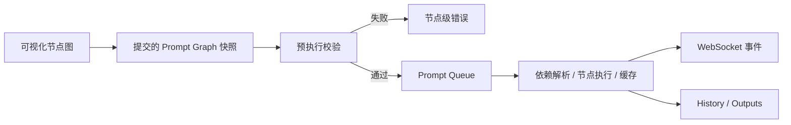

# ComfyUI 项目研究

- 编号：RES-014
- 调研日期：2026-08-14
- 分类：通用可视化 AI 工作流执行引擎
- 固定快照：[Comfy-Org/ComfyUI@`7fe8a6138504f90ff7be82f3babf416da32876b1`](https://github.com/Comfy-Org/ComfyUI/tree/7fe8a6138504f90ff7be82f3babf416da32876b1)
- 快照提交时间：2026-08-14
- Stars 快照：127,427，仅作检索记录，不代表成熟度
- 许可证证据：[根 LICENSE 为 GPL-3.0](https://github.com/Comfy-Org/ComfyUI/blob/7fe8a6138504f90ff7be82f3babf416da32876b1/LICENSE)
- 研究结论：提交前校验、队列/历史/中断、节点事件与部分重执行是执行引擎模式；节点画布不是短剧领域产品模型

## 1. 公开事实

ComfyUI 将自己定义为图像、视频、音频、3D 与文本的节点图创作引擎，支持工作流 JSON、模板、子图、App Mode、API、异步队列、部分图重执行和缓存。[固定提交 README](https://github.com/Comfy-Org/ComfyUI/blob/7fe8a6138504f90ff7be82f3babf416da32876b1/README.md)

服务端在接收 `/prompt` 时：

1. 读取客户端提交的 prompt graph；
2. 生成或校验 UUID `prompt_id`；
3. 执行 `validate_prompt`；
4. 验证成功后把 graph、输出目标和额外数据加入 PromptQueue；
5. 立即返回 `prompt_id`、队列序号和节点错误。

该行为可在 [`server.py`](https://github.com/Comfy-Org/ComfyUI/blob/7fe8a6138504f90ff7be82f3babf416da32876b1/server.py) 复核。执行器基于 DynamicPrompt 和 ExecutionList 解析依赖、读取缓存、逐节点发送事件并记录成功或错误。[`execution.py`](https://github.com/Comfy-Org/ComfyUI/blob/7fe8a6138504f90ff7be82f3babf416da32876b1/execution.py)

## 2. 工作流与模块

### 2.1 画布、提交快照与执行事实

**事实**：执行入口接收序列化 prompt graph；队列项保存该次提交的 graph。用户后续在客户端移动节点或改变布局，不会改变已经入队的 Payload。[服务端提交代码](https://github.com/Comfy-Org/ComfyUI/blob/7fe8a6138504f90ff7be82f3babf416da32876b1/server.py)

**推断**：空间布局服务理解和编辑；执行事实应是用户确认后提交的版本化快照。坐标、缩放、分组不是业务依赖本身。

**Lanverse 决策**：如果提供无限画布，画布和列表读取相同的领域节点/边；工作流运行绑定输入版本快照。布局数据单独保存，不能决定镜头是否就绪、候选是否主选或导出是否完整。

### 2.2 提交前完整校验

**事实**：`validate_prompt` 在入队前检查输出节点、连接、节点类型、输入与自定义校验，并返回全局错误及 node_errors；无效请求不会进入队列。[`execution.py`](https://github.com/Comfy-Org/ComfyUI/blob/7fe8a6138504f90ff7be82f3babf416da32876b1/execution.py) 与 [`server.py`](https://github.com/Comfy-Org/ComfyUI/blob/7fe8a6138504f90ff7be82f3babf416da32876b1/server.py)

**推断**：在高成本生成进入队列前，能本地判定的错误应全部返回，不能让 Worker 花钱后才发现缺输入。

**Lanverse 决策**：视频生成提交前执行 readiness 校验：权限、镜头存在、请求版本、Prompt、主关键帧/参考资产、供应商能力、画幅/时长参数和成本确认。返回字段级/对象级错误。

### 2.3 部分执行与缓存

**事实**：ExecutionList 只从指定输出目标展开依赖；执行器检查节点缓存、发送 `execution_cached`，并只运行所需节点。[执行实现](https://github.com/Comfy-Org/ComfyUI/blob/7fe8a6138504f90ff7be82f3babf416da32876b1/execution.py)

**推断**：重做一个目标不需要重跑所有无关分支；但缓存命中必须建立在输入签名有效之上。

**Lanverse 决策**：重试一个镜头或上游资产后，只使真实依赖的下游结果 stale；已完成且输入不变的兄弟镜头保持有效。生成供应商调用不采用隐式进程缓存替代持久候选。

## 3. 任务、恢复与失败边界

### 3.1 队列与历史

**事实**：PromptQueue 用互斥锁保护内存中的 heap queue、currently_running、history 和 flags；完成时把 prompt、outputs 与 status 复制到 history，并限制历史数量。[`PromptQueue`](https://github.com/Comfy-Org/ComfyUI/blob/7fe8a6138504f90ff7be82f3babf416da32876b1/execution.py)

**事实**：服务端提供 queue、history、job 查询和取消接口；待执行任务从队列删除，正在执行任务通过针对 `prompt_id` 的原子检查后发中断，避免中断信号落到下一任务。[`server.py`](https://github.com/Comfy-Org/ComfyUI/blob/7fe8a6138504f90ff7be82f3babf416da32876b1/server.py) 与 [`PromptQueue`](https://github.com/Comfy-Org/ComfyUI/blob/7fe8a6138504f90ff7be82f3babf416da32876b1/execution.py)

**边界**：Queue 和 history 在该实现中是进程内集合。固定提交不能证明服务重启后自动恢复正在运行/排队 Job，也没有 Lanverse 所需的供应商 task ID、租约和高成本未知提交模型。

### 3.2 事件流

**事实**：服务端通过 WebSocket 发出 `status`、`execution_start`、`executing`、`executed`、`execution_error`、`execution_interrupted`、进度和预览；重连时可向当前 client 重发正在执行的节点。[`server.py`](https://github.com/Comfy-Org/ComfyUI/blob/7fe8a6138504f90ff7be82f3babf416da32876b1/server.py) 与 [`execution.py`](https://github.com/Comfy-Org/ComfyUI/blob/7fe8a6138504f90ff7be82f3babf416da32876b1/execution.py)

**推断**：实时通道适合增量反馈，不应是唯一真相；断线后客户端仍需用 Job API 重建页面。

**Lanverse 决策**：SSE/WS 只传事件提示和目标 ID；客户端收到后查询持久状态。任何断线、重复或乱序事件都不能改变最终候选/主选事实。

### 3.3 错误表达

**事实**：执行错误包含 prompt ID、节点 ID、已执行节点、异常类型、消息、输入和当前输出，并区分 interrupt 与 error。[执行错误处理](https://github.com/Comfy-Org/ComfyUI/blob/7fe8a6138504f90ff7be82f3babf416da32876b1/execution.py)

**推断**：工作流错误要定位目标与步骤，并保留已完成结果；但原始 traceback/输入不适合直接回显给终端用户。

**Lanverse 决策**：任务事件同时有用户安全摘要与内部诊断字段；错误定位到 project/shot/attempt/provider execution，不泄露密钥、签名 URL 或完整敏感 Prompt。

## 4. 媒体与版本边界

**事实**：README 声明工作流可保存为 JSON，部分生成媒体可恢复完整工作流与 seed；执行历史记录输出，并由主进程登记输出文件。[README](https://github.com/Comfy-Org/ComfyUI/blob/7fe8a6138504f90ff7be82f3babf416da32876b1/README.md) 与 [`main.py`](https://github.com/Comfy-Org/ComfyUI/blob/7fe8a6138504f90ff7be82f3babf416da32876b1/main.py)

**适用模式**：生成结果应能回溯到输入工作流/参数快照。

**边界与风险**：

- 通用节点输出不等于 Lanverse 的 MediaAsset、VideoCandidate 或 ShotSelection；
- 内存 history 不等于长期审计记录；
- seed/graph 能辅助复现，但远程闭源供应商仍可能非确定；
- 节点缓存是执行优化，不应决定候选历史保留；
- 自定义节点可定义任意行为，不能默认视为可信媒体处理。

**Lanverse 决策**：每个候选引用请求快照和供应商响应事实；是否成为主选由独立 Selection 决议确定。

## 5. 导出边界

ComfyUI 的输出节点和文件历史面向通用生成结果，不提供短剧“有序镜头唯一主选 + Manifest”领域语义。Lanverse 不暴露任意图的输出收集作为项目交付。

**Lanverse 决策**：导出服务只接受固定 ProjectRevision 和 ShotSelection 集合；缺少、失败、stale、不可读或未显式主选的必要镜头全部进入预检报告，是否允许部分导出由产品需求明确控制。

## 6. 安全边界

**事实**：服务端包含来源/跨站请求防护，代码注释明确防止任意网站向本机接口排队；README 也说明可离线运行并可禁用可选 API nodes。[`server.py`](https://github.com/Comfy-Org/ComfyUI/blob/7fe8a6138504f90ff7be82f3babf416da32876b1/server.py) 与 [README](https://github.com/Comfy-Org/ComfyUI/blob/7fe8a6138504f90ff7be82f3babf416da32876b1/README.md)

**事实**：README 支持安装自定义节点。[README](https://github.com/Comfy-Org/ComfyUI/blob/7fe8a6138504f90ff7be82f3babf416da32876b1/README.md)

**推断**：自定义节点是代码执行扩展面，不适合在多租户 Lanverse 中允许用户任意安装或运行。

**Lanverse 决策**：工作流节点类型由服务端白名单注册；普通用户不能上传可执行节点。外部 Provider 和媒体处理均在受控适配器内运行。

## 7. 测试证据与边界

固定提交包含执行、异步节点、Job、进度隔离、公开 API、Prompt ID 和输入校验测试，例如：

- [`tests/execution/test_execution.py`](https://github.com/Comfy-Org/ComfyUI/blob/7fe8a6138504f90ff7be82f3babf416da32876b1/tests/execution/test_execution.py)；
- [`tests/execution/test_jobs.py`](https://github.com/Comfy-Org/ComfyUI/blob/7fe8a6138504f90ff7be82f3babf416da32876b1/tests/execution/test_jobs.py)；
- [`tests/execution/test_progress_isolation.py`](https://github.com/Comfy-Org/ComfyUI/blob/7fe8a6138504f90ff7be82f3babf416da32876b1/tests/execution/test_progress_isolation.py)；
- [`tests-unit/assets_test/test_prompt_id_enforcement.py`](https://github.com/Comfy-Org/ComfyUI/blob/7fe8a6138504f90ff7be82f3babf416da32876b1/tests-unit/assets_test/test_prompt_id_enforcement.py)。

这些测试约束通用执行引擎，不证明短剧领域完整性、分布式持久恢复、多租户自定义节点安全或供应商成本幂等。

## 8. 可吸收模式

1. 用户确认后形成独立于画布布局的提交快照；
2. 入队前完成可本地判定的图与输入校验；
3. 返回节点/对象级错误，不只返回 HTTP 400；
4. Job ID 贯穿队列、历史、事件、取消和输出；
5. 待执行删除与运行中中断采用不同语义；
6. 实时通道只做状态投影，重连后可查询恢复；
7. 只执行目标所需依赖，保留无关分支；
8. 输入签名一致才允许复用缓存。

## 9. 明确拒绝点

- 不移植 ComfyUI 代码、节点或工作流模板；
- 不把通用节点图直接暴露为短剧首版产品；
- 不把节点位置、连线 UI 或 Agent 生成布局作为业务真相；
- 不使用进程内 PromptQueue/History 作为正式任务持久层；
- 不允许用户安装任意可执行自定义节点；
- 不把缓存输出直接等同项目候选；
- 不因高 Stars 推断短剧产品成熟度；
- 不因 GPL-3.0 仓库公开而提出代码复用建议。

## 10. Lanverse 决策

ComfyUI 是执行模式而非产品模块来源。Lanverse 可以采用“提交快照—预检—持久 Job—目标级事件—部分重试”的工作流原则，但终端用户操作的是剧本、资产、镜头、候选和主选。若未来增加空间视图，空间视图和列表视图必须同源于类型化领域节点；布局永远不是依赖、完成度或导出真相。
