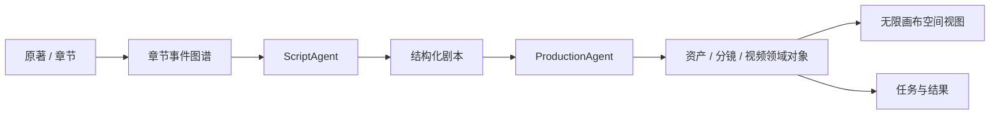

# Toonflow-app 项目研究

- 编号：RES-015
- 调研日期：2026-08-14
- 分类：桌面端 AI 短剧制作与无限画布平台
- 固定快照：[HBAI-Ltd/Toonflow-app@`bc61ec7a1b5df31293b286981a5f4ad4635464ee`](https://github.com/HBAI-Ltd/Toonflow-app/tree/bc61ec7a1b5df31293b286981a5f4ad4635464ee)
- 快照提交时间：2026-07-09
- Stars 快照：13,857，仅作检索记录，不代表成熟度
- 许可证证据：[根 LICENSE 为 Apache-2.0 正文加商业授权、标识和历史 AGPL 附加条款](https://github.com/HBAI-Ltd/Toonflow-app/blob/bc61ec7a1b5df31293b286981a5f4ad4635464ee/LICENSE)
- 研究结论：无限画布、章节事件与 Agent 分工提供产品组织启发；任务恢复、状态表达、测试和许可边界均不宜照搬

## 1. 公开事实

固定提交 README 把 Toonflow 描述为 TypeScript/Electron 桌面短剧工程，公开工作流为：导入原著、提取章节事件、ScriptAgent 生成故事骨架/改编策略/结构化剧本、ProductionAgent 在无限画布组织分镜/素材/视频节点、精调分镜后拼接导出。[README](https://github.com/HBAI-Ltd/Toonflow-app/blob/bc61ec7a1b5df31293b286981a5f4ad4635464ee/README.md)

README 还声明三层 Agent 协作、持久化 Agent 记忆、Markdown Skill 和可编程供应商 TypeScript。上述属于公开产品声明；是否覆盖所有失败路径，必须再由源文件或测试证明。

固定源文件可证明以下领域对象存在：Project、Novel/Chapter Event、Script、Asset、Storyboard、Image、Video、VideoTrack、Task、Agent Work Data 与 Memory；VideoTrack 含 `selectVideoId` 字段。[数据库类型](https://github.com/HBAI-Ltd/Toonflow-app/blob/bc61ec7a1b5df31293b286981a5f4ad4635464ee/src/types/database.d.ts)

## 2. 工作流与模块

### 2.1 章节事件图谱

**事实**：README 声明按章节抽取事件并在改编时调用上下文；数据库类型有 `o_event`、`o_eventChapter` 与 Novel 的 `event/eventState` 字段。[README](https://github.com/HBAI-Ltd/Toonflow-app/blob/bc61ec7a1b5df31293b286981a5f4ad4635464ee/README.md) 与 [类型证据](https://github.com/HBAI-Ltd/Toonflow-app/blob/bc61ec7a1b5df31293b286981a5f4ad4635464ee/src/types/database.d.ts)

**推断**：长篇改编应先把来源切成可引用事件，不应每次把整部原著作为无版本上下文交给模型。

**Lanverse 决策**：首版如支持长文本，建立来源片段/事件/剧本元素的引用关系；事件是改编证据，不直接成为生产执行节点。

### 2.2 ScriptAgent 与 ProductionAgent 分责

**事实**：README 把故事/剧本决策与资产/分镜/生成生产分给两个 Agent；ProductionAgent 源文件从项目模型、Memory 和 Skill 读取上下文，并调用类型化工具写入资产和分镜。[Agent 实现](https://github.com/HBAI-Ltd/Toonflow-app/blob/bc61ec7a1b5df31293b286981a5f4ad4635464ee/src/agents/productionAgent/index.ts) 与 [工具定义](https://github.com/HBAI-Ltd/Toonflow-app/blob/bc61ec7a1b5df31293b286981a5f4ad4635464ee/src/agents/productionAgent/tools.ts)

**推断**：Agent 按阶段/责任域使用不同工具和上下文，比一个全能 Agent 直接修改所有对象更容易约束。

**Lanverse 决策**：Agent 只调用受控领域命令；所有写入通过同一权限、版本与校验规则。Agent Memory 是辅助上下文，不是项目事实来源。

### 2.3 无限画布的正确吸收方式

**事实**：README 宣称无限画布以节点组织剧本、角色、分镜、素材和视频，并支持自由编排、回溯与并行生产。[README](https://github.com/HBAI-Ltd/Toonflow-app/blob/bc61ec7a1b5df31293b286981a5f4ad4635464ee/README.md)

**不可推断**：README 没有证明画布节点和数据库对象是否同源、布局冲突如何解决、画布边是否是业务依赖，或移动节点是否会改变执行状态。

**Lanverse 决策**：若引入画布：

1. 列表视图与空间视图读取同一 Project/Script/Asset/Shot/Candidate 数据；
2. 节点必须是类型化领域节点，不允许任意文本块成为生产事实；
3. 布局坐标、分组和连线样式只属于 ViewState；
4. 业务依赖来自稳定 ID 与版本边，不能由视觉位置推断；
5. 每个节点显示真实任务状态、错误和 stale，而不是只显示 Agent 对话。

### 2.4 视频选择

**事实**：数据库类型有多个 `o_video` 记录与 `o_videoTrack.selectVideoId`。[数据库类型](https://github.com/HBAI-Ltd/Toonflow-app/blob/bc61ec7a1b5df31293b286981a5f4ad4635464ee/src/types/database.d.ts)

**推断**：该结构至少承认“轨道上的当前选择”应引用一个视频 ID，而非覆盖 URL。

**待验证**：是否同镜头保留所有成功候选、新候选是否保护人工主选、并发选择是否检测冲突、选中项删除如何处理、导出是否固定选择快照。

**Lanverse 决策**：吸收 ID 引用的显式选择语义，但采用独立 ShotSelection 决议；不把 VideoTrack 或成片轨道引入当前范围。

## 3. 任务、恢复与失败边界

### 3.1 可核验任务模型

`taskRecord` 在任务开始时插入 project、taskClass、relatedObjects、model、description、中文状态与开始时间，返回 `done` 回调将状态改为“已完成”或“生成失败”，失败时保存原因。[任务记录实现](https://github.com/HBAI-Ltd/Toonflow-app/blob/bc61ec7a1b5df31293b286981a5f4ad4635464ee/src/utils/taskRecord.ts)

任务列表可按 project、taskClass 和 state 分页筛选，任务详情可按 taskId 查询。[任务列表路由](https://github.com/HBAI-Ltd/Toonflow-app/blob/bc61ec7a1b5df31293b286981a5f4ad4635464ee/src/routes/task/getTaskApi.ts) 与 [详情路由](https://github.com/HBAI-Ltd/Toonflow-app/blob/bc61ec7a1b5df31293b286981a5f4ad4635464ee/src/routes/task/taskDetails.ts)

### 3.2 关键不足

固定任务模型只能直接证明三态和失败原因，不能证明：

- queued、cancelled、unknown、超时与部分成功；
- Attempt 历史、最大重试、幂等键和重复点击保护；
- Provider request/task ID、轮询恢复和重复扣费保护；
- Worker 租约、心跳、进程重启回收；
- 任务所属的稳定镜头/资产版本，而非松散 JSON `relatedObjects`；
- 事件日志、SSE 回放和任务状态迁移测试。

**Lanverse 决策**：不采纳 `taskRecord -> done` 的简化模型。高成本动作在 Agent 调用前也必须向用户显示目标、输入快照、模型/价格估算，获得明确确认后才创建 Job。

## 4. 媒体与版本边界

### 4.1 已有字段证据

- Image 保存 filePath、model、resolution、state 和 errorReason；
- Storyboard 保存稳定 ID、index、prompt、duration、filePath、state、关联资产和视频描述；
- Video 保存 filePath、state、errorReason、耗时和 videoTrackId；
- Asset 与 Storyboard 通过关联表连接；
- VideoTrack 保存 `selectVideoId`。

以上来自 [数据库类型](https://github.com/HBAI-Ltd/Toonflow-app/blob/bc61ec7a1b5df31293b286981a5f4ad4635464ee/src/types/database.d.ts)。

### 4.2 风险

- 裸 filePath 不能证明内容哈希、MIME、大小、时长、存储 key 和来源许可；
- 未看到不可变 ArtifactRevision 或上游输入版本；
- Storyboard 的数值 index 和 Track 仍可能混合身份、排序与画布分组；
- `selectVideoId` 没有从字段本身证明选择者、时间、依据和历史；
- Agent Memory/WorkData 与正式资产边界需要进一步核验。

**Lanverse 决策**：MediaAsset 保存文件事实；Candidate 保存生成血缘；Selection 保存选择决议；CanvasViewState 只保存布局。

## 5. 导出边界

**事实**：README 声明分镜精调后进行视频拼接与导出。[README](https://github.com/HBAI-Ltd/Toonflow-app/blob/bc61ec7a1b5df31293b286981a5f4ad4635464ee/README.md)

**边界**：这是 E2 产品声明，本轮未找到固定提交中的 ExportManifest、逐镜素材包契约或导出完整性测试。Lanverse 也不做拼接。

**Lanverse 决策**：借鉴“在生产对象中显式选择视频后再交付”，拒绝 VideoTrack 拼接；素材包按镜头顺序输出当前主选及不可变 Manifest。

## 6. 安全与许可边界

### 6.1 可执行供应商脚本

**事实**：README 声明用户可在设置中心直接编写供应商 TypeScript 并即时生效。[README](https://github.com/HBAI-Ltd/Toonflow-app/blob/bc61ec7a1b5df31293b286981a5f4ad4635464ee/README.md)

**推断**：这属于本地桌面工具的高权限扩展能力。在多租户服务中等同代码执行面，不能直接开放。

**Lanverse 决策**：普通用户只能选择服务端批准的 Provider 配置；不能上传或即时执行任意 TypeScript。

### 6.2 许可证

**事实**：根 LICENSE 前部是 Apache-2.0 正文，后部追加书面商业授权、不得删除品牌标识、定价和历史 AGPL 用户条款。[完整 LICENSE](https://github.com/HBAI-Ltd/Toonflow-app/blob/bc61ec7a1b5df31293b286981a5f4ad4635464ee/LICENSE)

**Lanverse 决策**：GitHub API 或徽章的 `Apache-2.0` 标签不能覆盖附加条款；本研究不提出任何代码复用。许可文本仅作为“必须读完整根文件”的治理反例，不构成法律意见。

## 7. 测试证据与边界

固定提交树中未发现常规自动化测试目录或 `*.test.*`/`*.spec.*` 文件。存在 `src/routes/test/test.ts` 路径，但它不是足以证明任务恢复、候选选择或多用户安全的测试套件。

因此 README 的三层 Agent、并行生产、回溯、导出和效率数字均不能升级为已测试生产能力。需要单独验证：任务重启、重复提交、Agent 并发写、选择冲突、媒体损坏、导出完整性与安全隔离。

## 8. 可吸收模式

1. 原著先形成章节事件，再进入剧本改编；
2. ScriptAgent 与 ProductionAgent 按职责、工具和上下文分离；
3. Agent 通过类型化工具写领域对象，而不是只输出聊天文本；
4. 剧本、资产、分镜和视频可在同一空间视图组织；
5. 空间视图和列表视图必须同源；
6. 画布节点类型化，布局不作为业务真相；
7. 视频选择引用稳定视频 ID；
8. 任务中心支持项目、分类和状态筛选。

## 9. 明确拒绝点

- 不移植 Toonflow 代码、Agent、Skill 或供应商脚本；
- 不把 README 声明直接写成 Lanverse 已验证能力；
- 不使用三态任务与一个 `done` 回调作为可靠执行模型；
- 不把 Agent Memory 当作项目事实；
- 不让画布位置或非类型化连线决定业务依赖；
- 不开放多租户任意 TypeScript 执行；
- 不引入轨道、拼接和成片；
- 不把 GitHub 的 Apache-2.0 标签当完整许可结论；
- 不因 Stars 数量推断成熟度。

## 10. Lanverse 决策

Toonflow 支持“长文本事件化、创作/生产 Agent 分责、空间化工作区和 ID 化视频选择”四个产品方向，但没有提供足够任务恢复证据。Lanverse 若建设无限画布，必须坚持类型化领域节点、列表/空间同源、布局非业务真相、任务状态可观察和高成本 Agent 动作预览确认；视频选择使用独立决议，导出保持逐镜素材包边界。
