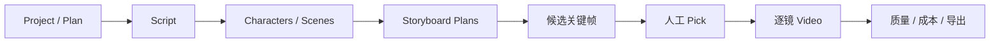

# wind-comic 项目研究

- 编号：RES-016
- 调研日期：2026-08-14
- 分类：多 Agent 短剧工作室补充样本
- 固定快照：[ChrisChen667788/wind-comic@`c83e1cf5e9b88fa8ac62bb737c79985a95243b8d`](https://github.com/ChrisChen667788/wind-comic/tree/c83e1cf5e9b88fa8ac62bb737c79985a95243b8d)
- 快照提交时间：2026-08-11
- Stars 快照：424，仅作检索记录，不代表成熟度
- 许可证证据：[根 LICENSE 为 MIT](https://github.com/ChrisChen667788/wind-comic/blob/c83e1cf5e9b88fa8ac62bb737c79985a95243b8d/LICENSE)
- 研究结论：任务心跳/死信、检查点、候选确认与 stale 提供丰富实现证据；其大范围成片、协作、计费和固定九宫格不进入 Lanverse 当前范围

## 1. 公开事实

wind-comic 的 README 宣称从创意到剧本、角色、分镜、视频、配音、时间线和最终 mp4 的多 Agent 管线，并列出质量回路、Yjs 协作、成本归因和多种专业导出。[固定提交中文 README](https://github.com/ChrisChen667788/wind-comic/blob/c83e1cf5e9b88fa8ac62bb737c79985a95243b8d/README.zh-CN.md) 属于 E2 公开产品声明；诸如“生产级”“全部竞品无一具备”等评价不作为本研究事实。

本轮以固定实现和测试约束为主：

- Pipeline Job 有 queued/running/done/failed、step、attempts、last error、heartbeat 和 append-only progress events；
- 失败未耗尽次数则重新 queued，耗尽进入 failed；只有 failed 可人工重投；
- 心跳超时的 running Job 可回队列，超过 24 小时的 queued/running Job 进入失败；
- Pipeline Checkpoints 从持久资产加载计划、剧本、角色、场景、分镜、视频、时间线和评审；
- Project Asset 保存 stable ID、type/name、媒体 URL、persistent URL、shot number、version 与 stale；
- 候选关键帧按镜头落为 candidate_set，用户选择时服务端从持久候选集查找，不信任客户端回传 URL。

证据见 [`pipeline-job-repo.ts`](https://github.com/ChrisChen667788/wind-comic/blob/c83e1cf5e9b88fa8ac62bb737c79985a95243b8d/lib/repos/pipeline-job-repo.ts)、[`pipeline-checkpoints.ts`](https://github.com/ChrisChen667788/wind-comic/blob/c83e1cf5e9b88fa8ac62bb737c79985a95243b8d/lib/pipeline-checkpoints.ts)、[`asset-repo.ts`](https://github.com/ChrisChen667788/wind-comic/blob/c83e1cf5e9b88fa8ac62bb737c79985a95243b8d/lib/repos/asset-repo.ts) 与 [候选选择路由](https://github.com/ChrisChen667788/wind-comic/blob/c83e1cf5e9b88fa8ac62bb737c79985a95243b8d/app/api/projects/%5Bid%5D/candidates/pick/route.ts)。

## 2. 工作流与模块

### 2.1 持久 Job 与可回放事件

**事实**：Pipeline Job 将最近阶段写入 `step`，进度事件从原 JSON 列的读改写迁移到 append-only event 表；注释指出旧方式在多副本下会 lost update。[任务仓库](https://github.com/ChrisChen667788/wind-comic/blob/c83e1cf5e9b88fa8ac62bb737c79985a95243b8d/lib/repos/pipeline-job-repo.ts)

**推断**：状态快照和事件日志承担不同职责：快照用于当前页面，事件用于回放、诊断和断线恢复。

**Lanverse 决策**：WorkflowRun/Step/Attempt 保存当前状态；TaskEvent 只追加并带运行内单调序号。SSE 读取事件，但数据库快照仍是业务真相。

### 2.2 检查点续做

**事实**：重试时 Pipeline Checkpoints 加载已有持久产物，存在有效形态就跳过生成；脚本只有含非空 shots 才算检查点，分镜计划与已经有图的分镜分开，媒体优先 persistent URL。[检查点实现](https://github.com/ChrisChen667788/wind-comic/blob/c83e1cf5e9b88fa8ac62bb737c79985a95243b8d/lib/pipeline-checkpoints.ts)

**推断**：检查点不能只看记录存在，至少要看对象最低结构和媒体可用性；“已有计划”和“已有渲染”是不同完成度。

**Lanverse 决策**：为剧本、分镜、关键帧、视频候选分别定义 readiness；“有一条结果”“本阶段全部完成”“可进入导出”必须是三个不同汇总。

### 2.3 候选生成与确认

**事实**：候选端点一次生成 4/6/9 个构图变体，以 SSE 逐个回传，完成后持久化 candidate_set；选择端点按项目属主校验，从服务端候选集取得被选 URL，再创建 storyboard 资产。[候选生成路由](https://github.com/ChrisChen667788/wind-comic/blob/c83e1cf5e9b88fa8ac62bb737c79985a95243b8d/app/api/projects/%5Bid%5D/candidates/route.ts) 与 [选择路由](https://github.com/ChrisChen667788/wind-comic/blob/c83e1cf5e9b88fa8ac62bb737c79985a95243b8d/app/api/projects/%5Bid%5D/candidates/pick/route.ts)

**推断**：生成多个候选、逐个可见、由人明确确认，比自动采用最后一个结果更符合创作工作。

**风险**：候选以资产 data 内的 JSON 数组存储，ID 是候选集内 `cand-1`；Pick 通过另建 storyboard 资产实现，不是独立、可并发控制的选择决议。固定 4/6/9 和预设九种构图也把创作方法写成了产品硬规则。

**Lanverse 决策**：视频候选是一等实体、全局稳定 ID；选择是独立 ShotSelection。候选数量由用户本次生成决定，首版不强制九宫格、不自动改写 Prompt 成固定机位套餐。

### 2.4 质量回路

**事实**：固定提交包含 vision audit、quality gate、shot quality gate、decision log 和 render loop 模块及对应测试文件；README 声明失败镜头可定向重生。[仓库固定树](https://github.com/ChrisChen667788/wind-comic/tree/c83e1cf5e9b88fa8ac62bb737c79985a95243b8d)

**推断**：质量判断应形成可见 Issue/Review，而不是模型分数直接替用户选片。

**Lanverse 决策**：首版镜头检查以人工检查项、问题和通过/驳回为主；自动分析只能给建议与证据，不得静默替换当前主选。

## 3. 任务、恢复与失败边界

### 3.1 正向证据

| 机制 | 固定提交事实 | 可吸收含义 |
| --- | --- | --- |
| 认领 | `UPDATE ... WHERE state='queued'`，只允许一个认领者成功 | Worker 认领必须比较旧状态 |
| Attempt | 每次 claim 递增，最大 3 次 | 重试次数可追踪并有上限 |
| 死信 | 重试耗尽进入 failed；只有 failed 可重投 | 不允许 running 被手动重投造成双跑 |
| 心跳 | 运行中写 heartbeat；超时才回收 | 重启不能无条件重置所有 running |
| 事件 | append-only Job events，支持回放 | 断线后恢复阶段和错误历史 |
| 租户列表 | 默认必须给 userId，否则返回空集；全量需显式 allUsers | 跨租户访问必须成为显式特权 |

实现与 [`tests/pipeline-job-repo.test.ts`](https://github.com/ChrisChen667788/wind-comic/blob/c83e1cf5e9b88fa8ac62bb737c79985a95243b8d/tests/pipeline-job-repo.test.ts) 提供了代码/测试双重证据。

### 3.2 仍有边界

- 注释明确单 Worker 是既有假设，不能据此证明分布式调度完成；
- ISO 时间比较要求多实例 NTP 同步；
- `attempts` 属于 Job 汇总，未证明每次供应商调用都有不可变 Attempt/ProviderExecution；
- 自动重试不能证明区分 4xx、限流、未知提交与已经计费的供应商任务；
- 超 24 小时清理进度事件会缩短审计窗口；
- Checkpoint 的“最新资产”可能把输入版本不匹配的旧产物当可复用项。

**Lanverse 决策**：采用租约/心跳和显式重投，但 Attempt 独立建模；未知提交、高成本重试和供应商对账采用更保守规则。

## 4. 媒体与版本边界

### 4.1 正向证据

Project Asset 有 version 和 stale；可按资产类型或受影响镜头批量置 stale；更新媒体时可避免用空失败结果覆盖已有好 URL。[资产仓库](https://github.com/ChrisChen667788/wind-comic/blob/c83e1cf5e9b88fa8ac62bb737c79985a95243b8d/lib/repos/asset-repo.ts)

检查点区分 storyboard plan 与 rendered storyboard，视频必须有 URL 才进入已恢复集合。[检查点实现](https://github.com/ChrisChen667788/wind-comic/blob/c83e1cf5e9b88fa8ac62bb737c79985a95243b8d/lib/pipeline-checkpoints.ts)

### 4.2 关键风险

- `dedupeLatest` 以 `(type, shot_number | name)` 选择最新记录，镜头序号/名称不是理想永久身份；
- Asset 表同时存在 update/upsert 与 append 历史语义，源码注释承认唯一索引会与“重录第二次”冲突；
- version 数字不自动证明输入血缘；
- stale 标记不能替代“由哪个上游 revision 引起”的依赖证据；
- 多处媒体仍以 URL JSON 表达，清单字段不足以证明完整校验信息。

**Lanverse 决策**：Shot 使用稳定 UUID；ArtifactRevision 只追加；DependencyEdge 记录输入版本；stale 是由依赖计算出的投影，而非人工散落布尔值。

## 5. 导出边界

**事实**：README 声明 MP4、CSV/Markdown/PDF 分镜表、EDL/FCPXML/AAF、平台分发包等导出；仓库有相应测试名，例如 [`tests/jianying-export.test.ts`](https://github.com/ChrisChen667788/wind-comic/blob/c83e1cf5e9b88fa8ac62bb737c79985a95243b8d/tests/jianying-export.test.ts)。

**边界**：当前 Lanverse 不做剪辑线、成片、配音、字幕或平台发布，所以这些能力只用于明确拒绝范围，不能进入首版模块。

**Lanverse 决策**：素材包导出复用“导出前健康检查”的原则，但检查内容只覆盖：镜头顺序稳定、每镜存在唯一有效主选、媒体可读、Manifest 与文件一致、缺失项明确列出。

## 6. 安全边界

**事实**：候选生成需要登录、项目属主校验和预算护栏；Pick 从服务端持久候选取得 URL，不信客户端提交 URL。[生成路由](https://github.com/ChrisChen667788/wind-comic/blob/c83e1cf5e9b88fa8ac62bb737c79985a95243b8d/app/api/projects/%5Bid%5D/candidates/route.ts) 与 [选择路由](https://github.com/ChrisChen667788/wind-comic/blob/c83e1cf5e9b88fa8ac62bb737c79985a95243b8d/app/api/projects/%5Bid%5D/candidates/pick/route.ts)

**事实**：任务列表源码注释记录过历史跨租户泄露风险，并改为安全默认空集。[任务仓库](https://github.com/ChrisChen667788/wind-comic/blob/c83e1cf5e9b88fa8ac62bb737c79985a95243b8d/lib/repos/pipeline-job-repo.ts)

**推断**：属主校验必须统一在仓储/授权层；注释中“无 user_id demo 放行”一类兼容分支不适合生产。

**Lanverse 决策**：项目、任务、候选、选择和导出全部强制 Workspace/Project 权限；不存在 demo 绕过。用户输入的 URL 不可直接升级为权威媒体。

## 7. 测试证据与边界

固定提交有大量测试文件，相关的可执行证据包括：

- [`tests/pipeline-job-repo.test.ts`](https://github.com/ChrisChen667788/wind-comic/blob/c83e1cf5e9b88fa8ac62bb737c79985a95243b8d/tests/pipeline-job-repo.test.ts)：认领、重试、死信、心跳恢复和租户过滤；
- [`tests/pipeline-checkpoints.test.ts`](https://github.com/ChrisChen667788/wind-comic/blob/c83e1cf5e9b88fa8ac62bb737c79985a95243b8d/tests/pipeline-checkpoints.test.ts)：结构化检查点、空壳剧本、persistent URL 与重复资产；
- [`tests/candidate-grid.test.ts`](https://github.com/ChrisChen667788/wind-comic/blob/c83e1cf5e9b88fa8ac62bb737c79985a95243b8d/tests/candidate-grid.test.ts)：候选构建和 Pick 校验；
- [`tests/asset-ledger.test.ts`](https://github.com/ChrisChen667788/wind-comic/blob/c83e1cf5e9b88fa8ac62bb737c79985a95243b8d/tests/asset-ledger.test.ts)：资产台账；
- [`tests/decision-log.test.ts`](https://github.com/ChrisChen667788/wind-comic/blob/c83e1cf5e9b88fa8ac62bb737c79985a95243b8d/tests/decision-log.test.ts)：决策记录。

测试数量和 README 自述的通过数量都不等于生产成熟度；本轮未运行真实供应商、多实例、灾备或安全测试。

## 8. 可吸收模式

1. Job 的认领、Attempt 上限、死信和人工重投；
2. 心跳超时回收而非启动时无条件重置；
3. Append-only 任务事件与断线回放；
4. 持久产物检查点与最低有效形态；
5. 计划存在、部分渲染和阶段完成分开；
6. 候选逐个可见、服务端持久化、用户明确 Pick；
7. Pick 不信任客户端 URL；
8. 失败结果不覆盖已有好媒体；
9. 按真实影响范围标 stale；
10. 导出前运行健康检查。

## 9. 明确拒绝点

- 不移植 wind-comic 代码、Agent、Provider、任务或导出实现；
- 不采用 README 的“生产级”自我评价作为决策依据；
- 不强制 4/6/9 或固定九宫格构图套餐；
- 不用候选集内短 ID 和 JSON URL 数组作为候选模型；
- 不用 shot number/name 作为永久身份；
- 不把最新记录自动当有效版本；
- 不引入配音、口型、时间线、成片、计费、协作或商业发布；
- 不因测试数量或 Stars 数量推断成熟度。

## 10. Lanverse 决策

wind-comic 是可靠性与候选交互的高信息量补充样本。Lanverse 将采用可持久恢复的 Job、Attempt、心跳、事件回放、最低有效检查点和服务端权威选择，但收紧身份与版本模型：稳定 shot_id、不可变候选、独立 Selection、输入版本依赖和可追溯 stale。当前只交付逐镜主选素材包，不跟随其完整成片与运营平台范围。
