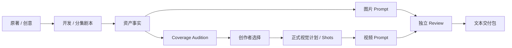

# drama-skills 项目研究

- 编号：RES-017
- 调研日期：2026-08-14
- 分类：文本型 AI 短剧技能与创作证据工作流
- 固定快照：[worldwonderer/drama-skills@`bc040191458da3d5b6eaa7068da67527ae3c912f`](https://github.com/worldwonderer/drama-skills/tree/bc040191458da3d5b6eaa7068da67527ae3c912f)
- 快照提交时间：2026-08-13
- Stars 快照：704，仅作检索记录，不代表成熟度
- 许可证证据：[根 LICENSE 为 MIT](https://github.com/worldwonderer/drama-skills/blob/bc040191458da3d5b6eaa7068da67527ae3c912f/LICENSE)
- 研究结论：创作者决策、记录级失效、写前日志恢复和独立审查是强证据；文本技能不能替代 Lanverse 的多人产品、媒体与任务系统

## 1. 公开事实

drama-skills 将九个 Agent Skill 组织为原著分析、故事开发、分集写作、资产决策、图片 Prompt、分镜、视频 Prompt、独立审查和文本交付。它明确声明所有产物都是文本，并刻意不调用图片、视频或音频服务，以避免未确认 Prompt 触发成本。[固定提交 README](https://github.com/worldwonderer/drama-skills/blob/bc040191458da3d5b6eaa7068da67527ae3c912f/README.md)

这个项目的研究价值不在 UI 或生成能力，而在以下可核验契约：

- 候选导演方案与最终创作者选择分别保存；
- 选择绑定候选的内容哈希，正式视觉计划同时引用候选与创作者决议；
- 下游可声明自己读取了 JSON/JSONL 中哪些稳定记录，避免整个共享资产文件变动都使其过期；
- 多文件发布采用写前事务记录，崩溃后可决定回滚或前滚；
- 外部人工改动优先保留并将事务置为 blocked，不静默覆盖；
- 独立 Review 与创作技能分责。

证据见 [Coverage Audition 规则](https://github.com/worldwonderer/drama-skills/blob/bc040191458da3d5b6eaa7068da67527ae3c912f/skills/short-drama-storyboard/references/coverage-audition.md)、[记录级失效测试](https://github.com/worldwonderer/drama-skills/blob/bc040191458da3d5b6eaa7068da67527ae3c912f/tests/test_record_level_staleness.py) 与 [事务恢复测试](https://github.com/worldwonderer/drama-skills/blob/bc040191458da3d5b6eaa7068da67527ae3c912f/tests/test_recovery_and_package.py)。

## 2. 工作流与模块

### 2.1 候选方案、选择和正式计划分离

**事实**：Coverage Audition 只在关键场景比较真正不同的信息时机、观看位置、表演空间或声音方案；不规定宫格和镜头数量。Audition 不把事后选择写回自身，选择保存在独立 `creator-decision`，绑定 candidate 的 target hashes；正式 scene visual plan 再引用 audition 与选择决议。[规则文档](https://github.com/worldwonderer/drama-skills/blob/bc040191458da3d5b6eaa7068da67527ae3c912f/skills/short-drama-storyboard/references/coverage-audition.md)

**推断**：候选是可比较方案，Selection 是人的决议，正式产物是被选择方案的投影；三者混在一个可覆盖对象中会产生哈希循环和历史丢失。

**Lanverse 决策**：镜头视频同样分为 VideoCandidate、ShotSelection 和 ExportManifestItem。生成候选不能自动成为主选；选择变更不修改候选内容。

### 2.2 只在需要时提供多方案

**事实**：Audition 只用于首次亮相、身份揭示、关系反转、高潮、复杂调度等关键场次，普通场景可跳过；两个方案只有导演命题真实不同时才算不同。[规则文档](https://github.com/worldwonderer/drama-skills/blob/bc040191458da3d5b6eaa7068da67527ae3c912f/skills/short-drama-storyboard/references/coverage-audition.md)

**推断**：候选生成是高成本创作动作，不应为了填满固定网格而机械制造差异。

**Lanverse 决策**：用户决定为哪些镜头生成几次视频；系统可提示关键镜头需要更多比较，但不强制所有镜头九宫格或相同候选数。

### 2.3 独立审查

**事实**：`short-drama-review` 作为单独 Skill，读取剧本、提示词和生产观察，输出独立结论；README 将其与写作、资产和分镜 Skill 分开。[README](https://github.com/worldwonderer/drama-skills/blob/bc040191458da3d5b6eaa7068da67527ae3c912f/README.md)

**推断**：生成者的自评不能等于验收；审查结果也不应直接覆盖创作者主选。

**Lanverse 决策**：镜头检查形成 Review/Issue，记录检查者、对象版本、结论与问题；最终是否替换主选仍是显式创作决议。

## 3. 记录级版本与失效传播

### 3.1 可核验契约

记录级失效测试约束了以下行为：

- 下游若声明只读取 `CHAR-A`，共享角色 Bible 新增无关 `CHAR-C` 不使其 stale；
- 编辑、删除或制造重复 `CHAR-A` 会使读取者 stale；
- 仅重排记录或改变 JSON 字段顺序不使其 stale；
- 若下游只绑定整文件哈希，则同样的无关追加仍会 stale；
- 记录级选择只适用于能可靠解析稳定记录的 JSON/JSONL。

证据见 [`tests/test_record_level_staleness.py`](https://github.com/worldwonderer/drama-skills/blob/bc040191458da3d5b6eaa7068da67527ae3c912f/tests/test_record_level_staleness.py)。

### 3.2 产品含义

**推断**：长剧集共享资产库会持续增加角色、造型和地点。如果所有下游都绑定整个库版本，任何追加都会让全项目变红；如果完全不绑定，又会使用失效参考。

**Lanverse 决策**：镜头/生成请求明确引用实际使用的 AssetRevision ID 集合。新增无关资产不影响旧镜头；修改已引用资产只使依赖它的关键帧、视频候选和导出预检 stale。

### 3.3 适用条件

记录级失效需要：稳定记录 ID、规范化内容哈希、唯一解析、明确 read set 和可追踪依赖。对自由文本无法可靠定位记录时，退回文档/Revision 级依赖，不能用脆弱正则假装精确。

## 4. 事务、恢复与失败边界

### 4.1 写前事务

**事实**：发布多个文件前创建 manifest、read set、staged outputs 与 WAL；不同崩溃点决定回滚旧内容或前滚新内容；恢复再次执行应无变化。[恢复测试](https://github.com/worldwonderer/drama-skills/blob/bc040191458da3d5b6eaa7068da67527ae3c912f/tests/test_recovery_and_package.py)

**推断**：多个关联对象的发布必须全成或全不成；“第一个文件更新、第二个失败”不能被当作完整剧本版本。

**Lanverse 决策**：剧本解析、批量镜头变更和 ExportManifest 发布使用数据库事务/不可变版本；外部媒体上传采用 staging -> validate -> publish，不暴露半成品。

### 4.2 外部修改与冲突

**事实**：恢复检测到创作者在崩溃后修改目标文件时，保留外部字节、复制冲突证据并将事务/交付门禁置为 blocked；已提交事务也不会覆盖提交后的人工编辑。[恢复测试](https://github.com/worldwonderer/drama-skills/blob/bc040191458da3d5b6eaa7068da67527ae3c912f/tests/test_recovery_and_package.py)

**推断**：自动恢复的目标是收敛到安全状态，而不是强行“修好”；当机器无法决定时，blocked 是有效终态。

**Lanverse 决策**：更新剧本、分镜和主选使用 expected revision/ETag。并发冲突返回可比较版本，不采取最后写入覆盖。

### 4.3 Read Set 校验

**事实**：事务准备后若依赖文件变化，发布会在替换任何目标之前以 stale read set 失败。[恢复测试](https://github.com/worldwonderer/drama-skills/blob/bc040191458da3d5b6eaa7068da67527ae3c912f/tests/test_recovery_and_package.py)

**Lanverse 决策**：生成 Job 一旦提交绑定不可变输入，不受后续页面编辑影响；新输入版本使结果标 stale，但不篡改正在运行 Attempt 的历史快照。

## 5. 媒体与生成任务边界

**事实**：项目刻意不调用生图、生视频或音频服务；Prompt 先落文件并由人确认。[README](https://github.com/worldwonderer/drama-skills/blob/bc040191458da3d5b6eaa7068da67527ae3c912f/README.md)

这意味着固定提交不能提供以下证据：

- ProviderExecution、异步轮询、供应商 task ID 与未知提交；
- 视频媒体上传/校验、对象存储和签名访问；
- 同镜视频候选预览、播放、删除和主选并发；
- SSE/WS 任务进度与 Worker 心跳；
- 素材包的二进制视频导出。

**Lanverse 决策**：吸收“高成本动作前先展示请求快照并确认”。Agent 准备 Prompt、目标、参考资产、模型和成本估算；用户确认后才创建生成 Job。drama-skills 不作为媒体/任务模块实现参照。

## 6. 导出边界

**事实**：交付物是文本包，项目不生成视频文件。[README](https://github.com/worldwonderer/drama-skills/blob/bc040191458da3d5b6eaa7068da67527ae3c912f/README.md)

**推断**：交付闭包思想仍适用——一个包应固定其引用的已接受对象和哈希，不能随项目后续变化漂移。

**Lanverse 决策**：ExportManifest 是一次不可变交付快照，绑定项目/剧本版本、镜头顺序、每镜 Selection 与 MediaAsset 校验信息。文件复制失败则 ExportJob 失败，不能发布半完整 Manifest。

## 7. 安全边界

恢复测试覆盖路径规范、非便携历史路径、损坏 WAL、缺失 manifest 和外部编辑保留，说明项目对文件系统故障采取保守策略。[`tests/test_recovery_and_package.py`](https://github.com/worldwonderer/drama-skills/blob/bc040191458da3d5b6eaa7068da67527ae3c912f/tests/test_recovery_and_package.py)

**不可推断**：文本文件本地安全不证明 Web 多租户鉴权、上传扫描、SSRF、密钥保护或供应商 Webhook 安全。

**Lanverse 决策**：把“冲突时保护用户数据”作为跨模块原则；Web 安全和 Provider 安全仍独立设计。

## 8. 测试证据与边界

固定提交包含生命周期、结构校验、原著/剧本索引、输出语言、记录级失效、恢复与交付包等测试。本研究重点引用：

- [`tests/test_record_level_staleness.py`](https://github.com/worldwonderer/drama-skills/blob/bc040191458da3d5b6eaa7068da67527ae3c912f/tests/test_record_level_staleness.py)；
- [`tests/test_recovery_and_package.py`](https://github.com/worldwonderer/drama-skills/blob/bc040191458da3d5b6eaa7068da67527ae3c912f/tests/test_recovery_and_package.py)；
- [`tests/test_structural_validators.py`](https://github.com/worldwonderer/drama-skills/blob/bc040191458da3d5b6eaa7068da67527ae3c912f/tests/test_structural_validators.py)；
- [`tests/test_shipping_boundaries.py`](https://github.com/worldwonderer/drama-skills/blob/bc040191458da3d5b6eaa7068da67527ae3c912f/tests/test_shipping_boundaries.py)。

这些测试对文件工作流提供强约束，但不验证 Web 产品、真实媒体、异步供应商、多租户或规模性能。

## 9. 可吸收模式

1. 候选、创作者选择和正式产物分离；
2. 选择绑定候选内容哈希，避免写回候选产生循环；
3. 多方案只用于真正需要创作比较的目标；
4. 生成者与独立审查者分责；
5. 稳定记录 ID 与记录级依赖缩小 stale 半径；
6. Read Set 在发布前再次校验；
7. 多对象发布全成或全不成；
8. 崩溃恢复可重复执行并最终收敛；
9. 检测到外部修改时保留用户内容并进入 blocked；
10. 高成本 AI 动作先预览输入与成本，再由人确认。

## 10. 明确拒绝点

- 不移植 drama-skills 代码、Skill、模板或脚本；
- 不把文件目录当作 Lanverse 多人数据库；
- 不让 Agent 文件工作流替代权限、任务、媒体与实时状态；
- 不把哈希接受流程原样暴露给普通创作者；
- 不强制所有场景生成多个导演方案或固定宫格；
- 不因文本恢复测试充分而推断供应商任务可靠；
- 不把独立 Review 的自动结论变成自动主选；
- 不因 MIT 许可提出代码复用建议。

## 11. Lanverse 决策

drama-skills 为 Lanverse 提供了最清楚的“创作决议与证据”参照：候选保持不可变，人类选择另存决议，正式交付绑定选择和版本；共享资产依赖精确到实际引用记录；冲突恢复优先保护创作者内容。Lanverse 将把复杂哈希与事务藏在产品内部，对用户呈现“待确认、已选择、内容已更新需复核、发生冲突请处理”等清晰状态，并在任何高成本 Agent 生成前提供预览确认。
