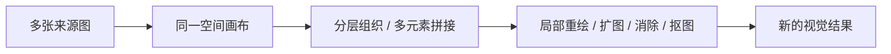

# 即梦智能画布产品研究

- 编号：RES-018
- 调研日期：2026-08-14
- 分类：公开产品证据 / AI 图像空间画布
- 一手来源：[即梦 AI 官方首页](https://jimeng.jianying.com/)
- 核验方式：未登录公开页面只读核验；未上传素材、未生成、未下载、未执行付费动作
- 许可证：不适用；本页研究公开产品交互，不研究或复用其代码
- 研究结论：多素材同屏、分层处理和局部修改适合关键帧探索；不能据公开页面推断生产 DAG、版本恢复或镜头任务架构

## 1. 证据范围

### 1.1 已核验公开事实

[即梦 AI 官方首页](https://jimeng.jianying.com/) 的“智能画布 多图 AI 融合”区域公开说明：

- 一站式智能画布；
- AI 拼图生成；
- 局部重绘；
- 一键扩图；
- 图像消除；
- 抠图；
- 在同一画布上进行多元素拼接；
- 多图层编辑；
- 精细化控制。

这些事实只证明官网在 2026-08-14 公开呈现的产品能力名称和用途描述。

### 1.2 不可推断

公开首页不能证明：

- 画布内部是否使用 DAG、事件溯源或某种数据库；
- 图层与生成任务是否有稳定业务 ID；
- 局部重绘是否创建不可变版本，还是覆盖原图；
- 多人协作、权限、冲突和审计；
- 任务排队、Provider task ID、重试、取消、断线恢复和重复计费保护；
- 媒体哈希、存储、来源血缘、保留期和删除策略；
- 产品能否承担剧本—资产—分镜—逐镜视频的完整生产工作流。

本轮没有恢复历史截图，也不使用第三方转述或逆向脚本推断后端。

## 2. 产品工作流观察

### 2.1 从“单 Prompt 单结果”转向“素材关系操作”

**事实**：官方文案强调同一画布、多元素、多图融合与多图层，而不是只有单一 Prompt 输入框。[官方首页](https://jimeng.jianying.com/)

**推断**：角色参考、场景参考、构图草图和已有结果可以同时可见，创作者更容易说明“保留什么、替换什么、扩展哪里”。

**适用条件**：这类空间工作区适合视觉探索和局部修改；只有当每个内容对象都有明确类型、来源和版本时，才适合进入正式生产。

**Lanverse 决策**：当前把画布定位为“视觉资产/关键帧探索视图”的候选方向，不把它定义为整个短剧生产流程本身。

### 2.2 局部修改应产生派生结果

**事实**：局部重绘、扩图、消除和抠图都是从现有图像出发的修改动作。[官方首页](https://jimeng.jianying.com/)

**推断**：这些动作需要明确 Source Asset、操作区域/参数和 Result Asset，否则无法解释当前图来自哪里，也无法回退。

**Lanverse 决策**：任何 AI 修改生成新 AssetRevision/Candidate，保留原输入；“设为当前主选”是另一个显式动作。删除或消除视觉内容不能物理抹去历史证据。

### 2.3 图层适合作为视觉编辑语义，不是生产完成度

**事实**：官方公开“多图层编辑”和“精细化控制”。[官方首页](https://jimeng.jianying.com/)

**推断**：图层有助于在一张画布中组织视觉元素，但图层顺序无法回答剧本是否冻结、镜头是否完整、视频是否主选或素材包是否可导出。

**Lanverse 决策**：图层/布局属于 CanvasViewState；生产状态来自领域对象和任务。不能以“画布上有一个视频节点”判断镜头视频阶段完成。

## 3. 画布与列表同源原则

如果 Lanverse 提供空间画布，应坚持以下映射：

| 空间视图对象 | 领域真相 | 布局不负责的内容 |
| --- | --- | --- |
| 角色参考节点 | Character / AssetRevision | 角色是否被某镜头引用 |
| 场景参考节点 | Scene / AssetRevision | 场景版本是否使下游 stale |
| 分镜/关键帧节点 | Shot / KeyframeCandidate / Selection | 镜头顺序与主选完整性 |
| 视频节点 | VideoCandidate / GenerationAttempt | 任务终态与 Provider 对账 |
| 连线 | 显式 DependencyEdge 或仅视觉关联，必须区分 | 不能由线条外观推断依赖类型 |
| 坐标/分组/缩放 | CanvasViewState | 权限、版本、完成度、导出资格 |

**Lanverse 决策**：列表视图与空间视图必须读写同一领域对象。切换视图不能复制一份项目状态，也不能形成两套选择结果。

## 4. 任务、恢复与失败边界

### 4.1 公开事实边界

本轮只读公开页面没有展示任务中心、状态机、错误详情、取消、重试、恢复、重复请求防护或成本确认。因此这些能力全部标记为待验证，不能写成即梦已有成熟模式。

### 4.2 Lanverse 产品要求

空间画布上的每个高成本动作应经历：

1. 选择一个或多个类型化目标；
2. 展示即将使用的输入版本、修改区域/指令、模型与预计成本；
3. 用户确认；
4. 创建可查询 Job/Attempt；
5. 节点显示 queued/running/succeeded/failed/cancelled/unknown；
6. 成功结果作为新候选加入，不自动覆盖主选；
7. 失败节点给出重试范围和是否可能重复计费。

这是 Lanverse 决策，不是对即梦后端的描述。

## 5. 媒体与版本边界

### 5.1 从公开能力推导的必要产品语义

多图融合至少涉及多个 Source Asset；局部重绘涉及空间选区；扩图涉及新画布边界；抠图涉及透明背景/蒙版结果。这些只是合理的产品推断，具体实现需 Design/PoC 验证。

### 5.2 Lanverse 决策

- 每次画布 AI 操作产生新媒体，不覆盖源媒体；
- 保存源资产版本、操作类型、用户指令和结果媒体 ID；
- 画布中的临时摆放只有在显式“保存为候选/纳入镜头”后进入正式资产链；
- 选区或蒙版若影响复现，应作为受控附件保存；
- 当前主选删除时进入缺失状态，不自动换成最近候选；
- 媒体可用性由对象存储事实和校验决定，不由画布是否仍显示缩略图决定。

## 6. 导出边界

公开首页没有提供本研究所需的逐镜候选选择与有序素材包证据。本轮不把即梦的任何下载能力写成 Lanverse 导出参照。

**Lanverse 决策**：画布只帮助准备/比较视觉资产；项目导出仍从 ShotSelection 与 ExportManifest 读取，不导出任意画布可见节点集合，也不生成成片。

## 7. 安全、隐私与权利边界

多图上传、局部修改和人物抠图可能涉及真人肖像、版权素材、敏感内容和第三方服务处理。公开首页不能证明具体上传条款、保留期、训练用途、访问控制或删除 SLA。

进入 Lanverse 需求前仍需验证：

- 用户是否拥有上传与生成所需权利；
- 真人/未成年人素材的同意和限制；
- 临时上传、生成结果和蒙版的保留/删除；
- 分享链接与 Workspace 权限；
- Provider 数据处理地区、训练使用和日志保留；
- 内容审核失败时是否保留安全诊断而不泄露素材。

## 8. 测试与验证边界

本研究没有源码、自动化测试、API 文档或已授权登录任务记录，因此不能评价：

- 操作成功率与真实生成质量；
- 大画布性能、离线/断线恢复；
- 多图层上限和大型素材处理；
- 局部修改边界精度；
- 多人并发或历史回滚；
- 可访问性、键盘操作和移动端等价性。

这些应进入 Lanverse 原型测试，而不是从竞品文案借结论。

## 9. 可吸收模式

1. 多个视觉参考在同一空间中持续可见；
2. 多图层帮助区分素材与组合关系；
3. 局部重绘、扩图、消除、抠图以对象级动作呈现；
4. 修改从源资产派生新候选；
5. 画布用于探索与比较，不替代领域状态；
6. 空间视图和列表视图同源；
7. 节点类型化，布局不是业务真相；
8. 高成本动作先预览确认，并在节点上观察任务状态。

## 10. 明确拒绝点

- 不把官方营销文案推断为生产 DAG；
- 不推断即梦的数据库、任务队列、模型路由或存储实现；
- 不复制 UI、品牌、素材或交互细节；
- 不恢复或提交已删除的竞品截图；
- 不让自由画布替代剧本、资产、分镜、候选和选择模型；
- 不让图层顺序决定镜头顺序；
- 不让局部修改覆盖历史源图；
- 不把画布中的所有可见媒体自动纳入导出。

## 11. Lanverse 决策

即梦证明的不是“一套短剧生产 DAG”，而是视觉创作需要一个能同时容纳多素材、分层关系和局部修改的空间。Lanverse 若建设画布，将把它作为正式领域对象的一种视图：列表/空间同源、节点有明确类型、布局独立、工作流状态可观察。所有生成或修改先展示目标与成本并由用户确认，结果形成候选，只有显式选择才能进入逐镜导出。
