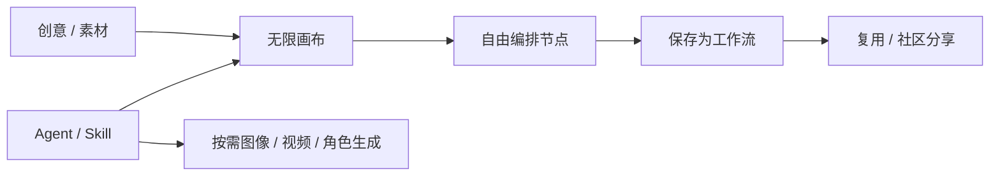

# LibTV 无限画布与 Agent 工作流产品研究

- 编号：RES-019
- 调研日期：2026-08-14
- 分类：公开产品证据 / 无限画布、工作流与 Agent/Skill 平台
- 一手来源：[LibTV 官方产品页](https://www.liblib.tv/wappro)、[LibTV CLI 官方页](https://www.liblib.tv/cli)
- 核验方式：公开页面只读；未登录、未创建画布、未安装 CLI/Skill、未提交生成或分享
- 许可证：不适用；本页研究公开产品工作流，不研究或复用其代码
- 研究结论：画布、工作流、社区分享和 Agent/Skill 适合形成“可编排、可复用”的创作体验；登录内对象、生产状态和恢复机制尚未核验

## 1. 证据范围

### 1.1 已核验公开事实

[LibTV 官方产品页](https://www.liblib.tv/wappro) 在公开区域宣称：

- 无限画布；
- 自由编排；
- 智能 Agent；
- 工作流；
- 社区分享。

[LibTV CLI 官方页](https://www.liblib.tv/cli) 公开说明：

- 可通过 AI Agent 安装；
- 面向主流 Agent 工具；
- 提供 LibTV Skill；
- 可按需生成视频、图像与角色。

这些事实说明其公开定位与能力入口，不证明每个功能在所有账户、地区或套餐下可用，也不证明后端实现。

### 1.2 未核验范围

- 登录后的项目、画布、节点、任务、候选和版本字段；
- 节点连线是否就是执行依赖；
- 工作流保存的是布局、参数还是完整可执行快照；
- 社区分享的权限、复制、版本、来源与删除策略；
- Agent 在高成本生成前是否总会确认；
- 任务状态、取消、重试、断线恢复、Provider 对账和幂等；
- 媒体存储、历史版本、选择决议和导出清单；
- CLI/Skill 的本地权限、令牌范围、沙箱和审计。

公开页面之外的登录态细节全部保持“待验证”，不依据网页资源包、第三方视频或营销截图推断。

## 2. 产品工作流观察

### 2.1 空间编排与工作流沉淀

**事实**：官方产品页把“无限画布·自由编排·智能 Agent”与“工作流·社区分享”分别作为公开卖点。[官方产品页](https://www.liblib.tv/wappro)

**推断**：空间画布负责组织当次创作，工作流负责把可重复步骤和参数沉淀下来；二者应有明确边界。如果把布局本身直接当可执行逻辑，移动节点就可能意外改变生产结果。

**Lanverse 决策**：

- CanvasViewState 保存坐标、缩放、分组和视觉连线；
- WorkflowDefinition 保存类型化步骤、输入/输出契约和版本；
- Project、Asset、Shot、Candidate 与 Selection 是领域真相；
- 画布和列表读取同一对象，工作流执行绑定提交快照；
- 布局优化或重排不得改变业务依赖。

### 2.2 Agent/Skill 是入口，不是无限权限

**事实**：官方 CLI 页把 Skill/Agent 作为调用图像、视频与角色生成的入口。[CLI 官方页](https://www.liblib.tv/cli)

**推断**：Agent 可降低复杂操作门槛，Skill 可复用工作方法；但自然语言意图可能不完整，视频生成又是高成本且不可完全撤销的外部动作。

**Lanverse 决策**：Agent 先产出可预览执行计划：目标镜头、输入版本、模型、参数、预计任务数/成本与会失效的下游。用户确认后才执行。Skill 只能调用白名单领域命令，不能直接写数据库、读取任意 Workspace 或访问密钥。

### 2.3 社区工作流分享

**事实**：官方产品页公开“工作流·社区分享”。[官方产品页](https://www.liblib.tv/wappro)

**推断**：一个可分享工作流至少需要作者/来源、版本、依赖、参数占位、预览、兼容性和权限说明。否则复制后可能调用不同模型、泄露素材或产生意外成本。

**Lanverse 决策**：当前产品打磨阶段不建设社区市场或公开分享。首版只考虑 Workspace 内部模板；模板保存 Definition，不携带他人私有素材、密钥或历史任务。

## 3. 类型化画布节点原则

Lanverse 不采用“任何卡片和连线都能运行”的模糊画布。允许进入正式生产的节点类型应受领域约束：

| 节点类型 | 必须引用 | 可显示的状态 | 禁止承担的隐含语义 |
| --- | --- | --- | --- |
| Script/Scene | ScriptRevision / Scene ID | draft / accepted / stale | 坐标不能决定故事顺序 |
| Character/Location/Prop | Asset / AssetRevision | available / missing / stale | 分组不能替代引用关系 |
| Shot | Shot ID / order key | incomplete / ready / stale | 连线外观不能替代输入版本 |
| Keyframe Candidate | Candidate / MediaAsset | queued / succeeded / failed / selected | 最新结果不能自动主选 |
| Video Candidate | Candidate / GenerationAttempt | queued / running / terminal / stale | 可见即完成、位置即顺序 |
| Export | ExportJob / Manifest | preflight / running / succeeded / failed | 不能收集画布上所有视频即导出 |

列表、分镜表与画布都是这些对象的不同投影。

## 4. 任务、恢复与失败边界

### 4.1 证据限制

公开产品/CLI 页面没有给出可复核的任务状态机、Worker、事件协议、幂等、取消、未知提交和重启恢复。因此 LibTV 不进入这些架构决策的一手实现证据。

### 4.2 Lanverse 必需行为

Agent 或画布触发生成时应：

1. 对所选节点做权限与 readiness 预检；
2. 固定输入 revision 和 WorkflowDefinition version；
3. 展示执行计划、预计高成本调用数和失效范围；
4. 用户确认后创建持久 Job/Attempt；
5. 通过 SSE/WS 投影状态，但刷新后用 API 重建；
6. 失败定位到目标节点和 Attempt；
7. 重试只重跑失败/选择目标，不重跑无关分支；
8. 供应商提交结果不确定时进入 `unknown`，不自动双重提交。

这些是 Lanverse 的产品约束，不是对 LibTV 的描述。

## 5. 媒体、候选与版本边界

“按需生成视频、图像与角色”只能证明公开入口，不能证明媒体数据结构。[CLI 官方页](https://www.liblib.tv/cli)

Lanverse 需要独立保证：

- 媒体有稳定 ID、存储 key、MIME、大小、尺寸/时长和校验信息；
- 每次生成形成 Candidate 与 Attempt，不覆盖原媒体；
- 候选引用准确 Workflow/Prompt/AssetRevision 快照；
- 人工 Selection 独立保存，选择冲突用 expected revision 检测；
- 上游变化标记相关候选 stale，保留历史；
- 工作流模板只引用输入槽位，不打包私有素材 URL。

## 6. 导出与分享边界

### 6.1 导出

公开两页没有提供 Lanverse 所需的逐镜主选素材包与 Manifest 证据。Lanverse 不从“工作流完成”自动推断项目可交付。

**Lanverse 决策**：ExportPreflight 单独检查每个必要镜头；成功后冻结 Manifest 和文件集合。不拼成成片。

### 6.2 分享

社区分享涉及公开范围、复制权、素材授权、个人信息和 Prompt/工作流知识产权。未登录证据不足以确认 LibTV 的具体规则。

**Lanverse 决策**：当前排除公开社区、市场、点赞、收藏、计费和运营。Workspace 内模板也必须去除凭据与私有媒体引用。

## 7. 安全与隐私边界

CLI/Skill 会把第三方 Agent 与生成服务连接起来，合理推断需要令牌、权限和本地/远程数据边界，但公开页面未给出足够技术细节。

后续若 Lanverse 提供 Agent/CLI，必须验证：

- Token 最小权限、有效期、撤销和设备绑定；
- Skill 来源、版本、签名和允许的工具；
- 项目/Workspace 资源访问范围；
- 高成本命令的交互确认和审计；
- 上传媒体、Prompt 和生成结果是否发送第三方；
- 日志中令牌、签名 URL 与隐私内容脱敏；
- 恶意模板/Prompt 不得提升工具权限。

## 8. 测试与待验证清单

本轮未获得源码、测试、API Schema 或已授权登录记录，因而以下全部待验证：

- 画布规模、节点上限与大型项目性能；
- 列表/画布是否同源，以及节点复制后的身份语义；
- Workflow version、输入版本与重放确定性；
- Agent 计划预览、自动/手动模式和成本确认；
- 任务断线/重启、重复提交、取消和部分失败；
- 社区工作流复制时的权限与私有数据清理；
- CLI 的安装供应链、沙箱、令牌与审计；
- 逐镜视频候选与唯一主选；
- 有序素材包导出。

## 9. 可吸收模式

1. 无限画布承载跨模态创作上下文；
2. 自由编排与可执行工作流分层；
3. 工作方法沉淀为版本化模板/Skill；
4. Agent 可从自然语言路由到图像、视频、角色能力；
5. 类型化领域节点而非任意卡片成为正式生产对象；
6. 空间和列表视图同源，布局不是业务真相；
7. 节点展示真实工作流状态与失败；
8. 高成本 Agent 动作先预览、再确认；
9. 当前只做 Workspace 内复用，不做社区运营。

## 10. 明确拒绝点

- 不推断 LibTV 的后端、数据库、DAG、队列、模型路由或计费实现；
- 不把公开营销能力直接写成 Lanverse 已批准需求；
- 不复制产品 UI、品牌、文案、Skill 或工作流；
- 不把画布坐标/视觉连线当业务真相；
- 不允许 Agent 在未确认时执行高成本生成；
- 不允许模板携带他人素材、Token 或签名 URL；
- 不在当前产品打磨阶段建设社区、市场或商业运营；
- 不把工作流执行完成等同逐镜导出就绪。

## 11. Lanverse 决策

LibTV 的公开定位支持一个重要方向：创作者既需要空间组织，又需要把可重复方法沉淀为工作流/Skill。但 Lanverse 的实现前提更严格——空间视图和列表视图同源、节点类型化、布局不是业务真相、运行状态随节点可观察、Agent 的高成本动作必须预览确认。社区分享与 CLI 生态不进入当前核心范围，先把项目内剧本—资产—分镜—候选—选择—素材包闭环打磨好。
