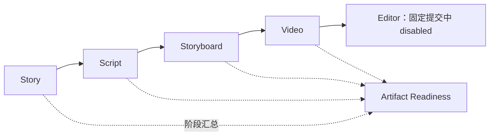

# waoowaoo 项目研究

- 编号：RES-020
- 调研日期：2026-08-14
- 分类：AI 短剧/漫画视频垂直制作平台
- 固定快照：[waooAI/waoowaoo@`ce8edebf7cd2fe32c37a8d628aa3edc67f544586`](https://github.com/waooAI/waoowaoo/tree/ce8edebf7cd2fe32c37a8d628aa3edc67f544586)
- 快照提交时间：2026-07-29
- Stars 快照：13,593，仅作检索记录，不代表成熟度
- 许可证证据：[根 LICENSE 为 CC BY-NC-SA 4.0 人类可读摘要，并明确称不是严格意义的软件开源许可证](https://github.com/waooAI/waoowaoo/blob/ce8edebf7cd2fe32c37a8d628aa3edc67f544586/LICENSE)；GitHub API 在调研时返回 `NOASSERTION`
- 研究结论：GraphRun/Step/Attempt/Event、分支失效、DB↔队列恢复和显式候选确认是本轮强证据；许可禁止商业使用，且其成片/配音/计费与 Lanverse 当前范围不符

## 1. 公开事实

waoowaoo 把自身描述为从小说分析到角色、场景、分镜、视频与配音的 AI 影视 Studio；README 同时明确项目处于测试初期、开发资源有限、快速迭代，并警告版本间数据库不兼容。[固定提交 README](https://github.com/waooAI/waoowaoo/blob/ce8edebf7cd2fe32c37a8d628aa3edc67f544586/README.md)

技术栈证据边界是 Next.js 15/React 19、MySQL/Prisma、Redis/BullMQ、NextAuth。它只帮助理解仓库实现，不构成 Lanverse 选型或代码复用建议。[README](https://github.com/waooAI/waoowaoo/blob/ce8edebf7cd2fe32c37a8d628aa3edc67f544586/README.md)

固定 Prisma Schema 提供两层执行模型：

- `Task`：用户、项目/分集、类型、目标、状态、进度、重试、去重键、外部 ID、Payload/Result/Error/Billing、心跳和入队诊断；
- `TaskEvent`：按任务/项目/用户保存事件；
- `GraphRun`：Workflow、目标、输入/输出、取消请求、租约/心跳、工作流版本和运行序号；
- `GraphStep`：步骤稳定 key、标题、状态、当前 Attempt、顺序与错误；
- `GraphStepAttempt`：Provider、模型、输入哈希、输入/输出、usage、错误和时间；
- `GraphEvent`：运行内单调 seq、步骤、Attempt、lane 与 Payload；
- `GraphCheckpoint/GraphArtifact`：节点检查点与运行产物。

以上均可在 [`prisma/schema.prisma`](https://github.com/waooAI/waoowaoo/blob/ce8edebf7cd2fe32c37a8d628aa3edc67f544586/prisma/schema.prisma) 复核。

## 2. 阶段导航与产品工作流

### 2.1 阶段导航由持久产物投影

**事实**：`resolveEpisodeStageArtifacts` 根据实际持久数据判断 `hasStory/hasScript/hasStoryboard/hasVideo/hasVoice`；导航再投影为 empty/active/processing/ready，而不是只依赖用户访问过哪个页面。[readiness](https://github.com/waooAI/waoowaoo/blob/ce8edebf7cd2fe32c37a8d628aa3edc67f544586/src/lib/novel-promotion/stage-readiness.ts) 与 [导航 Hook](https://github.com/waooAI/waoowaoo/blob/ce8edebf7cd2fe32c37a8d628aa3edc67f544586/src/app/%5Blocale%5D/workspace/%5BprojectId%5D/modes/novel-promotion/hooks/useWorkspaceStageNavigation.ts)

**推断**：导航状态应是领域对象的汇总投影，刷新/换设备后仍能重建。

**Lanverse 决策**：阶段条不保存独立“完成”布尔值；根据剧本版本、必要资产、镜头完整性、候选/主选和导出预检计算，并解释缺失项。

### 2.2 `has any` 与 `complete` 必须分开

**事实**：固定实现只要任一 clip 有 screenplay 就 `hasScript=true`，任一 storyboard 有 panel 就 `hasStoryboard=true`，任一 panel 有 video URL 就 `hasVideo=true`；对应测试明确锁定这一语义。[readiness 实现](https://github.com/waooAI/waoowaoo/blob/ce8edebf7cd2fe32c37a8d628aa3edc67f544586/src/lib/novel-promotion/stage-readiness.ts) 与 [测试](https://github.com/waooAI/waoowaoo/blob/ce8edebf7cd2fe32c37a8d628aa3edc67f544586/tests/unit/novel-promotion/stage-readiness.test.ts)

**推断**：该规则适合表达“阶段已有产物/可以进入查看”，不适合表达“全项目完成/可导出”。一部有 30 镜、仅 1 镜有视频的项目不能被视为视频完整。

**Lanverse 决策**：分别计算 `started`、`partially_ready`、`complete` 和 `export_ready`；视频阶段汇总显示 `成功/总镜头`、缺主选数、失败数与 stale 数。

### 2.3 全局 processing 会掩盖目标状态

**事实**：导航 Hook 中只要 `isAnyOperationRunning` 为真，多个阶段的 `getStageStatus` 都返回 processing。[导航 Hook](https://github.com/waooAI/waoowaoo/blob/ce8edebf7cd2fe32c37a8d628aa3edc67f544586/src/app/%5Blocale%5D/workspace/%5BprojectId%5D/modes/novel-promotion/hooks/useWorkspaceStageNavigation.ts)

**推断**：一个镜头生成视频时，把剧本和全部分镜也标成处理中会丢失目标粒度。

**Lanverse 决策**：顶部阶段只汇总真实子对象状态；运行状态显示在具体镜头/资产节点，另提供任务中心。全局忙碌不覆盖已经完成或失败的阶段事实。

## 3. GraphRun、Step、Attempt 与事件

### 3.1 分层职责

| 层级 | 固定提交事实 | Lanverse 可吸收语义 |
| --- | --- | --- |
| Task | 面向项目目标的异步任务，含 dedupe/externalId/heartbeat | 用户可查询的 Job 外壳 |
| GraphRun | 一个版本化工作流运行，含 lease/cancel/seq | 一次可恢复编排实例 |
| GraphStep | 稳定步骤及当前投影 | 阶段/目标级状态 |
| GraphStepAttempt | 每次执行的输入、Provider、usage、错误 | 不改写失败历史的重试证据 |
| GraphEvent | append-only、运行内序号 | SSE/回放/审计来源 |
| Checkpoint | 节点与版本的状态快照 | 崩溃续做入口 |
| Artifact | 步骤产生的可寻址引用 | 运行产物到领域对象的桥 |

模型证据来自 [`prisma/schema.prisma`](https://github.com/waooAI/waoowaoo/blob/ce8edebf7cd2fe32c37a8d628aa3edc67f544586/prisma/schema.prisma)。

**Lanverse 决策**：采用这些责任划分，不照搬表结构。用户层 Job 与内部 WorkflowRun 分离；每次 Provider 调用是不可变 Attempt/Execution，事件仅追加。

### 3.2 重试与分支失效

**事实**：`retryFailedStep` 检查 run 所属用户和步骤必须为 failed；计算受影响 step keys，在一个事务中把运行恢复 running、目标及下游步骤置 pending、目标 Attempt 递增，并处理下游 GraphArtifact。[运行服务](https://github.com/waooAI/waoowaoo/blob/ce8edebf7cd2fe32c37a8d628aa3edc67f544586/src/lib/run-runtime/service.ts)

集成测试给出两个具体依赖半径：

- 重试角色分析会失效 split clips 与 screenplay 分支，但保留已完成地点分析；
- 重试某 clip 的 storyboard phase 只失效该 clip 下游与 voice analyze，保留另一个 clip 分支。

证据见 [`retry-failed-step.integration.test.ts`](https://github.com/waooAI/waoowaoo/blob/ce8edebf7cd2fe32c37a8d628aa3edc67f544586/tests/integration/run-runtime/retry-failed-step.integration.test.ts)。

**推断**：重试目标必须有明确影响分析，不能全项目重跑；兄弟分支应保留。

**风险**：实现会物理 `deleteMany` 受影响 GraphArtifact。即使领域对象另有保存，运行证据被删除会降低审计和“为何失效”的可解释性。

**Lanverse 决策**：失效产物保留并标记 stale/superseded，记录 invalidated_by revision/attempt；不物理删除成功历史。重试前 UI 展示将受影响的下游对象。

## 4. DB、队列、Worker 与恢复

### 4.1 启动恢复

**事实**：Node 服务启动时把 `processing` Task 重置为 queued，但保留 `externalId`，注释说明 Worker 可继续轮询外部供应商而不是重新提交，避免重复扣费；随后扫描数据库中的 queued Task，重新加入 BullMQ，记录 enqueuedAt/enqueueAttempts/lastEnqueueError，并启动 DB↔BullMQ watchdog。[`src/instrumentation.ts`](https://github.com/waooAI/waoowaoo/blob/ce8edebf7cd2fe32c37a8d628aa3edc67f544586/src/instrumentation.ts)

**推断**：数据库是任务真相，队列是可重建执行索引；Provider external ID 是高成本恢复的关键。

**Lanverse 决策**：先持久 Task/Attempt，再入队；队列丢失可由数据库重建；已获 ProviderExecution ID 时恢复轮询，不重新提交。

### 4.2 恢复风险

**事实**：启动逻辑对所有 processing Task 执行批量重置，没有在该段代码中检查租约/新鲜心跳。[instrumentation](https://github.com/waooAI/waoowaoo/blob/ce8edebf7cd2fe32c37a8d628aa3edc67f544586/src/instrumentation.ts)

**推断**：若多实例同时运行，新实例启动可能把另一实例仍在处理的任务打回队列；是否由后续 watchdog/队列去重完全消除风险，固定片段不能证明。

**Lanverse 决策**：按过期 lease/heartbeat 回收，不在任一实例启动时无条件重置全局 running；认领使用 compare-and-set，运行 token 防旧 Worker 写终态。

### 4.3 SSE 是投影

**事实**：客户端按 project/episode 订阅 SSE，将 created/processing 投影到 target overlay；completed/failed 才使目标数据缓存失效并重新查询，事件可按 targetType/targetId 精确定位。[`useSSE.ts`](https://github.com/waooAI/waoowaoo/blob/ce8edebf7cd2fe32c37a8d628aa3edc67f544586/src/lib/query/hooks/useSSE.ts)

**推断**：实时事件不直接替代最终领域查询；终态后回源数据库能降低乱序/丢事件风险。

**Lanverse 决策**：沿用“事件提示 + API 回源”；SSE 事件带 event ID/seq 支持续传，页面首次加载永远先查询当前状态。

## 5. 候选选择与媒体边界

### 5.1 显式预览和确认

**事实**：`PanelCardV2` 收到候选列表和 selectedIndex，可在候选间预览，并提供取消与确认按钮；只有确认时把当前候选提交给回调。[候选 UI](https://github.com/waooAI/waoowaoo/blob/ce8edebf7cd2fe32c37a8d628aa3edc67f544586/src/components/ui/patterns/PanelCardV2.tsx)

**推断**：浏览中的临时高亮和持久主选是不同状态；用户必须能取消而不改变现有结果。

**Lanverse 决策**：视频候选采用同样的预览—确认交互。打开候选播放器、左右切换不会写主选；点击“设为本镜使用”才创建/更新 Selection。

### 5.2 数据模型风险

**事实**：NovelPromotionPanel 有 image/video URL 和 MediaObject ID、imageHistory、`candidateImages` 文本字段，但视频仍主要是单数 `videoUrl/videoMediaId`。[Prisma Schema](https://github.com/waooAI/waoowaoo/blob/ce8edebf7cd2fe32c37a8d628aa3edc67f544586/prisma/schema.prisma)

**推断**：图片候选用序列化字符串、视频只保留当前 URL，不足以表达同镜多个不可变视频候选、各自 Attempt 与唯一主选。

**Lanverse 决策**：候选是一等表/实体，不嵌入 JSON URL 数组；图片和视频都统一 `Candidate -> MediaAsset -> GenerationAttempt` 血缘，Selection 引用 Candidate ID。

### 5.3 删除与失效

固定实现不能证明候选删除后的主选策略、并发选择冲突或上游改动时视频候选 stale。Lanverse 要求删除已选候选前阻断或先清除选择，并产生审计事件；绝不静默选择其他候选。

## 6. 导出边界

**事实**：README 宣称制作完整视频，但固定导航把 editor 标为 disabled/coming soon。[README](https://github.com/waooAI/waoowaoo/blob/ce8edebf7cd2fe32c37a8d628aa3edc67f544586/README.md) 与 [导航 Hook](https://github.com/waooAI/waoowaoo/blob/ce8edebf7cd2fe32c37a8d628aa3edc67f544586/src/app/%5Blocale%5D/workspace/%5BprojectId%5D/modes/novel-promotion/hooks/useWorkspaceStageNavigation.ts)

**结论**：公开定位与固定实现存在范围/阶段差异，不能把成片导出写成已验证能力。

**Lanverse 决策**：拒绝编辑器、合成、配音和成片。导出只打包镜头有序主选视频与 Manifest，并用完整 readiness 而不是 `hasVideo` 预检。

## 7. 安全与许可边界

### 7.1 权限证据

`retryFailedStep` 在事务中验证 run.userId，SSE/Task 模型也携带 userId/projectId；这为资源属主提供局部证据。[运行服务](https://github.com/waooAI/waoowaoo/blob/ce8edebf7cd2fe32c37a8d628aa3edc67f544586/src/lib/run-runtime/service.ts) 与 [Schema](https://github.com/waooAI/waoowaoo/blob/ce8edebf7cd2fe32c37a8d628aa3edc67f544586/prisma/schema.prisma)

**不可推断**：不能由部分路由/服务证明全仓多租户隔离、Webhook 签名、SSRF、上传扫描、密钥加密和日志脱敏。

### 7.2 许可结论

根 LICENSE 是 CC BY-NC-SA 4.0 的人类可读摘要，明确 NonCommercial 与 ShareAlike，并自述不是严格意义的软件开源许可证；GitHub API 未识别标准软件许可证。[固定 LICENSE](https://github.com/waooAI/waoowaoo/blob/ce8edebf7cd2fe32c37a8d628aa3edc67f544586/LICENSE)

**Lanverse 决策**：waoowaoo 不可作为商业产品代码来源；本轮只研究公开模式，不复制代码、Schema、UI 或文案。本结论不是法律意见，若未来发生任何复用诉求必须另做版权/许可审查。

## 8. 测试证据与边界

固定提交为任务与工作流关键路径提供较强测试证据：

- [`tests/integration/run-runtime/retry-failed-step.integration.test.ts`](https://github.com/waooAI/waoowaoo/blob/ce8edebf7cd2fe32c37a8d628aa3edc67f544586/tests/integration/run-runtime/retry-failed-step.integration.test.ts)：分支级失效；
- [`tests/integration/task/create-task-dedupe.integration.test.ts`](https://github.com/waooAI/waoowaoo/blob/ce8edebf7cd2fe32c37a8d628aa3edc67f544586/tests/integration/task/create-task-dedupe.integration.test.ts)：创建任务去重；
- [`tests/regression/task-dedupe-recovery.test.ts`](https://github.com/waooAI/waoowaoo/blob/ce8edebf7cd2fe32c37a8d628aa3edc67f544586/tests/regression/task-dedupe-recovery.test.ts)：去重恢复回归；
- [`tests/unit/worker/video-generation-resume.test.ts`](https://github.com/waooAI/waoowaoo/blob/ce8edebf7cd2fe32c37a8d628aa3edc67f544586/tests/unit/worker/video-generation-resume.test.ts)：视频生成恢复；
- [`tests/unit/optimistic/sse-invalidation.test.ts`](https://github.com/waooAI/waoowaoo/blob/ce8edebf7cd2fe32c37a8d628aa3edc67f544586/tests/unit/optimistic/sse-invalidation.test.ts)：SSE 缓存失效；
- [`tests/unit/novel-promotion/stage-readiness.test.ts`](https://github.com/waooAI/waoowaoo/blob/ce8edebf7cd2fe32c37a8d628aa3edc67f544586/tests/unit/novel-promotion/stage-readiness.test.ts)：阶段 `has any` 语义。

这些测试只证明固定提交约束，不证明线上容量、多实例恢复、真实供应商扣费、长期数据库迁移或完整安全；README 自述数据库版本不兼容反而表明迁移仍是显著风险。

## 9. 可吸收模式

1. Stage 导航由持久产物计算，而非页面访问顺序；
2. `started/partial/complete/export-ready` 分离；
3. Task、GraphRun、Step、Attempt、Event、Checkpoint、Artifact 分责；
4. Attempt 保存 Provider、模型、输入哈希、usage 和错误；
5. 重试前计算精确分支失效，保留无关分支；
6. 数据库为任务真相，队列可重建；
7. 保留 external provider ID，重启后恢复轮询；
8. SSE 作为目标级投影，终态后回源查询；
9. 候选浏览与持久确认分离；
10. 高成本生成不得被宽泛全局状态或隐式自动选择遮蔽。

## 10. 明确拒绝点

- 不移植 waoowaoo 代码、Schema、Worker、UI、模型适配器或 Prompt；
- 不把 CC BY-NC-SA 许可项目作为商业代码来源；
- 不采用“任一产物存在即阶段 ready”作为完成/导出规则；
- 不用全局 `isAnyOperationRunning` 覆盖所有阶段状态；
- 不物理删除被失效的 GraphArtifact 历史；
- 不在多实例环境启动时无条件重置所有 processing Task；
- 不用 JSON 字符串保存候选 URL 集合；
- 不用单数 `videoUrl` 表达同镜多候选；
- 不引入配音、计费、编辑器、合成或成片；
- 不因 Stars 或测试数量推断成熟度。

## 11. Lanverse 决策

waoowaoo 为 Lanverse 的持久工作流提供了最完整的单仓证据之一：用户任务、版本化运行、步骤、不可变 Attempt、事件和检查点应分别建模；失败重试只失效真实下游；DB 与队列要能对账；候选预览与确认分开。Lanverse 会收紧四点：完整度不等于“已有一个输出”，失效历史不删除，多实例按租约回收，高成本/未知供应商任务不盲目重提。许可与当前范围决定了本研究仅能影响产品模式，不能成为实现代码来源。
