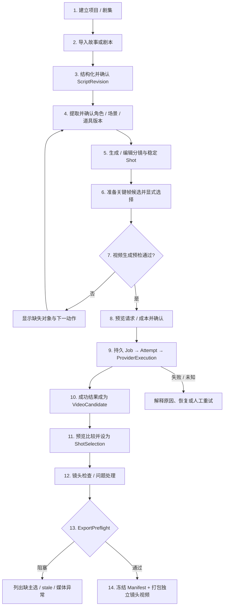
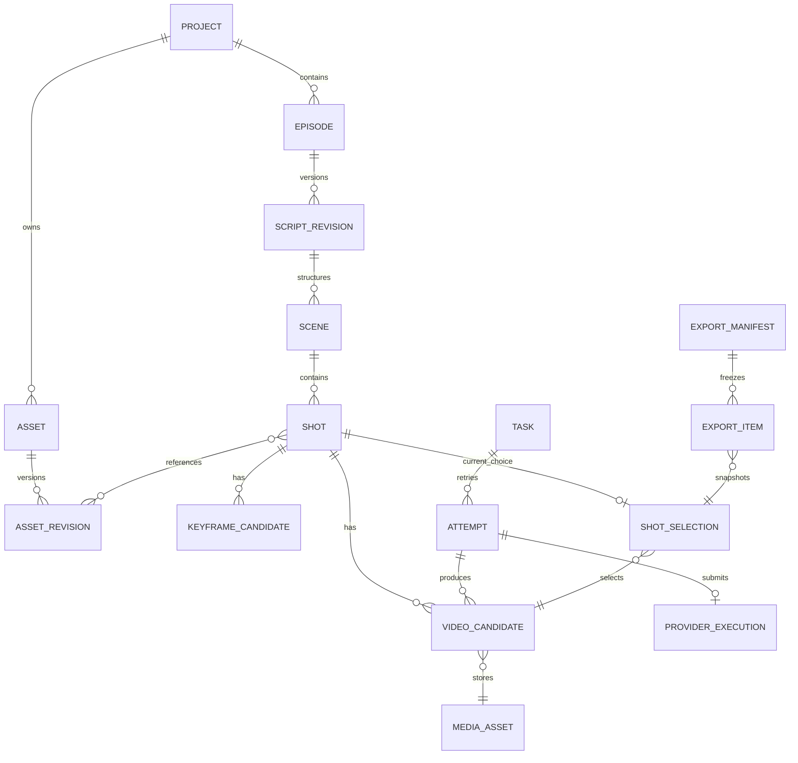
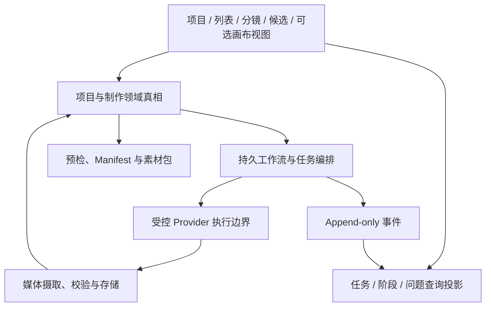

# 跨项目工作流模式与 Lanverse 产品决策

- 编号：RES-021
- 调研日期：2026-08-14
- 证据输入：VibeReels、即梦、LibTV 三组公开/授权只读产品证据，16 个 GitHub 固定提交样本
- 文档性质：跨样本研究结论与产品取舍，不是详细需求、技术设计或实施计划
- 范围决议状态：已被 2026-08-20 当前 Requirement 基线校准；证据和工程模式继续有效
- 快照当时边界：不做剪辑、时间线、配音、字幕、整集成片和商业运营；必须支持逐镜视频候选选择与有序素材包导出

## 0. 后续校准说明

当前正式 Requirement 已在保留逐镜候选、显式选择、任务恢复和不可变清单的前提下，增加基础画面、音频、字幕装配、审阅批准和不可变交付；完整专业 NLE、商业计费和无审阅自动发布仍不在范围内。

当前对象层级统一解释为：Project 是管理、记忆、权限和交付单元，ContentUnit 是叙事与顺序规划单元，Shot 是生成、候选选择、质检和局部返工单元。后续范围和优先级以当前 Requirement 为准，本文件不再使用“当前决议”覆盖正式需求。

## 1. 结论

Lanverse 应建设“以稳定镜头为生产单元的 AI 短剧制作工作台”，不是一句话黑盒成片器，也不是把通用节点图直接交给创作者。

本轮证据共同支持九个核心判断：

1. 项目、剧集、剧本版本、资产、镜头、候选和选择必须是稳定对象；
2. 上游内容进入生产前要形成可审阅版本，运行中的任务固定输入快照；
3. AI 图片/视频生成是高成本、长时间、可能出现未知提交的异步任务；
4. 同一镜头保留多个不可变候选，新结果不覆盖历史或人工主选；
5. 浏览候选、收藏候选和“当前用于导出”是不同语义；
6. 上游变化只使真实依赖的下游结果 stale，不删除历史、不重跑无关镜头；
7. 阶段“已有产物”“部分完成”“全部完成”“可导出”必须分开；
8. 空间画布和列表/分镜表必须同源，类型化节点承载领域对象，布局不是业务真相；
9. Agent/Skill 可以规划和调用受控命令，但高成本动作必须先预览并由用户确认。

最终闭环为：

```text
项目/剧集 → 剧本版本 → 资产版本 → 稳定镜头 → 关键帧候选/主选
→ 视频生成任务/Attempt → 视频候选 → 每镜唯一主选
→ 检查/问题 → 导出预检 → 有序独立视频 + 不可变 Manifest
```

## 2. 证据强度与适用范围

| 研究问题 | 主要一手证据 | 能支持的结论 | 不能支持的结论 |
| --- | --- | --- | --- |
| 逐镜工作台 | [VibeReels 只读研究](./002-VibeReels-只读产品研究.md)、[LumenX 模型](https://github.com/alibaba/lumenx/blob/f2a02e23171447c939e7d8e1386b24d17049bbf1/src/apps/comic_gen/models.py) | 镜头可聚合 Prompt、资源、任务、历史与选择 | 竞品后端架构、质量与 SLA |
| 多候选/主选 | [LumenX 模型](https://github.com/alibaba/lumenx/blob/f2a02e23171447c939e7d8e1386b24d17049bbf1/src/apps/comic_gen/models.py)、[wind-comic Pick](https://github.com/ChrisChen667788/wind-comic/blob/c83e1cf5e9b88fa8ac62bb737c79985a95243b8d/app/api/projects/%5Bid%5D/candidates/pick/route.ts)、[waoowaoo 候选 UI](https://github.com/waooAI/waoowaoo/blob/ce8edebf7cd2fe32c37a8d628aa3edc67f544586/src/components/ui/patterns/PanelCardV2.tsx) | 候选浏览与持久选择应分离，主选单数 | 固定九宫格是最佳方案 |
| 持久任务 | [Yihen-Drama 研究](./010-Yihen-Drama.md)、[waoowaoo Schema](https://github.com/waooAI/waoowaoo/blob/ce8edebf7cd2fe32c37a8d628aa3edc67f544586/prisma/schema.prisma)、[wind-comic Job](https://github.com/ChrisChen667788/wind-comic/blob/c83e1cf5e9b88fa8ac62bb737c79985a95243b8d/lib/repos/pipeline-job-repo.ts) | Task/Attempt/Event/心跳/入队诊断需分责 | 任一仓库已证明大规模分布式可靠性 |
| 供应商恢复 | [LumenX Pipeline](https://github.com/alibaba/lumenx/blob/f2a02e23171447c939e7d8e1386b24d17049bbf1/src/apps/comic_gen/pipeline.py)、[waoowaoo 启动恢复](https://github.com/waooAI/waoowaoo/blob/ce8edebf7cd2fe32c37a8d628aa3edc67f544586/src/instrumentation.ts) | 保存 external task ID；无法判断时保守停下 | 所有 Provider 都支持恢复轮询或取消 |
| 失效传播 | [drama-skills 记录级测试](https://github.com/worldwonderer/drama-skills/blob/bc040191458da3d5b6eaa7068da67527ae3c912f/tests/test_record_level_staleness.py)、[waoowaoo 分支重试测试](https://github.com/waooAI/waoowaoo/blob/ce8edebf7cd2fe32c37a8d628aa3edc67f544586/tests/integration/run-runtime/retry-failed-step.integration.test.ts) | 依赖精确到实际引用对象/分支，兄弟分支保留 | 用一个全项目 stale 布尔值即可 |
| 检查点 | [ViMax 会话/产物](https://github.com/HKUDS/ViMax/blob/05a48943878312d88fe5a016c12a9654940ecc43/agent_runtime/session_index.py)、[wind-comic Checkpoints](https://github.com/ChrisChen667788/wind-comic/blob/c83e1cf5e9b88fa8ac62bb737c79985a95243b8d/lib/pipeline-checkpoints.ts) | 中间产物应可检查、可续做 | 文件存在就等于有效 |
| 执行图 | [ComfyUI 提交与校验](https://github.com/Comfy-Org/ComfyUI/blob/7fe8a6138504f90ff7be82f3babf416da32876b1/server.py)、[waoowaoo Runtime](https://github.com/waooAI/waoowaoo/blob/ce8edebf7cd2fe32c37a8d628aa3edc67f544586/src/lib/run-runtime/service.ts) | 提交快照、预检、目标级执行与事件 | 通用节点图就是短剧产品 IA |
| 空间画布 | [即梦官方页](https://jimeng.jianying.com/)、[LibTV 官方页](https://www.liblib.tv/wappro)、[Toonflow README](https://github.com/HBAI-Ltd/Toonflow-app/blob/bc61ec7a1b5df31293b286981a5f4ad4635464ee/README.md) | 多素材同屏和空间组织有价值 | 公开页面证明了生产 DAG 或版本恢复 |
| Agent/Skill | [LibTV CLI](https://www.liblib.tv/cli)、[drama-skills README](https://github.com/worldwonderer/drama-skills/blob/bc040191458da3d5b6eaa7068da67527ae3c912f/README.md)、[Toonflow Agent](https://github.com/HBAI-Ltd/Toonflow-app/blob/bc61ec7a1b5df31293b286981a5f4ad4635464ee/src/agents/productionAgent/index.ts) | Agent 应使用受控工具，高成本前确认 | Agent 可拥有无限数据库/文件/密钥权限 |
| 素材包 | [LocalMiniDrama 研究](./005-LocalMiniDrama.md)、[dramai 研究](./008-dramai.md)、[LumenX Final Take](https://github.com/alibaba/lumenx/blob/f2a02e23171447c939e7d8e1386b24d17049bbf1/src/apps/comic_gen/models.py) | 导出需固定镜头顺序、选中项和清单 | 当前必须做剪辑或完整 MP4 |

这些结论按适用条件吸收。Stars、组织知名度、README 的“生产级/一键成片”描述和许可证标签不参与成熟度排序。

## 3. 当前产品范围

### 3.1 核心用户结果

创作者应能把一份故事/剧本变成一套可交接的逐镜视频素材：每个镜头有清楚意图与参考资产，可以多次生成视频，比较后选择唯一当前使用项，最后按固定顺序导出所有有效主选和 Manifest。

### 3.2 当前必须完成

- 项目与剧集组织；
- 剧本导入/分析、结构化与版本确认；
- 角色、场景、道具及其状态/版本；
- 分镜与稳定镜头身份、顺序和规格；
- 关键帧/视觉参考候选与选择；
- 生成前 readiness 和高成本确认；
- 持久视频生成任务、Attempt、失败/恢复；
- 同镜多个视频候选和唯一显式主选；
- 镜头检查、缺失/失败/stale 问题视图；
- 有序独立视频素材包和不可变 Manifest。

### 3.3 当前非目标

- 时间线、多轨剪辑、转场、调色、特效；
- 配音、声音设计、音乐、字幕、口型；
- FFmpeg 拼接、整集 MP4 或“一键成片”；
- 发布到社交平台；
- 计费、订阅、分销、社区、市场、模板交易等商业运营；
- 任意用户自定义可执行节点/Provider 脚本；
- 以通用工作流画布替代领域产品；
- 供应商质量排名或自动选片。

## 4. 目标产品工作流



任何阶段都允许用户回到上游修改，但修改产生新 Revision，并显示真实影响范围；不在后台悄悄覆盖或全量重跑。

## 5. 核心产品模块决策

### 5.1 项目与剧集工作台

**责任**：承载项目类型、画幅、剧集、成员、当前版本、整体完成度和任务问题汇总。

**关键决策**：

- 项目和 Episode 有稳定 ID；
- “漫剧/真人/3D”等制作形态若影响后续能力，提交前解释影响；不默认设计为永久不可逆；
- 阶段导航由领域完成度计算，不独立保存假状态；
- 项目首页优先展示阻塞、运行中任务、失败和下一动作，不堆商业数据。

**证据**：[VibeReels 只读研究](./002-VibeReels-只读产品研究.md)、[waoowaoo readiness](https://github.com/waooAI/waoowaoo/blob/ce8edebf7cd2fe32c37a8d628aa3edc67f544586/src/lib/novel-promotion/stage-readiness.ts)。

### 5.2 故事来源、剧本分析与 ScriptRevision

**责任**：保存来源、解析结构、场次/节拍/镜头文本和已接受剧本版本。

**关键决策**：

- 原始来源与 AI 分析结果分离；
- 分析结果先作为 Candidate/草稿，人工确认后发布新 ScriptRevision；
- 长篇材料按章节/事件/片段索引，不把整部原著作为可变 Prompt 背景；
- 运行中的下游 Job 固定提交时 ScriptRevision；
- 改稿创建新版本并计算受影响 Scene/Shot，不覆盖旧版本。

**证据**：[Toonflow 章节事件](https://github.com/HBAI-Ltd/Toonflow-app/blob/bc61ec7a1b5df31293b286981a5f4ad4635464ee/README.md)、[drama-skills README](https://github.com/worldwonderer/drama-skills/blob/bc040191458da3d5b6eaa7068da67527ae3c912f/README.md)。

### 5.3 角色、场景、道具与状态资产

**责任**：保存可复用身份、剧情状态、参考媒体、候选、主选和版本。

**关键决策**：

- Asset 身份与 AssetState/Revision 分离；
- “角色本人”与“第 3 集受伤/换装状态”不是同一个层级；
- 一个 Revision 可有多个媒体候选和一个当前选择；
- ShotSpec 显式引用准确 AssetRevision，不在任务完成时读取“最新资产”；
- 新增无关资产不使所有镜头 stale。

**证据**：[VibeReels 资产状态](./002-VibeReels-只读产品研究.md)、[drama-skills 记录级失效](https://github.com/worldwonderer/drama-skills/blob/bc040191458da3d5b6eaa7068da67527ae3c912f/tests/test_record_level_staleness.py)。

### 5.4 分镜与稳定镜头

**责任**：把剧本意图转换为可生产的 Scene/Shot 列表，保存顺序、视觉描述、动作、时长、参考槽位与状态。

**关键决策**：

- Shot ID 永久稳定，显示编号/排序键可变化；
- 插入、删除、重排不重用身份；
- 镜头规格和执行结果分开；
- 资源槽位有类型和顺序，引用版本化；
- 对关键场景可比较不同导演方案，普通镜头不强制固定宫格或多方案。

**证据**：[drama-skills Coverage Audition](https://github.com/worldwonderer/drama-skills/blob/bc040191458da3d5b6eaa7068da67527ae3c912f/skills/short-drama-storyboard/references/coverage-audition.md)、[VibeReels 资源槽位](./002-VibeReels-只读产品研究.md)。

### 5.5 关键帧与视觉探索

**责任**：生成/上传关键帧、比较候选、执行局部视觉修改并确定当前参考。

**关键决策**：

- 多图同屏、分层与局部修改可作为视觉工作区能力；
- 每次局部重绘/扩图/消除/抠图创建派生候选，保留源图；
- 临时画布内容只有显式“纳入镜头/保存为候选”后成为项目事实；
- 关键帧主选与视频主选分别存在；
- 领域对象与列表从 P0 起必须为后续画布保留同源投影能力；最小依赖/影响视图可以随 Agent 和局部修复进入早期切片，完整空间画布、多人布局和深度视觉编辑在核心闭环验证后再进入。

**证据**：[即梦官方智能画布](https://jimeng.jianying.com/)、[waoowaoo 候选 UI](https://github.com/waooAI/waoowaoo/blob/ce8edebf7cd2fe32c37a8d628aa3edc67f544586/src/components/ui/patterns/PanelCardV2.tsx)。

### 5.6 Readiness 与生成计划

**责任**：在高成本调用前验证目标可生成，说明缺失输入、调用数量、模型参数、预计成本和影响。

**关键决策**：

- Readiness 是服务端计算结果，不是用户手动勾选“已准备”；
- 返回阻塞对象 ID、字段、原因和下一动作；
- 区分“已有一个产物”“部分就绪”“本阶段完整”“导出就绪”；
- Agent 或批量操作先产出计划，用户确认后入队；
- 计划固定输入版本，确认后上游继续编辑不改变已提交任务。

**证据**：[VibeReels 资源审核](./002-VibeReels-只读产品研究.md)、[ComfyUI validate_prompt](https://github.com/Comfy-Org/ComfyUI/blob/7fe8a6138504f90ff7be82f3babf416da32876b1/execution.py)、[waoowaoo readiness 测试](https://github.com/waooAI/waoowaoo/blob/ce8edebf7cd2fe32c37a8d628aa3edc67f544586/tests/unit/novel-promotion/stage-readiness.test.ts)。

### 5.7 异步任务与任务中心

**责任**：创建、入队、执行、观察、取消、恢复和重试所有高成本 AI 动作。

**关键决策**：

- 先持久 Task/Attempt，再入队；
- 队列可由数据库重建，不能作为唯一真相；
- 每次 Provider 调用保存请求快照、Provider、模型、external task/request ID、用量和错误；
- 重试创建新 Attempt，不覆盖失败历史；
- Worker 使用 lease/heartbeat/运行 token，过期才回收；
- SSE/WS 只做投影，刷新/重连后从 API 重建；
- 任务中心按项目、剧集、镜头、类型和状态筛选，并提供明确下一动作。

**证据**：[waoowaoo Schema](https://github.com/waooAI/waoowaoo/blob/ce8edebf7cd2fe32c37a8d628aa3edc67f544586/prisma/schema.prisma)、[wind-comic Job](https://github.com/ChrisChen667788/wind-comic/blob/c83e1cf5e9b88fa8ac62bb737c79985a95243b8d/lib/repos/pipeline-job-repo.ts)、[MoneyPrinterTurbo State](https://github.com/harry0703/MoneyPrinterTurbo/blob/1f9f19c2021a68d04df228f33e9099a0c947f6f8/app/services/state.py)。

### 5.8 视频候选与 ShotSelection

**责任**：展示每次成功结果、比较/播放、记录质量信息并确定当前导出项。

**关键决策**：

- 每个成功 Attempt 产生独立 VideoCandidate；
- Candidate 保存媒体、输入/模型血缘、创建时间、错误后的补偿信息和 stale；
- 预览时的临时高亮不写入 Selection；
- 一个 Shot 同时最多一个当前 Selection，允许零个；
- 新 Candidate 不自动覆盖人工 Selection；
- 收藏/shortlist 若以后需要可以多选，但不能与主选复用一个布尔值；
- 删除已选 Candidate 必须阻断或要求用户显式清除主选；
- 并发选择以 expected revision 检测冲突；
- 上游变更后保留 Selection 指向的历史 Candidate，但标记需复核并默认阻断新导出。

**证据**：[LumenX 候选与 Final Take](https://github.com/alibaba/lumenx/blob/f2a02e23171447c939e7d8e1386b24d17049bbf1/src/apps/comic_gen/models.py)、[waoowaoo 候选确认](https://github.com/waooAI/waoowaoo/blob/ce8edebf7cd2fe32c37a8d628aa3edc67f544586/src/components/ui/patterns/PanelCardV2.tsx)、[wind-comic 服务端 Pick](https://github.com/ChrisChen667788/wind-comic/blob/c83e1cf5e9b88fa8ac62bb737c79985a95243b8d/app/api/projects/%5Bid%5D/candidates/pick/route.ts)。

### 5.9 检查、Issue 与决策

**责任**：发现缺失、连续性、内容和技术问题，记录解决过程，而不是自动替换结果。

**关键决策**：

- Review 绑定准确对象版本；
- 问题状态至少能表达 open/resolved/accepted-risk；
- 自动检查提供证据和建议，不能直接成为主选；
- 生成者与审查者的责任分开；
- 批量问题视图优先于在长页面逐卡寻找失败。

**证据**：[drama-skills 独立审查](https://github.com/worldwonderer/drama-skills/blob/bc040191458da3d5b6eaa7068da67527ae3c912f/README.md)、[wind-comic 质量模块研究](./016-wind-comic.md)。

### 5.10 素材包导出

**责任**：冻结一次交付所需的镜头顺序、选择和媒体，并打包独立视频文件。

**关键决策**：

- 先运行 ExportPreflight，不在压缩中途才发现缺项；
- 每个必要镜头必须有唯一有效主选，除非用户明确选择“部分导出”模式且 Manifest 标出缺口；
- Manifest 绑定项目/剧本版本、镜头稳定 ID、显示序号、Candidate/Selection/MediaAsset ID、文件名、MIME、时长、尺寸、校验信息和 stale 状态；
- Manifest 与文件集合一次发布，不能出现成功清单指向缺失文件；
- 导出历史不可变；项目后续改动不改变旧包；
- 不拼接、不加入音频/字幕/时间线。

**证据**：[LocalMiniDrama 研究](./005-LocalMiniDrama.md)、[dramai 研究](./008-dramai.md)、[LumenX Final Take](https://github.com/alibaba/lumenx/blob/f2a02e23171447c939e7d8e1386b24d17049bbf1/src/apps/comic_gen/models.py)。

## 6. 核心对象关系



这是研究得出的责任关系，不是数据库表设计。详细字段、聚合边界和接口仍需在正式 Design 中决定。

## 7. 状态语义决策

### 7.1 生产对象状态

生产对象至少需要区分：

- `draft`：仍可编辑，未成为正式下游输入；
- `accepted/current`：当前被项目采用的版本；
- `stale`：历史仍存在，但上游依据已变化；
- `missing/blocked`：必要事实或媒体缺失；
- `superseded`：被新版本取代，不等于删除。

这些状态不能与任务 queued/running/failed 混为一组。

### 7.2 任务状态

从样本失败路径综合，Lanverse 的产品语义应能表达：

- `queued`：已持久化、等待认领；
- `running`：Worker 持有有效租约；
- `waiting_provider`：外部任务已提交，等待结果；
- `succeeded`：该 Attempt 成功产生预期产物；
- `failed`：已确认失败，并有错误类别/下一动作；
- `cancel_requested`：用户要求取消，尚未确认；
- `cancelled`：本地/供应商已确认终止；
- `unknown`：请求可能已被供应商接受，但无法确认结果；
- `blocked`：恢复或冲突需要人工处理。

具体内部状态可更细，但 UI 不能把 `unknown` 冒充 failed 后自动重跑。

### 7.3 阶段汇总

每阶段需要四个互不替代的维度：

1. 是否已经开始；
2. 完成对象数/必要对象总数；
3. 是否有失败、unknown、blocked 或 stale；
4. 下一阶段/导出是否满足门禁。

[waoowaoo 的 `has any` 规则](https://github.com/waooAI/waoowaoo/blob/ce8edebf7cd2fe32c37a8d628aa3edc67f544586/src/lib/novel-promotion/stage-readiness.ts) 是“已开始”的参考，不能直接成为“已完成”。

## 8. 失败路径与产品行为

| 场景 | 错误做法 | Lanverse 决策 | 主要证据 |
| --- | --- | --- | --- |
| 入队失败 | 页面仍显示生成中 | Task 保持可查询，标 scheduling/enqueue 失败并可重试 | [MoneyPrinterTurbo WebUI](https://github.com/harry0703/MoneyPrinterTurbo/blob/1f9f19c2021a68d04df228f33e9099a0c947f6f8/app/services/webui_task.py) |
| 队列数据丢失 | 任务永远 queued | 从数据库重建队列并记录每次入队错误 | [waoowaoo instrumentation](https://github.com/waooAI/waoowaoo/blob/ce8edebf7cd2fe32c37a8d628aa3edc67f544586/src/instrumentation.ts) |
| Worker 崩溃 | 启动时重置所有 running | 仅回收租约/心跳过期任务 | [wind-comic Job](https://github.com/ChrisChen667788/wind-comic/blob/c83e1cf5e9b88fa8ac62bb737c79985a95243b8d/lib/repos/pipeline-job-repo.ts) |
| Provider 已收单、本地超时 | 直接重提 | 保存 external ID，进入 waiting/unknown，先查询对账 | [LumenX Pipeline](https://github.com/alibaba/lumenx/blob/f2a02e23171447c939e7d8e1386b24d17049bbf1/src/apps/comic_gen/pipeline.py)、[waoowaoo instrumentation](https://github.com/waooAI/waoowaoo/blob/ce8edebf7cd2fe32c37a8d628aa3edc67f544586/src/instrumentation.ts) |
| 重复点击/回调 | 产生重复扣费或候选 | 业务 dedupe key + ProviderExecution 唯一约束；重复事件幂等 | [waoowaoo Task Schema](https://github.com/waooAI/waoowaoo/blob/ce8edebf7cd2fe32c37a8d628aa3edc67f544586/prisma/schema.prisma) |
| 批量任务部分失败 | 跳过失败镜头宣告完成 | 保留成功候选；汇总 partial，列出失败目标 | [Open-AI-Micro-Drama 反例](./009-Open-AI-Micro-Drama-Generator.md) |
| 重试一个分支 | 全项目重跑 | 预览并只失效真实下游，保留兄弟分支 | [waoowaoo retry test](https://github.com/waooAI/waoowaoo/blob/ce8edebf7cd2fe32c37a8d628aa3edc67f544586/tests/integration/run-runtime/retry-failed-step.integration.test.ts) |
| 状态/清单半写 | 清空或留下损坏文件 | 原子发布，保留损坏证据；不能决定时 blocked | [ViMax SessionIndex](https://github.com/HKUDS/ViMax/blob/05a48943878312d88fe5a016c12a9654940ecc43/agent_runtime/session_index.py)、[drama-skills recovery](https://github.com/worldwonderer/drama-skills/blob/bc040191458da3d5b6eaa7068da67527ae3c912f/tests/test_recovery_and_package.py) |
| SSE 断线/乱序 | 只信客户端事件 | 重连回源 API，事件按目标/序号去重 | [waoowaoo useSSE](https://github.com/waooAI/waoowaoo/blob/ce8edebf7cd2fe32c37a8d628aa3edc67f544586/src/lib/query/hooks/useSSE.ts) |
| 主选候选删除 | 自动选择最后一个 | 阻断删除或显式清除 Selection；绝不静默替换 | [LumenX 研究](./003-LumenX.md) |
| 导出中缺文件 | 跳过继续打包 | 预检失败或显式部分导出，Manifest 记录缺口 | [dramai 研究](./008-dramai.md) |

## 9. 空间画布产品决策

### 9.1 采用的五条原则

1. **空间视图与列表视图同源**：切换视图不复制业务数据；
2. **类型化领域节点**：Project/Asset/Shot/Candidate/Export 等有明确类型和允许动作；
3. **布局不是业务真相**：位置、缩放、视觉分组和装饰连线独立保存；
4. **工作流状态可观察**：节点显示实际 Job/Attempt、错误、stale 和下一动作；
5. **高成本动作预览确认**：Agent/批量生成先显示目标、输入、模型、数量、成本估计和影响。

证据来源是 [即梦公开画布](https://jimeng.jianying.com/)、[LibTV 官方工作流](https://www.liblib.tv/wappro)、[Toonflow 研究](./015-Toonflow-app.md) 和 [ComfyUI 研究](./014-ComfyUI.md)。前三者证明空间组织的产品价值；只有固定仓库代码能支撑任务/执行结论，不能从公开页面推断 DAG。

### 9.2 当前优先级

画布是同源工作区视图，不是核心数据前置条件。首个可验证闭环应先用项目导航、剧本/资产列表、分镜表/镜头卡和候选播放器完成。领域对象与 ViewState 从一开始分开，使后续画布无需迁移业务真相；是否把完整无限画布列为首发，交给原型可用性测试，而不是竞品功能数量决定。

## 10. Agent 与 Skill 产品决策

### 10.1 允许的职责

- 从来源提出结构化剧本草案；
- 识别角色/场景/道具候选；
- 为镜头提出分镜、Prompt 和资源引用建议；
- 解释 readiness 阻塞和失败原因；
- 生成批量操作计划；
- 调用经过权限、版本与参数校验的领域命令。

### 10.2 禁止的职责

- 绕过用户确认直接发起高成本视频生成；
- 直接读取/写入任意文件、数据库或密钥；
- 自动把生成结果设为主选；
- 以聊天记忆覆盖 Script/Asset/Shot 正式版本；
- 静默删除 stale/失败历史；
- 因“计划完成”宣告导出完成；
- 安装未审计任意可执行 Skill/节点/Provider 代码。

[drama-skills](https://github.com/worldwonderer/drama-skills/blob/bc040191458da3d5b6eaa7068da67527ae3c912f/README.md) 明确采用“Prompt 先落地、确认后才生成”的成本保护；[LibTV CLI](https://www.liblib.tv/cli) 和 [Toonflow Agent tools](https://github.com/HBAI-Ltd/Toonflow-app/blob/bc61ec7a1b5df31293b286981a5f4ad4635464ee/src/agents/productionAgent/tools.ts) 说明 Agent/Skill 作为入口与类型化工具的产品方向。

## 11. 研究支持的逻辑架构边界

本研究支持以下逻辑责任，不直接决定框架、部署单元或微服务：



责任约束：

- 领域层不保存供应商专有状态作为核心业务枚举；
- Provider 边界将外部状态映射为 Lanverse Task/Attempt/Execution；
- Media 层保存文件事实，不保存“是否主选”的创作决议；
- 工作流层不以 UI 画布布局作为执行输入；
- 查询/实时层可重建，不成为唯一真相；
- Export 只读固定版本与 Selection，不修改生产对象。

是否先采用模块化单体、独立 Worker、哪种数据库/队列/对象存储，应在正式 Architecture Design 中结合团队、负载和现有约束决定，不能由 GitHub 项目的技术栈投票决定。

## 12. 非功能性产品约束

本轮不凭竞品数据虚构 SLA 数字，但可确定以下必须可验收的性质。

### 12.1 持久性与恢复

- 页面刷新、客户端断线、应用/Worker 重启后，项目、任务、Attempt、候选和主选可从持久事实恢复；
- 已获 Provider task ID 的任务优先恢复查询，不重复提交；
- 队列丢失可从数据库补回；
- 运行中任务只因租约/心跳过期被回收；
- Manifest 和多对象版本发布不可出现半完成。

### 12.2 一致性与并发

- 同一 Shot 同时最多一个当前 Selection；
- 并发选择、改稿和删除使用 expected revision 检测冲突；
- 重复请求/回调幂等；
- 新候选不能覆盖历史或当前主选；
- stale 计算可解释到上游版本和受影响对象。

### 12.3 可观察性

- 每个长任务可查询目标、阶段、Attempt、最近事件、错误类别和下一动作；
- 用户日志与内部诊断分层，敏感信息脱敏；
- 项目级汇总能看到失败、unknown、blocked、stale 和缺主选数；
- 实时事件丢失不影响最终状态查询。

### 12.4 安全与隐私

- 所有 Project/Asset/Task/Candidate/Selection/Export 强制 Workspace/项目权限；
- 上传和远程媒体经过类型、大小、路径/URL 和内容安全校验；
- Provider 密钥不进入浏览器、Prompt、任务 Payload、事件或导出；
- 下载/预览使用受限访问；
- Agent、Skill 和工作流节点均为服务端白名单能力；
- 真人肖像、版权来源、敏感素材和第三方处理条款另行形成治理需求。

### 12.5 性能与可用性

- 大项目采用剧集/镜头分页或虚拟化，不能靠无限长页面；
- 并发按用户/项目/Provider 能力限流；
- 候选缩略图与视频预览按需加载；
- 批量操作显示目标数量、局部进度和部分失败，不以单一全局 Spinner 遮蔽；
- 画布若进入首发，需用真实规模项目验证交互、内存和可访问性。

### 12.6 可追溯与交付完整性

- 每个 Candidate 可回溯输入 Revision、Prompt/参数、参考资产、ProviderExecution 与媒体；
- 每次 Selection 可回溯选择者和被选 Candidate；
- 每个 Export 可回溯固定 Selection/MediaAsset 集合；
- 失败/stale/被取代历史保留，不为“界面整洁”删除证据。

## 13. 优先级建议

### 13.1 P0：逐镜可交付闭环

1. Project/Episode 与成员权限；
2. Story/ScriptRevision 和结构化场次/镜头；
3. 角色/场景/道具 AssetRevision；
4. Storyboard/ShotSpec 与稳定镜头顺序；
5. 关键帧候选/主选；
6. 生成 Readiness、请求预览和用户确认；
7. 持久 Task/Attempt/ProviderExecution、任务中心和恢复；
8. VideoCandidate 与唯一 ShotSelection；
9. 镜头问题/检查和项目完整度；
10. ExportPreflight、Manifest 和独立镜头视频包。

### 13.2 P1：提升创作效率但不改变核心真相

- 空间画布作为同源视图；
- Agent 批量规划与受控执行；
- 收藏/shortlist、候选对比增强；
- Workspace 内工作流模板；
- 更精细的自动检查和影响预览；
- 长篇事件索引与跨集资产状态管理。

### 13.3 延后或排除

- 社区工作流市场与公开分享；
- 商业计费/订阅/分销；
- 任意自定义节点与脚本；
- 配音、字幕、音乐、口型；
- 时间线、剪辑、合成和整集成片；
- 一键发布到平台。

P1 不是预建承诺。只有 P0 在真实项目中闭环、用户问题明确、Design 通过后才进入实现。

## 14. 跨样本明确拒绝的模式

| 拒绝模式 | 风险 | 反例来源 |
| --- | --- | --- |
| 最新成功结果自动主选 | 覆盖人工决策，导出漂移 | [LumenX 研究](./003-LumenX.md) |
| 文件/URL 存在即检查点成功 | 旧版本、半文件、不可读媒体被复用 | [ViMax 研究](./011-ViMax.md) |
| 任一镜头有视频即阶段完成 | 长项目被错误标 ready | [waoowaoo 研究](./020-waoowaoo.md) |
| 全局运行中覆盖全部阶段状态 | 用户不知道真实目标和完成度 | [waoowaoo 导航](https://github.com/waooAI/waoowaoo/blob/ce8edebf7cd2fe32c37a8d628aa3edc67f544586/src/app/%5Blocale%5D/workspace/%5BprojectId%5D/modes/novel-promotion/hooks/useWorkspaceStageNavigation.ts) |
| 重试时物理删除下游历史 | 审计、比较和恢复证据丢失 | [waoowaoo Retry](https://github.com/waooAI/waoowaoo/blob/ce8edebf7cd2fe32c37a8d628aa3edc67f544586/src/lib/run-runtime/service.ts) |
| 启动时无条件重置所有 processing | 多实例可能双跑 | [waoowaoo instrumentation](https://github.com/waooAI/waoowaoo/blob/ce8edebf7cd2fe32c37a8d628aa3edc67f544586/src/instrumentation.ts) |
| 固定九宫格/固定机位套餐 | 把导演方法硬编码、增加无效成本 | [wind-comic candidate grid](https://github.com/ChrisChen667788/wind-comic/blob/c83e1cf5e9b88fa8ac62bb737c79985a95243b8d/lib/candidate-grid.ts) |
| 三态任务 + done 回调 | 无法表达入队、取消、未知、恢复与 Attempt | [Toonflow taskRecord](https://github.com/HBAI-Ltd/Toonflow-app/blob/bc61ec7a1b5df31293b286981a5f4ad4635464ee/src/utils/taskRecord.ts) |
| 通用节点图直接作为领域模型 | 创作者面对供应商/执行细节，布局与业务耦合 | [ComfyUI 研究](./014-ComfyUI.md) |
| 内存任务/历史作为唯一真相 | 重启丢失、无法恢复 | [Open-AI-Micro-Drama 研究](./009-Open-AI-Micro-Drama-Generator.md)、[ComfyUI PromptQueue](https://github.com/Comfy-Org/ComfyUI/blob/7fe8a6138504f90ff7be82f3babf416da32876b1/execution.py) |
| 失败镜头静默跳过后宣告完成 | 交付缺失不可见 | [dramai 研究](./008-dramai.md)、[Open-AI-Micro-Drama 研究](./009-Open-AI-Micro-Drama-Generator.md) |
| Agent 未确认直接生成 | 误用输入、重复扣费、不可逆外部动作 | [drama-skills README](https://github.com/worldwonderer/drama-skills/blob/bc040191458da3d5b6eaa7068da67527ae3c912f/README.md) |

## 15. 待验证问题

研究不能替代以下产品/技术验证：

1. 目标用户更偏剧本主导、分镜主导还是视觉画布主导；
2. 一部真实项目的剧集、镜头、候选和并发规模；
3. 关键帧是否必须双帧/多参考，哪些模型能力真正稳定；
4. Provider 提交、轮询、取消、回调、幂等和计费语义；
5. `unknown` 任务的人工对账路径；
6. 上游改稿时用户期望自动 stale、手工确认还是分支版本；
7. 允许部分导出的具体规则与 Manifest 表达；
8. 画布相对分镜表是否显著提高真实任务完成率；
9. Agent 计划预览需要展示多少技术细节；
10. 大项目视频预览、对象存储、打包和恢复容量；
11. 真人/版权素材、内容安全和 Provider 数据处理要求；
12. 多人同时改稿、选片与导出时的冲突体验。

这些问题应通过创作者访谈、可用性原型、Provider PoC、故障注入和真实素材包验收逐项关闭。

## 16. 最终产品决议摘要

| 主题 | 决议 |
| --- | --- |
| 产品形态 | 逐镜 AI 短剧制作工作台，不是一句话成片器 |
| 最小生产单元 | 稳定 Shot |
| AI 结果 | 不可变 Candidate，不覆盖历史 |
| 导出使用项 | 每镜 0..1 个显式 ShotSelection |
| 高成本动作 | 预检 + 计划预览 + 用户确认 |
| 工作流 | 持久 Run/Step/Attempt/Event；队列可重建 |
| 失败恢复 | external ID 对账、unknown 保守处理、精确分支重试 |
| 版本变化 | 真实依赖 stale，保留历史，不物理删除 |
| 阶段状态 | started / partial / complete / export-ready 分开 |
| 画布 | 与列表同源、节点类型化、布局非业务真相 |
| Agent | 受控命令与最小权限，不自动生成/主选 |
| 导出 | 有序独立视频 + 不可变 Manifest，不拼成片 |
| 快照当时非目标 | 剪辑、音频、成片、商业运营、社区市场；当前范围以 Requirement 为准 |
| 开源使用 | 只参考产品/工作流模式，不借用或移植代码 |

这组决议是后续需求、架构和验收文档的研究输入。2026-08-20 当前 Requirement 已通过本文件第 0 节记录范围校准；未来继续作出不同取舍时，仍必须记录新证据、适用条件和迁移影响，而不是静默偏离。
