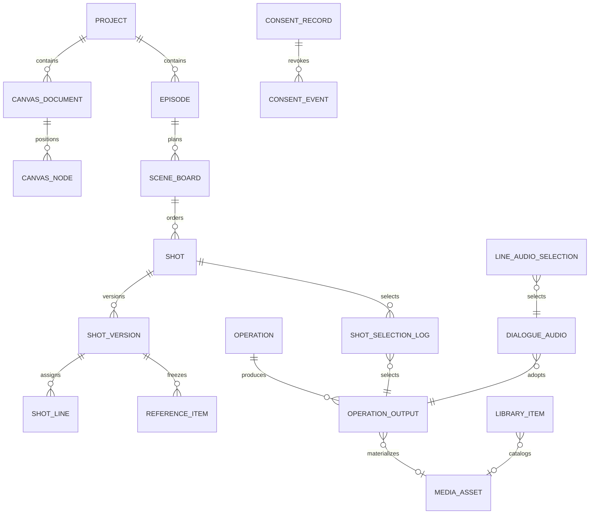

# 浮光页面数据库设计

对应[139条页面功能需求](../requirement/浮光页面/index.md)。核验基线为 `2793f811`；当前结构来自 `backend/db/schema.sql`。本文是逻辑与增量设计，**不提供第二份执行DDL，不改Schema，不执行迁移**。现有字段只列页面用到的投影；完整类型、默认值、约束、触发器和ACL以Schema为准。拟新增表/列须在该模块实现、评审和合同测试同步完成时才进入Schema。

## 1. 模块与表级映射

| 数据组     | 页面      | 当前结构与关键事实                                                                                                               | 本轮设计增量                                                  |
| ---------- | --------- | -------------------------------------------------------------------------------------------------------------------------------- | ------------------------------------------------------------- |
| DB-ID      | PG-08～12 | `identity.user`、`workspace.organization`；角色、状态、password_hash、must_change_password、session_epoch、revision；会话在Redis | 公开认证装配、本人资料、会话目录，不重复建users/session SQL表 |
| DB-INV     | PG-09     | 当前无邀请/公开注册合同                                                                                                          | 仅D-01选择邀请激活后增加一次性邀请表                          |
| DB-PREF    | PG-11     | 工作区 `workspace.prompt_customization` 不是个人偏好                                                                             | 条件性用户偏好；头像和个人提示词作用域待D-08/09               |
| DB-PRJ     | PG-01     | `workspace.project`、project_folder/placement、project_copy_job及回执；name、aspect_ratio、style、revision、cover_asset_id       | 不建首页卡片表；1:1通过D-02后才改CHECK/DTO                    |
| DB-SCR     | PG-01/04  | `script_source`、script_version、episode、episode_structure、scene、dialogue_line、导入/对象意图与回执                           | 复用已确认版本；不由mock集号生成正式ID                        |
| DB-BIB     | PG-06     | character/location/prop头与不可变版本、确认记录；look/look_version、reference_version、voice_version                             | 以现有版本集合表达参考；独立slot锁定若采纳须专项设计          |
| DB-MED     | PG-07     | library/folder/item、media_asset/rendition、upload_request、transfer/purge/package任务和对象回执                                 | 常驻详情只新增读组合，不新增素材副本表                        |
| DB-CNV     | PG-02     | canvas.document/node/edge/command_log，文档revision和永久复制回执                                                                | 正式业务节点引用与命令接线；不在config复制镜头事实            |
| DB-SHOT    | PG-03/04  | 当前Schema无storyboard表；DES-21/25已有概念规划                                                                                  | 细化场、镜头、版本、台词分配、参考及选择历史                  |
| DB-AUD     | PG-03     | script.dialogue_line已有；audio表未建                                                                                            | 配音候选、当前选择与逐句参数版本                              |
| DB-GEN     | PG-02～06 | operation/batch/input/output/event/provider_call；billing budget/reservation/ledger                                              | 复用发送权、冻结输入与费用；增加业务target绑定适配            |
| DB-CONSENT | PG-06/07  | media_asset已有contains_real_person/consent_record_id；无consent_record表                                                        | 细化不可变授权材料与撤销事实                                  |
| DB-LIN     | PG-02～06 | 概念有dependency/stale_mark，Schema尚无表                                                                                        | 精确版本依赖和过期投影                                        |
| DB-ANA     | PG-05     | Operation、账本、分集等基础事实有；完整镜头/配音尚缺                                                                             | 首版只读聚合；不为了图表新增重复计数表                        |
| DB-CAT     | PG-13/14  | provider/credential、capability、model_profile/version、price_rule_version                                                       | 复用现有版本与active唯一约束；先测后换是另一待决策流程        |
| DB-AUDIT   | PG-15     | audit.audit_log、infra.outbox/processed_event；分区与受限写权限                                                                  | 查询/导出和索引按实际执行计划校验                             |
| DB-HEALTH  | PG-16     | Operation/Outbox事实、Prometheus指标                                                                                             | 无新业务表；有界短缓存，缺失显式为unknown                     |
| DB-NONE    | PG-17/18  | DESIGN.md、主题变量、组件代码                                                                                                    | 无数据库                                                      |

DB-GEN、DB-CAT、DB-MED已有较完整结构不等于供应商真实执行、费用或媒体处理已验收；以BACKLOG和测试证据为准。

## 2. 关系与所有权

此图含规划表，不能据图断言已建表。同schema内部关系采用外键；跨schema以稳定ID和owning接口校验，不直接跨模块改表。组织/项目从已授权父对象推导并复核，不能采信请求体自行指定的组织。新建同schema子表外键用含scope的复合键约束，避免对象ID合法但项目错配。

## 3. 已有字段如何满足页面

| 现有对象                      | 页面字段映射                                                                               | 约束与不可误用点                                                           |
| ----------------------------- | ------------------------------------------------------------------------------------------ | -------------------------------------------------------------------------- |
| identity.user                 | login_name citext、display_name text、role/status text、revision integer                   | 组织内登录名唯一；最后管理员保护要组织级串行化；不返回password_hash        |
| workspace.project             | name、aspect_ratio、style_type/subtype、status、cover_asset_id、revision                   | 当前比例只有9:16/16:9；回收为is_delete，归档为status，不混为一种状态       |
| bible头/版本                  | current_version_id、confirmed_version_id；content JSON、content_sha256                     | UI“未确认”比较当前与确认版本；current和confirmed不能被生成任务直接同时修改 |
| bible.reference_version       | look_version_id、position、role、media_asset_id/revision/sha256/bytes、rendition_id/sha256 | 是冻结的媒体证据；新引用使用普通有效读，历史使用专门冻结证据读             |
| media.library_item            | title、category、tags、favorite、folder_id、plain_text或asset_id、catalog_state、revision  | 文本与资产互斥按当前CHECK；库级favorite不是每用户收藏                      |
| media.media_asset             | object_key、kind/status、byte_size/sha256、duration_ms、moderation_status、来源模型        | 签名URL不是持久字段；ready与审核通过独立；只有可用素材可进入新正式引用     |
| canvas.node                   | ref_type/ref_id、config、x/y、size、last_operation_id                                      | config保存本节点配置；不缓存另一份shot/character正式可变内容               |
| operation.operation           | target、冻结模型/价格版本、input_hash、status、quote/settled_micros、source_context        | 原任务与原发送键恢复；completed前须私有媒体接管；状态不等于前端播放状态    |
| operation.output              | seq_no、kind、media_asset_id/json_payload、moderation_status                               | 候选不是当前选定；不能在output上加一个跨业务全局selected布尔值             |
| catalog.model_profile_version | modes、limits、param_schema、provider_model_id、version_no                                 | 发布后不可变；编辑生成新版本，不改历史Operation的引用                      |
| catalog.provider_credential   | ciphertext bytea、key_id、last4、status、last_test_result                                  | active部分唯一索引；API不返回ciphertext；测试结果不等于凭据激活事务        |
| billing账本                   | amount_micros、operation/episode/shot、region/currency/fx                                  | bigint微元；更正加adjust记录，不能改历史分录来匹配图表                     |
| audit.audit_log               | actor、action、object、before/after、request/trace、create_time                            | before/after是脱敏摘要；分区主键含时间；应用无修改历史内容权               |

现有name/长度、枚举与必填性应从DTO/Schema读取，不根据本表生成代码。

## 4. 拟新增：DB-SHOT（分镜与镜头）

以下全部为规划。延续[DES-21](21-分镜生成与镜头编辑.md)、[DES-25](25-多候选与选定.md)的表名和头＋版本模式。共同列：UUID主键；项目级含 `org_id/project_id`；头表 `revision bigint NOT NULL DEFAULT 1`、`is_delete boolean NOT NULL DEFAULT false`、`create_time/update_time timestamptz`；不可变内容与日志只追加。时间为UTC、时长整数毫秒；nullable明确列出，不用空字符串替代未知。

### 4.1 头表和版本字段

| 表                      | 字段与类型                                                              | 必填/默认                                | 规则                                                           |
| ----------------------- | ----------------------------------------------------------------------- | ---------------------------------------- | -------------------------------------------------------------- |
| storyboard.scene_board  | episode_id uuid、scene_id uuid、source_structure_id uuid                | 必填                                     | 同一当前场只一条active board；绑定已确认结构版本               |
| scene_board             | confirmed_at timestamptz、confirmed_by uuid、confirmed_revision bigint  | 可空且同时为空/同时有值                  | 场内容变更取消当前确认状态但保留审计；重确认须台词完整         |
| storyboard.shot         | scene_board_id uuid、position bigint                                    | 必填                                     | active `(scene_board_id,position)`唯一；间隔1024，耗尽场内重排 |
| shot                    | current_version_no integer                                              | 必填，初值1                              | 指向同一shot的存在版本；版本创建后更新指针同事务               |
| shot                    | selected_frame_output_id/selected_take_output_id uuid                   | 可空                                     | 跨模块引用经owning验证；不因新候选自动改选                     |
| shot                    | selection_frame_version_no/selection_take_version_no integer            | 与对应output同时为空或有值               | 记录选定针对的镜头版本，可明确计算过期                         |
| shot                    | progress text                                                           | 必填，初始not_started                    | 可重建投影；与stale/missing_refs独立，不能覆盖内容状态         |
| storyboard.shot_version | shot_id uuid、version_no integer、previous_version_no integer           | 前两必填，previous首版空                 | `(shot_id,version_no)`唯一；首版1，后续单调增加                |
| shot_version            | description text、duration_ms integer                                   | 必填                                     | description建议1–4000字；时长1000–60000，再与模型能力求交集    |
| shot_version            | shot_size/camera_angle/camera_move text                                 | 必填                                     | 枚举由分镜领域类型统一定义，API与UI共用                        |
| shot_version            | generation_mode text、params jsonb、prompt_override text                | 前两必填，params默认空对象；override可空 | JSON按模式与模型版本校验；空override与无override区分           |
| shot_version            | origin text、change_note text、created_by uuid、create_time timestamptz | 必填；origin=user/ai/agent               | 用户/Agent/AI结果有来源；任务输出不得改旧版本                  |
| shot_version            | source_operation_id uuid                                                | 仅AI/Agent来源需要                       | 来源输出与冻结输入可追溯；普通用户修改可空                     |

镜号按场序/position计算，不当主键持久化。`progress`排序建议：有在途任务→generating；无在途且当前有效选定→selected；无选定且有可用候选→awaiting_selection；仅最近失败且无候选→failed；否则not_started。曾选定但新版本过期仍显示selected并独立stale标记，不能假装重新生成完成。

### 4.2 关联和历史

| 表                            | 字段与类型                                                                                                                                    | 唯一/外键/检查                                              | 用途                                             |
| ----------------------------- | --------------------------------------------------------------------------------------------------------------------------------------------- | ----------------------------------------------------------- | ------------------------------------------------ |
| storyboard.shot_line          | shot_id uuid、shot_version_no int、line_key uuid、position int                                                                                | 同版本line_key唯一；同schema FK→shot_version                | 固定台词顺序；line_key跨script通过结构查询核验   |
| storyboard.reference_item     | id、shot_id、shot_version_no、seq_no int、role text、ref_type text、ref_id uuid、ref_version text、media_asset_id uuid可空、frozen_meta jsonb | 版本内seq_no唯一；role/type闭集；text引用与媒体引用字段互斥 | 固定参考身份/用途/版本/摘要，不保存签名URL       |
| storyboard.shot_selection_log | id、shot_id、slot text、old_output_id uuid可空、output_id uuid、shot_version_no int、actor_id、request_key uuid、create_time                  | slot=frame/take；request_key+shot+slot唯一；只追加          | 谁在何时改选什么；更正再追加，不改历史           |
| storyboard.shot_template      | id、org_id、name、content jsonb、revision、is_delete、时间                                                                                    | 模板枚举/时长同版本校验；同org查询                          | P1；应用是复制参数形成新镜头版本，模板修改不传播 |

场确认时跨版本台词完整性不能由普通CHECK完成：锁scene_board，读取已确认结构的台词键，核对每句一且仅一落在当前active镜头版本；事务内再核验引用和场revision，随后记确认和Outbox。PostgreSQL的行CHECK不能保证跨行集合规则，应使用锁、唯一约束和应用事务配合。[PostgreSQL约束文档](https://www.postgresql.org/docs/current/ddl-constraints.html)

### 4.3 索引与查询

| 查询                 | 拟定索引                                                                                                | 验证                                               |
| -------------------- | ------------------------------------------------------------------------------------------------------- | -------------------------------------------------- |
| 分集当前镜头按场排序 | scene_board `(project_id,episode_id,scene_id)`；shot `(scene_board_id,position,id) WHERE NOT is_delete` | 150镜头单次分页查询，不逐镜N+1                     |
| 详情/版本历史        | shot_version UNIQUE `(shot_id,version_no)`                                                              | detail+references+lines有界批量读取                |
| 候选与当前选定       | 复用operation `(target_type,target_id,create_time)`；output `(operation_id,seq_no)`                     | 使用EXPLAIN验证实际索引选择，新增前先测            |
| 引用检查             | reference_item `(media_asset_id)`、`(ref_type,ref_id,ref_version)`                                      | 只把当前正式引用计入普通删除阻塞；历史证据单独保留 |
| 选择历史             | selection_log `(shot_id,create_time DESC,id DESC)`                                                      | keyset无重无漏                                     |

## 5. 拟新增：DB-AUD、DB-CONSENT、DB-LIN

| 表/字段组                  | 字段与类型（除共同列外）                                                                                                                                                         | 约束、事务与读取                                                                                          |
| -------------------------- | -------------------------------------------------------------------------------------------------------------------------------------------------------------------------------- | --------------------------------------------------------------------------------------------------------- |
| audio.dialogue_audio       | project/episode_id uuid；line_key uuid；source_structure_id uuid；operation_output_id uuid；media_asset_id uuid；voice_snapshot jsonb；tts_params jsonb；origin text             | 不可变候选；output唯一；音频须同项目、ready且审核通过；禁止拿filename当身份                               |
| audio.line_tts_override    | episode_id、line_key；revision；voice_source jsonb；speed numeric；emotion text；其它参数jsonb                                                                                   | 按模型schema校验范围；覆盖值仅限本句；建议改名版本记录前先与DES-32统一，不建第二套voice表                 |
| audio.line_audio_selection | episode_id、line_key；dialogue_audio_id；revision；selected_by；selected_at                                                                                                      | 每句一个当前指针；同schemaFK到候选；更换同事务审计/依赖事件；历史选择通过审计/不可变事件保留              |
| media.consent_record       | id、org/project_id、subject_label text、kind text、purposes text[]、evidence_asset_id uuid、valid_from/valid_until timestamptz、declarant_id、declaration_version text、revision | 原始声明只追加；kind=image/voice/both；期限合法；证据为同项目私有资产；具体期限由产品决定，不编造法律结论 |
| media.consent_event        | id、consent_record_id、event_type text、reason text、actor_id、occurred_at                                                                                                       | append-only；event_type=revoked/superseded；当前有效性由声明期限和事件计算，不覆盖原证据                  |
| lineage.dependency         | id、org/project_id、upstream_type/id/version、downstream_type/id/version、role text、create_time                                                                                 | 完整上下游版本组合唯一；删除关系不删业务对象；写入仅由明确采用/编辑事件产生                               |
| lineage.stale_mark         | id、org/project_id、downstream_type/id/version、cause_dependency_id、cause_version text、opened_at、resolved_at可空、resolution text可空                                         | 同未解决原因唯一；解决只对应指定版本；新上游不自动重做；可重建投影                                        |

授权的读取与撤销均审计，材料访问走私有授权链；撤销后禁止新报价/采用，已冻结任务进入政策判断和人工处理，不自动清除审计与历史证据。配音改选、参考变更与镜头选定触发版本化依赖；消费按event_id去重，乱序事件不得使旧版本恢复为当前。

## 6. 条件性身份与偏好扩展

### 6.1 DB-INV 邀请（只有D-01通过后）

`identity.registration_invitation`：id UUID、org_id UUID、login_name citext可空（为空表示可自选）、role text（admin/producer，由管理员签发）、token_hash bytea唯一、expires_at timestamptz、created_by UUID、consumed_by UUID可空、consumed_at timestamptz可空、revoked_at timestamptz可空、create_time。`consumed_*`同时有值或同时为空；token仅返回一次，摘要固定长度，建议有效期24h为待确认产品默认。

核验/消费锁同一邀请行；校验未过期/未撤销/未消费→创建user→消费邀请→写事件同事务。user.org/role取邀请，不能来自注册请求。密码计算在事务外完成，事务内重新检查邀请。敏感注册请求不得进入存明文body的幂等设施；仅保存安全请求摘要和生成对象ID。无需新增永久注册表或重复账户表。

### 6.2 DB-PREF 偏好

建议 `identity.user_preference`：user_id UUID PK/FK、org_id UUID、theme text default system CHECK(system/light/dark)、avatar_asset_id UUID可空、revision bigint default1、update_time。以用户ID/组织隔离，图片通过media owning校验。只有D-09确认个人提示词时再加 `prompt_suffix_by_capability jsonb`，限制键为已知capability、每项建议最多2000字，版本冻结时显式纳入最终输入，不覆盖平台约束。此建议长度是工程提案，非现有合同。

设备会话沿用Redis，不建关系库session副本：token摘要对应session；新增每用户会话ID索引用于分页与清理，记录创建/最近活跃/绝对到期、粗粒度设备标签和epoch，不存密码、原始token或精确位置。对其他设备撤销需要每会话revoke标记或删除，全部撤销用epoch；创建/撤销竞态按账户当前epoch核验。Redis丢失即需重新登录，不把会话当必须恢复的业务事实。

## 7. 画布Agent与共享通知数据

这些能力在18页中以入口出现，复用DES-39/36规划，不与镜头生产并列创建新平台。

| 规划表              | 最小字段与规则                                                                                   | 持久化边界                                                           |
| ------------------- | ------------------------------------------------------------------------------------------------ | -------------------------------------------------------------------- |
| agent.session       | id、org/project_id、actor_id、title、revision、时间                                              | 会话限当前项目，不存供应商凭据                                       |
| agent.message       | id、session_id、seq_no、role、content引用或有界JSON、create_time                                 | seq唯一；工具结果是数据；大正文放已有受控内容存储                    |
| agent.run           | id、session_id、status、frozen_context、operation_id可空、started/finished_at、failure_code      | 运行与费用走Operation，未知结果不能另起付费run                       |
| agent.proposal      | id、run_id、action_kind、target_id/version、payload、status、confirmed_by/at、command_key        | pending/accepted/rejected/expired；用户确认时复核版本和权限          |
| notify.notification | id、org_id、recipient_id、project_id可空、event_id、kind、safe_payload、read_at可空、create_time | `(recipient_id,event_id)`唯一；通知不含完整敏感对象；读写按recipient |

具体工具闭集、提案种类与内容保留沿用DES-39，实施时再按实际用例增加字段，不能借本表预建独立Agent微服务。

## 8. 写入事务和失败恢复

| 命令          | 事务内原子内容                                                           | 事务外/恢复                                          |
| ------------- | ------------------------------------------------------------------------ | ---------------------------------------------------- |
| 编辑镜头      | 幂等、scope/permission、头revision锁、新版本/引用/台词、更新指针、Outbox | 冲突返回当前revision；客户端保留草稿                 |
| 镜头选定      | 当前权限、目标revision、候选归属/审核/版本、指针与选择日志、Outbox       | 依赖异步传播；旧版本候选显式确认；媒体守卫防并发清理 |
| 确认场        | 场锁、当前镜头集合和台词全量校验、确认字段、审计Outbox                   | 任何错误整体不确认                                   |
| 报价确认      | 复用Operation既有幂等与预算锁、reservation/ledger/事件                   | 不在DB事务内调用供应商；原发送键unknown对账          |
| 批量编辑      | 每项版本检查和明确成功/冲突结果；以批次幂等回执固定首次结果              | 前端只重试失败项；原子全批与部分成功模式不得混用     |
| 上传/媒体接管 | 持久对象意图、元数据、版权审核、发布回执                                 | 写私有对象失败可恢复；发布未确认不暴露可用素材       |
| 替换凭据      | 新封装记录+停用旧active+审计事件                                         | 免费测试是独立任务，失败不回滚保存事实               |
| 账号角色/状态 | 组织管理员锁、重读actor、最后管理员保护、revision/epoch、Outbox          | 旧Redis session下次校验拒绝；不先清会话后遗漏DB状态  |

页面缓存、图表百分比、播放器状态、选中行、签名URL不进入正式业务表。数据库事务不包含远程HTTP或模型执行。跨模块同数据库事务须由命令层持有并调用消费方定义的端口，不允许跨模块直接读写对方表。

## 9. 查询、容量与生命周期

- 核心验收数据：100集×150镜头、200造型、2万素材；另外按历史版本/多候选扩大Operation与媒体记录，使用生成fixture，不复制私人剧本。
- analytics首版按范围聚合；默认最多90日明细查询、全部范围只读汇总为建议上限。先测EXPLAIN/延迟再决定索引或事件投影；缓存键包含org/project/filter，返回as_of。聚合模型可重建，不成为计费事实源。
- 月分区沿用当前Schema对audit/Outbox/provider_call规则；定期创建未来分区须有运维任务，不因初始化存在未来三月分区就视为永久维护完成。
- 正式版本/选择/授权历史随项目生命周期保留；当前引用阻止普通清理；审计≥3年。回收30天、备份RPO≤15min/RTO≤4h沿用REQ-02，实际清理、备份恢复须专项演练。
- 同schemaFK默认RESTRICT，避免误级联抹除证据；项目永久清理由各owning模块显式回收并保存任务/对象删除回执。旧版本和历史媒体访问使用专门证据读取，普通读取拒绝回收/已清理资产。

## 10. 实施与数据库验收

1. 产品确认相关D项，更新对应REQ/DES；先写失败合同测试，再实现模块、DTO/Handler与Schema最终态。
2. 新空库在单事务初始化；已有库先比较实例与目标Schema，审阅增量SQL、备份与兼容性，不运行完整初始化覆盖已有数据。
3. 用受限 `lanverse_app` 验证历史不可改、跨scope拒绝、active唯一、revision冲突、事务回滚、重复命令与并发清理保护。
4. 逐个关键查询做EXPLAIN和目标规模压测；在版本写入/Outbox、对象接管/发布、供应商发送/回执边界故障注入。
5. 无数据迁移、表结构、恢复或真实供应商证据时，不能把本文的规划标为“已实现”。
